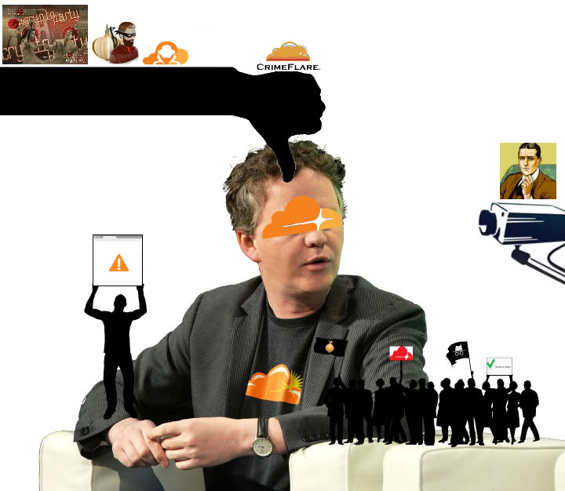

# "Cloudflare, we have a problem"


- This is a list of voices. Thank you for sharing your opinion.
- *Disclaimer*: This page contains external links to third party websites. These sites are subject to the liability of the respective website operators.


| 🖼 | 🖼 | 🖼 |
| --- | --- | --- |
|  |  |  |
|  |  |  |


```
It's pretty sad when even the hometown paper is behind the greatcloudwall.
C'mon guys. Stop using Cloudflare.
It's endangering the world wide web and you're blocking readers who are protecting
their privacy by using Tor.
```
-- [Jeff Cliff](https://shitposter.club/jeffcliff/)


```
Man-in-the-middle attack is a serious offense.
If you′re using Cloudflare on your website, you won′t get first rank.
You shouldn′t use it if you value visitor′s privacy.
```
-- [Ss](https://sercxi.nnpaefp7pkadbxxkhz2agtbv2a4g5sgo2fbmv3i7czaua354334uqqad.onion/)


```
I say it's a bad idea to pimp CloudFlare sites and expect such repressions to go unchallenged.
Activism is a duty & ethics trumps netiquette.
Posting original information exclusively on onion sites
is like affirmative action for the repressed Tor community.
Correcting the wrongs of CloudFlare entails some unfair discrimination against clearnet users.
```
-- [Activist](https://activism.openworlds.info/@aktivismoEstasMiaLuo)


---

| 🖼 | 🖼 | 🖼 |
| --- | --- | --- |
|  | <br> |  |

---

<details>
<summary>_click me_

## News
</summary>


- [Major internet outage: Dozens of websites and apps were down](https://edition.cnn.com/2020/08/30/tech/internet-outage-cloudflare/index.html)
- [Произошел сбой работы интернет сервисов по всему миру](https://www.securitylab.ru/news/511577.php)
- [Cloudflare suffered data leak; exposing 3 million IP addresses: Ukraine](https://www.hackread.com/cloudflare-data-leak-expose-ip-addresses-ukraine/)
- [Cloudflare’s DNS Issue, Service Shuts Down Half The Web](https://www.prosyscom.tech/tech-industry/cloudflares-dns-issue-service-shuts-down-half-the-web/)
- [Half Of The Internet Is Down After Cloudflare Suffers Major Outage](https://www.zerohedge.com/markets/major-part-web-offline-cloudflare-suffers-outage)
- [MASSIVE outage hits Cloudflare, sends Discord & other service-powered sites DOWN - reports](https://www.rt.com/usa/495127-discord-cloudfare-outage-down/), RT
- [Discord, Riot Games down with reported Cloudflare outage](https://www.polygon.com/2020/7/17/21329005/cloudflare-outrage-discord-riot-games-july-2020), [Nicole Carpenter](https://www.polygon.com/users/NicoleCarpenter)
- [Discord was down for nearly an hour due to Cloudflare issues](https://www.theverge.com/2020/7/17/21328993/discord-down-server-outage-issues), [Tom Warren](https://www.theverge.com/authors/tom-warren)
- [Your Regular Reminder That the Internet Is a Fragile Place](https://slate.com/technology/2019/07/cloudflare-internet-outage-502-gateway-error.html), [Chip Brownlee](https://slate.com/author/chip-brownlee)
- [Internet wobble caused, Cloudflare glitch](https://www.bbcnewsv2vjtpsuy.onion/news/technology-48841815), [BBC](https://www.bbcnewsv2vjtpsuy.onion/)
- [CloudflareのDNSだと「5ちゃんねる」に接続できない？　ネットで話題に](https://www.itmedia.co.jp/news/articles/1908/09/news108.html), [itmedia](https://www.itmedia.co.jp/news/)
- [Cloudflare down: Thousands of popular websites affected, brief outage](https://news.sky.com/story/cloudflare-down-thousands-of-popular-websites-affected-by-brief-outage-11755312), [Alexander J Martin](https://news.sky.com/)
- [Major websites and services across the internet went down Tuesday because of a hosting-platform outage](https://www.businessinsider.nl/cloudflare-outage-causes-major-websites-across-internet-to-go-down-2019-7/), [Antonio Villas-Boas](https://www.businessinsider.com/author/antonio-villas-boas)
- [CloudFlare Outage Takes Down Coinbase, CoinMarketCap and Other Top Crypto Websites](https://www.coindesk.com/cloudflare-outage-takes-down-coinbase-coinmarketcap-and-other-top-crypto-websites), [John Biggs](https://www.coindesk.com/author/johncoindesk-com)
- [Millions of websites went down across the internet today after massive Cloudflare outage](https://metro.co.uk/2019/07/02/cloudflare-outage-means-websites-including-detector-10103471/), [Jasper Hamill](https://metro.co.uk/author/jasper-hamill/)
- [Cloudflare blames ‘bad software’ deployment for today’s outage](https://techcrunch.com/2019/07/02/a-cloudflare-outage-is-impacting-sites-everywhere/), [Brian Heater](https://techcrunch.com/author/brian-heater/)
- [Cloudflare issues affecting numerous sites on Monday AM](https://techcrunch.com/2019/06/24/cloudflare-outage-affecting-numerous-sites-on-monday-am/), [Sarah Perez](https://techcrunch.com/author/sarah-perez/)
- [Internet security CEO explained why his company exposed people to harassment, and suggested they should've used fake names](https://web.archive.org/web/20171024040313/http://www.businessinsider.com/cloudflare-ceo-suggests-people-who-report-online-abuse-use-fake-names-2017-5), [Julie Bort](http://www.businessinsider.com/author/julie-bort)
- [Cloudflare CEO Terminates Neo-Nazi Site After 'Waking Up in a Bad Mood'](https://www.zerohedge.com/news/2017-08-17/cloudflare-ceo-terminates-neo-nazi-site-after-waking-bad-mood), [The_Real_Fly](https://www.zerohedge.com/users/therealfly)
- [Cloudflare CEO on Terminating Service to Neo-Nazi Site: 'The Daily Stormer Are Assholes'](https://gizmodo.com/cloudflare-ceo-on-terminating-service-to-neo-nazi-site-1797915295), [Kate Conger](https://kinja.com/conger)
- [The invasion boards that set out to ruin lives](https://web.archive.org/web/https://boingboing.net/2015/01/19/invasion-boards-set-out-to-rui.html), [Jay Allen](https://boingboing.net/author/amaninblack)
- [How One Major Internet Company Helps Serve Up Hate on the Web](https://web.archive.org/web/20190512152916/https://www.propublica.org/article/how-cloudflare-helps-serve-up-hate-on-the-web), [Ken Schwencke](https://web.archive.org/web/20190512152916/https://www.propublica.org/people/ken-schwencke)
- [Zaradi hrošča iz Cloudflara več mesecev curljalo](https://slo-tech.com/novice/t694836/p5445996), [Slo-Tech](https://slo-tech.com/)
- [CDN企業Cloudflareのバグで、多数のサービスで機密データ流出の可能性](https://www.itmedia.co.jp/news/articles/1702/25/news024.html), [佐藤由紀子](https://www.itmedia.co.jp/news/)
- [Everything You Need to Know About Cloudbleed, the Latest Internet Security Disaster](https://gizmodo.com/everything-you-need-to-know-about-cloudbleed-the-lates-1792710616), [Adam Clark Estes](https://kinja.com/ace)
- [Why Cloudflare Let an Extremist Stronghold Burn](https://www.wired.com/story/free-speech-issue-cloudflare/), [Steven Johnson](https://www.wired.com/author/steven-johnson/)
- [Private crypto keys are accessible to Heartbleed hackers, new data shows](https://arstechnica.com/information-technology/2014/04/private-crypto-keys-are-accessible-to-heartbleed-hackers-new-data-shows/), [Megan Geuss](https://arstechnica.com/author/megan-geuss/)

</details>

-----

<details>
<summary>_click me_

## Blog
</summary>


(Just don't add Medium.com articles. It's Cloudflared. Whether the content is good or not doesn't matter.)


- [Don't Trust CloudFlare](https://write.pixie.town/thufie/dont-trust-cloudflare)
- [blocking cloudflare IP-range be like](https://hacktivis.me/articles/blocking%20cloudflare%20IP-range%20be%20like)
- [Unrevokable SSL Certificates - Isn’t this sounding pretty corrupt?  Yes.](https://worldofmatthew.com/post/cloudflare-ssl/)
- [New CDN for media files](https://masto.host/new-cdn-for-media-files/)
- [Personal post: I left Cloudflare](https://www.ethanyoo.com/cloudflare/)
- [Crimeflare (Fuck Cloudflare) / bandcamp / music](https://polarisfm.bandcamp.com/releases)
- [Cloudflare outage and the risk in today's Internet](https://www.garron.blog/posts/cloudflare-outage.html)
- [Turns out half the internet has a Single-Point-of-Failure called “Cloudflare”](https://easydns.com/blog/2020/07/20/turns-out-half-the-internet-has-a-single-point-of-failure-called-cloudflare/)
- [Cloudflare and why it's bad](https://ella.wantscuddl.es/b/cloudflare)
- [Vous vous souvenez de l'époque où DARPA avait conçu internet de manière à ce qu'il continue de fonctionner même quand un noeud du réseau est tombé ?](https://sebsauvage.net/links/?GSB_Fg)
- [Die zentralisierung des Internets](https://blog.bka.li/~/JustForFun/cloudflare/)
- [Is Cloudflare safe yet?](https://iscloudflaresafeyet.com)
- [Mozilla - Devil Incarnate: DNS over HTTPS](http://digdeep4orxw6psc33yxa2dgmuycj74zi6334xhxjlgppw6odvkzkiad.onion/ghost/mozilla.html#cloudflare), [DigDeeper](http://digdeep4orxw6psc33yxa2dgmuycj74zi6334xhxjlgppw6odvkzkiad.onion/)
- [「Block Cloudflare MITM Attack」の設定を見直してわかったこと。](https://watasinokaikakutohyouron.hatenablog.com/entry/2020/05/25/044334)
- [Cloudflare silently deleted my DNS records](https://web.archive.org/save/https://txti.es/cloudflare-deleted-my-dns), Cloudflare user
- [Cloudflare is turning off the internet for me](https://blog.dijit.sh/cloudflare-is-turning-off-the-internet-for-me), [Jan Harasym](https://blog.dijit.sh/)
- [Can you trust CloudFlare with your personal data?](https://shkspr.mobi/blog/2019/11/can-you-trust-cloudflare-with-your-personal-data/), [Terence Eden](https://edent.tel/)
- [WARP is not a VPN for privacy](https://www.piavpnaymodqeuza.onion/blog/2019/09/warp-is-not-a-vpn-for-privacy/), [Private Internet Access](https://www.privateinternetaccess.com/)
- [Cloudflare - why the fuss?](https://decentralize.today/decentralization/cloudflare-why-the-fuss), [O S Layman](https://decentralize.today/cryptocurrency/blogger/big-h)
- [Cloudflare Outage Kills the Internet](https://youtube.com/watch?v=Yld9t32Frcw)
- [Cloudflare is down lol](https://youtube.com/watch?v=cpCZG_r6nXg)
- [Cloudflare considered harmful](https://www.devever.net/~hl/cloudflare)
- [Cloudflare’s WARP ‘VPN’ isn’t private nor safe; Don’t use it](https://blog.kareldonk.com/cloudflares-warp-vpn-isnt-private-nor-safe-dont-use-it/), [Karel Donk](https://blog.kareldonk.com/)
- [Does Cloudflare help my WordPress site?](https://seravo.com/blog/does-cloudflare-help-my-wordpress-site/), [Seravo](https://seravo.com/)
- [Say no to Cloudflare](https://robinwils.surge.sh/categories/articles/say-no-to-cloudflare/), [Robin Wils](https://robinwils.surge.sh/contact/)
- [Why You Don’t Use Cloudflare…](https://www.focowphelp.com/2017/03/why-you-dont-use-cloudflare/)
- [Don’t use Cloudflare CDN: build in speed quality instead.](http://pagepipe.com/cloudflare-doesnt-guarantee-consistent-load-times/)
- [Why I Stopped Using CloudFlare](https://www.reviewhell.com/blog/cloudflare-makes-websites-slower/), [Review Hell](https://www.reviewhell.com/)
- [I don’t trust Cloudflare’s 1.1.1.1 App and Warp VPN](https://blog.kareldonk.com/i-dont-trust-cloudflares-1-1-1-1-app-and-warp-vpn/), [Karel Donk](https://blog.kareldonk.com/)
- [Don’t Use Cloudflare Because You Impose This on People Who Least Want It](http://techrights.org/2019/02/17/the-cloudflare-trap/), [Dr. Roy Schestowitz](http://techrights.org/)
- [All your DNS traffic will be sent to Cloudflare](https://ungleich.ch/en-us/cms/blog/2018/08/04/mozillas-new-dns-resolution-is-dangerous/), [ungleich](https://ungleich.ch/)
- [Cloudflare: The bad, the worse and the ugly?](http://webschauder.de/cloudflare-the-bad-the-worse-and-the-ugly/), [Alle Beiträge](http://webschauder.de/author/jw/)
- [I don’t trust Cloudflare with IPFS](https://blog.kareldonk.com/i-dont-trust-cloudflare-with-ipfs/), [Karel Donk](https://blog.kareldonk.com/)
- [Cloudflare IPFS experiment](https://js.ipfs.io/ipns/QmZJBQBXX98AuTcoR1HBGdbe5Gph74ZBWSgNemBcqPNv1W/cloudflare-IPFS-experiment.html), [Joe](https://js.ipfs.io/ipns/QmZJBQBXX98AuTcoR1HBGdbe5Gph74ZBWSgNemBcqPNv1W/index.html)  [[mirror](http://archive.fo/139z1)]
- [Tor Project calls out CloudFlare for dark web surveillance](https://www.itproportal.com/2016/02/29/tor-project-calls-out-cloudflare-for-dark-web-surveillance/)
- [CloudFlare: Deutscher Bundestag bezieht schon wieder Internet von US-Anbietern, diesmal für die eigenen Webseiten](https://netzpolitik.org/2015/cloudflare-deutscher-bundestag-bezieht-schon-wieder-internet-von-us-anbietern-diesmal-fuer-die-eigenen-webseiten/), [Andre Meister](https://netzpolitik.org/author/andre/)
- [Don't Trust CloudFlare](https://write.lain.haus/thufie/dont-trust-cloudflare), [@lunaterra@cyberia.social](https://cyberia.social/@lunaterra)
- [CloudFlare slowed down our site](https://pergento.wordpress.com/2012/02/01/cloudflare-slowed-down-our-site/), [Callum](https://pergento.wordpress.com/author/chmac/)
- [Stay away from CloudFlare](http://www.unixsheikh.com/articles/stay-away-from-cloudflare.html), [Unix Sheikh](http://www.unixsheikh.com/)
- [Cloudflare and Spamhaus](https://wordtothewise.com/2012/07/cloudflare-and-spamhaus/), [laura](https://wordtothewise.com/author/laura/)
- [Support End-to-End Encryption on the Web](https://www.wordfence.com/blog/2017/03/support-end-to-end-encryption/), [Mark Maunder](https://www.wordfence.com/)
- [Cloudflare发布针对IPFS的Gateway](https://www.jianshu.com/p/8a9cb8065f4a), [幸运排骨虾](https://www.jianshu.com/u/c3c0e9748845)
- [CloudFlareよサヨナラ！ WordPressの表示速度が改善するプラグイン「Photon」](https://rentalhomepage.com/photon/), [ENJILOG](https://rentalhomepage.com/)
- [CloudFlareの解除と「Phonton」の導入方法](http://kyoheixxx.com/cloudflare-phonton-5058), [kyohei](http://kyoheixxx.com/)
- [Cloudflare: The “Now You See Me, Now You Don’t” of the Internet](http://copyright.nova.edu/cloudflare/)
- [The CloudFlare Leak and the Problem of Centralized Authentication](https://web.archive.org/web/https://www.iovation.com/blog/the-cloudflare-leak-and-the-problem-of-centralized-authentication), [iovation Inc.](https://www.iovation.com/)
- [CloudFlare is ruining the internet (for me)](https://www.slashgeek.net/2016/05/17/cloudflare-is-ruining-the-internet-for-me/), [slashgeek](https://www.slashgeek.net/)
- [MITM-as-a-Service: The Threat Surface We Didn’t Know We Had](http://daveshackleford.com/?p=1134), [Shack](twitter.com/daveshackleford/)
- [Journal CloudFlare au milieu](https://linuxfr.org/users/thibg/journaux/cloudflare-au-milieu), [ThibG](https://linuxfr.org/)
- [why you shouldn’t use Cloudflare](https://tech.tiq.cc/2016/01/why-you-shouldnt-use-cloudflare/), [tiq](https://tech.tiq.cc/)
- [DNSサーバー「1.1.1.1」が利用できない障害発生中（2018年4月22日）](https://web.archive.org/web/20190815152042/https://did2memo.net/2018/04/22/dns-1-1-1-1-failure-2018-04-22/), [did2](https://twitter.com/did2memo)
- [The CloudFlare MITM](https://web.archive.org/web/20160311163431/https://blog.paymium.com/2014/02/19/the-cloudflare-mitm/), [David FRANCOIS](https://blog.paymium.com/)
- [Allergique à Cloudflare ? Voici comment vous soigner…](https://web.archive.org/web/https://korben.info/cloudflare-mitm.html), [KORBEN](https://korben.info/)
- [CloudFlare, We Have A Problem](http://cryto.net/~joepie91/blog/2016/07/14/cloudflare-we-have-a-problem/), [joepie91](http://cryto.net/~joepie91/)
- [CloudFlare blocked 94% of Tor requests](http://en.android4e.com/?p=1263)
- [On Cloudflare](https://www.tyil.nl/post/2017/12/17/on-cloudflare/), [tyil](https://www.tyil.nl/)
- [What Is Cloudflare, and Did It Really Leak My Data All Over the Internet?](https://www.howtogeek.com/295677/WHAT-IS-CLOUDFLARE-AND-DID-IT-REALLY-LEAK-MY-DATA-ALL-OVER-THE-INTERNET/)
- [Why CloudFlare Is Probably A Honeypot](https://web.archive.org/web/https://cypherpunk.is/2015/04/02/why-cloudflare-is-probably-a-honeypot/), [cypherpunk](https://cypherpunk.is/)
- [iSucker: Big Brother Internet Culture](https://exiledonline.com/isucker-big-brother-internet-culture/), [The Exiled](https://exiledonline.com/)
- [CloudFlare Watch](http://cryptome.org/2012/07/cloudflare-watch.htm), Daniel Brandt
- [The Trouble with CloudFlare](https://blog.torproject.org/trouble-cloudflare), [mikeperry](https://blog.torproject.org/users/mikeperry)
- [Growing Cloudflare Menace](http://imhhge4lijqv7jzf.onion/warning.html)

</details>

-----

<details>
<summary>_click me_

## Forum / Wiki
</summary>


- [Unable to issue certificate because acme API is behind CloudFlare](https://community.letsencrypt.org/t/unable-to-issue-certificate-because-acme-api-is-behind-cloudflare/156269)
- [fch.bet is behind CloudFlare](https://web.archive.org/web/https://frchan.bet/int/res/2905.html)
- [Why does GL-inet promote it](https://forum.gl-inet.com/t/cloudflare/15825)
- [Please, stop using Cloudflare on help.archive.org.](https://archive.org/post/1114639/please-stop-using-cloudflare-on-helparchiveorg)
- [Your thoughts on CloudFlare](https://lemmy.ml/post/61492)
- [Cloudflare ... Yeah, I know the Tor country, it's located in the Onion continent](https://www.reddit.com/r/softwaregore/comments/mlv97r/cloudflare_yeah_i_know_the_tor_country_its/)
- [I now have a cloudflare watermark stuck on my client](https://www.reddit.com/r/Warthunder/comments/ln5nya/i_now_have_a_cloudflare_watermark_stuck_on_my/)
- [Mushroom game brought to you by cloudflare.](https://www.reddit.com/r/Maplestory/comments/jy453w/mushroom_game_brought_to_you_by_cloudflare/)
- [Can I bypass Cloudflare?](https://www.reddit.com/r/TOR/comments/m4zfbo/can_i_bypass_cloudflare/)
- [linuxreviews.org Cloudflare](https://linuxreviews.org/Cloudflare)
- ["When you fetch a page from a website that is served from CloudFlare, Javascript has been injected on-the-fly into that page by CloudFlare, and they also plant a cookie that brands your browser with a globally-unique ID."](https://www.reddit.com/r/privacy/comments/jd6dys/when_you_fetch_a_page_from_a_website_that_is/)
- [Tor connectiong being MITMED by Cloudflare](https://www.reddit.com/r/tails/comments/ip0gg6/tor_connectiong_being_mitmed_by_cloudflare/)
- [Cloudflare now controls a large portion of the internet with it's MiTM-style DDOS protection.](https://www.reddit.com/r/privacy/comments/iddxb2/are_we_seriously_going_to_live_in_a_googleowned/)
- [Cloudflare fail - a dry run to closing down the internet?](https://www.reddit.com/r/conspiracyNOPOL/comments/ijk28z/cloudflare_fail_a_dry_run_to_closing_down_the/)
- [gab.com is on Cloudflare](https://www.reddit.com/r/CloudFlare/comments/kuiolw/gabcom_is_on_cloudflare/gisqk65/)
- [Dozens of Websites, Apps Go Down in Major Cloudflare Outage](https://www.reddit.com/user/joshwho/comments/ijkfqv/dozens_of_websites_apps_go_down_in_major/)
- [For everyone who needs drivers during the MSI website downtime.](https://www.reddit.com/r/MSI_Gaming/comments/iji1pk/for_everyone_who_needs_drivers_during_the_msi/)
- [That can't be good. Anyone else with this issue?](https://www.reddit.com/r/CloudFlare/comments/c89hu5/that_cant_be_good_anyone_else_with_this_issue/)
- [Access Denied: Cloudflare is blocking my access to srb2.org (Can't access the game to Download!)](https://www.reddit.com/r/SRB2/comments/ikfq09/access_denied_cloudflare_is_blocking_my_access_to/)
- [Cloudflare is down, who cares?](https://www.reddit.com/r/Bluzelle/comments/ijo561/cloudflare_is_down_who_cares/)
- [Cloudflare goes down; crypto websites hit](https://www.reddit.com/r/p2psf/comments/ijlcvb/cloudflare_goes_down_crypto_websites_hit/)
- [Spectrum and Cloudflare](https://www.reddit.com/r/Spectrum/comments/iia1cz/spectrum_and_cloudflare/)
- [DNS Troubles?](https://www.reddit.com/r/TalesOfCrestoria/comments/iiyvha/dns_troubles/)
- [Access denied | www.freemalaysiatoday.com used Cloudflare to restrict access](https://www.reddit.com/r/malaysianews/comments/iinkqa/access_denied_wwwfreemalaysiatodaycom_used/)
- [How do I restore company's faith in Cloudflare?](https://www.reddit.com/r/sysadmin/comments/htg5p5/how_do_i_restore_companys_faith_in_cloudflare/)
- [Cloudlfare issues?](https://reddit.com/r/CloudFlare/comments/i852xd/cloudlfare_issues/)
- [Anyone else's game just dis connect?](https://reddit.com/r/VALORANT/comments/i850x5/anyone_elses_game_just_dis_connect/g16aqap/)
- [Help! Cloudflare blocking access to every website, probably malware](https://reddit.com/r/techsupport/comments/i80my6/help_cloudflare_blocking_access_to_every_website/)
- [Access denied, Cloudflare when using TOR, why?](https://reddit.com/r/TOR/comments/i2ubsj/access_denied_by_cloudflare_when_using_tor_why/)
- [Private Windows with Tor showing excessive CAPTCHAs](https://reddit.com/r/brave_browser/comments/hnrv91/private_windows_with_tor_showing_excessive/)
- [i always get redirected to Cloudflare Captcha](https://reddit.com/r/TOR/comments/hhd9kk/some_problems_with_tor/)
- [The problem with CloudFlare (part 1 of 2: detriment to privacy, netneutrality, s/w freedom, & human rights)](https://neoreddit.horobets.me/post/43)
- [The problem with CloudFlare (part 2 of 2: detriment to security, environment, democracy, and free expression)](https://neoreddit.horobets.me/post/44)
- [Cloudflare Captcha Shit!](https://forum.tuts4you.com/topic/42026-cloudflare-captcha-shit/)
- [Hcaptcha In IRAN](https://community.cloudflare.com/t/hcaptcha-in-iran/166585)
- [No IPv6 on hcaptcha](https://community.cloudflare.com/t/no-ipv6-on-hcaptcha/169108)
- [How Cloudflare Killed the Internet](https://www.reddit.com/r/witchlnx/comments/hw0yss/how_cloudflare_killed_the_internet_liked_on/)
- [Right now, there's something wrong with matchmaking definitely- I see Steam forums also note people can't start matches after ready up](https://www.reddit.com/r/commandandconquer/comments/htsqtp/right_now_theres_something_wrong_with_matchmaking/)
- [cloudflare down again?](https://www.reddit.com/r/sysadmin/comments/htg9kd/cloudflare_down_again/)
- [Because you are a normie that uses Tor and/or a VPN. I’m in the same boat. I use one - that is, a VPN - and man alive! Captchas, captchas everywhere. I’m annoyed to the point that I simply don’t go to sites that use captchas. Which, annoyingly, are a great, many sites, because everyone and their grandmother seems to be using Cloudflare nowadays. Sorry, rant over.](https://dev.lemmy.ml/post/37546/comment/11865)
- [Cloudflare is down again!](https://dev.lemmy.ml/post/37708)
- [I'm free now.](https://www.reddit.com/r/FinlayDaG33k/comments/hthp0s/im_free_now/)
- [The CloudFlare and Tor Stalemate Is Harming Users](https://fulldisclosure.org/eb0d5/The_CloudFlare_and_Tor_Stalemate_Is_Harming_Users)
- [How to stop and disable stupid Hcaptcha from our Cloudflare site?](https://community.cloudflare.com/t/how-to-stop-and-disable-stupid-hcaptcha-from-our-cloudflare-site/160194)
- [Cloudflare: l'OPA silenziosa sul web](https://www.reddit.com/r/ItalyInformatica/comments/belhyu/cloudflare_lopa_silenziosa_sul_web/)
- [STOP USING hCAPTCHA](https://community.cloudflare.com/t/stop-using-hcaptcha/158968)
- [Cloudflare is down](https://www.reddit.com/r/CloudFlare/comments/ht4iz1/cloudflare_is_down/)
- [hehe cloudflare ded](https://www.reddit.com/r/memes/comments/ht5fnc/hehe_cloudflare_ded/)
- [cloudflare captcha problem](https://www.reddit.com/r/techsupport/comments/aw61do/cloudflare_captcha_problem/)
- [Anyone still having problems connecting? Is Cloudflare still screwed?](https://www.reddit.com/r/EscapefromTarkov/comments/ht5d65/anyone_still_having_problems_connecting_is/)
- [Try browsing the web using Tor or a VPN. You will spend the day doing Google recaptchas for like 90% of the websites you visit, I guarantee it. All thanks to Cloudflare.](https://dev.lemmy.ml/post/35712/comment/8474)
- [why the fuck does so much stuff run on Cloudflare?!](https://dev.lemmy.ml/post/36758/comment/10074)
- [The devs of systemd, the main init system on Linux, use Google and cloudflare for fallback/default NTP and DNS, when asked to use privacy respecting alternatives, they call people conspiracy theorists](https://dev.lemmy.ml/post/34476)
- [The devs of systemd, the main init system on Linux, use Google and cloudflare for fallback/default NTP and DNS, when asked to use privacy respecting alternatives, they call people conspiracy theorists](https://www.reddit.com/r/privacy/duplicates/h108u5/the_devs_of_systemd_the_main_init_system_on_linux/)
- [Fight for the Future is supposed to be advocating netneutrality, & yet their own site is on CloudFlare](https://dev.lemmy.ml/post/31655)
- [Ok. But if they use Cloudflare, which MITMs traffic, all their users data is in plaintext to Cloudflare.](https://news.ycombinator.com/item?id=17700131)
- [Can someone please explain to me how Cloudflare isn't MITM?](https://www.reddit.com/r/AskNetsec/comments/hbcvl2/can_someone_please_explain_to_me_how_cloudflare/)
- [every cloudflare website i go to it has error 1020. is cloudflare down rn?](https://www.reddit.com/r/CloudFlare/comments/hittvf/every_cloudflare_website_i_go_to_it_has_error/)
- [NO cloudflare website is loading](https://www.reddit.com/r/CloudFlare/comments/hiqm4u/no_cloudflare_website_is_loading/)
- [Highlighting Liberapay and OpenCollective as the preferred donation options](https://forum.f-droid.org/t/highlighting-liberapay-and-opencollective-as-the-preferred-donation-options/10163)
- [Firefox VPN (Firefox Private Network)](https://www.reddit.com/r/thehatedone/comments/h9elzc/firefox_vpn_firefox_private_network/)
- [Why is everyone ignoring Cloudfare's MITM that affects 13% of sites worldwide and maybe 30% of English-language sites?](https://web.archive.org/save/https://www.linuxquestions.org/questions/linux-security-4/why-is-everyone-ignoring-cloudfare%27s-mitm-that-affects-13-of-sites-worldwide-and-maybe-30-of-english-language-sites-4175675815/)
- [Are CAPTCHAs harder to solve on TOR?](https://www.reddit.com/r/TOR/comments/gu7p75/are_captchas_harder_to_solve_on_tor/)
- [Can we stop using Cloudflare?](https://www.reddit.com/r/BitChute/comments/cmgmur/can_we_stop_using_cloudflare/)
- [Crowd Sourced Protest Of Cloudflare](https://lists.torproject.org/pipermail/tor-talk/2016-March/040705.html)
- [Crowd Sourced Protest Of Cloudflare](https://www.reddit.com/r/TOR/comments/4cdx30/crowd_sourced_protest_of_cloudflare/)
- [US Bank website is not in Cloudflare DNS](https://www.reddit.com/r/CloudFlare/comments/gmfm4i/us_bank_website_is_not_in_cloudflare_dns/)
- [Aliexpress not working with 1.1.1.1](https://community.cloudflare.com/t/aliexpress-not-working-with-1-1-1-1/167491)
- [What data does CloudFlare actually see?](https://community.cloudflare.com/t/what-data-does-cloudflare-actually-see/28660)
- [Why does everyone here dislike CloudFlare?](https://www.reddit.com/r/privacy/comments/cce2ui/why_does_everyone_here_dislike_cloudflare/)
- [As long as Gab uses Cloudflare, it's doomed to failure](https://www.reddit.com/r/gab/comments/eet4cr/as_long_as_gab_uses_cloudflare_its_doomed_to/)
- [Mozilla just lost all its credibility. Cloudflare isn't trustworthy, since it decrypts TLS!](https://www.reddit.com/r/privacytoolsIO/comments/e97thq/mozilla_just_lost_all_its_credibility_cloudflare/), [vargasgetulio](https://www.reddit.com/user/vargasgetulio)
- [Cloudflare and the US Intelligence Community](https://www.reddit.com/r/privacy/comments/dmc4cj/cloudflare_and_the_us_intelligence_community/), [dhaavi](https://www.reddit.com/user/dhaavi)
- [Cloudflare IM NOT A ROBOT blocking API?!?](https://www.patreondevelopers.com/t/cloudflare-im-not-a-robot-blocking-api/2607)
- [API Returning Cloudflare Challenge](https://www.patreondevelopers.com/t/api-returning-cloudflare-challenge/2025)
- [Cloudflare Challenge On www.patreon.com](https://www.patreondevelopers.com/t/cloudflare-challenge-on-https-www-patreon-com-api-oauth2-token/2213)
- [Some websites not loading pictures after upgrade to Tor Browser 9.0](https://trac.torproject.org/projects/tor/ticket/32238)
- [Downvoters seem to hate the truth.](https://www.reddit.com/r/btc/comments/8yin4y/ironic/e2b5ycn/)
- [Why does a .gov site use Cloudflare?](https://www.reddit.com/r/sysadmin/comments/4vdn15/why_does_a_gov_site_use_cloudflare/)
- [Some images from Cloudflare don't load up and a 403 Forbidden is returned](https://trac.torproject.org/projects/tor/ticket/32582)
- [Do you know how Cloudflare works? It's literally a proxy.](https://endchan.org/pol/res/72923.html#q74241)
- [website not working properly since update](https://trac.torproject.org/projects/tor/ticket/32430)
- [Cloudflare to MITM your traffic is an extraordinary security and privacy problem.](https://www.reddit.com/r/Bitcoin/comments/e303gh/bitcoincoreorg_expired_ssl_cert/f8zqcf9/), [hva32](https://www.reddit.com/user/hva32/)
- [Google's reCAPTCHA fails 100%](https://trac.torproject.org/projects/tor/ticket/23840)
- [The Great Cloudwall](https://lobste.rs/s/xkwcl3), [caioalonso](https://lobste.rs/u/caioalonso)
- [Proposal: Remove Cloudflare from the official Bitcoin Cash website](https://www.reddit.com/r/btc/comments/docdui/proposal_remove_cloudflare_from_the_official/), [LeoBeltran](https://www.reddit.com/user/LeoBeltran/)
- [Now that Cloudflare Warp has gone public, is it still the worst thing EVER?](https://www.reddit.com/r/privacytoolsIO/comments/da1lx3/now_that_cloudflare_warp_has_gone_public_is_it/), [Anaranovski](https://www.reddit.com/user/Anaranovski)
- [Cloudeflare Captcha](https://forum.palemoon.org/viewtopic.php?f=37&t=22321&p=169114), [zdmv09rzbtklezd8d](https://forum.palemoon.org/memberlist.php?mode=viewprofile&u=19075)
- [Secure Connection Failed](https://forum.palemoon.org/viewtopic.php?f=44&t=20845&p=155973), [Tomaso](https://forum.palemoon.org/memberlist.php?mode=viewprofile&u=9778)
- [12.7 percent of the domains I visit are intercepted, CloudFlare](https://www.mail-archive.com/tor-talk@lists.torproject.org/msg21066.html)
- [cloudflare blocks connection](https://www.mail-archive.com/tor-talk@lists.torproject.org/msg20740.html)
- [Cloudflare reCAPTCHA De-anonymizes Tor Users](https://www.mail-archive.com/tor-talk@lists.torproject.org/msg22062.html)
- [That's not how the web works, sorry. Cheers](https://bugs.debian.org/cgi-bin/bugreport.cgi?bug=941394)
- [Pale Moon developer shows disdain for Tor and people who combat Cloudflare MITM](https://www.reddit.com/r/privacy/comments/cnqwr3/pale_moon_developer_shows_disdain_for_tor_and/), [vargasgetulio](https://www.reddit.com/user/vargasgetulio/)
- [...Cloudflare DOES TLS termination, directly having access to all the data in clear.](https://www.reddit.com/r/privacy/comments/ckwlem/cloudflare_does_tls_termination_directly_having/), [JustCondition4](https://www.reddit.com/user/JustCondition4/)
- [What makes CloudFlare bad?](https://www.reddit.com/r/privacy/comments/cki0s5/what_makes_cloudflare_bad/), [Spadey0](https://www.reddit.com/user/Spadey0/)
- [Why am I being asked to fill out a captcha to view a webpage?](https://www.privateinternetaccess.com/forum/discussion/8554/why-am-i-being-asked-to-fill-out-a-captcha-to-view-a-webpage)
- [Cloudflare](https://mlpol.net/mlpol/res/241062.html), Anonymous
- [The Great Cloudwall](https://sebsauvage.net/links/?beq2fA), [sebsauvage](https://framapiaf.org/@sebsauvage)
- [DNS over HTTPS](http://oxwugzccvk3dk6tj.onion/tech/res/1082196.html)
- [Cloudflare = CIA](http://oxwugzccvk3dk6tj.onion/tech/res/1032001.html)
- [Delete Account](https://www.projecthoneypot.org/board/read.php?f=4&i=722&t=722)
- [Please remove cloudflare](https://www.reddit.com/r/privacytoolsIO/comments/35xg9u/please_remove_cloudflare/), [cloudspyha](https://www.reddit.com/user/cloudspyha/)
- [coinkite SSL is shared with shady sites?](https://www.reddit.com/r/Bitcoin/comments/1ynfvt/coinkite_ssl_is_shared_with_shady_sites/), [notR1CH](https://www.reddit.com/user/notR1CH/)
- [Cloudflare's mobile application 1.1.1.1: Faster & Safer Internet keeps a log of your DNS queries for 24 hours, can't be disabled](https://www.reddit.com/r/privacy/comments/9wmjey/cloudflares_mobile_application_1111_faster_safer/), [maybenot12](https://www.reddit.com/user/maybenot12/)
- [In other news, Bitpay is completely broken now.](https://www.reddit.com/r/Bitcoin/comments/7n5ofh/in_other_news_bitpay_is_completely_broken_now/), [phelix2](https://www.reddit.com/user/phelix2/)
- [Can we stop posting articles from medium?](https://www.reddit.com/r/privacy/comments/bsip31/can_we_stop_posting_articles_from_medium/), [FusionTorpedo](https://www.reddit.com/user/FusionTorpedo)
- [How to avoid plain text passwords etc being visible to Cloudflare's MITM proxies](https://www.reddit.com/r/webdev/comments/5ap1le/how_to_avoid_plain_text_passwords_etc_being/), [r0ck0](https://www.reddit.com/user/r0ck0/)
- [Thoughts on CloudFlare](https://www.reddit.com/r/privacytoolsIO/comments/cailfa/thoughts_on_cloudflare/), [techEnthusiast0](https://www.reddit.com/user/techEnthusiast0/)
- [Is it possible to universally bypass the Cloudflare DDOS-protection? Can add a delay to your daily browsing when automatically clearing cookies](https://www.reddit.com/r/firefox/comments/c7ywt4/is_it_possible_to_universally_bypass_the/), [8VBQ-Y5AG-8XU9-567UM](https://www.reddit.com/user/8VBQ-Y5AG-8XU9-567UM)
- [Este Cloudflare atac MITM?](https://forum.softpedia.com/topic/1146988-este-cloudflare-atac-mitm/), gladioc
- [How to get rid of CloudFlare](http://answerszuvs3gg2l64e6hmnryudl5zgrmwm3vh65hzszdghblddvfiqd.onion/76323/how-to-get-rid-of-cloudflare)
- [Cloudflare outage caused, deploying bad regular expression that caused 100% CPU usage worldwide, dropping up to 82% of traffic](https://www.reddit.com/r/sysadmin/comments/c8eymj/cloudflare_outage_caused_by_deploying_bad_regular/), [TyroPyro](https://www.reddit.com/user/TyroPyro/)
- [Cloudflare outage AGAIN MAH INTERNETS! Nooo!](https://www.reddit.com/r/sysadmin/comments/c89fa4/cloudflare_outage_again/), [Lewis_Browne](https://www.reddit.com/user/Lewis_Browne/)
- [Dear customers of Cloudflare: an appeal regarding Tor](https://news.ycombinator.com/item?id=17750801), [IngoBlechschmid](https://news.ycombinator.com/user?id=IngoBlechschmid)
- [Cloudflare CDN suffers route leak; services like Discord and Crunchyroll experience outages all over the world](https://www.reddit.com/r/worldnews/comments/c4n42g/cloudflare_cdn_suffers_route_leak_services_like/), [DragonSkyMusic](https://www.reddit.com/user/DragonSkyMusic/)
- [Cloudflare Is Not An Option!](https://www.reddit.com/r/privacy/comments/bhag8s/cloudflare_is_not_an_option/), [FVz7Ftt83m](https://www.reddit.com/user/FVz7Ftt83m)
- [All Captchas seem to be broken for me.](https://www.reddit.com/r/CloudFlare/comments/7cqb60/all_captchas_seem_to_be_broken_for_me/), [da_sechzga](https://www.reddit.com/user/da_sechzga/)
- [Fastest DNS from Cloudflare + privacy first? Hmmm](https://www.reddit.com/r/privacy/comments/88qqjf/fastest_dns_from_cloudflare_privacy_first_hmmm/), [deleted](https://www.reddit.com/r/privacy/comments/88qqjf/fastest_dns_from_cloudflare_privacy_first_hmmm/)
- [Tor says CloudFlare's claim that 94% of requests from Tor are malicious is likely based on flawed methodology, asks for explanation](https://www.reddit.com/r/autotldr/comments/4d21p5/tor_says_cloudflares_claim_that_94_of_requests/), [autotldr](https://www.reddit.com/user/autotldr/)
- [Is there a safe download mirror for Monero wallets that doesn't force me to go through this hateful and broken CloudFlare?](https://www.reddit.com/r/TOR/comments/30980u/cant_get_passed_cloudflares_captcha_with/), [VedadoAnonimato](https://www.reddit.com/user/VedadoAnonimato/)
- [Can't get passed CloudFlare's CAPTCHA with TorBrowser.](https://www.reddit.com/r/TOR/comments/30980u/cant_get_passed_cloudflares_captcha_with/), [VedadoAnonimato](https://www.reddit.com/user/VedadoAnonimato/)
- [Anyone else getting this error - THIS REQUEST HAS BEEN RATE LIMITED](https://www.reddit.com/r/CoinBase/comments/7k8hug/anyone_else_getting_this_error_this_request_has/), [jessicadunbar](https://www.reddit.com/user/jessicadunbar/)
- [Cloudflare blocked my IP address.](https://www.reddit.com/r/discordapp/comments/bq8977/cloudflare_blocked_my_ip_address_i_use_pia_vpn/), [Stillhart](https://www.reddit.com/user/Stillhart/)
- [CloudFlare blocks reddit API requests from Tor](https://www.reddit.com/r/bugs/comments/4wre66/cloudflare_blocks_reddit_api_requests_from_tor/), [QuantumBadger](https://www.reddit.com/user/QuantumBadger/)
- [Any way to fix 523 cloudflare error websites (websites that dead with 523 cloudlare error)?](https://www.reddit.com/r/techsupport/comments/byb2g1/any_way_to_fix_523_cloudflare_error_websites/), [fasdaa222](https://www.reddit.com/user/fasdaa222/)
- [Ongoing centralization of the internet through CDNs](https://www.reddit.com/r/C_S_T/comments/3gc1ne/ongoing_centralization_of_the_internet_through/), [quickdecision](https://www.reddit.com/user/quickdecision/)
- [Padlock icon appears on MitMd Firefox connections](https://redmine.tails.boum.org/code/issues/11629), [cypherpunks](https://redmine.tails.boum.org/code/users/808)
- [I'm not sure if I can ELI5 this but I'll try my best to explain.](https://www.reddit.com/r/india/comments/bg3lxh/was_casually_checking_my_logs_this_is_what_is/elk77k3/), [Waphire](https://www.reddit.com/user/Waphire)
- [Anonym im Internet - Inhaltsverzeichnis](https://wiki.kairaven.de/open/anon/netzwerk/anet), [Kairaven](https://hp.kairaven.de)
- [Cloudflare is MITM](https://forum.golem.de/kommentare/security/ddos-schutz-cloudflare-gewinnt-kampf-um-national-security-letter/cloudflare-is-mitm/106383,4705549,4705549,read.html), Nutzer
- [Constant CloudFlare IP BLOCK Popups](https://web.archive.org/web/20190119114739/https://forums.malwarebytes.com/topic/209059-constant-cloudflare-ip-block-popups/), [craigs](https://forums.malwarebytes.com/profile/39498-craigs/)
- [This Cloudflare horsesh*t. Are they CIA? Seriously, I keep finding cloudflare based problems. No way they are this popular with all these problems.](https://www.reddit.com/r/conspiracy/comments/3cuqgg/this_cloudflare_horsesht_are_they_cia_seriously_i/), deleted
- [Issues with corporate censorship and mass surveillance](https://www.torproject.org/projects/tor/ticket/18361), [Jacob Appelbaum](https://twitter.com/ioerror)
- [How can i get rid of those cloudflare captchas its annoying](https://tor.stackexchange.com/questions/13424/how-can-i-get-rid-of-those-cloudflare-captchas-its-annoying)
- [Cloudflares captcha screen insurmountable](https://tor.stackexchange.com/questions/599/cloudflares-captcha-screen-insurmountable)
- [Does cloudflare identify tor users actual ip address and other identifying info](https://tor.stackexchange.com/questions/4441/does-cloudflare-identify-tor-users-actual-ip-address-and-other-identifying-info)
- [Cloudflare hates tbb v7 not duplicate](https://tor.stackexchange.com/questions/14955/cloudflare-hates-tbb-v7-not-duplicate)
- [Cloudflare wont let in even though i solve the captcha correctly](https://tor.stackexchange.com/questions/6045/cloudflare-wont-let-in-even-though-i-solve-the-captcha-correctly)
- [Getting cloudflared all of a sudden why](https://tor.stackexchange.com/questions/9330/getting-cloudflared-all-of-a-sudden-why)
- [Is a tor or cloudflare update the reason i suddenly getting cloudflared to death](https://tor.stackexchange.com/questions/9465/is-a-tor-or-cloudflare-update-the-reason-i-suddenly-getting-cloudflared-to-death)
- [How do enter all cloudflares captchas on one page to access a complex page](https://tor.stackexchange.com/questions/6277/how-do-enter-all-cloudflares-captchas-on-one-page-to-access-a-complex-page)
- [Be careful with CloudFlare](https://www.reddit.com/r/privacy/comments/41cb4k/be_careful_with_cloudflare/), [no-idea-for-username](https://www.reddit.com/user/no-idea-for-username)
- [Be wary reporting to Cloudflare](https://www.reddit.com/r/GamerGhazi/comments/2s64fe/be_wary_reporting_to_cloudflare/), [athenahollow](https://www.reddit.com/user/athenahollow/)
- [Waterfox needs this(DNS over HTTPS)](https://www.reddit.com/r/waterfox/comments/8p4x1q/waterfox_needs_thisdns_over_https/), [0o-0-o0](https://www.reddit.com/user/0o-0-o0)
- [Cloudflare rant](https://www.reddit.com/r/privacy/comments/8ixnfa/cloudflare_rant/), [86rd9t7ofy8pguh](https://www.reddit.com/user/86rd9t7ofy8pguh/)
- [Fuck CloudFlare stickers](https://www.reddit.com/r/TOR/comments/46kn1d/fuck_cloudflare_stickers/), [pizzaiolo_](https://www.reddit.com/user/pizzaiolo_/)
- [Ditch Cloudflare - Broken HTTPS/MiTM](https://greysec.net/showthread.php?tid=1256), [NO-OP](https://greysec.net/member.php?action=profile&uid=47)
- [Slow load after settng up CloudFlare](https://www.webpagetest.org/forums/showthread.php?tid=14948), [Altberger](https://www.webpagetest.org/forums/member.php?action=profile&uid=456680)
- [CloudFlare - What the Daily WTF?](https://what.thedailywtf.com/topic/11168/cloudflare), [Daniel Beardsmore](https://what.thedailywtf.com/user/daniel_beardsmore)
- [HTTPSを「借りる」のはやめよう。](https://srad.jp/comment/3349767), [Printable is bad.](https://srad.jp/~Printable%20is%20bad./)
- [PSA: Do not trust any website using CloudFlare.](https://www.reddit.com/r/Bitcoin/comments/5w13kw/psa_do_not_trust_any_website_using_cloudflare/), [danda](https://www.reddit.com/user/danda/)
- [How do I get rid of cloudflare on Windows 10?](https://answers.microsoft.com/en-us/windows/forum/windows_10-win_cortana/how-do-i-get-rid-of-cloudflare-on-windows-10/bab116b1-5c09-4952-aa18-9d8e8261b705), [BillWebster1964](https://answers.microsoft.com/en-us/windows/forum/windows_10-win_cortana/how-do-i-get-rid-of-cloudflare-on-windows-10/en-us/profile/e12a62cc-0c40-4e09-9199-5c5b41f65e2f)
- [Fucking Cloudflare](https://www.reddit.com/r/TOR/comments/351ept/fucking_cloudflare/), [deleted](https://www.reddit.com/r/TOR/comments/351ept/fucking_cloudflare/)
- [The CloudFlare MITM](https://www.reddit.com/r/Bitcoin/comments/1yj948/the_cloudflare_mitm/), [davout-bc](https://www.reddit.com/user/davout-bc/)
- [Cloudflare as a Security Risk - Support - Whonix Forum](http://forums.whonix.org/t/cloudflare-as-a-security-risk/2162), [entr0py](https://forums.whonix.org/u/entr0py)
- [My dad is getting pop-ups from CloudFlare every time he types something into his Mozilla Firefox search/address bar and hits enter.](http://archive.is/XTRlk), [Yahoo! user](http://archive.is/XTRlk)
- [Block Global Active Adversary Cloudflare](https://trac.torproject.org/projects/tor/ticket/24351), [nullius](https://trac.torproject.org/projects/tor/ticket/24351)
- [Issues with corporate censorship and mass surveillance](https://trac.torproject.org/projects/tor/ticket/18361), [ioerror](https://trac.torproject.org/projects/tor/query?status=!closed&reporter=ioerror)
- [Padlock icon indicates a secure SSL connection established w MitM-ed](https://bugs.debian.org/cgi-bin/bugreport.cgi?bug=831835), [Anonymous](https://bugs.debian.org/cgi-bin/bugreport.cgi?bug=831835)
- [The catch you're missing](https://www.reddit.com/r/Wordpress/comments/2zpq2g/cloudflare_free_plan_too_good_to_be_true/cpldjc6/), [cqwww](https://www.reddit.com/user/cqwww)
- [What are the disadvantages of using CloudFlare?](https://www.quora.com/What-are-the-disadvantages-of-using-CloudFlare), quora
- [Why did Cloudflare go down on July 2, 2019?](https://www.quora.com/Why-did-Cloudflare-go-down-on-July-2-2019), quora
- [How likely is it that CloudFlare is an NSA operation?](https://www.quora.com/How-likely-is-it-that-CloudFlare-is-an-NSA-operation/answer/Hamid-Sarfraz), quora
- [cloudflare 是如何转发 HTTPS 流量的？](https://www.v2ex.com/t/406759), [feast](https://www.v2ex.com/member/feast)
- [Cloudflare – The Asocial](http://asocialfz7ncw5ui.onion/articles/internet/cloudflare.html), [ASocial](https://theasocial.github.io/) [[mirror](https://theasocial.github.io/articles/internet/cloudflare.html)]
- [CloudFlare – Sipuliwiki 3](http://nla423n3gyyunhci.onion/index.php?title=CloudFlare)
- [I keep getting cloudflare blocking access to some websites](https://support.mozilla.org/en-US/questions/1106240), [vbbuilt](https://support.mozilla.org/en-US/user/vbbuilt)
- [fuckcloudflare/stop_cloudflare](http://volagitvnzf3o56b.onion/cgit/fuckcloudflare/stop_cloudflare/)

</details>

-----

<details>
<summary>_click me_

## Microsoft GitHub / Gitea / GitLab
</summary>


- [getting cloudflare page](https://github.com/zhkrb/cloudflare-scrape-Android/issues/26)
- [Cloudflare blocking scraping](https://github.com/leoncvlt/blinkist-scraper/issues/46)
- [Are you using Gitea behind CloudFlare?](https://github.com/go-gitea/gitea/pull/14098)
- [Application was being blocked by cloudflare](https://github.com/Supergamer5465/Helix-Raid-Tool/pull/2)
- [Detect Cloudflare blocking and return an error](https://github.com/pqml/prismarine-tokens/issues/6)
- [Blocked in websites using cloudflares](https://github.com/guardianproject/orbot/issues/429)
- [Images are blocked by cloudflare](https://github.com/factly/dega-themes/issues/29)
- [CloudFlare](https://git.disroot.org/cyberMonk/liberethos_paradigm/src/branch/master/rap_sheets/cloudflare.md)
- [problem with cloudfare protect](https://github.com/HDoujinDownloader/HDoujin-Downloader/issues/5)
- [Some issues I am having....](https://github.com/CookieJarApps/SmartCookieWeb/issues/33)
- [Add Donation options?](https://github.com/ajayyy/SponsorBlock/issues/184)
- [Htmlunit Cloudflare](https://github.com/HtmlUnit/htmlunit/issues/249)
- [Stop using CDNs](https://github.com/sio2project/oioioi/issues/44)
- [Blocked as a result of the Cloudflare's anti-DDoS challenge.](https://github.com/Jackett/Jackett/issues/9352#issuecomment-674549970)
- [npm audit returns a cloudflare captcha page](https://github.com/npm/cli/issues/1741)
- [Check field values e.g. Issuer against RegEx and change badge colour](https://github.com/jannispinter/indicatetls/issues/48)
- [Unable to query Cloudflare via Python](https://github.com/AnalogJ/lexicon/issues/542)
- [Having issues with Cloudflare endpoints](https://github.com/ethers-io/ethers.js/issues/949)
- [Cloudflare Forever Loading](https://github.com/bitwarden/server/issues/713)
- [403 Cloudflare](https://github.com/zry98/steam-promotions-bot/issues/1)
- [Unknown Firewall](https://github.com/Ekultek/WhatWaf/issues/868)
- [Consider dropping Cloudflare](https://github.com/maraoz/maraoz.github.io/issues/1)
- [Discord is down, and GitHub Actions are failing](https://github.com/PowerNukkit/PowerNukkit/issues/381)
- [Chartjs.org is a dead link?](https://github.com/chartjs/Chart.js/issues/7646)
- [shields.io domain not resolvable](https://github.com/badges/shields/issues/5341)
- [Failing test: Jest Integration Tests.packages/kbn-plugin-helpers/src/tasks/build/integration_tests - creating the build removes development properties from package.json](https://github.com/elastic/kibana/issues/72351)
- [Cocoapods website and CDN are down](https://github.com/CocoaPods/CocoaPods/issues/9919)
- [cloudflare is down again....](https://github.com/a4k-openproject/script.module.openscrapers/issues/147)
- [Liberapay has also always been served through Cloudflare](https://github.com/liberapay/liberapay.com/issues/1727)
- [Riot connects to cloudflare servers, even if an isolated private homeserver is used](https://github.com/vector-im/riot-web/issues/11648)
- [Cloudflare CAPTCHA](https://github.com/OnionBrowser/OnionBrowser/issues/256)
- [Add blocked Cloudflare IPs](https://github.com/zhovner/zaborona_help/issues/178)
- [No CloudFlare instances are 'green'](https://framagit.org/greenfediverse/green-instances/-/issues/3)
- [CloudFlare tracks whether a user is downloading images,](https://framagit.org/greenfediverse/green-instances/-/raw/master/rejectlist/cloudflare.md)
- [Cloudflare now blocks API access to socialblade.](https://github.com/sl4vkek/python-socialblade/issues/3)
- [Clients that provide the X-API-Token header get blocked by Cloudflare](https://github.com/Sv443/JokeAPI/issues/117)
- [API endpoints have captcha?](https://github.com/opencollective/opencollective/issues/1040)
- [CloudFlare blocking requests](https://github.com/opencollective/opencollective/issues/3139)
- [Patreon Cloudflare CAPTCHA](https://github.com/mikf/gallery-dl/issues/508)
- [Patreon added Cloudflare, blocks get_file_contents](https://github.com/daemionfox/patreon-feed/issues/7)
- [Cloudflare - the predator striking from the shadows.](https://web.archive.org/web/https://gitlab.com/librewolf-community/browser/linux/-/issues/119)
- [Can not bypass cloudflare captcha](https://github.com/JimmyLaurent/cloudflare-scraper/issues/9)
- [Error 522 when Cloudflare is Enable](https://github.com/htpcBeginner/docker-traefik/issues/58)
- [Alternative to Cloudflare?](https://github.com/audacity/audacity/issues/543)
- [ReadComicOnline no longer working without VPN.](https://github.com/Anorov/cloudflare-scrape/issues/372)
- [Website not accessible from Tor](https://github.com/mojolicious/mojolicious.org/issues/12)
- [A quick guide on allowing Tor users to visit your site that is behind Cloudflare](https://github.com/allow-tor/on-cloudflare)
- [Failed to get data from the API server: HTTP Error 403: Forbidden](https://github.com/ansible/galaxy/issues/1980)
- [Cloudflare breaks the HTML form for Tor users.](https://github.com/securitytxt/securitytxt.org/issues/43)
- [RSS feed blocked most of the time for Tor users](https://github.com/mnapoli/externals/issues/117)
- [Add domains owned by Cloudflare](https://github.com/nextdns/metadata/pull/23)
- [Does not work with Cloudflare](https://github.com/dorzki/Slack-Notifications/issues/48)
- [Remove CloudFlare CDN request](https://github.com/rust-lang/mdBook/pull/1256/commits/2c6c97e3a466c9c7194585e3073240a8429feea9)
- [he's got cf devs constantly monitoring him](https://github.com/VeNoMouS/cloudscraper/issues/241#issuecomment-645067896)
- [How can this be overcome?](https://github.com/jnsofini/Full-Stack/issues/1)
- [Is there a way to add a way to deal with the captcha?](https://github.com/Sibusten/derpibooru-downloader/issues/36)
- [cloudflared wont resolve usbank.com](https://github.com/cloudflare/cloudflared/issues/201)
- [I can't believe that there idiots out there paying money for such a honeypot](https://github.com/asciimoo/searx/issues/1965#issuecomment-632575485)
- [Recently we use cloudflare at our server and since then htmldoc has stopped working](https://github.com/michaelrsweet/htmldoc/issues/387)
- [CloudFlare rejects my benchmark](https://github.com/jsperf/jsperf.com/issues/523), [willydee](https://github.com/willydee)
- [Redirection Error](https://github.com/johngodley/redirection/issues/2186), [Jmira323](https://github.com/Jmira323)
- [[BUG] 429 Too Many Requests](https://github.com/npm/cli/issues/836), [raphaelyancey](https://github.com/raphaelyancey)
- [Cloudflare challenge loop (again)](https://github.com/codemanki/cloudscraper/issues/285), [elpaxel](https://github.com/elpaxel)
- [Handle new cloudflare blocking](https://github.com/krues8dr/lazuli/issues/29), [krues8dr](https://github.com/krues8dr)
- [Add cloudflare to blocked services](https://github.com/AdguardTeam/AdGuardHome/pull/1155/commits/d42d475d1b4376055adee3e6181c9a5624af7525), [AdguardTeam](https://github.com/AdguardTeam)
- [Cloudflare blocks feed update](https://github.com/QuiteRSS/quiterss/issues/1076), [QuiteRSS](https://github.com/QuiteRSS)
- [[Bug] API blocked, CloudFlare](https://github.com/angel-penchev/globaloffensive-predictor/issues/4), [angel-penchev](https://github.com/angel-penchev)
- [Cloudflare blocks me when trying to include jQuery](https://github.com/jsperf/jsperf.com/issues/518), [jsperf](https://github.com/jsperf)
- [Cloudflare blocks this client library](https://github.com/apixu/apixu-java/issues/1), [apixu](https://github.com/apixu)
- [blocked, cloudflare](https://github.com/thinkle/gourmet/issues/885), [imesg](https://github.com/imesg)
- [Cloudflare blocked](https://github.com/sinkaroid/Hentai2read-Grabber/issues/1), [sinkaroid](https://github.com/sinkaroid)
- [Use a CDN that doesn't use cookies](https://github.com/badges/shields/issues/2986)
- [Blocked, cloudflare](https://github.com/bitmarket-net/api/issues/24), [roquez](https://github.com/roquez)
- [Can't access your API](https://github.com/bitcoincoltd/bitexthai/issues/7), [adeelotx](https://github.com/adeelotx)
- [Can't access susper, because of cloudflare](https://github.com/fossasia/susper.com/issues/903), [clownfeces](https://github.com/clownfeces)
- [Extension blocked, Cloudflare](https://github.com/bit4woo/knife/issues/11), [Neolex-Security](https://github.com/Neolex-Security)
- [Need some documentation about CloudFlare? Here it is!](https://shiromarieke.github.io/cloudflare)
- [Custom DNS option not working !](https://github.com/Jigsaw-Code/Intra/issues/209), [Nokia808](https://github.com/Nokia808)
- [Patreon added Cloudflare, blocks get_file_contents](https://github.com/daemionfox/patreon-feed/issues/7), [TwistedMexi](https://github.com/TwistedMexi)
- [Why do I have to complete a CAPTCHA?](https://github.com/KyranRana/cloudflare-bypass/issues/119), [DrPaw](https://github.com/DrPaw)
- [i found a solution for cloudflare](https://github.com/KyranRana/cloudflare-bypass/issues/116), [WAVDEVTEAM](https://github.com/WAVDEVTEAM)
- [Notes on privacy and data collection of Matrix.org](https://gist.github.com/maxidorius/5736fd09c9194b7a6dc03b6b8d7220d0#gistcomment-2963692), [maxidorius](https://github.com/maxidorius)
- [The feed stopped working](https://github.com/splitbrain/patreon-rss/issues/4), [leandroprz](https://github.com/leandroprz)
- [Tor and Cloudflare](https://github.com/Eloston/ungoogled-chromium/issues/783), [nchv](https://github.com/nchv)
- [Stop using Cloudflare to make site https](https://github.com/nownabe/blog.nownabe.com/issues/45), [nownabe](https://github.com/nownabe)
- [Stop using Cloudflare](https://github.com/vector-im/riot-web/issues/8691), [theel0ja](https://github.com/theel0ja)
- [Stop using CloudFlare as a public resolver](https://github.com/dappnode/DNP_BIND/issues/20), [vdo](https://github.com/vdo)
- [Please stop using CloudFlare.](https://github.com/danarel/thinkprivacy/issues/5)
- [Wire, Please stop using CloudFlare](https://github.com/wireapp/wire-webapp/issues/5716)
- [What do you think about Cloudflare? PTIO](https://github.com/privacytoolsIO/privacytools.io/issues/374)
- [What do you think about Cloudflare? PRISM](https://github.com/prism-break/prism-break/issues/1843)
- [Issue 1139: cloudflare: Cloudflare Reverse Proxies are Dumping Uninitialized Memory](https://bugs.chromium.org/p/project-zero/issues/detail?id=1139)
- [Cloudflare Reverse Proxies Are Dumping Uninitialized Memory](https://news.ycombinator.com/item?id=13718752)
- [let's talk about our little buddy cloudflare](https://github.com/ghacksuserjs/ghacks-user.js/issues/310), [Thorin-Oakenpants](https://github.com/Thorin-Oakenpants)
- [API is currently always returning a 503 error triggered, the Cloudflare protection](https://github.com/ICObench/data-api/issues/7), [TiesdeKok](https://github.com/TiesdeKok)
- [Add an option to stop trusting Cloudflare certificate](https://github.com/mozilla-mobile/focus-android/issues/1743), [StopMITMInternational](https://github.com/StopMITMInternational)
- [Block Cloudflare MITM Attack](https://github.com/nym-zone/block_cloudflare_mitm_fx), [nym-zone](https://github.com/nym-zone)
- [List of Sites on Cloudflare DNS](https://github.com/pirate/sites-using-cloudflare), [pirate](https://github.com/pirate)

</details>

-----

## Twitter
- ↳ [Twitter](subfiles/people.twitter.md)

## Mastodon
- ↳ [Mastodon](subfiles/people.mastodon.md)

## Telegram
- ↳ [Telegram](image/telegram/README.md)

-----


## Still defending Cloudflare after all you've read?


| 🖼 | 🖼 |
| --- | --- |
|  |  |


