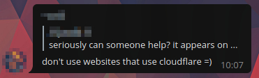

## [La Granda Nubmuro 🌩 The Great Cloudwall](http://crimeflare.eu.org)

| &#128444; | &#128441; |
|  ---  |  ---  |
|         | af [ Afrikaans ](https://mypdns.org/dCF/deCloudflare/-/blob/master/readme/af.md) am [ &#4768;&#4635;&#4653;&#4763; ](https://mypdns.org/dCF/deCloudflare/-/blob/master/readme/am.md) ar [ &#1575;&#1604;&#1593;&#1585;&#1576;&#1610;&#1577; ](https://mypdns.org/dCF/deCloudflare/-/blob/master/readme/ar.md) az [ Az&#601;rbaycanca ](https://mypdns.org/dCF/deCloudflare/-/blob/master/readme/az.md) be [ &#1041;&#1077;&#1083;&#1072;&#1088;&#1091;&#1089;&#1082;&#1072;&#1103; ](https://mypdns.org/dCF/deCloudflare/-/blob/master/readme/be.md) bg [ &#1041;&#1098;&#1083;&#1075;&#1072;&#1088;&#1089;&#1082;&#1080; ](https://mypdns.org/dCF/deCloudflare/-/blob/master/readme/bg.md) bn [ &#2476;&#2494;&#2434;&#2482;&#2494; ](https://mypdns.org/dCF/deCloudflare/-/blob/master/readme/bn.md) bs [ &#1073;&#1086;&#1089;&#1072;&#1085;&#1089;&#1082;&#1080; ](https://mypdns.org/dCF/deCloudflare/-/blob/master/readme/bs.md) ca [ Catal&#224; ](https://mypdns.org/dCF/deCloudflare/-/blob/master/readme/ca.md) cb [ Cebuan ](https://mypdns.org/dCF/deCloudflare/-/blob/master/readme/cb.md) co [ Corsu ](https://mypdns.org/dCF/deCloudflare/-/blob/master/readme/co.md) cs [ &#268;eština ](https://mypdns.org/dCF/deCloudflare/-/blob/master/readme/cs.md) cy [ Cymraeg ](https://mypdns.org/dCF/deCloudflare/-/blob/master/readme/cy.md) da [ Dansk ](https://mypdns.org/dCF/deCloudflare/-/blob/master/readme/da.md) de [ Deutsch ](https://mypdns.org/dCF/deCloudflare/-/blob/master/readme/de.md) el [ &#917;&#955;&#955;&#951;&#957;&#953;&#954;&#940; ](https://mypdns.org/dCF/deCloudflare/-/blob/master/readme/el.md) en [ English ](https://mypdns.org/dCF/deCloudflare/-/blob/master/readme/en.md) eo [ Esperanto ](https://mypdns.org/dCF/deCloudflare/-/blob/master/readme/eo.md) es [ Espa&#241;ol ](https://mypdns.org/dCF/deCloudflare/-/blob/master/readme/es.md) et [ Eesti ](https://mypdns.org/dCF/deCloudflare/-/blob/master/readme/et.md) eu [ Euskara ](https://mypdns.org/dCF/deCloudflare/-/blob/master/readme/eu.md) fa [ &#1601;&#1575;&#1585;&#1587;&#1740; ](https://mypdns.org/dCF/deCloudflare/-/blob/master/readme/fa.md) fi [ suomen kieli ](https://mypdns.org/dCF/deCloudflare/-/blob/master/readme/fi.md) fl [ Wikang Filipino ](https://mypdns.org/dCF/deCloudflare/-/blob/master/readme/fl.md) fr [ Français ](https://mypdns.org/dCF/deCloudflare/-/blob/master/readme/fr.md) fy [ Frisian ](https://mypdns.org/dCF/deCloudflare/-/blob/master/readme/fy.md) ga [ Gaeilge ](https://mypdns.org/dCF/deCloudflare/-/blob/master/readme/ga.md) gd [ G&#224;idhlig ](https://mypdns.org/dCF/deCloudflare/-/blob/master/readme/gd.md) gl [ Galego ](https://mypdns.org/dCF/deCloudflare/-/blob/master/readme/gl.md) gu [ Gujar&#257;t&#299; ](https://mypdns.org/dCF/deCloudflare/-/blob/master/readme/gu.md) ha [ Harshen ](https://mypdns.org/dCF/deCloudflare/-/blob/master/readme/ha.md) he [ &#1506;&#1489;&#1512;&#1497;&#1514; ](https://mypdns.org/dCF/deCloudflare/-/blob/master/readme/he.md) hi [ &#2361;&#2367;&#2344;&#2381;&#2342;&#2368; ](https://mypdns.org/dCF/deCloudflare/-/blob/master/readme/hi.md) hm [ lus Hmoob ](https://mypdns.org/dCF/deCloudflare/-/blob/master/readme/hm.md) hr [ Hrvatski ](https://mypdns.org/dCF/deCloudflare/-/blob/master/readme/hr.md) ht [ Krey&#242;l ](https://mypdns.org/dCF/deCloudflare/-/blob/master/readme/ht.md) hu [ Magyar ](https://mypdns.org/dCF/deCloudflare/-/blob/master/readme/hu.md) hw [ ʻŌlelo Hawaiʻi ](https://mypdns.org/dCF/deCloudflare/-/blob/master/readme/hw.md) hy [ &#1392;&#1377;&#1397;&#1381;&#1408;&#1381;&#1398; ](https://mypdns.org/dCF/deCloudflare/-/blob/master/readme/hy.md) id [ Indonesia ](https://mypdns.org/dCF/deCloudflare/-/blob/master/readme/id.md) ig [ As&#7909;s&#7909; Igbo ](https://mypdns.org/dCF/deCloudflare/-/blob/master/readme/ig.md) is [ íslenska ](https://mypdns.org/dCF/deCloudflare/-/blob/master/readme/is.md) it [ Italiano ](https://mypdns.org/dCF/deCloudflare/-/blob/master/readme/it.md) ja [ &#26085;&#26412;&#35486; ](https://mypdns.org/dCF/deCloudflare/-/blob/master/readme/ja.md) jv [ Basa Jawa ](https://mypdns.org/dCF/deCloudflare/-/blob/master/readme/jv.md) ka [ &#4325;&#4304;&#4320;&#4311;&#4323;&#4314;&#4312; ](https://mypdns.org/dCF/deCloudflare/-/blob/master/readme/ka.md) kk [ &#1178;&#1072;&#1079;&#1072;&#1179;&#1096;&#1072; ](https://mypdns.org/dCF/deCloudflare/-/blob/master/readme/kk.md) km [ &#6039;&#6070;&#6047;&#6070;&#6017;&#6098;&#6040;&#6082;&#6042; ](https://mypdns.org/dCF/deCloudflare/-/blob/master/readme/km.md) kn [ &#3221;&#3240;&#3277;&#3240;&#3233; ](https://mypdns.org/dCF/deCloudflare/-/blob/master/readme/kn.md) ko [ &#54620;&#44397;&#50612; ](https://mypdns.org/dCF/deCloudflare/-/blob/master/readme/ko.md) ku [ &#1705;&#1608;&#1585;&#1583;&#1740; ](https://mypdns.org/dCF/deCloudflare/-/blob/master/readme/ku.md) ky [ &#1050;&#1099;&#1088;&#1075;&#1099;&#1079;&#1095;&#1072; ](https://mypdns.org/dCF/deCloudflare/-/blob/master/readme/ky.md) la [ Lat&#299;na ](https://mypdns.org/dCF/deCloudflare/-/blob/master/readme/la.md) lb [ Lëtzebuergesch ](https://mypdns.org/dCF/deCloudflare/-/blob/master/readme/lb.md) lo [ &#3742;&#3762;&#3754;&#3762;&#3749;&#3762;&#3751; ](https://mypdns.org/dCF/deCloudflare/-/blob/master/readme/lo.md) lt [ Lietuvi&#371; ](https://mypdns.org/dCF/deCloudflare/-/blob/master/readme/lt.md) lv [ Latviešu ](https://mypdns.org/dCF/deCloudflare/-/blob/master/readme/lv.md) mg [ Malagasy ](https://mypdns.org/dCF/deCloudflare/-/blob/master/readme/mg.md) mi [ M&#257;ori ](https://mypdns.org/dCF/deCloudflare/-/blob/master/readme/mi.md) mk [ &#1084;&#1072;&#1082;&#1077;&#1076;&#1086;&#1085;&#1089;&#1082;&#1080; ](https://mypdns.org/dCF/deCloudflare/-/blob/master/readme/mk.md) ml [ &#3374;&#3378;&#3375;&#3390;&#3379;&#3330; ](https://mypdns.org/dCF/deCloudflare/-/blob/master/readme/ml.md) mn [ &#1084;&#1086;&#1085;&#1075;&#1086;&#1083; ](https://mypdns.org/dCF/deCloudflare/-/blob/master/readme/mn.md) mr [ &#2350;&#2352;&#2366;&#2336;&#2368; ](https://mypdns.org/dCF/deCloudflare/-/blob/master/readme/mr.md) ms [ bahasa Melayu ](https://mypdns.org/dCF/deCloudflare/-/blob/master/readme/ms.md) mt [ Malti ](https://mypdns.org/dCF/deCloudflare/-/blob/master/readme/mt.md) my [ Burmese ](https://mypdns.org/dCF/deCloudflare/-/blob/master/readme/my.md) nb [ Norsk Bokm&#229;l ](https://mypdns.org/dCF/deCloudflare/-/blob/master/readme/nb.md) ne [ &#2344;&#2375;&#2346;&#2366;&#2354;&#2368; ](https://mypdns.org/dCF/deCloudflare/-/blob/master/readme/ne.md) nl [ Nederlands ](https://mypdns.org/dCF/deCloudflare/-/blob/master/readme/nl.md) ny [ Chichewa ](https://mypdns.org/dCF/deCloudflare/-/blob/master/readme/ny.md) or [ &#2835;&#2849;&#2876;&#2879;&#2822; ](https://mypdns.org/dCF/deCloudflare/-/blob/master/readme/or.md) pa [ &#2602;&#2672;&#2588;&#2622;&#2604;&#2624; ](https://mypdns.org/dCF/deCloudflare/-/blob/master/readme/pa.md) pl [ Polski ](https://mypdns.org/dCF/deCloudflare/-/blob/master/readme/pl.md) ps [ &#1662;&#1690;&#1578;&#1608; ](https://mypdns.org/dCF/deCloudflare/-/blob/master/readme/ps.md) pt [ Portugu&#234;s ](https://mypdns.org/dCF/deCloudflare/-/blob/master/readme/pt.md) ro [ Român&#259; ](https://mypdns.org/dCF/deCloudflare/-/blob/master/readme/ro.md) ru [ &#1056;&#1091;&#1089;&#1089;&#1082;&#1080;&#1081; ](https://mypdns.org/dCF/deCloudflare/-/blob/master/readme/ru.md) rw [ Kinyarwanda ](https://mypdns.org/dCF/deCloudflare/-/blob/master/readme/rw.md) sd [ &#1587;&#1606;&#1676;&#1610;&#8206; ](https://mypdns.org/dCF/deCloudflare/-/blob/master/readme/sd.md) si [ Sinhalese ](https://mypdns.org/dCF/deCloudflare/-/blob/master/readme/si.md) sk [ Sloven&#269;ina ](https://mypdns.org/dCF/deCloudflare/-/blob/master/readme/sk.md) sl [ Slovenš&#269;ina ](https://mypdns.org/dCF/deCloudflare/-/blob/master/readme/sl.md) sm [ Gagana S&#257;moa ](https://mypdns.org/dCF/deCloudflare/-/blob/master/readme/sm.md) sn [ chiShona ](https://mypdns.org/dCF/deCloudflare/-/blob/master/readme/sn.md) so [ Af Soomaali ](https://mypdns.org/dCF/deCloudflare/-/blob/master/readme/so.md) sq [ Shqip ](https://mypdns.org/dCF/deCloudflare/-/blob/master/readme/sq.md) sr [ &#1057;&#1088;&#1087;&#1089;&#1082;&#1080; ](https://mypdns.org/dCF/deCloudflare/-/blob/master/readme/sr.md) st [ Sesotho ](https://mypdns.org/dCF/deCloudflare/-/blob/master/readme/st.md) su [ Basa Sunda ](https://mypdns.org/dCF/deCloudflare/-/blob/master/readme/su.md) sv [ Svenska ](https://mypdns.org/dCF/deCloudflare/-/blob/master/readme/sv.md) sw [ Kiswahili ](https://mypdns.org/dCF/deCloudflare/-/blob/master/readme/sw.md) ta [ &#2980;&#2990;&#3007;&#2996;&#3021; ](https://mypdns.org/dCF/deCloudflare/-/blob/master/readme/ta.md) te [ &#3108;&#3142;&#3122;&#3137;&#3095;&#3137; ](https://mypdns.org/dCF/deCloudflare/-/blob/master/readme/te.md) tg [ &#1090;&#1086;&#1207;&#1080;&#1082;&#1251; ](https://mypdns.org/dCF/deCloudflare/-/blob/master/readme/tg.md) th [ &#3616;&#3634;&#3625;&#3634;&#3652;&#3607;&#3618; ](https://mypdns.org/dCF/deCloudflare/-/blob/master/readme/th.md) tk [ Türkmençe ](https://mypdns.org/dCF/deCloudflare/-/blob/master/readme/tk.md) tr [ Türkçe ](https://mypdns.org/dCF/deCloudflare/-/blob/master/readme/tr.md) tt [ &#1090;&#1072;&#1090;&#1072;&#1088; &#1090;&#1077;&#1083;&#1077; ](https://mypdns.org/dCF/deCloudflare/-/blob/master/readme/tt.md) ug [ &#1574;&#1735;&#1610;&#1594;&#1735;&#1585;&#1670;&#1749; ](https://mypdns.org/dCF/deCloudflare/-/blob/master/readme/ug.md) uk [ &#1059;&#1082;&#1088;&#1072;&#1111;&#1085;&#1089;&#1100;&#1082;&#1072; ](https://mypdns.org/dCF/deCloudflare/-/blob/master/readme/uk.md) ur [ &#1575;&#1615;&#1585;&#1583;&#1615;&#1608; ](https://mypdns.org/dCF/deCloudflare/-/blob/master/readme/ur.md) uz [ ózbekça ](https://mypdns.org/dCF/deCloudflare/-/blob/master/readme/uz.md) vi [ Ti&#7871;ng Vi&#7879;t ](https://mypdns.org/dCF/deCloudflare/-/blob/master/readme/vi.md) xh [ isiXhosa ](https://mypdns.org/dCF/deCloudflare/-/blob/master/readme/xh.md) yi [ &#1488;&#1497;&#1491;&#1497;&#1513; ](https://mypdns.org/dCF/deCloudflare/-/blob/master/readme/yi.md) yo [ &#200;d&#232; Yor&#249;bá ](https://mypdns.org/dCF/deCloudflare/-/blob/master/readme/yo.md) zh [ 简体 ](https://mypdns.org/dCF/deCloudflare/-/blob/master/readme/zh.md) zt [ 繁體 ](https://mypdns.org/dCF/deCloudflare/-/blob/master/readme/zt.md) zu [ isiZulu ](https://mypdns.org/dCF/deCloudflare/-/blob/master/readme/zu.md) |
|  | - [Historio / Histre](HISTORY.md)  - [Permesilo / Lisense](LICENSE.md)  - [Pri Donaco / Donate to keep this alive](DONATION.md)  - [Aldoni vian mesaĝon anonime / Add your massarge anonymously](https://mail.crimeflare.eu.org/issue/)         |
|   | **OFFICIAL MIRRORS**  ☞ When in doubt ☞ **always** use ☞ [http://crimeflare.eu.org](http://crimeflare.eu.org) ☜  - https://mypdns.org/dCF/deCloudflare --- https://notabug.org/dCF/deCloudflare --- https://git.kescher.at/dCF/deCloudflare --- https://git.redxen.eu/dCF/deCloudflare --- https://git.disroot.org/dCF/deCloudflare  |

