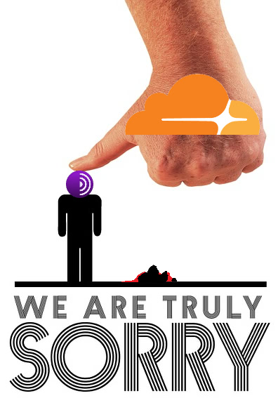

# Kiuj retejoj estas malamikaj al Tor-uzantoj?

Ne bloku nin!

| 🖼 | 🖼 |
| --- | --- |
|  |  |

Bonvolu vidi [INSTRUCTION.md](../INSTRUCTION.md) por dosiera celo kaj formato specifoj.

-----

# Which websites are hostile against Tor users?

Don't block us!

See [INSTRUCTION.md](../INSTRUCTION.md) for file purpose and format specifications.

-----

"Tor users are human too" - _Anonymous_
"Any person who takes a strong stand on something risks pushback. Even when there are no legal considerations, social pressure can be a strong deterrent against doing the right thing." -- [Oliver Bensson](https://www.orangewebsite.com/articles/privacy-on-the-internet-is-essential/)