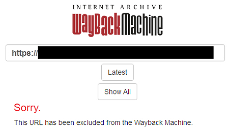
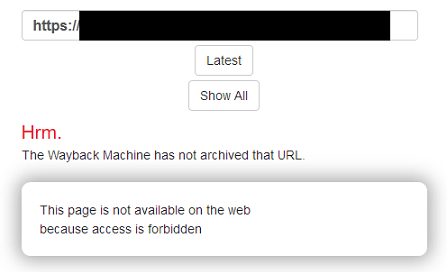
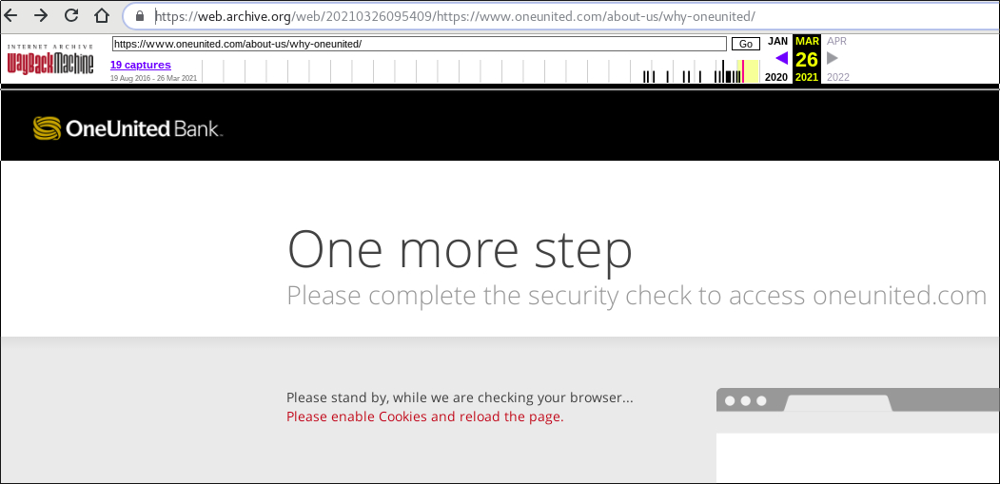

# Kontraŭ-Tor uzantoj FQDN-listo

[//]: # (do not edit me; start)

## *209,991* FQDN

[//]: # (do not edit me; end)

- Ne ĉiuj uzantoj de Tor estas malbonaj. Ne punu ĉiujn.
  - Kiel vi sentas, se iu blokas vin sen kialo?
  - Uzi Tor ne estas krimo.
  - [Fakuloj diras, ke gruppuno estas senutila, kontraŭproduktiva, mallaborema kaj neetika](https://web.archive.org/web/20201112000414/https://mypointexactly.wordpress.com/2009/07/21/group-punishment-ineffective-unethical/).
- Blokado de Tor ne estas solvo. Estas VPNj, retprogramoj kaj prokuroj.

# Forigu sin el la Wayback-maŝino de la Interreta Arkivo

[//]: # (do not edit me; start)

## _17,798_ domajnoj

[//]: # (do not edit me; end)

Iuj Tor-uzantoj dividas [arkivan ligon](https://web.archive.org/) kiel anstataŭigo de ligilo kiu rilatas al Cloudflare.
Tamen ekzistas retejoj kiuj forigis sin de la Wayback-maŝino.
Iuj el ili blokas la IP-adreson de Interreta Arkivo sur ilia serviloj.

| Mem-for-elekto | HTTP 403 Malpermesita | Cloudflare Arkivo |
|  ---  |  ---  |  ---  |
|  |  |  |

- "Kial ne estas la retejo, kiun mi serĉas en la arkivo?"
  - "Retejaj posedantoj eble petis, ke iliaj retejoj estu ekskluditaj de la Wayback-Maŝino."
- Bonvolu vidi [INSTRUCTION.md](../../INSTRUCTION.md) por dosiera celo kaj formato specifoj.
- Ilo: [Karma::iarchive](http://im5wixghmfmt7gf7wb4xrgdm6byx2gj26zn47da6nwo7xvybgxnqryid.onion/iarchive/)

-----

# Anti-Tor users FQDN list

- Not all Tor users are bad. Do not punish everyone.
  - How do you feel if someone block you for no reason?
  - Using Tor is not a crime.
  - Experts say that group punishment is ineffective, counterproductive, lazy and unethical.
- Blocking Tor is not a solution. There are VPNs, network program and proxies.

# Opted out from the Internet Archive's Wayback Machine

Some Tor users are sharing [archive.org](https://web.archive.org/) link as a replacement of link which are related to Cloudflare.
However there are websites which opted themselves out from the Wayback Machine.
Some of them block Internet Archive's IP address on their servers.

- "Why isn't the site I'm looking for in the archive?"
  - "Site owners might have requested that their sites be excluded from the Wayback Machine."
- See [INSTRUCTION.md](../../INSTRUCTION.md) for file purpose and format specifications.
- Tool: [Karma::iarchive](http://im5wixghmfmt7gf7wb4xrgdm6byx2gj26zn47da6nwo7xvybgxnqryid.onion/iarchive/)

-----

