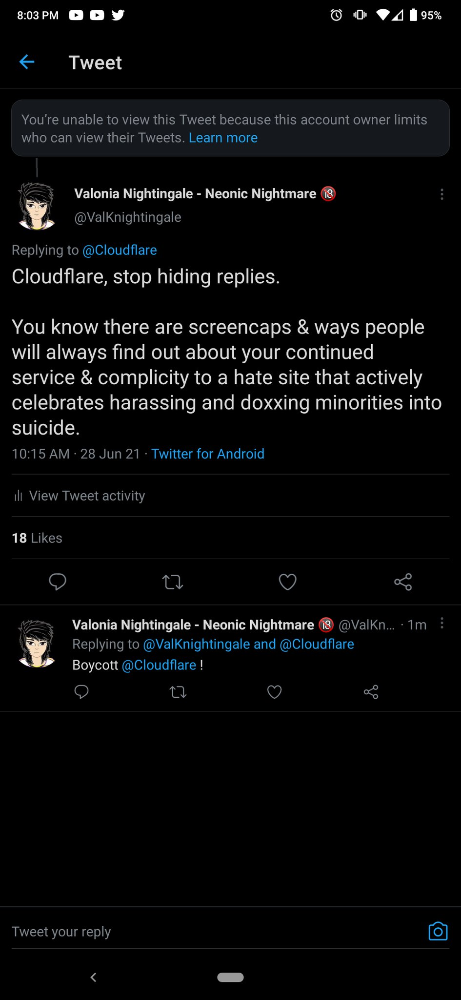

# Cloudflare, Inc.

Kontraŭ-homa gvatada & cenzura kompanio.

| 🖼 | 🖼 | 🖼 |
| --- | --- | --- |
|  |  |  |
|  |  |  |
|  |  |  |
|  |  |  |
|  |  | - |

Bonvolu vidi [INSTRUCTION.md](../INSTRUCTION.md) por dosiera celo kaj formato specifoj.

-----

Anti-human surveilance & censorship company.

See [INSTRUCTION.md](../INSTRUCTION.md) for file purpose and format specifications.

---

- "_Nobody needs American tech companies like cloudflare, google, ibm, or cisco to provide dns to us. We can just run it locally -- far more private_" 
[Paul Vixie](https://twitter.com/paulvixie/status/1063843157668970496)
