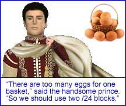

# Domajna listo de uzantoj de Cloudflare

[//]: # (do not edit me; start)

## *13,080,331* domajnoj

[//]: # (do not edit me; end)

- Bonvolu vidi [INSTRUCTION.md](../../INSTRUCTION.md) por dosiera celo kaj formato specifoj.
- [is_listed_cf(), is_cloudflare_cached()](../../tool/example.json.is_cloudflare.php)

-----

# Cloudflare users domain list

- See [INSTRUCTION.md](../../INSTRUCTION.md) for file purpose and format specifications.
- [is_listed_cf(), is_cloudflare_cached()](../../tool/example.json.is_cloudflare.php)

-----

