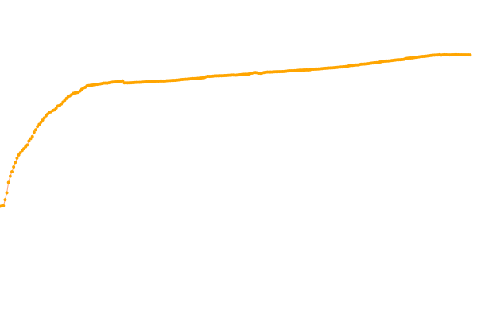

# Domajna listo de uzantoj de Cloudflare

[//]: # (do not edit me; start)

## *33,109,366* domajnoj

[//]: # (do not edit me; end)

- Bonvolu vidi [INSTRUCTION.md](../../INSTRUCTION.md) por dosiera celo kaj formato specifoj.

-----

# Cloudflare users domain list

- See [INSTRUCTION.md](../../INSTRUCTION.md) for file purpose and format specifications.

-----

# Using the list

  - [is_listed_cf(), is_cloudflare_cached()](../../tool/example.json.is_cloudflare.php)
  - [CfDomains](../../tool/cfdomains/README.md), CLI tool to look up Cloudflare domain list
  - [Karma API](../../subfiles/service/karma_api.md)
  - [API files for IsMM/IsAT Add-ons](../../tool/api_for_ismm_isat/README.md)

-----

[//]: # (begin table section)

| Date | Domains |
| --- | --- |
| 2023-05-13 | 33,109,366 |
| 2023-05-12 | 33,111,149 |
| 2023-05-11 | 33,100,166 |
| 2023-05-10 | 33,092,313 |
| 2023-05-09 | 33,086,367 |
| 2023-05-08 | 33,091,783 |
| 2023-05-07 | 33,101,158 |
| 2023-05-06 | 33,107,811 |
| 2023-05-05 | 33,094,550 |
| 2023-05-04 | 33,068,399 |
| 2023-05-03 | 33,114,842 |
| 2023-05-02 | 33,079,785 |
| 2023-05-01 | 33,068,932 |
| 2023-04-30 | 33,060,167 |
| 2023-04-29 | 33,045,627 |
| 2023-04-28 | 33,021,225 |
| 2023-04-27 | 32,993,351 |
| 2023-04-26 | 32,959,104 |
| 2023-04-25 | 32,930,127 |
| 2023-04-24 | 32,905,696 |
| 2023-04-23 | 32,891,942 |
| 2023-04-22 | 32,872,284 |
| 2023-04-21 | 32,842,505 |
| 2023-04-20 | 32,807,876 |
| 2023-04-19 | 32,779,524 |
| 2023-04-18 | 32,745,512 |
| 2023-04-17 | 32,712,930 |
| 2023-04-16 | 32,700,349 |
| 2023-04-15 | 32,686,136 |
| 2023-04-14 | 32,659,297 |
| 2023-04-13 | 32,630,246 |
| 2023-04-12 | 32,529,507 |
| 2023-04-11 | 32,501,510 |
| 2023-04-10 | 32,483,582 |
| 2023-04-09 | 32,474,544 |
| 2023-04-08 | 32,461,350 |
| 2023-04-07 | 32,437,954 |
| 2023-04-06 | 32,408,219 |
| 2023-04-05 | 32,382,446 |
| 2023-04-04 | 32,354,339 |
| 2023-04-03 | 32,327,978 |
| 2023-04-02 | 32,320,685 |
| 2023-04-01 | 32,308,580 |
| 2023-03-31 | 32,285,569 |
| 2023-03-29 | 32,234,566 |
| 2023-03-28 | 32,197,493 |
| 2023-03-27 | 32,139,172 |
| 2023-03-26 | 32,121,523 |
| 2023-03-25 | 32,102,368 |
| 2023-03-24 | 32,078,534 |
| 2023-03-23 | 32,055,175 |
| 2023-03-22 | 32,014,555 |
| 2023-03-21 | 31,986,803 |
| 2023-03-20 | 31,954,797 |
| 2023-03-19 | 31,943,077 |
| 2023-03-18 | 31,931,947 |
| 2023-03-17 | 31,920,546 |
| 2023-03-16 | 31,874,714 |
| 2023-03-15 | 31,830,588 |
| 2023-03-14 | 31,827,735 |
| 2023-03-13 | 31,803,635 |
| 2023-03-12 | 31,772,442 |
| 2023-03-11 | 31,755,495 |
| 2023-03-10 | 31,734,667 |
| 2023-03-09 | 31,658,948 |
| 2023-03-08 | 31,628,027 |
| 2023-03-07 | 31,601,672 |
| 2023-03-06 | 31,580,124 |
| 2023-03-05 | 31,573,158 |
| 2023-03-04 | 31,551,419 |
| 2023-03-03 | 31,528,601 |
| 2023-03-02 | 31,506,596 |
| 2023-03-01 | 31,483,904 |
| 2023-02-28 | 31,465,731 |
| 2023-02-27 | 31,459,479 |
| 2023-02-26 | 31,448,266 |
| 2023-02-25 | 31,429,824 |
| 2023-02-24 | 31,411,752 |
| 2023-02-23 | 31,394,713 |
| 2023-02-22 | 31,367,657 |
| 2023-02-21 | 31,350,332 |
| 2023-02-20 | 31,330,054 |
| 2023-02-19 | 31,317,959 |
| 2023-02-18 | 31,311,781 |
| 2023-02-17 | 31,297,208 |
| 2023-02-16 | 31,279,996 |
| 2023-02-15 | 31,226,125 |
| 2023-02-14 | 31,197,565 |
| 2023-02-13 | 31,213,261 |
| 2023-02-12 | 31,197,112 |
| 2023-02-11 | 31,189,925 |
| 2023-02-10 | 31,168,866 |
| 2023-02-09 | 31,176,845 |
| 2023-02-08 | 31,152,109 |
| 2023-02-07 | 31,134,988 |
| 2023-02-06 | 31,113,340 |
| 2023-02-05 | 31,103,506 |
| 2023-02-04 | 31,096,110 |
| 2023-02-03 | 31,094,367 |
| 2023-02-02 | 31,075,951 |
| 2023-02-01 | 31,037,851 |
| 2023-01-31 | 31,015,385 |
| 2023-01-30 | 31,001,763 |
| 2023-01-29 | 30,991,728 |
| 2023-01-28 | 30,990,345 |
| 2023-01-27 | 30,983,588 |
| 2023-01-26 | 30,979,512 |
| 2023-01-25 | 30,971,431 |
| 2023-01-24 | 30,946,962 |
| 2023-01-23 | 30,941,737 |
| 2023-01-22 | 30,936,582 |
| 2023-01-21 | 30,943,635 |
| 2023-01-20 | 30,917,783 |
| 2023-01-19 | 30,878,527 |
| 2023-01-18 | 30,831,410 |
| 2023-01-17 | 30,781,869 |
| 2023-01-16 | 30,798,631 |
| 2023-01-15 | 30,845,071 |
| 2023-01-14 | 30,878,904 |
| 2023-01-13 | 30,863,152 |
| 2023-01-12 | 30,807,344 |
| 2023-01-11 | 30,767,945 |
| 2023-01-10 | 30,686,866 |
| 2023-01-09 | 30,657,728 |
| 2023-01-08 | 30,665,015 |
| 2023-01-07 | 30,655,148 |
| 2023-01-06 | 30,637,249 |
| 2023-01-05 | 30,607,492 |
| 2023-01-04 | 30,582,094 |
| 2023-01-03 | 30,560,029 |
| 2023-01-02 | 30,539,664 |
| 2023-01-01 | 30,567,953 |
| 2022-12-31 | 30,561,224 |
| 2022-12-30 | 30,543,418 |
| 2022-12-29 | 30,528,854 |
| 2022-12-28 | 30,506,751 |
| 2022-12-27 | 30,501,762 |
| 2022-12-26 | 30,481,309 |
| 2022-12-25 | 30,474,367 |
| 2022-12-24 | 30,475,670 |
| 2022-12-23 | 30,463,202 |
| 2022-12-22 | 30,458,745 |
| 2022-12-21 | 30,457,228 |
| 2022-12-20 | 30,421,648 |
| 2022-12-19 | 30,400,071 |
| 2022-12-18 | 30,392,144 |
| 2022-12-17 | 30,400,606 |
| 2022-12-16 | 30,350,097 |
| 2022-12-15 | 30,253,302 |
| 2022-12-14 | 30,223,173 |
| 2022-12-13 | 30,192,485 |
| 2022-12-12 | 30,164,359 |
| 2022-12-11 | 30,150,625 |
| 2022-12-10 | 30,138,418 |
| 2022-12-09 | 30,115,858 |
| 2022-12-08 | 30,121,352 |
| 2022-12-07 | 30,093,856 |
| 2022-12-06 | 30,064,582 |
| 2022-12-05 | 30,045,497 |
| 2022-12-04 | 30,036,936 |
| 2022-12-03 | 30,022,288 |
| 2022-12-02 | 30,002,452 |
| 2022-12-01 | 29,980,559 |
| 2022-11-30 | 29,949,350 |
| 2022-11-29 | 29,924,735 |
| 2022-11-28 | 29,896,978 |
| 2022-11-27 | 29,891,465 |
| 2022-11-26 | 29,885,263 |
| 2022-11-25 | 29,863,015 |
| 2022-11-24 | 29,852,785 |
| 2022-11-23 | 29,845,248 |
| 2022-11-22 | 29,815,369 |
| 2022-11-21 | 29,806,670 |
| 2022-11-20 | 29,810,985 |
| 2022-11-19 | 29,811,968 |
| 2022-11-18 | 29,795,449 |
| 2022-11-17 | 29,798,225 |
| 2022-11-16 | 29,784,907 |
| 2022-11-15 | 29,739,765 |
| 2022-11-14 | 29,724,962 |
| 2022-11-13 | 29,715,770 |
| 2022-11-12 | 29,713,646 |
| 2022-11-11 | 29,705,640 |
| 2022-11-10 | 29,692,165 |
| 2022-11-09 | 29,676,191 |
| 2022-11-08 | 29,656,246 |
| 2022-11-07 | 29,642,773 |
| 2022-11-06 | 29,640,594 |
| 2022-11-05 | 29,637,964 |
| 2022-11-04 | 29,621,094 |
| 2022-11-03 | 29,603,932 |
| 2022-11-02 | 29,584,739 |
| 2022-11-01 | 29,576,643 |
| 2022-10-31 | 29,567,841 |
| 2022-10-30 | 29,571,892 |
| 2022-10-29 | 29,574,121 |
| 2022-10-28 | 29,829,171 |
| 2022-10-27 | 29,796,841 |
| 2022-10-26 | 29,765,941 |
| 2022-10-25 | 29,730,310 |
| 2022-10-24 | 29,697,913 |
| 2022-10-23 | 29,684,222 |
| 2022-10-22 | 29,667,720 |
| 2022-10-21 | 29,632,538 |
| 2022-10-20 | 29,586,486 |
| 2022-10-19 | 29,533,877 |
| 2022-10-18 | 29,547,440 |
| 2022-10-17 | 29,542,746 |
| 2022-10-16 | 29,492,595 |
| 2022-10-15 | 29,449,576 |
| 2022-10-14 | 29,415,068 |
| 2022-10-13 | 29,385,687 |
| 2022-10-12 | 29,359,901 |
| 2022-10-11 | 29,331,456 |
| 2022-10-10 | 29,285,202 |
| 2022-10-09 | 29,259,128 |
| 2022-10-08 | 29,230,359 |
| 2022-10-07 | 29,192,407 |
| 2022-10-03 | 29,007,713 |
| 2022-09-30 | 28,922,633 |
| 2022-09-26 | 28,773,160 |
| 2022-09-19 | 28,547,605 |
| 2022-09-14 | 28,384,633 |
| 2022-09-13 | 28,343,600 |
| 2022-09-12 | 28,307,812 |
| 2022-09-09 | 28,252,153 |
| 2022-09-04 | 28,089,354 |
| 2022-08-31 | 27,937,649 |
| 2022-08-28 | 27,838,291 |
| 2022-08-21 | 27,607,616 |
| 2022-08-14 | 27,379,537 |
| 2022-08-07 | 27,158,232 |
| 2022-07-31 | 26,921,560 |
| 2022-07-26 | 26,733,282 |
| 2022-07-24 | 26,666,096 |
| 2022-07-17 | 26,397,126 |
| 2022-07-12 | 26,172,266 |
| 2022-07-10 | 26,102,085 |
| 2022-07-06 | 25,937,466 |
| 2022-07-03 | 25,873,671 |
| 2022-06-26 | 25,654,368 |
| 2022-06-19 | 25,428,978 |
| 2022-06-12 | 25,167,535 |
| 2022-06-05 | 24,889,465 |
| 2022-05-29 | 24,615,415 |
| 2022-05-22 | 24,347,662 |
| 2022-05-15 | 24,081,371 |
| 2022-05-08 | 23,677,738 |
| 2022-05-01 | 23,371,269 |
| 2022-04-17 | 22,825,552 |
| 2022-04-10 | 22,555,670 |
| 2022-04-03 | 22,265,911 |
| 2022-03-20 | 21,753,265 |
| 2022-03-13 | 21,529,360 |
| 2022-03-06 | 21,287,599 |
| 2022-02-27 | 21,064,967 |
| 2022-02-20 | 20,790,994 |
| 2022-02-13 | 20,508,975 |
| 2022-02-06 | 20,110,128 |
| 2022-01-30 | 19,570,903 |
| 2022-01-23 | 18,997,847 |
| 2022-01-16 | 18,396,598 |
| 2022-01-09 | 17,834,161 |
| 2022-01-02 | 17,053,096 |
| 2021-12-26 | 15,750,788 |
| 2021-12-19 | 14,880,990 |
| 2021-12-12 | 14,119,233 |
| 2021-12-05 | 14,082,351 |
| 2021-11-28 | 14,046,229 |
