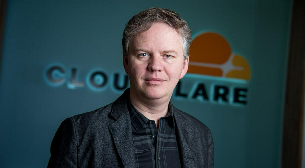

# Què podeu fer per resistir Cloudflare?

| 🖼 | 🖼 | 🖼 |
| --- | --- | --- |
|  |  |  |


"Matthew Browning Prince (Tvitero @eastdakota)", naskita la 13an de novembro 1974, estas la ĉefoficisto kaj kunfondinto de Cloudflaron.

Danke al lia riĉa paĉjo, "John B. Prince", li ĉeestis la Universitaton de Ĉikago Leĝlernejo kaj Harvard Komerclernejo.
Princo instruis Interretan leĝon kaj estis specialisto pri kontraŭ-spamaj leĝoj kaj Fraŭdo-esploroj.


"*I’d suggest this was armchair analysis by kids – it’s hard to take seriously.*" [t](https://www.theguardian.com/technology/2015/nov/19/cloudflare-accused-by-anonymous-helping-isis)

"*That was simply unfounded paranoia, pretty big difference.*"  [t](https://twitter.com/xxdesmus/status/992757936123359233)

"*We also work with Interpol and other non-US entities*" [t](https://twitter.com/eastdakota/status/1203028504184360960)

"*Watching hacker skids on Github squabble about trying to bypass Cloudflare's new anti-bot systems continues to be my daily amusement.* 🍿" [t](https://twitter.com/eastdakota/status/1273277839102656515)


---


<details>
<summary>feu clic a mi

## Consumidor de llocs web
</summary>


- Si el lloc web que us agrada utilitza Cloudflare, digueu-los que no l’utilitzin.
  - Queixar-se a les xarxes socials com Facebook, Reddit, Twitter o Mastodon no fa cap diferència. [Les accions són més fortes que els hashtags.](https://twitter.com/phyzonloop/status/1274132092490862594)
  - Intenteu posar-vos en contacte amb el propietari del lloc web si voleu fer-vos útil.

[Va dir Cloudflare](https://github.com/Eloston/ungoogled-chromium/issues/783):
```
Us recomanem que contacteu amb els administradors per obtenir serveis o llocs específics amb els quals tingueu problemes i que compartiu la vostra experiència.
```

[Si no ho demaneu, el propietari del lloc web mai no sabrà aquest problema.](../PEOPLE.md)


[Exemple correcte](https://counterpartytalk.org/t/turn-off-cloudflare-on-counterparty-co-plz/164/5).<br>
Tens algun problema? [Alça la veu ara.](https://github.com/maraoz/maraoz.github.io/issues/1) Exemple següent.

```
Només ajudeu a la censura corporativa i la vigilància massiva.
http://crimeflare.eu.org
```

```
La vostra pàgina web es troba al jardí privat de CloudFlare, que abusa de la privadesa.
http://crimeflare.eu.org
```

- Dediqueu una estona a llegir la política de privadesa del lloc web.
  - si el lloc web està darrere de Cloudflare o el lloc web utilitza serveis connectats a Cloudflare.

Ha d’explicar què és el "Cloudflare" i demanar permís per compartir les vostres dades amb Cloudflare. Si no ho feu, es trencarà la confiança i s’hauria d’evitar el lloc web en qüestió.

[Aquí es mostra un exemple de política de privadesa acceptable](https://archive.is/bDlTz) ("Subprocessors" > "Entity Name")

```
He llegit la vostra política de privadesa i no trobo la paraula Cloudflare.
Em nego a compartir dades amb vosaltres si continueu proporcionant les meves dades a Cloudflare.
http://crimeflare.eu.org
```

Aquest és un exemple de política de privadesa que no conté la paraula Cloudflare.
[Liberland Jobs](https://archive.is/daKIr) [privacy policy](https://docsend.com/view/feiwyte):


Cloudflare té la seva pròpia política de privadesa.
[A Cloudflare li encanten les persones que fan sexe.](https://www.reddit.com/r/GamerGhazi/comments/2s64fe/be_wary_reporting_to_cloudflare/)

Aquí teniu un bon exemple del formulari d’inscripció al lloc web.
AFAIK, lloc web zero. Confiarà en ells?

```
En fer clic a "Registra't a XYZ", acceptes les nostres condicions del servei i la nostra declaració de privadesa.
També accepteu compartir les vostres dades amb Cloudflare i també accepteu la declaració de privadesa de cloudflare.
Si Cloudflare divulga la vostra informació o no us permet connectar-vos als nostres servidors, no és culpa nostra. [*]

[ Registra't ] [ no hi estic d'acord ]
```
[*] [PEOPLE.md](../PEOPLE.md)


- Intenteu no utilitzar el seu servei. Recordeu que Cloudflare us està mirant.
  - ["I'm in your TLS, sniffin' your passworz"](../image/iminurtls.jpg)

- Cerqueu un altre lloc web. Hi ha alternatives i oportunitats a Internet.

- Convenceu els vostres amics per utilitzar Tor diàriament.
  - L’anonimat hauria de ser l’estàndard d’internet obert.
  - [Tingueu en compte que al projecte Tor no li agrada aquest projecte.](../HISTORY.md)

</details>

------

<details>
<summary>feu clic a mi

## Complements
</summary>

- Si el vostre navegador és Firefox, Tor Browser o Ungoogled Chromium, utilitzeu un d'aquests complements a continuació.
  - Si voleu afegir un altre complement, pregunteu-hi primer.


| Nom | Desenvolupador | Suport | Es pot bloquejar | Es pot notificar | Chrome |
| -------- | -------- | -------- | -------- | -------- | -------- |
| [Bloku Cloudflaron MITM-Atakon](../subfiles/addon/bcma.md) | #Addon | [ ? ](http://crimeflare.eu.org/) | **Sí**     | **Sí**     |  **Sí** |
| [Ĉu ligoj estas vundeblaj al MITM-atako?](../subfiles/addon/ismm.md) | #Addon | [ ? ](http://crimeflare.eu.org/) | No     | **Sí**     |  **Sí** |
| [Ĉu ĉi tiuj ligoj blokos Tor-uzanton?](../subfiles/addon/isat.md) | #Addon | [ ? ](http://crimeflare.eu.org/) | No     | **Sí**     |  **Sí** |
| [Block Cloudflare MITM Attack](https://trac.torproject.org/projects/tor/attachment/ticket/24351/block_cloudflare_mitm_attack-1.0.14.1-an%2Bfx.xpi)<br>[**DELETED BY TOR PROJECT**](../HISTORY.md) | nullius | [ ? ](../tool/block_cloudflare_mitm_fx), [Link](http://crimeflare.eu.org/) | **Sí**     | **Sí**     |  No |
| [TPRB](http://sw.nnpaefp7pkadbxxkhz2agtbv2a4g5sgo2fbmv3i7czaua354334uqqad.onion/) | Sw | [ ? ](http://sw.nnpaefp7pkadbxxkhz2agtbv2a4g5sgo2fbmv3i7czaua354334uqqad.onion/) | **Sí**     | **Sí**     |  No |
| [Detect Cloudflare](https://addons.mozilla.org/en-US/firefox/addon/detect-cloudflare/) | Frank Otto | [ ? ](https://github.com/traktofon/cf-detect) | No     | **Sí**     |  No |
| [True Sight](https://addons.mozilla.org/en-US/firefox/addon/detect-cloudflare-plus/) | claustromaniac | [ ? ](https://github.com/claustromaniac/detect-cloudflare-plus) | No     | **Sí**     |  No |
| [Which Cloudflare datacenter am I visiting?](https://addons.mozilla.org/en-US/firefox/addon/cf-pop/) | 依云 | [ ? ](https://github.com/lilydjwg/cf-pop) | No     | **Sí**     |  No |


- "Decentraleyes" pot aturar la connexió a "CDNJS (Cloudflare)".
  - Evita que moltes peticions arribin a les xarxes i serveix a fitxers locals per evitar que els llocs es trenquin.
  - El desenvolupador va respondre: "[very concerning indeed](https://github.com/Synzvato/decentraleyes/issues/236#issuecomment-352049501)", "[widespread usage severely centralizes the web](https://github.com/Synzvato/decentraleyes/issues/251#issuecomment-366752049)"

- [També podeu eliminar o desconfiar del certificat Cloudflare de la vostra autoritat de certificació (CA).](https://www.ssl.com/how-to/remove-root-certificate-firefox/)

</details>

------

<details>
<summary>feu clic a mi

## Propietari del lloc web / desenvolupador web
</summary>


- No utilitzeu la solució Cloudflare, punt.
  - Pots fer-ho millor, oi? [A continuació s’explica com eliminar subscripcions, plans, dominis o comptes de Cloudflare.](https://support.cloudflare.com/hc/en-us/articles/200167776-Removing-subscriptions-plans-domains-or-accounts)

| 🖼 | 🖼 |
| --- | --- |
|  |  |

- Voleu més clients? Saps que has de fer. La pista és "per sobre de la línia".
  - [Hola, heu escrit "Ens prenem seriosament la vostra privadesa", però tinc "Error 403 Prohibit Anonymous Proxy No Allowed".](https://it.slashdot.org/story/19/02/19/0033255/stop-saying-we-take-your-privacy-and-security-seriously) Per què bloquegeu Tor o VPN? I per què bloquegeu els correus electrònics temporals?


- L’ús de Cloudflare augmentarà les possibilitats d’apagada. Els visitants no poden accedir al vostre lloc web si el vostre servidor està inactiu o Cloudflare està inactiu.
  - [Realment pensàveu que Cloudflare no baixaria mai?](https://www.ibtimes.com/cloudflare-down-not-working-sites-producing-504-gateway-timeout-errors-2618008) [Another](https://twitter.com/Jedduff/status/1097875615997399040) [sample](https://twitter.com/search?f=tweets&vertical=default&q=Cloudflare%20is%20having%20problems). [Need more](../PEOPLE.md)?


- L'ús de Cloudflare per representar el vostre "servei API", "servidor d'actualització de programari" o "feed RSS" perjudicarà el vostre client. Un client us va trucar i us va dir "Ja no puc utilitzar la vostra API" i no teniu ni idea de què passa. Cloudflare pot bloquejar silenciosament el vostre client. Creus que està bé?
  - Hi ha molts serveis de connexió en línia de clients i lectors RSS. Per què publiqueu flux RSS si no permeteu que la gent es subscrigui?


- Necessiteu un certificat HTTPS? Utilitzeu "Encriptem" o només el compreu a una empresa de CA.

- Necessiteu un servidor DNS? No podeu configurar el vostre propi servidor? Què passa amb ells: [Hurricane Electric Free DNS](https://dns.he.net/), [Dyn.com](https://dyn.com/dns/), [1984 Hosting](https://www.1984hosting.com/), [Afraid.Org (Administrador suprimiu el vostre compte si utilitzeu TOR)](https://freedns.afraid.org/)
  - [Alternativoj al DNS](../subfiles/alternative/domaindns.md)

- Busqueu servei d’allotjament? Només gratuït? Què passa amb ells: [Onion Service](http://vww6ybal4bd7szmgncyruucpgfkqahzddi37ktceo3ah7ngmcopnpyyd.onion/en/security/network-security/tor/onionservices-best-practices), [Free Web Hosting Area](https://freewha.com/), [Autistici/Inventati Web Site Hosting](https://www.autinv5q6en4gpf4.onion/services/website), [Github Pages](https://pages.github.com/), [Surge](https://surge.sh/)
  - [Alternatives a Cloudflare](../subfiles/alternative/cloudflare.md)

- Feu servir "cloudflare-ipfs.com"? [Sabeu que Cloudflare IPFS és dolent?](../PEOPLE.md)

- Instal·leu el tallafoc d'aplicacions web, com ara OWASP i Fail2Ban, al vostre servidor i configureu-lo correctament.
  - Bloquejar Tor no és una solució. No castigueu a tothom només per usuaris petits i dolents.

- Redirigeix ​​o bloqueja els usuaris de "Cloudflare Warp" perquè accedeixin al teu lloc web. I proporcioneu un motiu si podeu.

> Llista d’IP: "[Els intervals d’IP actuals de Cloudflare](cloudflare_inc/)"

> A: Només cal bloquejar-los

```
server {
...
deny 173.245.48.0/20;
deny 103.21.244.0/22;
deny 103.22.200.0/22;
deny 103.31.4.0/22;
deny 141.101.64.0/18;
deny 108.162.192.0/18;
deny 190.93.240.0/20;
deny 188.114.96.0/20;
deny 197.234.240.0/22;
deny 198.41.128.0/17;
deny 162.158.0.0/15;
deny 104.16.0.0/12;
deny 172.64.0.0/13;
deny 131.0.72.0/22;
deny 2400:cb00::/32;
deny 2606:4700::/32;
deny 2803:f800::/32;
deny 2405:b500::/32;
deny 2405:8100::/32;
deny 2a06:98c0::/29;
deny 2c0f:f248::/32;
...
}
```

> B: Redirigeix ​​a la pàgina d'advertència

```
http {
...
geo $iscf {
default 0;
173.245.48.0/20 1;
103.21.244.0/22 1;
103.22.200.0/22 1;
103.31.4.0/22 1;
141.101.64.0/18 1;
108.162.192.0/18 1;
190.93.240.0/20 1;
188.114.96.0/20 1;
197.234.240.0/22 1;
198.41.128.0/17 1;
162.158.0.0/15 1;
104.16.0.0/12 1;
172.64.0.0/13 1;
131.0.72.0/22 1;
2400:cb00::/32 1;
2606:4700::/32 1;
2803:f800::/32 1;
2405:b500::/32 1;
2405:8100::/32 1;
2a06:98c0::/29 1;
2c0f:f248::/32 1;
}
...
}

server {
...
if ($iscf) {rewrite ^ https://example.com/cfwsorry.php;}
...
}

<?php
header('HTTP/1.1 406 Not Acceptable');
echo <<<CLOUDFLARED
Thank you for visiting ourwebsite.com!<br />
We are sorry, but we can't serve you because your connection is being intercepted by Cloudflare.<br />
Please read http://crimeflare.eu.org for more information.<br />
CLOUDFLARED;
die();
```

- Configureu Tor Onion Service o I2P insite si creieu en la llibertat i acolliu usuaris anònims.

- Demaneu consell a altres operadors de llocs web dobles Clearnet / Tor i feu amics anònims.

</details>

------

<details>
<summary>feu clic a mi

## Usuari del programari
</summary>


- Discord utilitza CloudFlare. Alternatives? Nosaltres recomenem [**Briar** (Android)](https://f-droid.org/en/packages/org.briarproject.briar.android/), [Ricochet (PC)](https://ricochet.im/), [Tox + Tor (Android/PC)](https://tox.chat/download.html)
  - Briar inclou el dimoni Tor, de manera que no cal instal·lar Orbot.
  - Els desenvolupadors de Qwtch, Open Privacy, van esborrar el projecte stop_cloudflare del seu servei git sense previ avís.

- Si utilitzeu Debian GNU / Linux o qualsevol derivat, subscriviu-vos: [bug #831835](https://bugs.debian.org/cgi-bin/bugreport.cgi?bug=831835). I si podeu, ajudeu a verificar el pegat i ajudeu el mantenidor a arribar a la conclusió correcta sobre si s’ha d’acceptar.

- Recomaneu sempre aquests navegadors.

| Nom | Desenvolupador | Suport | Comenta |
| -------- | -------- | -------- | -------- |
| [Ungoogled-Chromium](https://ungoogled-software.github.io/ungoogled-chromium-binaries/) | Eloston | [ ? ](https://github.com/Eloston/ungoogled-chromium) | PC (Win, Mac, Linux)  _!Tor_ |
| [Bromite](https://www.bromite.org/fdroid) | Bromite | [ ? ](https://github.com/bromite/bromite/issues) | Android  _!Tor_ |
| [Tor Browser](https://www.torproject.org/download/) | Tor Project | [ ? ](https://support.torproject.org/) | PC (Win, Mac, Linux)  _Tor_|
| [Tor Browser Android](https://www.torproject.org/download/) | Tor Project | [ ? ](https://support.torproject.org/) | Android  _Tor_|
| [Onion Browser](https://itunes.apple.com/us/app/onion-browser/id519296448?mt=8) | Mike Tigas | [ ? ](https://github.com/OnionBrowser/OnionBrowser/issues) | Apple iOS  _Tor_|
| [GNU/Icecat](https://www.gnu.org/software/gnuzilla/) | GNU | [ ? ](https://www.gnu.org/software/gnuzilla/) | PC (Linux) |
| [IceCatMobile](https://f-droid.org/en/packages/org.gnu.icecat/) | GNU | [ ? ](https://lists.gnu.org/mailman/listinfo/bug-gnuzilla) | Android |
| [Iridium Browser](https://iridiumbrowser.de/about/) | Iridium | [ ? ](https://github.com/iridium-browser/iridium-browser/) | PC (Win, Mac, Linux, OpenBSD) |


La privadesa d'altres programes és imperfecta. Això no vol dir que el navegador Tor sigui "perfecte".
No hi ha cap tecnologia 100% segura ni 100% privada a Internet.

- No voleu utilitzar Tor? Podeu utilitzar qualsevol navegador amb el dimoni Tor.
  - [Tingueu en compte que al projecte Tor no els agrada això.](https://support.torproject.org/tbb/tbb-9/) Utilitzeu el navegador Tor si podeu fer-ho.
- [Com s'utilitza Chromium amb Tor](../subfiles/chromium_tor.md)


Parlem de la privadesa d'altres programes.

- [Si realment necessiteu utilitzar Firefox, trieu "Firefox ESR".](https://www.mozilla.org/en-US/firefox/organizations/)
  - [Firefox - Spyware Watchdog](https://spyware.neocities.org/articles/firefox.html)
  - [Firefox rebutja la llibertat d’expressió i prohibeix la llibertat d’expressió](https://web.archive.org/web/20200423010026/https://reclaimthenet.org/firefox-rejects-free-speech-bans-free-speech-commenting-plugin-dissenter-from-its-extensions-gallery/)
  - ["Més de 100 vots a la baixa. Sembla que demanar a una empresa de programari que s’adhereixi a ... el programari és massa en aquests dies."](https://old.reddit.com/r/firefox/comments/gutdiw/weve_got_work_to_do_the_mozilla_blog/fslbbb6/)
  - [Uh, per què Firefox em mostra enllaços patrocinats a la barra d’URL?](https://www.reddit.com/r/firefox/comments/jybx2w/uh_why_is_firefox_showing_me_sponsored_links_in/)
  - [Mozilla - Diable encarnat](https://digdeeper.neocities.org/ghost/mozilla.html)

- [Recordeu que Mozilla utilitza el servei Cloudflare.](https://www.robtex.com/dns-lookup/www.mozilla.org) [També utilitzen el servei DNS de Cloudflare al seu producte.](https://www.theregister.co.uk/2018/03/21/mozilla_testing_dns_encryption/)

- [Mozilla va rebutjar oficialment aquest bitllet.](https://bugzilla.mozilla.org/show_bug.cgi?id=1426618)

- [Firefox Focus és una broma.](https://github.com/mozilla-mobile/focus-android/issues/1743) [Van prometre desactivar la telemetria, però la van canviar.](https://github.com/mozilla-mobile/focus-android/issues/4210)

- [Al desenvolupador de PaleMoon / Basilisk li encanta Cloudflare.](https://github.com/mozilla-mobile/focus-android/issues/1743#issuecomment-345993097)
  - [El servidor d’arxius de Pale Moon va piratejar i difondre programari maliciós durant 18 mesos](https://www.reddit.com/r/privacytoolsIO/comments/cc808y/pale_moons_archive_server_hacked_and_spread/)
  - També odia els usuaris de Tor - "[Que sigui hostil cap a Tor. Crec que la majoria de llocs haurien de ser hostils envers Tor, tenint en compte el seu factor d'abús extremadament elevat.](https://github.com/yacy/yacy_search_server/issues/314#issuecomment-565932097)"

- [Waterfox té un greu problema de "telèfons a casa"](https://spyware.neocities.org/articles/waterfox.html)

- [Google Chrome és un programari espia.](https://www.gnu.org/proprietary/malware-google.en.html)
  - [Google perfila la vostra activitat.](https://spyware.neocities.org/articles/chrome.html)

- [SRWare Iron fa que hi hagi massa telèfons connectats a casa.](https://spyware.neocities.org/articles/iron.html) També es connecta a dominis de google.

- [Seguidors de Facebook / Twitter de la llista blanca del navegador Brave.](https://www.bleepingcomputer.com/news/security/facebook-twitter-trackers-whitelisted-by-brave-browser/)
  - [Aquí hi ha més números.](https://spyware.neocities.org/articles/brave.html)
  - [identificador d'afiliat binance](https://twitter.com/cryptonator1337/status/1269594587716374528)

- [Microsoft Edge permet a Facebook executar codi Flash darrere de l’esquena dels usuaris.](https://www.zdnet.com/article/microsoft-edge-lets-facebook-run-flash-code-behind-users-backs/)

- [Vivaldi no respecta la vostra privadesa.](https://spyware.neocities.org/articles/vivaldi.html)

- [Nivell de programari espia Opera: extremadament alt](https://spyware.neocities.org/articles/opera.html)

- Apple iOS: [No hauríeu d’utilitzar iOS, principalment perquè és programari maliciós.](https://www.gnu.org/proprietary/malware-apple.html)

Per tant, recomanem només la taula anterior. Res més.

</details>

------

<details>
<summary>feu clic a mi

## Usuari de Mozilla Firefox
</summary>


- "Firefox Nightly" enviarà informació de depuració als servidors de Mozilla sense mètode de desactivació.
  - [Els servidors de Mozilla fan servir Cloudflare](https://www.digwebinterface.com/?hostnames=www.mozilla.org%0D%0Amozilla.cloudflare-dns.com&type=&ns=resolver&useresolver=8.8.4.4&nameservers=)

- És possible prohibir que Firefox es connecti a servidors Mozilla.
  - [Guia de plantilles de polítiques de Mozilla](https://github.com/mozilla/policy-templates/blob/master/README.md)
  - Tingueu en compte que aquest truc pot deixar de funcionar en una versió posterior perquè a Mozilla li agrada fer la llista blanca a si mateixa.
  - Utilitzeu el tallafoc i el filtre DNS per bloquejar-los completament.

"`/distribution/policies.json`"

>     "WebsiteFilter": {
> 		"Block": [
> 		"*://*.mozilla.com/*",
> 		"*://*.mozilla.net/*",
> 		"*://*.mozilla.org/*",
> 		"*://webcompat.com/*",
> 		"*://*.firefox.com/*",
> 		"*://*.thunderbird.net/*",
> 		"*://*.cloudflare.com/*"
> 		]
>     },


- ~~Notifiqueu un error al rastrejador de Mozilla, indicant-los que no facin servir Cloudflare.~~ Hi ha hagut un informe d'errors sobre bugzilla. Molta gent va publicar la seva preocupació, però l'administrador va ocultar l'error el 2018.

- Podeu desactivar DoH al Firefox.
  - [Canvia el proveïdor de DNS per defecte de Firefox](../subfiles/change-firefox-dns.md)


- [Si voleu utilitzar DNS no ISP, penseu en utilitzar el servei DNS OpenNIC Tier2 o qualsevol dels serveis DNS no Cloudflare.](https://wiki.opennic.org/start)

  - Bloqueja Cloudflare amb DNS. [Crimeflare DNS](../subfiles/service/publicdns.md)

- Podeu utilitzar Tor com a resolució de DNS. [Si no sou expert en Tor, feu una pregunta aquí.](https://tor.stackexchange.com/)

> **Com?**
> 1. Descarregueu Tor i instal·leu-lo al vostre ordinador.
> 2. Afegiu aquesta línia al fitxer "torrc".
> DNSPort 127.0.0.1:53
> 3. Reinicieu Tor.
> 4. Establiu el servidor DNS del vostre ordinador a "127.0.0.1".

</details>

------

<details>
<summary>feu clic a mi

## Acció
</summary>


- Expliqueu als altres que us envolten els perills de Cloudflare.

- [Ajudeu a millorar aquest dipòsit.](http://crimeflare.eu.org)
  - Tant les llistes, els arguments en contra com els detalls.

- [Documentar i fer molt públic on les coses van malament amb Cloudflare (i empreses similars), assegurant-se d'esmentar aquest dipòsit quan ho faci](http://crimeflare.eu.org) :)

- Feu que més persones utilitzin Tor per defecte perquè puguin experimentar el web des de la perspectiva de diferents parts del món.

- Inicieu grups, a les xarxes socials i al meatspace, dedicats a alliberar el món de Cloudflare.

- Si escau, enllaceu amb aquests grups en aquest repositori; pot ser un lloc per coordinar-vos com a grups.

- [Inicieu una cooperativa que pugui proporcionar una alternativa significativa no corporativa a Cloudflare.](../subfiles/alternative/cloudflare.md)

- Feu-nos saber qualsevol alternativa per ajudar, com a mínim, a proporcionar diverses capes de defensa contra Cloudflare.

- Si sou client de Cloudflare, configureu la configuració de privadesa i espereu que els infringeixi.
  - [A continuació, incloeu-los en càrrecs contra el correu brossa i contra la privadesa](https://twitter.com/thexpaw/status/1108424723233419264)

- Si sou als Estats Units d'Amèrica i el lloc web en qüestió és un banc o un comptable, proveu de fer pressió legal sota la Llei Gramm-Leach-Bliley o la Llei d'Americans amb DIsabilities i informeu-nos de fins on arribeu .

- Si el lloc web és un lloc governamental, intenteu exercir pressió legal en virtut de la 1a Esmena de la Constitució dels Estats Units.

- Si sou ciutadà de la UE, poseu-vos en contacte amb el lloc web per enviar la vostra informació personal segons el Reglament general de protecció de dades. Si es neguen a proporcionar-vos la vostra informació, això infringeix la llei.

- Per a les empreses que afirmen oferir servei al seu lloc web, intenteu informar-les de "publicitat falsa" a les organitzacions de protecció del consumidor i BBB. Els llocs web Cloudflare són servits per servidors Cloudflare.

- [La UIT suggereix al context nord-americà que Cloudflare comença a ser prou gran com perquè la llei antimonopoli pugui ser enderrocada.](https://www.itu.int/en/ITU-T/Workshops-and-Seminars/20181218/Documents/Geoff_Huston_Presentation.pdf)

- És concebible que la versió 4 de GNU GPL inclogui una disposició contra l’emmagatzematge de codi font darrere d’aquest servei, que requereixi per a tots els programes GPLv4 i posteriors que almenys el codi font sigui accessible a través d’un mitjà que no discrimini els usuaris de Tor.

- [Se vi uzas Mastodon bonvolu sekvi la konton Mitigator](../subfiles/service/altlink.md).

</details>

------

### Comentaris

```
Sempre hi ha esperança en la resistència.

La resistència és fèrtil.

Fins i tot alguns dels resultats més foscos es produeixen, el mateix acte de resistència ens capacita per continuar desestabilitzant l’status quo distòpic que resulta.

Resistir!
```

```
Algun dia entendràs per què hem escrit això.
```

```
No hi ha res de futurista en això. Ja hem perdut.
```

### Ara, què heu fet avui?


