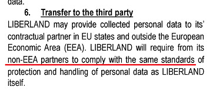

# ¿Qué puedes hacer para resistirte a Cloudflare?

| 🖼 | 🖼 | 🖼 |
| --- | --- | --- |
|  |  |  |


Matthew Browning Prince, nacido el 13 de noviembre de 1974, es el CEO y el cofundador de Cloudflare.

Gracias a su rico padre, "John B. Prince", asistió a la Escuela de Etiquetas de la Universidad de Chicago y Harvard Business School.
El príncipe enseñó una ley de Internet y fue especialista en leyes y investigación de fraudes antispam.


"*I’d suggest this was armchair analysis by kids – it’s hard to take seriously.*" [t](https://www.theguardian.com/technology/2015/nov/19/cloudflare-accused-by-anonymous-helping-isis)

"*That was simply unfounded paranoia, pretty big difference.*"  [t](https://twitter.com/xxdesmus/status/992757936123359233)

"*We also work with Interpol and other non-US entities*" [t](https://twitter.com/eastdakota/status/1203028504184360960)

"*Watching hacker skids on Github squabble about trying to bypass Cloudflare's new anti-bot systems continues to be my daily amusement.* 🍿" [t](https://twitter.com/eastdakota/status/1273277839102656515)


---


<details>
<summary>Haz click en mi

## Consumidor del sitio web
</summary>


- Si el sitio web que le gusta usa Cloudflare, dígales que no usen Cloudflare.
  - Quejarse en las redes sociales como Facebook, Reddit, Twitter o Mastodon no hace ninguna diferencia. [Las acciones son más ruidosas que los hashtags.](https://twitter.com/phyzonloop/status/1274132092490862594)
  - Intente ponerse en contacto con el propietario del sitio web si desea ser útil.

[Cloudflare dijo](https://github.com/Eloston/ungoogled-chromium/issues/783):
```
Le recomendamos que se comunique con los administradores de los servicios o sitios específicos con los que tenga problemas y comparta su experiencia.
```

[Si no lo solicita, el propietario del sitio web nunca conocerá este problema.](../PEOPLE.md)


[Ejemplo exitoso](https://counterpartytalk.org/t/turn-off-cloudflare-on-counterparty-co-plz/164/5).<br>
¿Tienes un problema? [Levanta la voz ahora.](https://github.com/maraoz/maraoz.github.io/issues/1) Ejemplo a continuación.

```
Solo está ayudando a la censura corporativa y la vigilancia masiva.
http://crimeflare.eu.org
```

```
Su página web está en el jardín privado amurallado de CloudFlare que abusa de la privacidad.
http://crimeflare.eu.org
```

- Tómese su tiempo para leer la política de privacidad del sitio web.
  - si el sitio web está detrás de Cloudflare o si el sitio web está utilizando servicios conectados a Cloudflare.

Debe explicar qué es "Cloudflare" y pedir permiso para compartir sus datos con Cloudflare. Si no lo hace, se producirá un abuso de confianza y se debe evitar el sitio web en cuestión.

[Un ejemplo aceptable de política de privacidad está aquí.](https://archive.is/bDlTz) ("Subprocessors" > "Entity Name")

```
He leído su política de privacidad y no encuentro la palabra Cloudflare.
Me niego a compartir datos contigo si continúas enviando mis datos a Cloudflare.
http://crimeflare.eu.org
```

Este es un ejemplo de política de privacidad que no tiene la palabra Cloudflare.
[Liberland Jobs](https://archive.is/daKIr) [privacy policy](https://docsend.com/view/feiwyte):



Cloudflare tiene su propia política de privacidad.
[A Cloudflare le encanta hacer sexo con la gente.](https://www.reddit.com/r/GamerGhazi/comments/2s64fe/be_wary_reporting_to_cloudflare/)

Este es un buen ejemplo del formulario de registro del sitio web.
AFAIK, el sitio web cero hace esto. ¿Confiarás en ellos?

```
Al hacer clic en "Registrarse en XYZ", acepta nuestros términos de servicio y declaración de privacidad.
También acepta compartir sus datos con Cloudflare y también acepta la declaración de privacidad de cloudflare.
Si Cloudflare filtra su información o no le permite conectarse a nuestros servidores, no es culpa nuestra. [*]

[ Inscribirse ] [ no estoy de acuerdo ]
```
[*] [PEOPLE.md](../PEOPLE.md)


- Trate de no utilizar su servicio. Recuerde que está siendo observado por Cloudflare.
  - ["I'm in your TLS, sniffin' your passworz"](../image/iminurtls.jpg)

- Busque otro sitio web. ¡Hay alternativas y oportunidades en Internet!

- Convence a tus amigos para que utilicen Tor a diario.
  - ¡El anonimato debería ser el estándar de la Internet abierta!
  - [Tenga en cuenta que al proyecto Tor no le gusta este proyecto.](../HISTORY.md)

</details>

------

<details>
<summary>Haz click en mi

## Complementos
</summary>

- Si su navegador es Firefox, Tor Browser o Ungoogled Chromium, use uno de estos complementos a continuación.
  - Si desea agregar otro complemento nuevo, pregunte primero.


| Nombre | Desarrollador | Apoyo | Puede bloquear | Puede notificar | Chrome |
| -------- | -------- | -------- | -------- | -------- | -------- |
| [Bloku Cloudflaron MITM-Atakon](../subfiles/addon/bcma.md) | #Addon | [ ? ](http://crimeflare.eu.org/) | **sí**     | **sí**     |  **sí** |
| [Ĉu ligoj estas vundeblaj al MITM-atako?](../subfiles/addon/ismm.md) | #Addon | [ ? ](http://crimeflare.eu.org/) | No     | **sí**     |  **sí** |
| [Ĉu ĉi tiuj ligoj blokos Tor-uzanton?](../subfiles/addon/isat.md) | #Addon | [ ? ](http://crimeflare.eu.org/) | No     | **sí**     |  **sí** |
| [Block Cloudflare MITM Attack](https://trac.torproject.org/projects/tor/attachment/ticket/24351/block_cloudflare_mitm_attack-1.0.14.1-an%2Bfx.xpi)<br>[**DELETED BY TOR PROJECT**](../HISTORY.md) | nullius | [ ? ](../tool/block_cloudflare_mitm_fx), [Link](http://crimeflare.eu.org/) | **sí**     | **sí**     |  No |
| [TPRB](http://sw.nnpaefp7pkadbxxkhz2agtbv2a4g5sgo2fbmv3i7czaua354334uqqad.onion/) | Sw | [ ? ](http://sw.nnpaefp7pkadbxxkhz2agtbv2a4g5sgo2fbmv3i7czaua354334uqqad.onion/) | **sí**     | **sí**     |  No |
| [Detect Cloudflare](https://addons.mozilla.org/en-US/firefox/addon/detect-cloudflare/) | Frank Otto | [ ? ](https://github.com/traktofon/cf-detect) | No     | **sí**     |  No |
| [True Sight](https://addons.mozilla.org/en-US/firefox/addon/detect-cloudflare-plus/) | claustromaniac | [ ? ](https://github.com/claustromaniac/detect-cloudflare-plus) | No     | **sí**     |  No |
| [Which Cloudflare datacenter am I visiting?](https://addons.mozilla.org/en-US/firefox/addon/cf-pop/) | 依云 | [ ? ](https://github.com/lilydjwg/cf-pop) | No     | **sí**     |  No |


- "Decentraleyes" puede detener la conexión a "CDNJS (Cloudflare)".
  - Evita que muchas solicitudes lleguen a las redes y sirve archivos locales para evitar que los sitios se rompan.
  - El desarrollador respondió: "[very concerning indeed](https://github.com/Synzvato/decentraleyes/issues/236#issuecomment-352049501)", "[widespread usage severely centralizes the web](https://github.com/Synzvato/decentraleyes/issues/251#issuecomment-366752049)"

- [También puede eliminar o desconfiar del certificado de Cloudflare de su autoridad de certificación (CA).](https://www.ssl.com/how-to/remove-root-certificate-firefox/)

</details>

------

<details>
<summary>Haz click en mi

## Propietario del sitio web / desarrollador web
</summary>


- No use la solución Cloudflare, Period.
  - Puedes hacerlo mejor que eso, ¿verdad? [Aquí se explica cómo eliminar suscripciones, planes, dominios o cuentas de Cloudflare.](https://support.cloudflare.com/hc/en-us/articles/200167776-Removing-subscriptions-plans-domains-or-accounts)

| 🖼 | 🖼 |
| --- | --- |
|  |  |

- ¿Quieres más clientes? Sabes qué hacer. La pista está "por encima de la línea".
  - [Hola, escribiste "Nos tomamos en serio tu privacidad", pero recibí "Error 403 Proxy anónimo prohibido no permitido".](https://it.slashdot.org/story/19/02/19/0033255/stop-saying-we-take-your-privacy-and-security-seriously) ¿Por qué estás bloqueando Tor o VPN? ¿Y por qué bloquea los correos electrónicos temporales?


- El uso de Cloudflare aumentará las posibilidades de una interrupción. Los visitantes no pueden acceder a su sitio web si su servidor no funciona o si Cloudflare no funciona.
  - [¿De verdad pensaste que Cloudflare nunca caería?](https://www.ibtimes.com/cloudflare-down-not-working-sites-producing-504-gateway-timeout-errors-2618008) [Another](https://twitter.com/Jedduff/status/1097875615997399040) [sample](https://twitter.com/search?f=tweets&vertical=default&q=Cloudflare%20is%20having%20problems). [Need more](../PEOPLE.md)?


- El uso de Cloudflare como proxy de su "servicio API", "servidor de actualización de software" o "fuente RSS" dañará a su cliente. Un cliente te llamó y te dijo "Ya no puedo usar tu API", y no tienes idea de lo que está pasando. Cloudflare puede bloquear silenciosamente a su cliente. ¿Crees que está bien?
  - Hay muchos clientes de lectores de RSS y servicios en línea de lectores de RSS. ¿Por qué publica un feed RSS si no permite que la gente se suscriba?


- ¿Necesita un certificado HTTPS? Utilice "Let's Encrypt" o simplemente cómprelo en la empresa de CA.

- ¿Necesitas un servidor DNS? ¿No puede configurar su propio servidor? Que hay de ellos: [Hurricane Electric Free DNS](https://dns.he.net/), [Dyn.com](https://dyn.com/dns/), [1984 Hosting](https://www.1984hosting.com/), [Afraid.Org (El administrador borra su cuenta si usa TOR)](https://freedns.afraid.org/)
  - [Alternativoj al DNS](../subfiles/alternative/domaindns.md)

- ¿Buscas servicio de hosting? ¿Solo gratis? Que hay de ellos: [Onion Service](http://vww6ybal4bd7szmgncyruucpgfkqahzddi37ktceo3ah7ngmcopnpyyd.onion/en/security/network-security/tor/onionservices-best-practices), [Free Web Hosting Area](https://freewha.com/), [Autistici/Inventati Web Site Hosting](https://www.autinv5q6en4gpf4.onion/services/website), [Github Pages](https://pages.github.com/), [Surge](https://surge.sh/)
  - [Alternativas a Cloudflare](../subfiles/alternative/cloudflare.md)

- ¿Está utilizando "cloudflare-ipfs.com"? [¿Sabes que Cloudflare IPFS es malo?](../PEOPLE.md)

- Instale Web Application Firewall como OWASP y Fail2Ban en su servidor y configúrelo correctamente.
  - Bloquear Tor no es una solución. No castigue a todo el mundo solo por los pequeños usuarios malos.

- Redirigir o bloquear a los usuarios de "Cloudflare Warp" para que no accedan a su sitio web. Y proporcione una razón si puede.

> Lista de IP: "[Rangos de IP actuales de Cloudflare](cloudflare_inc/)"

> A: Solo bloquéalos

```
server {
...
deny 173.245.48.0/20;
deny 103.21.244.0/22;
deny 103.22.200.0/22;
deny 103.31.4.0/22;
deny 141.101.64.0/18;
deny 108.162.192.0/18;
deny 190.93.240.0/20;
deny 188.114.96.0/20;
deny 197.234.240.0/22;
deny 198.41.128.0/17;
deny 162.158.0.0/15;
deny 104.16.0.0/12;
deny 172.64.0.0/13;
deny 131.0.72.0/22;
deny 2400:cb00::/32;
deny 2606:4700::/32;
deny 2803:f800::/32;
deny 2405:b500::/32;
deny 2405:8100::/32;
deny 2a06:98c0::/29;
deny 2c0f:f248::/32;
...
}
```

> B: Redirigir a la página de advertencia

```
http {
...
geo $iscf {
default 0;
173.245.48.0/20 1;
103.21.244.0/22 1;
103.22.200.0/22 1;
103.31.4.0/22 1;
141.101.64.0/18 1;
108.162.192.0/18 1;
190.93.240.0/20 1;
188.114.96.0/20 1;
197.234.240.0/22 1;
198.41.128.0/17 1;
162.158.0.0/15 1;
104.16.0.0/12 1;
172.64.0.0/13 1;
131.0.72.0/22 1;
2400:cb00::/32 1;
2606:4700::/32 1;
2803:f800::/32 1;
2405:b500::/32 1;
2405:8100::/32 1;
2a06:98c0::/29 1;
2c0f:f248::/32 1;
}
...
}

server {
...
if ($iscf) {rewrite ^ https://example.com/cfwsorry.php;}
...
}

<?php
header('HTTP/1.1 406 Not Acceptable');
echo <<<CLOUDFLARED
Thank you for visiting ourwebsite.com!<br />
We are sorry, but we can't serve you because your connection is being intercepted by Cloudflare.<br />
Please read http://crimeflare.eu.org for more information.<br />
CLOUDFLARED;
die();
```

- Configure Tor Onion Service o I2P insite si cree en la libertad y da la bienvenida a usuarios anónimos.

- ¡Pida consejo a otros operadores de sitios web duales de Clearnet / Tor y haga amigos anónimos!

</details>

------

<details>
<summary>Haz click en mi

## Usuario de software
</summary>


- Discord está usando CloudFlare. ¿Alternativas? Nosotros recomendamos [**Briar** (Android)](https://f-droid.org/en/packages/org.briarproject.briar.android/), [Ricochet (PC)](https://ricochet.im/), [Tox + Tor (Android/PC)](https://tox.chat/download.html)
  - Briar incluye el demonio Tor para que no tengas que instalar Orbot.
  - Los desarrolladores de Qwtch, Open Privacy, eliminaron el proyecto stop_cloudflare de su servicio git sin previo aviso.

- Si usa Debian GNU / Linux, o cualquier derivado, suscríbase: [bug #831835](https://bugs.debian.org/cgi-bin/bugreport.cgi?bug=831835). Y si puede, ayude a verificar el parche y ayude al encargado de mantenimiento a llegar a la conclusión correcta sobre si debe ser aceptado.

- Recomiende siempre estos navegadores.

| Nombre | Desarrollador | Apoyo | Comentario |
| -------- | -------- | -------- | -------- |
| [Ungoogled-Chromium](https://ungoogled-software.github.io/ungoogled-chromium-binaries/) | Eloston | [ ? ](https://github.com/Eloston/ungoogled-chromium) | PC (Win, Mac, Linux)  _!Tor_ |
| [Bromite](https://www.bromite.org/fdroid) | Bromite | [ ? ](https://github.com/bromite/bromite/issues) | Android  _!Tor_ |
| [Tor Browser](https://www.torproject.org/download/) | Tor Project | [ ? ](https://support.torproject.org/) | PC (Win, Mac, Linux)  _Tor_|
| [Tor Browser Android](https://www.torproject.org/download/) | Tor Project | [ ? ](https://support.torproject.org/) | Android  _Tor_|
| [Onion Browser](https://itunes.apple.com/us/app/onion-browser/id519296448?mt=8) | Mike Tigas | [ ? ](https://github.com/OnionBrowser/OnionBrowser/issues) | Apple iOS  _Tor_|
| [GNU/Icecat](https://www.gnu.org/software/gnuzilla/) | GNU | [ ? ](https://www.gnu.org/software/gnuzilla/) | PC (Linux) |
| [IceCatMobile](https://f-droid.org/en/packages/org.gnu.icecat/) | GNU | [ ? ](https://lists.gnu.org/mailman/listinfo/bug-gnuzilla) | Android |
| [Iridium Browser](https://iridiumbrowser.de/about/) | Iridium | [ ? ](https://github.com/iridium-browser/iridium-browser/) | PC (Win, Mac, Linux, OpenBSD) |


La privacidad de otro software es imperfecta. Esto no significa que el navegador Tor sea "perfecto".
No hay tecnología 100% segura ni 100% privada en Internet.

- ¿No quieres usar Tor? Puede utilizar cualquier navegador con Tor daemon.
  - [Tenga en cuenta que al proyecto Tor no le gusta esto.](https://support.torproject.org/tbb/tbb-9/) Utilice Tor Browser si puede hacerlo.
- [Cómo usar Chromium con Tor](../subfiles/chromium_tor.md)


Hablemos de la privacidad de otros programas.

- [Si realmente necesita usar Firefox, elija "Firefox ESR".](https://www.mozilla.org/en-US/firefox/organizations/)
  - [Firefox - Perro guardián del software espía](https://spyware.neocities.org/articles/firefox.html)
  - [Firefox rechaza la libertad de expresión, prohíbe la libertad de expresión](https://web.archive.org/web/20200423010026/https://reclaimthenet.org/firefox-rejects-free-speech-bans-free-speech-commenting-plugin-dissenter-from-its-extensions-gallery/)
  - ["Más de 100 votos negativos. Parece que pedirle a una empresa de software que se ciña a ... software es demasiado en estos días."](https://old.reddit.com/r/firefox/comments/gutdiw/weve_got_work_to_do_the_mozilla_blog/fslbbb6/)
  - [¿Por qué Firefox me muestra enlaces patrocinados en mi barra de URL?](https://www.reddit.com/r/firefox/comments/jybx2w/uh_why_is_firefox_showing_me_sponsored_links_in/)
  - [Mozilla - Diablo Encarnado](https://digdeeper.neocities.org/ghost/mozilla.html)

- [Recuerde, Mozilla está utilizando el servicio Cloudflare.](https://www.robtex.com/dns-lookup/www.mozilla.org) [También están utilizando el servicio DNS de Cloudflare en su producto.](https://www.theregister.co.uk/2018/03/21/mozilla_testing_dns_encryption/)

- [Mozilla rechazó oficialmente este boleto.](https://bugzilla.mozilla.org/show_bug.cgi?id=1426618)

- [Firefox Focus es una broma.](https://github.com/mozilla-mobile/focus-android/issues/1743) [Prometieron apagar la telemetría pero la cambiaron.](https://github.com/mozilla-mobile/focus-android/issues/4210)

- [El desarrollador de PaleMoon / Basilisk ama Cloudflare.](https://github.com/mozilla-mobile/focus-android/issues/1743#issuecomment-345993097)
  - [El servidor de archivos de Pale Moon pirateó y difundió malware durante 18 meses](https://www.reddit.com/r/privacytoolsIO/comments/cc808y/pale_moons_archive_server_hacked_and_spread/)
  - También odia a los usuarios de Tor - "[Que sea hostil hacia Tor. Creo que la mayoría de los sitios deberían ser hostiles hacia Tor considerando su factor de abuso extremadamente alto.](https://github.com/yacy/yacy_search_server/issues/314#issuecomment-565932097)"

- [Waterfox tiene un grave problema de "teléfonos domésticos"](https://spyware.neocities.org/articles/waterfox.html)

- [Google Chrome es un software espía.](https://www.gnu.org/proprietary/malware-google.en.html)
  - [Google perfila su actividad.](https://spyware.neocities.org/articles/chrome.html)

- [SRWare Iron hace demasiados teléfonos conectados a casa.](https://spyware.neocities.org/articles/iron.html) También se conecta a los dominios de Google.

- [Brave Browser incluye rastreadores de Facebook / Twitter en la lista blanca.](https://www.bleepingcomputer.com/news/security/facebook-twitter-trackers-whitelisted-by-brave-browser/)
  - [Aquí hay más problemas.](https://spyware.neocities.org/articles/brave.html)
  - [ID de afiliado de binance](https://twitter.com/cryptonator1337/status/1269594587716374528)

- [Microsoft Edge permite que Facebook ejecute código Flash a espaldas de los usuarios.](https://www.zdnet.com/article/microsoft-edge-lets-facebook-run-flash-code-behind-users-backs/)

- [Vivaldi no respeta su privacidad.](https://spyware.neocities.org/articles/vivaldi.html)

- [Nivel de software espía Opera: Extremadamente alto](https://spyware.neocities.org/articles/opera.html)

- Apple iOS: [No debería usar iOS en absoluto, principalmente porque es malware.](https://www.gnu.org/proprietary/malware-apple.html)

Por lo tanto, recomendamos solo la tabla anterior. Nada más.

</details>

------

<details>
<summary>Haz click en mi

## Usuario de Mozilla Firefox
</summary>


- "Firefox Nightly" enviará información de nivel de depuración a los servidores de Mozilla sin un método de exclusión voluntaria.
  - [Los servidores de Mozilla están detrás de Cloudflare](https://www.digwebinterface.com/?hostnames=www.mozilla.org%0D%0Amozilla.cloudflare-dns.com&type=&ns=resolver&useresolver=8.8.4.4&nameservers=)

- Es posible prohibir que Firefox se conecte a los servidores de Mozilla.
  - [Guía de plantillas de políticas de Mozilla](https://github.com/mozilla/policy-templates/blob/master/README.md)
  - Tenga en cuenta que este truco podría dejar de funcionar en una versión posterior porque a Mozilla le gusta incluirse en la lista blanca.
  - Utilice un cortafuegos y un filtro DNS para bloquearlos por completo.

"`/distribution/policies.json`"

>     "WebsiteFilter": {
> 		"Block": [
> 		"*://*.mozilla.com/*",
> 		"*://*.mozilla.net/*",
> 		"*://*.mozilla.org/*",
> 		"*://webcompat.com/*",
> 		"*://*.firefox.com/*",
> 		"*://*.thunderbird.net/*",
> 		"*://*.cloudflare.com/*"
> 		]
>     },


- ~~Informar un error en el rastreador de mozilla, diciéndoles que no usen Cloudflare.~~ Hubo un informe de error en bugzilla. Muchas personas publicaron su preocupación, sin embargo, el administrador ocultó el error en 2018.

- Puede desactivar DoH en Firefox.
  - [Cambiar el proveedor de DNS predeterminado de firefox](../subfiles/change-firefox-dns.md)


- [Si desea utilizar un DNS que no sea de ISP, considere usar el servicio DNS OpenNIC Tier2 o cualquiera de los servicios DNS que no sean de Cloudflare.](https://wiki.opennic.org/start)

  - Bloquea Cloudflare con DNS. [Crimeflare DNS](../subfiles/service/publicdns.md)

- Puedes usar Tor como resolución de DNS. [Si no eres un experto en Tor, haz una pregunta aquí.](https://tor.stackexchange.com/)

> **¿Cómo?**
> 1. Descarga Tor e instálalo en tu computadora.
> 2. Agregue esta línea al archivo "torrc".
> DNSPort 127.0.0.1:53
> 3. Reinicia Tor.
> 4. Configure el servidor DNS de su computadora en "127.0.0.1".

</details>

------

<details>
<summary>Haz click en mi

## Acción
</summary>


- Cuéntele a los que le rodean los peligros de Cloudflare.

- [Ayude a mejorar este repositorio.](http://crimeflare.eu.org)
  - Tanto las listas, los argumentos en contra como los detalles.

- [Documente y haga muy público dónde las cosas van mal con Cloudflare (y compañías similares), asegurándose de mencionar este repositorio cuando lo haga.](http://crimeflare.eu.org) :)

- Consiga que más personas utilicen Tor de forma predeterminada para que puedan experimentar la web desde la perspectiva de diferentes partes del mundo.

- Inicie grupos, en las redes sociales y meatspace, dedicados a liberar al mundo de Cloudflare.

- Cuando corresponda, enlace a estos grupos en este repositorio; este puede ser un lugar para coordinar el trabajo conjunto como grupos.

- [Inicie una cooperativa que pueda proporcionar una alternativa no corporativa significativa a Cloudflare.](../subfiles/alternative/cloudflare.md)

- Háganos saber de cualquier alternativa para ayudar al menos a proporcionar una defensa de múltiples capas contra Cloudflare.

- Si es cliente de Cloudflare, configure sus configuraciones de privacidad y espere a que las infrinjan.
  - [Luego, tráigalos bajo cargos de violación de privacidad / anti-spam.](https://twitter.com/thexpaw/status/1108424723233419264)

- Si se encuentra en los Estados Unidos de América y el sitio web en cuestión es un banco o un contador, intente ejercer presión legal en virtud de la Ley Gramm-Leach-Bliley o la Ley de Estadounidenses con Discapacidades e infórmenos hasta dónde llega. .

- Si el sitio web es un sitio del gobierno, intente ejercer presión legal bajo la 1ª Enmienda de la Constitución de los Estados Unidos.

- Si es ciudadano de la UE, póngase en contacto con el sitio web para enviar su información personal en virtud del Reglamento general de protección de datos. Si se niegan a brindarle su información, es una violación de la ley.

- Para las empresas que afirman ofrecer servicios en su sitio web, intente denunciarlos como "publicidad falsa" a las organizaciones de protección al consumidor y a BBB. Los sitios web de Cloudflare son atendidos por servidores de Cloudflare.

- [La UIT sugiere en el contexto de EE. UU. Que Cloudflare está comenzando a crecer lo suficiente como para que se les imponga la ley antimonopolio.](https://www.itu.int/en/ITU-T/Workshops-and-Seminars/20181218/Documents/Geoff_Huston_Presentation.pdf)

- Es concebible que la versión 4 de GNU GPL podría incluir una disposición contra el almacenamiento de código fuente detrás de dicho servicio, requiriendo para todos los programas GPLv4 y posteriores que al menos el código fuente sea accesible a través de un medio que no discrimine a los usuarios de Tor.

- [Se vi uzas Mastodon bonvolu sekvi la konton Mitigator](../subfiles/service/altlink.md).

</details>

------

### Comentarios

```
Siempre hay esperanza en la resistencia.

La resistencia es fértil.

Incluso algunos de los resultados más oscuros llegan a ser, el mismo acto de resistencia nos entrena para continuar desestabilizando el statu quo distópico que resulta.

¡Resistirse!
```

```
Algún día entenderás por qué escribimos esto.
```

```
No hay nada futurista en esto. Ya hemos perdido.
```

### Ahora, ¿qué hiciste hoy?


