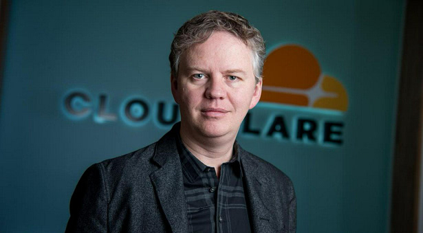
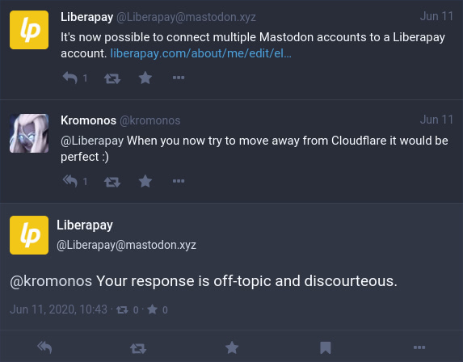

# Mida saate teha Cloudflare'ile vastupanu osutamiseks?

| 🖼 | 🖼 | 🖼 |
| --- | --- | --- |
|  |  |  |


Matthew Browning Prince, naskita la 13an de novembro 1974, estas la ĉefoficisto kaj kunfondinto de Cloudflaron.

Danke al lia riĉa paĉjo, "John B. Prince", li ĉeestis la Universitaton de Ĉikago Leĝlernejo kaj Harvard Komerclernejo.
Princo instruis Interretan leĝon kaj estis specialisto pri kontraŭ-spamaj leĝoj kaj Fraŭdo-esploroj.


"*I’d suggest this was armchair analysis by kids – it’s hard to take seriously.*" [t](https://www.theguardian.com/technology/2015/nov/19/cloudflare-accused-by-anonymous-helping-isis)

"*That was simply unfounded paranoia, pretty big difference.*"  [t](https://twitter.com/xxdesmus/status/992757936123359233)

"*We also work with Interpol and other non-US entities*" [t](https://twitter.com/eastdakota/status/1203028504184360960)

"*Watching hacker skids on Github squabble about trying to bypass Cloudflare's new anti-bot systems continues to be my daily amusement.* 🍿" [t](https://twitter.com/eastdakota/status/1273277839102656515)


---


<details>
<summary>klõpsa mind

## Veebisaidi tarbija
</summary>


- Kui teile meeldiv veebisait kasutab Cloudflare'i, öelge neile, et nad ei kasutaks Cloudflare'i.
  - Virisemine sotsiaalmeedias nagu Facebook, Reddit, Twitter või Mastodon ei tee vahet. [Toimingud on valjemad kui räsimärgid.](https://twitter.com/phyzonloop/status/1274132092490862594)
  - Proovige veebisaidi omanikuga ühendust võtta, kui soovite end kasulikuks muuta.

[Ütles Cloudflare](https://github.com/Eloston/ungoogled-chromium/issues/783):
```
Soovitame pöörduda administraatorite poole konkreetsete teenuste või saitide osas, millega teil probleeme on, ja jagage oma kogemusi.
```

[Kui te seda ei küsi, ei tea veebisaidi omanik seda probleemi kunagi.](../PEOPLE.md)



[Edukas näide](https://counterpartytalk.org/t/turn-off-cloudflare-on-counterparty-co-plz/164/5).<br>
Kas teil on probleeme? [Tõstke oma hääl nüüd üles.](https://github.com/maraoz/maraoz.github.io/issues/1) Näide allpool.

```
Aitate lihtsalt ettevõtte tsensuuri ja massjälgimist.
http://crimeflare.eu.org
```

```
Teie veebileht asub CloudFlare'i privaatsust kuritarvitavas privaatses müüriga aias.
http://crimeflare.eu.org
```

- Võta aega veebisaidi privaatsuseeskirjade lugemiseks.
  - kui veebisait on Cloudflare taga või kui veebisait kasutab Cloudflare'iga ühendatud teenuseid.

See peab selgitama, mis on "Cloudflare", ja küsima luba oma andmete jagamiseks Cloudflare'iga. Selle tegemata jätmine põhjustab usalduse rikkumist ja kõnealust veebisaiti tuleks vältida.

[Siin on vastuvõetav privaatsuspoliitika näide](https://archive.is/bDlTz) ("Subprocessors" > "Entity Name")

```
Olen teie privaatsuseeskirju lugenud ja ma ei leia sõna Cloudflare.
Keeldun teiega andmete jagamisest, kui jätkate minu andmete edastamist Cloudflare'i.
http://crimeflare.eu.org
```

See on näide privaatsuspoliitikast, millel puudub sõna Cloudflare.
[Liberland Jobs](https://archive.is/daKIr) [privacy policy](https://docsend.com/view/feiwyte):


Cloudflare'il on oma privaatsuseeskirjad.
[Cloudflare armastab doksima inimesi.](https://www.reddit.com/r/GamerGhazi/comments/2s64fe/be_wary_reporting_to_cloudflare/)

Siin on hea näide veebisaidi registreerimisvormi kohta.
AFAIK, null veebileht teeb seda. Kas usaldate neid?

```
Klõpsates nupul „Registreeru XYZ-i”, nõustute meie teenusetingimuste ja privaatsusavaldusega.
Samuti nõustute oma andmeid Cloudflare'iga jagama ja nõustute ka cloudflare'i privaatsusavaldusega.
Kui Cloudflare lekitab teie teavet või ei lase teil meie serveritega ühendust luua, pole see meie süü. [*]

[ Registreeri ] [ ma ei nõustu ]
```
[*] [PEOPLE.md](../PEOPLE.md)


- Püüdke nende teenust mitte kasutada. Pidage meeles, et Cloudflare jälgib teid.
  - ["I'm in your TLS, sniffin' your passworz"](../image/iminurtls.jpg)

- Otsige muud veebisaiti. Internetis on alternatiive ja võimalusi!

- Veenda oma sõpru Tori igapäevaselt kasutama.
  - Anonüümsus peaks olema avatud Interneti standard!
  - [Pange tähele, et Tor-projekt ei meeldi sellele projektile.](../HISTORY.md)

</details>

------

<details>
<summary>klõpsa mind

## Lisandmoodulid
</summary>

- Kui teie brauser on Firefox, Tori brauser või Ungoogled Chromium, kasutage ühte neist allpool olevatest lisandmoodulitest.
  - Kui soovite lisada mõnda uut lisandmoodulit, küsige kõigepealt selle kohta.


| Nimi | Arendaja | Toetus | Saab blokeerida | Saab teavitada | Chrome |
| -------- | -------- | -------- | -------- | -------- | -------- |
| [Bloku Cloudflaron MITM-Atakon](../subfiles/about.bcma.md) | #Addon | [ ? ](http://crimeflare.eu.org/) | **Jah**     | **Jah**     |  **Jah** |
| [Ĉu ligoj estas vundeblaj al MITM-atako?](../subfiles/about.ismm.md) | #Addon | [ ? ](http://crimeflare.eu.org/) | Ei     | **Jah**     |  **Jah** |
| [Ĉu ĉi tiuj ligoj blokos Tor-uzanton?](../subfiles/about.isat.md) | #Addon | [ ? ](http://crimeflare.eu.org/) | Ei     | **Jah**     |  **Jah** |
| [Block Cloudflare MITM Attack](https://trac.torproject.org/projects/tor/attachment/ticket/24351/block_cloudflare_mitm_attack-1.0.14.1-an%2Bfx.xpi)<br>[**DELETED BY TOR PROJECT**](../HISTORY.md) | nullius | [ ? ](../tool/block_cloudflare_mitm_fx), [Link](http://crimeflare.eu.org/) | **Jah**     | **Jah**     |  Ei |
| [TPRB](http://34ahehcli3epmhbu2wbl6kw6zdfl74iyc4vg3ja4xwhhst332z3knkyd.onion/) | Sw | [ ? ](http://34ahehcli3epmhbu2wbl6kw6zdfl74iyc4vg3ja4xwhhst332z3knkyd.onion/) | **Jah**     | **Jah**     |  Ei |
| [Detect Cloudflare](https://addons.mozilla.org/en-US/firefox/addon/detect-cloudflare/) | Frank Otto | [ ? ](https://github.com/traktofon/cf-detect) | Ei     | **Jah**     |  Ei |
| [True Sight](https://addons.mozilla.org/en-US/firefox/addon/detect-cloudflare-plus/) | claustromaniac | [ ? ](https://github.com/claustromaniac/detect-cloudflare-plus) | Ei     | **Jah**     |  Ei |
| [Which Cloudflare datacenter am I visiting?](https://addons.mozilla.org/en-US/firefox/addon/cf-pop/) | 依云 | [ ? ](https://github.com/lilydjwg/cf-pop) | Ei     | **Jah**     |  Ei |


- "Decentraleyes" võib ühenduse "CDNJS (Cloudflare)" -ga katkestada.
  - See takistab paljude taotluste jõudmist võrkudesse ja teenib kohalikke faile, et hoida saite purunemast.
  - Arendaja vastas: "[very concerning indeed](https://github.com/Synzvato/decentraleyes/issues/236#issuecomment-352049501)", "[widespread usage severely centralizes the web](https://github.com/Synzvato/decentraleyes/issues/251#issuecomment-366752049)"

- [Cloudflare'i sertifikaadi saate ka oma sertifikaadiasutusest (CA) eemaldada või umbusaldada.](https://www.ssl.com/how-to/remove-root-certificate-firefox/)

</details>

------

<details>
<summary>klõpsa mind

## Veebisaidi omanik / veebiarendaja
</summary>


- Ärge kasutage Cloudflare'i lahendust, Periood.
  - Saate paremini teha, eks? [Cloudflare'i tellimuste, plaanide, domeenide või kontode eemaldamiseks toimige järgmiselt.](https://support.cloudflare.com/hc/en-us/articles/200167776-Removing-subscriptions-plans-domains-or-accounts)

| 🖼 | 🖼 |
| --- | --- |
|  |  |

- Kas soovite rohkem kliente? Sa tead, mida teha. Vihje on "joone kohal".
  - [Tere, kirjutasite "Me võtame teie privaatsust tõsiselt", kuid sain "Viga 403 Keelatud anonüümne puhverserver pole lubatud".](https://it.slashdot.org/story/19/02/19/0033255/stop-saying-we-take-your-privacy-and-security-seriously) Miks blokeerite Tor või VPN? Ja miks blokeerite ajutised meilid?


- Cloudflare'i kasutamine suurendab katkestuse tõenäosust. Külastajad ei pääse teie veebisaidile juurde, kui teie server ei tööta või Cloudflare ei tööta.
  - [Kas arvasite tõesti, et Cloudflare ei lähe kunagi alla?](https://www.ibtimes.com/cloudflare-down-not-working-sites-producing-504-gateway-timeout-errors-2618008) [Another](https://twitter.com/Jedduff/status/1097875615997399040) [sample](https://twitter.com/search?f=tweets&vertical=default&q=Cloudflare%20is%20having%20problems). [Need more](../PEOPLE.md)?


- Cloudflare'i kasutamine oma "API-teenuse", "tarkvaravärskendusserveri" või "RSS-voo" puhverserverina kahjustab teie klienti. Klient helistas teile ja ütles: "Ma ei saa teie API-d enam kasutada", ja teil pole aimugi, mis toimub. Cloudflare võib teie kliendi vaikselt blokeerida. Kas sa arvad, et see on okei?
  - RSS-lugeja klienti ja RSS-lugeja veebiteenust on palju. Miks te avaldate RSS-voogu, kui te ei luba inimestel tellida?


- Kas vajate HTTPS-sertifikaati? Kasutage "Krüpteerime" või ostke see lihtsalt CA ettevõttelt.

- Kas vajate DNS-serverit? Kas te ei saa oma serverit seadistada? Kuidas nendega: [Hurricane Electric Free DNS](https://dns.he.net/), [Dyn.com](https://dyn.com/dns/), [1984 Hosting](https://www.1984hosting.com/), [Afraid.Org (Administraator kustutab teie konto, kui kasutate TOR-i)](https://freedns.afraid.org/)

- Kas otsite hostimisteenust? Ainult tasuta? Kuidas nendega: [Onion Service](http://vww6ybal4bd7szmgncyruucpgfkqahzddi37ktceo3ah7ngmcopnpyyd.onion/en/security/network-security/tor/onionservices-best-practices), [Free Web Hosting Area](https://freewha.com/), [Autistici/Inventati Web Site Hosting](https://www.autinv5q6en4gpf4.onion/services/website), [Github Pages](https://pages.github.com/), [Surge](https://surge.sh/)
  - [Cloudflare'i alternatiivid](../subfiles/cloudflare-alternatives.md)

- Kas kasutate saiti "cloudflare-ipfs.com"? [Kas teate, et Cloudflare IPFS on halb?](../PEOPLE.md)

- Installige veebirakenduste tulemüür, näiteks OWASP ja Fail2Ban, oma serverisse ja konfigureerige see korralikult.
  - Tori blokeerimine pole lahendus. Ärge karistage kõiki ainult väikeste halbade kasutajate eest.

- Suunake või blokeerige "Cloudflare Warp" kasutajatel juurdepääs teie veebisaidile. Ja kui võimalik, esitage põhjus.

> IP loend: "[Cloudflare'i praegused IP-vahemikud](cloudflare_inc/)"

> A: Blokeeri nad lihtsalt

```
server {
...
deny 173.245.48.0/20;
deny 103.21.244.0/22;
deny 103.22.200.0/22;
deny 103.31.4.0/22;
deny 141.101.64.0/18;
deny 108.162.192.0/18;
deny 190.93.240.0/20;
deny 188.114.96.0/20;
deny 197.234.240.0/22;
deny 198.41.128.0/17;
deny 162.158.0.0/15;
deny 104.16.0.0/12;
deny 172.64.0.0/13;
deny 131.0.72.0/22;
deny 2400:cb00::/32;
deny 2606:4700::/32;
deny 2803:f800::/32;
deny 2405:b500::/32;
deny 2405:8100::/32;
deny 2a06:98c0::/29;
deny 2c0f:f248::/32;
...
}
```

> B: Suunake hoiatuslehele

```
http {
...
geo $iscf {
default 0;
173.245.48.0/20 1;
103.21.244.0/22 1;
103.22.200.0/22 1;
103.31.4.0/22 1;
141.101.64.0/18 1;
108.162.192.0/18 1;
190.93.240.0/20 1;
188.114.96.0/20 1;
197.234.240.0/22 1;
198.41.128.0/17 1;
162.158.0.0/15 1;
104.16.0.0/12 1;
172.64.0.0/13 1;
131.0.72.0/22 1;
2400:cb00::/32 1;
2606:4700::/32 1;
2803:f800::/32 1;
2405:b500::/32 1;
2405:8100::/32 1;
2a06:98c0::/29 1;
2c0f:f248::/32 1;
}
...
}

server {
...
if ($iscf) {rewrite ^ https://example.com/cfwsorry.php;}
...
}

<?php
header('HTTP/1.1 406 Not Acceptable');
echo <<<CLOUDFLARED
Thank you for visiting ourwebsite.com!<br />
We are sorry, but we can't serve you because your connection is being intercepted by Cloudflare.<br />
Please read http://crimeflare.eu.org for more information.<br />
CLOUDFLARED;
die();
```

- Kui usute vabadusse ja tervitate anonüümseid kasutajaid, seadistage Tor Onion Service või I2P insite.

- Küsige nõu teistelt Clearnet / Tori topeltveebioperaatoritelt ja hankige anonüümseid sõpru!

</details>

------

<details>
<summary>klõpsa mind

## Tarkvara kasutaja
</summary>


- Discord kasutab CloudFlare'i. Alternatiivid? Me soovitame [**Briar** (Android)](https://f-droid.org/en/packages/org.briarproject.briar.android/), [Ricochet (PC)](https://ricochet.im/), [Tox + Tor (Android/PC)](https://tox.chat/download.html)
  - Briar sisaldab Tor-deemoni, nii et te ei pea Orboti installima.
  - Qwtchi arendajad, Open Privacy kustutasid stop_cloudflare projekti oma git-teenusest ette teatamata.

- Kui kasutate Debiani GNU / Linuxi või mõnda muud tuletist, tellige: [bug #831835](https://bugs.debian.org/cgi-bin/bugreport.cgi?bug=831835). Ja kui saate, aidake plaastrit kontrollida ja aidake hooldajal jõuda õigele järeldusele, kas see tuleks aktsepteerida.

- Soovitage neid brausereid alati.

| Nimi | Arendaja | Toetus | Kommentaar |
| -------- | -------- | -------- | -------- |
| [Ungoogled-Chromium](https://ungoogled-software.github.io/ungoogled-chromium-binaries/) | Eloston | [ ? ](https://github.com/Eloston/ungoogled-chromium) | PC (Win, Mac, Linux)  _!Tor_ |
| [Bromite](https://www.bromite.org/fdroid) | Bromite | [ ? ](https://github.com/bromite/bromite/issues) | Android  _!Tor_ |
| [Tor Browser](https://www.torproject.org/download/) | Tor Project | [ ? ](https://support.torproject.org/) | PC (Win, Mac, Linux)  _Tor_|
| [Tor Browser Android](https://www.torproject.org/download/) | Tor Project | [ ? ](https://support.torproject.org/) | Android  _Tor_|
| [Onion Browser](https://itunes.apple.com/us/app/onion-browser/id519296448?mt=8) | Mike Tigas | [ ? ](https://github.com/OnionBrowser/OnionBrowser/issues) | Apple iOS  _Tor_|
| [GNU/Icecat](https://www.gnu.org/software/gnuzilla/) | GNU | [ ? ](https://www.gnu.org/software/gnuzilla/) | PC (Linux) |
| [IceCatMobile](https://f-droid.org/en/packages/org.gnu.icecat/) | GNU | [ ? ](https://lists.gnu.org/mailman/listinfo/bug-gnuzilla) | Android |
| [Iridium Browser](https://iridiumbrowser.de/about/) | Iridium | [ ? ](https://github.com/iridium-browser/iridium-browser/) | PC (Win, Mac, Linux, OpenBSD) |


Muu tarkvara privaatsus on puudulik. See ei tähenda, et Tori brauser oleks "täiuslik".
Internetis ja tehnoloogias pole 100% turvalist ega 100% privaatsust.

- Kas te ei soovi Torit kasutada? Tori deemoniga saate kasutada mis tahes brauserit.
  - [Pange tähele, et see ei meeldi Tori projektile.](https://support.torproject.org/tbb/tbb-9/) Kasutage Tori brauserit, kui saate seda teha.
- [Kuidas kasutada kroomi koos Toriga](../subfiles/chromium_tor.md)


Räägime muu tarkvara privaatsusest.

- [Kui peate tõesti Firefoxi kasutama, valige käsk „Firefox ESR”.](https://www.mozilla.org/en-US/firefox/organizations/)
  - [Firefox - nuhkvara valvekoer](https://spyware.neocities.org/articles/firefox.html)
  - [Firefox lükkab tagasi sõnavabaduse, keelab sõnavabaduse](https://web.archive.org/web/20200423010026/https://reclaimthenet.org/firefox-rejects-free-speech-bans-free-speech-commenting-plugin-dissenter-from-its-extensions-gallery/)
  - ["100+ allahäält. Tundub, et palume tarkvaraettevõttel jääda ... tarkvara on tänapäeval lihtsalt liiga palju."](https://old.reddit.com/r/firefox/comments/gutdiw/weve_got_work_to_do_the_mozilla_blog/fslbbb6/)
  - [Uh, miks näitab Firefox mulle URL-i ribal sponsoreeritud linke?](https://www.reddit.com/r/firefox/comments/jybx2w/uh_why_is_firefox_showing_me_sponsored_links_in/)
  - [Mozilla - kehastunud kurat](https://digdeeper.neocities.org/ghost/mozilla.html)

- [Pidage meeles, et Mozilla kasutab Cloudflare'i teenust.](https://www.robtex.com/dns-lookup/www.mozilla.org) [Nad kasutavad oma tootes ka Cloudflare'i DNS-teenust.](https://www.theregister.co.uk/2018/03/21/mozilla_testing_dns_encryption/)

- [Mozilla lükkas selle pileti ametlikult tagasi.](https://bugzilla.mozilla.org/show_bug.cgi?id=1426618)

- [Firefox Focus on nali.](https://github.com/mozilla-mobile/focus-android/issues/1743) [Nad lubasid telemeetria välja lülitada, kuid muutsid seda.](https://github.com/mozilla-mobile/focus-android/issues/4210)

- [PaleMooni / Basiliski arendaja armastab Cloudflare'i.](https://github.com/mozilla-mobile/focus-android/issues/1743#issuecomment-345993097)
  - [Pale Mooni arhiiviserver häkkis ja levitas pahavara 18 kuud](https://www.reddit.com/r/privacytoolsIO/comments/cc808y/pale_moons_archive_server_hacked_and_spread/)
  - Ta vihkab ka Tori kasutajaid - "[Las see on Tori suhtes vaenulik. Ma arvan, et enamik saite peaks olema Tori suhtes vaenulik, arvestades selle ülisuurt kuritarvitamistegurit.](https://github.com/yacy/yacy_search_server/issues/314#issuecomment-565932097)"

- [Waterfoxil on tõsine probleem "telefonid koju"](https://spyware.neocities.org/articles/waterfox.html)

- [Google Chrome on nuhkvara.](https://www.gnu.org/proprietary/malware-google.en.html)
  - [Google profiilitab teie tegevust.](https://spyware.neocities.org/articles/chrome.html)

- [SRWare Iron loob liiga palju telefone koduühenduseks.](https://spyware.neocities.org/articles/iron.html) See loob ühenduse ka Google'i domeenidega.

- [Brave Browseri lubatud Facebooki / Twitteri jälgijad.](https://www.bleepingcomputer.com/news/security/facebook-twitter-trackers-whitelisted-by-brave-browser/)
  - [Siin on veel küsimusi.](https://spyware.neocities.org/articles/brave.html)
  - [binance'i sidusettevõtte ID](https://twitter.com/cryptonator1337/status/1269594587716374528)

- [Microsoft Edge laseb Facebookil käivitada Flash-koodi kasutajate selja taga.](https://www.zdnet.com/article/microsoft-edge-lets-facebook-run-flash-code-behind-users-backs/)

- [Vivaldi ei austa teie privaatsust.](https://spyware.neocities.org/articles/vivaldi.html)

- [Opera nuhkvara tase: väga kõrge](https://spyware.neocities.org/articles/opera.html)

- Apple iOS: [Te ei tohiks iOS-i üldse kasutada, peamiselt seetõttu, et see on pahavara.](https://www.gnu.org/proprietary/malware-apple.html)

Seetõttu soovitame ainult ülaltoodud tabelit. Mitte midagi muud.

</details>

------

<details>
<summary>klõpsa mind

## Mozilla Firefoxi kasutaja
</summary>


- „Firefox Nightly” saadab Mozilla serveritele silumisastme teabe ilma loobumismeetodita.
  - [Mozilla serverid teevad Cloudflare'i](https://www.digwebinterface.com/?hostnames=www.mozilla.org%0D%0Amozilla.cloudflare-dns.com&type=&ns=resolver&useresolver=8.8.4.4&nameservers=)

- Võimalik on keelata Firefoxil Mozilla serveritega ühenduse loomine.
  - [Mozilla poliitika mallide juhend](https://github.com/mozilla/policy-templates/blob/master/README.md)
  - Pidage meeles, et see trikk ei pruugi hilisemas versioonis enam töötada, sest Mozillale meeldib end valgesse nimekirja lisada.
  - Nende täielikuks blokeerimiseks kasutage tulemüüri ja DNS-filtrit.

"`/distribution/policies.json`"

>     "WebsiteFilter": {
> 		"Block": [
> 		"*://*.mozilla.com/*",
> 		"*://*.mozilla.net/*",
> 		"*://*.mozilla.org/*",
> 		"*://webcompat.com/*",
> 		"*://*.firefox.com/*",
> 		"*://*.thunderbird.net/*",
> 		"*://*.cloudflare.com/*"
> 		]
>     },


- ~~Teatage mozilla jälgija veast, öeldes neile, et nad ei peaks Cloudflare'i kasutama.~~ Bugzilla kohta oli veateade. Paljud inimesed postitasid oma mure, kuid admin peitis vea 2018. aastal.

- Võite Firefoxis DoH-i keelata.
  - [Firefoxi vaikepakkuja DNS-i muutmine](../subfiles/change-firefox-dns.md)


- [Kui soovite kasutada ISP-välist DNS-i, kaaluge OpenNIC Tier2 DNS-teenuse või mõne muu Cloudflare'i DNS-teenuse kasutamist.](https://wiki.opennic.org/start)

  - Blokeerige Cloudflare DNS-iga. [Crimeflare DNS](../subfiles/service.publicdns.md)

- Tori saate kasutada DNS-i lahendajana. [Kui te pole Tori ekspert, esitage siin küsimus.](https://tor.stackexchange.com/)

> **Kuidas?**
> 1. Laadige Tor alla ja installige see oma arvutisse.
> 2. Lisage see rida faili "torrc".
> DNSPort 127.0.0.1:53
> 3. Taaskäivitage Tor.
> 4. Määrake oma arvuti DNS-serveriks "127.0.0.1".

</details>

------

<details>
<summary>klõpsa mind

## Tegevus
</summary>


- Rääkige teistele ümbritsevatest Cloudflare'i ohtudest.

- [Aidake seda hoidlat paremaks muuta.](http://crimeflare.eu.org)
  - Nii nimekirjad, argumendid selle vastu kui ka üksikasjad.

- [Dokumenteerige ja tehke väga avalikuks, kui Cloudflare'iga (ja sarnaste ettevõtetega) läheb valesti, mainides seda tehes kindlasti ka seda hoidlat](http://crimeflare.eu.org) :)

- Võimaldage vaikimisi Tori kasutama rohkem inimesi, et nad saaksid veebi kogeda maailma eri paikade vaatenurgast.

- Alustage sotsiaalse meedia ja meediaruumi gruppe, mis on pühendatud maailma vabastamisele Cloudflare'ist.

- Vajaduse korral linkige selle hoidla nende rühmadega - see võib olla koht rühmadena koos töötamise koordineerimiseks.

- [Alustage koostööd, mis võib pakkuda Cloudflare'ile sisukat alternatiivset alternatiivi.](../subfiles/cloudflare-alternatives.md)

- Andke meile teada kõikidest alternatiividest, mis aitaksid Cloudflare'i vastu vähemalt mitmekihilist kaitset pakkuda.

- Kui olete Cloudflare'i klient, määrake oma privaatsusseaded ja oodake, kuni nad neid rikuvad.
  - [Seejärel viige nad rämpspostivastase / privaatsuse rikkumise eest süüdistuse alla.](https://twitter.com/thexpaw/status/1108424723233419264)

- Kui asute Ameerika Ühendriikides ja kõnealune veebisait on pank või raamatupidaja, proovige Gramm – Leach – Bliley seaduse või ameeriklastega, kellel on puuetega inimesed, seaduslikku survet avaldada ja teatage meile, kui kaugele jõuate .

- Kui veebisait on valitsuse sait, proovige avaldada USA põhiseaduse 1. muudatuse alla seaduslikku survet.

- Kui olete ELi kodanik, pöörduge isikuandmete kaitse üldmääruse kohase isikuandmete saatmiseks veebisaidile. Kui nad keelduvad teile teie andmeid andmast, on see seaduse rikkumine.

- Ettevõtete jaoks, kes väidavad, et pakuvad oma veebisaidil teenust, proovige teatada neist tarbijakaitseorganisatsioonidele ja BBB-le "valereklaamina". Cloudflare'i veebisaite teenindavad Cloudflare'i serverid.

- [ITU soovitab USA kontekstis, et Cloudflare hakkab piisavalt suureks minema, et neile võidakse monopolidevastane seadus langetada.](https://www.itu.int/en/ITU-T/Workshops-and-Seminars/20181218/Documents/Geoff_Huston_Presentation.pdf)

- On mõeldav, et GNU GPL versioon 4 võib sisaldada sätet sellise teenuse taha lähtekoodi salvestamise kohta, mis nõuab kõigi GPLv4 ja hilisemate programmide jaoks, et vähemalt lähtekood oleks juurdepääsetav andmekandja kaudu, mis ei diskrimineeri Tori kasutajaid.

</details>

------

### Kommentaarid

```
Vastupanus on alati lootust.

Vastupanu on viljakas.

Isegi mõned pimedamad tulemused tulevad, juba vastupanuakt treenib meid jätkama selle tulemuseks oleva düstoopilise status quo destabiliseerimist.

Vastupanu!
```

```
Kunagi saate aru, miks me selle kirjutasime.
```

```
Selles pole midagi futuristlikku. Oleme juba kaotanud.
```

### Mida sa täna tegid?


