# Eetilised probleemid


"Ärge toetage seda ettevõtet, mis on eetikavaba"

"Teie ettevõte pole usaldusväärne. Te väidate, et ta jõustab DMCA, kuid teil on selle vastu võtmata jätmiseks palju kohtuasju."

"Nad tsenseerivad ainult neid, kes seavad nende eetika kahtluse alla."

"Ma arvan, et tõde on ebamugav ja paremini peidetud avaliku vaate eest."  -- [phyzonloop](https://twitter.com/phyzonloop)


---


<details>
<summary>klõpsa mulle

## CloudFlare rämpsposti inimesi
</summary>


Cloudflare saadab rämpsposti mitte-Cloudflare'i kasutajatele.

- Saatke e-kirju ainult valitud tellijatele
- Kui kasutaja ütleb "stopp", lõpetage e-kirjade saatmine

See on nii lihtne. Kuid Pilvvalgus ei huvita.
Cloudflare ütles, et nende teenuse kasutamine võib peatada kõik rämpspostitajad või ründajad.
Kuidas saaksime Cloudflare'i peatada ilma Cloudflare aktiveerimata?


| 🖼 | 🖼 |
| --- | --- |
| 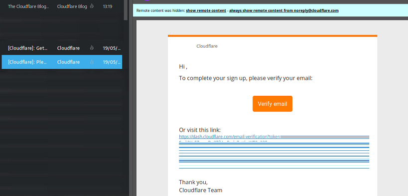 |  |
| 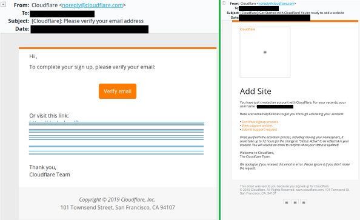 | <br> |
| 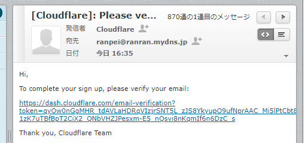 |  |

</details>

---

<details>
<summary>klõpsa mulle

## Eemaldage kasutaja arvustus
</summary>


Cloudflare tsenseerib negatiivseid ülevaateid.
Kui postitate Twitterisse Cloudflare'i vastase teksti, on teil võimalus saada Cloudflare'i töötajalt vastus sõnumiga "Ei, see pole".
Kui postitate negatiivse arvustuse mis tahes arvustussaidile, proovivad nad seda tsenseerida.


| 🖼 | 🖼 |
| --- | --- |
| 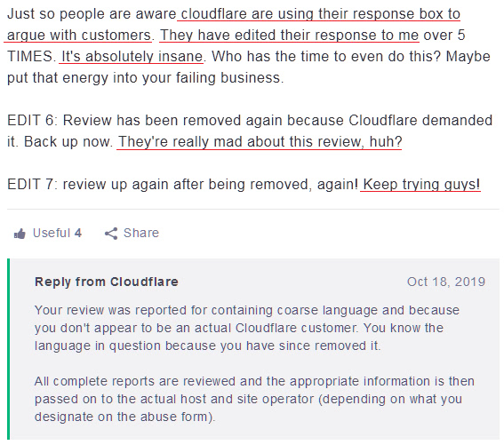<br>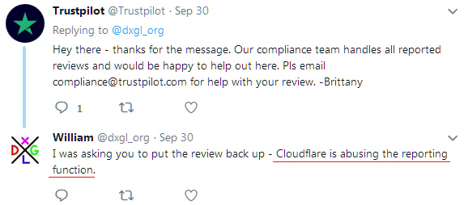 | 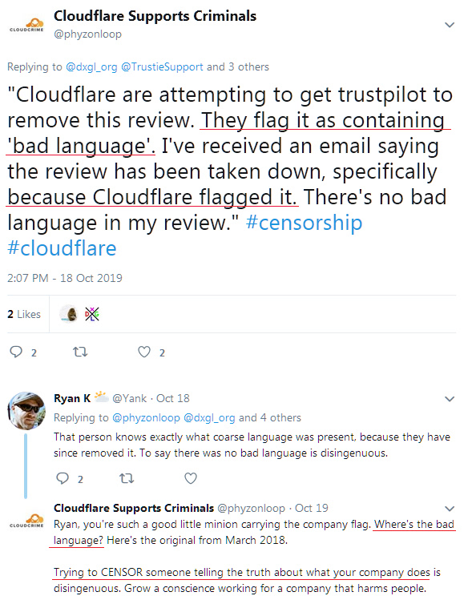 |

</details>

---

<details>
<summary>klõpsa mulle

## Jagage kasutaja isiklikku teavet
</summary>


Pilvvalgus on tohutu ahistamise probleem.
Cloudflare jagab isiklikku teavet nende kohta, kes kurdavad hostitud saitide üle.
Mõnikord paluvad nad teil sisestada oma tõeline isikutunnus.
Kui te ei soovi ahistada, rünnata, neelata ega tapeta, hoidke parem Cloudflaredi veebisaitidest.


| 🖼 | 🖼 |
| --- | --- |
|  | 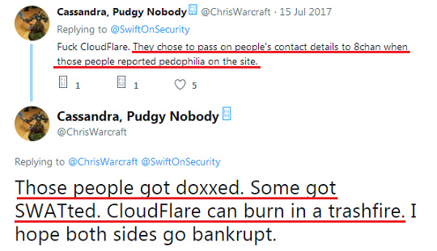 |
| 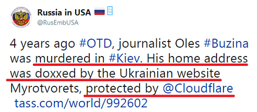 |  |
|  | 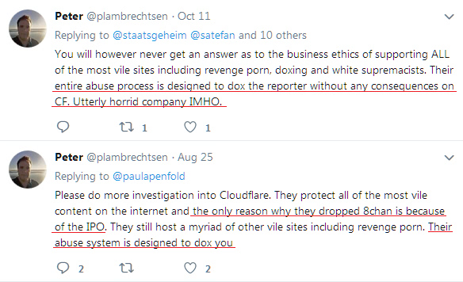 |
|  |  |

</details>

---

<details>
<summary>klõpsa mulle

## Heategevuslike toetuste korporatiivne taotlus
</summary>


CloudFlare küsib heategevuslikku toetust.
On üsna õõvastav, et Ameerika korporatsioon küsib heategevust lisaks heade põhjustega mittetulundusühingutele.
Kui teile meeldib inimeste blokeerimine või teiste inimeste aja raiskamine, võiksite tellida mõned pitsad Cloudflare'i töötajatele.


</details>

---

<details>
<summary>klõpsa mulle

## Lõpetavad saidid
</summary>


Mida teha, kui teie sait äkitselt väheneb?
On teateid, et Cloudflare kustutab kasutaja konfiguratsiooni või lõpetab teenuse ilma hoiatuseta, vaikides.
Soovitame teil leida parem pakkuja.


</details>

---

<details>
<summary>klõpsa mulle

## Brauseritarnija diskrimineerimine
</summary>


CloudFlare võimaldab Firefoxi kasutavatele isikutele eelistatud kohtlemist, pakkudes samal ajal Tor-mitte-brauseri mittekasutajatele vaenulikku kohtlemist.
Tori kasutajad, kes keelduvad õigustatult mittevaba javascripti täitmisest, saavad ka vaenulikku kohtlemist.
See juurdepääsu ebavõrdsus on võrgu neutraalsuse kuritarvitamine ja võimu kuritarvitamine.


- Vasakul: Tor-brauser, paremal: Chrome. Sama IP-aadress.


- Vasakul: Tor-brauseri Javascript keelatud, küpsis lubatud
- Paremal: Chrome Javascript lubatud, küpsis keelatud


- QuteBrowser (alaealine brauser) ilma Torita (Clearnet IP)

| ***Brauser*** | ***Juurdepääsu ravi*** |
| --- | --- |
| Tor Browser (Javascript on lubatud) | juurdepääs lubatud |
| Firefox (Javascript on lubatud) | juurdepääs halvenenud |
| Chromium (Javascript on lubatud) | juurdepääs halvenenud |
| Chromium or Firefox (Javascript on keelatud) | Ligipääs keelatud |
| Chromium or Firefox (Präänik on keelatud) | Ligipääs keelatud |
| QuteBrowser | Ligipääs keelatud |
| lynx | Ligipääs keelatud |
| w3m | Ligipääs keelatud |
| wget | Ligipääs keelatud |


Miks mitte kasutada helinuppu lihtsa väljakutse lahendamiseks?

Jah, seal on helinupp, kuid see ei tööta alati Tor'i kohal.
Selle teate kuvatakse siis, kui sellel klõpsate:

```
Proovige hiljem uuesti
Võimalik, et teie arvuti või võrk saadab automatiseeritud päringuid.
Kasutajate kaitsmiseks ei saa me praegu teie taotlust töödelda.
Lisateabe saamiseks külastage meie abilehte
```

</details>

---

<details>
<summary>klõpsa mulle

## Valijate allasurumine
</summary>


USA osariikide valijad registreeruvad hääletamiseks oma elukohariigi riigisekretäri veebisaidi kaudu.
Vabariiklaste kontrolli all olevad riigisekretäride kontorid tegelevad valijate allasurumisega, puhverdades riigisekretäri veebisaiti Cloudflare kaudu.
Cloudflare'i Tor-kasutajate vaenulik kohtlemine, selle MITM-i positsioon tsentraliseeritud globaalse seirepunktina ja kahjulik roll üldiselt muudavad tulevased valijad registreerimisest loobuma.
Eriti liberaalid kipuvad omaks võtma privaatsust.
Valija registreerimisvormid koguvad tundlikku teavet valija poliitilise poole, isikliku aadressi, sotsiaalkindlustuse numbri ja sünnikuupäeva kohta.
Enamik riike teeb selle teabe alamhulga avalikult kättesaadavaks, kuid Cloudflare näeb kogu seda teavet, kui keegi registreerub hääletama.

Pange tähele, et paberkandjal registreerimine ei hoia Cloudflarest mööda, kuna riigisisese andmesisestuse töötajate sekretär kasutab andmete sisestamiseks tõenäoliselt Cloudflare'i veebisaiti.

| 🖼 | 🖼 |
| --- | --- |
| 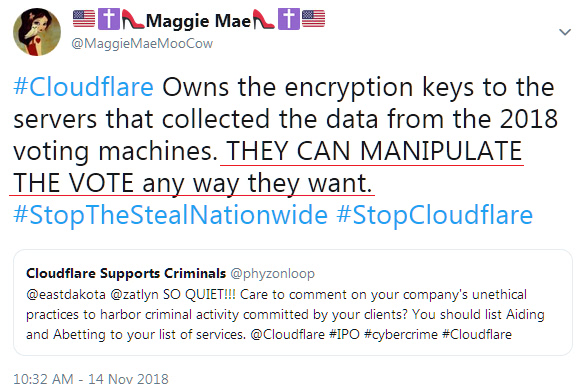 | 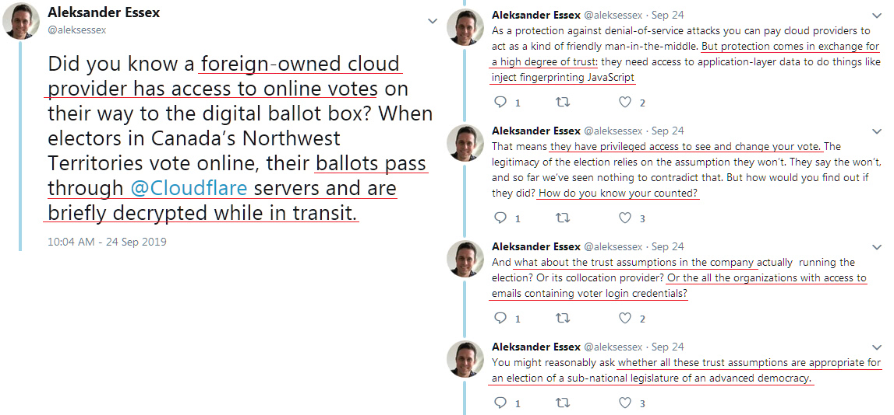 |

- Change.org on kuulus veebisait häälte kogumiseks ja tegutsemiseks.
“kõikjal inimesed alustavad kampaaniaid, mobiliseerivad toetajaid ja teevad lahenduste otsimiseks koostööd otsustajatega.”
Kahjuks ei saa paljud inimesed muutustorg.org Cloudflare'i agressiivse filtri tõttu üldse vaadata.
Neil takistatakse petitsiooni allkirjastamist, välistades seega nad demokraatlikust protsessist.
Muude pilvkattega platvormide, näiteks OpenPetitioni kasutamine aitab probleemi lahendada.

| 🖼 | 🖼 |
| --- | --- |
|  |  |

- Cloudflare'i "Ateena projekt" pakub riigi ja kohalike valimiste veebisaitidele tasuta ettevõtte tasemel kaitset.
Nad ütlesid, et "nende valijatel on juurdepääs valimisteabele ja valijate registreerimisele", kuid see on vale, sest paljud inimesed lihtsalt ei saa seda saiti üldse sirvida.

</details>

---

<details>
<summary>klõpsa mulle

## Kasutaja eelistuste eiramine
</summary>


Kui loobute millestki, loodate, et te ei saa selle kohta meilisõnumeid.
Cloudflare ignoreerib kasutaja eelistusi ja jagab andmeid ilma kliendi nõusolekuta kolmandate osapoolte ettevõtetega.
Kui kasutate nende tasuta paketti, saadavad nad teile mõnikord meilisõnumeid, paludes osta igakuist tellimust.


</details>

---

<details>
<summary>klõpsa mulle

## Valetab kasutaja andmete kustutamist
</summary>


Selle endise cloudflare'i kliendi ajaveebi kohaselt valetab Cloudflare kontode kustutamise üle.
Tänapäeval hoiavad paljud ettevõtted teie andmeid pärast konto sulgemist või eemaldamist.
Enamik häid ettevõtteid mainib seda oma privaatsuseeskirjades.
Pilvetuled? Ei

```
2019-08-05 CloudFlare saatis mulle kinnituse, et nad on mu konto eemaldanud.
2019-10-02 Sain CloudFlareilt meili "kuna olen klient"
```

Cloudflare ei teadnud sõna "eemalda".
Kui see tõesti eemaldatakse, siis miks see endine klient e-kirja sai?
Ta mainis ka, et Cloudflare'i privaatsuseeskirjades seda ei mainita.

```
Nende uues privaatsuspoliitikas ei mainita andmete säilitamist aasta jooksul.
```


Kuidas saab Cloudflare'i usaldada, kui nende privaatsuseeskirjad on LIE?

</details>

---

<details>
<summary>klõpsa mulle

## Hoidke oma isiklikke andmeid
</summary>


Cloudflare'i konto kustutamine on raskel tasemel.

```
Esitage tugipilet kategooria „Konto” abil,
ja taotleda konto kustutamist sõnumi kerest.
Enne kustutamise taotlemist ei tohi teie kontoga seotud olla domeene ega krediitkaarte.
```

Saate selle kinnitusmeili.


"Oleme hakanud teie kustutamistaotlust töötlema", kuid "Jätkame teie isikliku teabe säilitamist".

Kas saate seda "usaldada"?

</details>

---

<details>
<summary>_klaku min_

## Mi nuligis abonon kaj ricevis tro multajn retpoŝtojn
</summary>


La uzanto nuligis sian 'Cloudflare stream' abonon kaj li ricevas retpoŝtajn memorigilojn ĉiutage por rememorigi lin pri nuligita abono.
Ne estas malaprobita butono. Kiel vi ĉesas ĉi tiun frenezon?


Cloudflare diris al ĉi tiu uzanto kontakti subtenteamo kaj peti ĉiujn viajn enhavojn forigi.

- [t](https://web.archive.org/web/20210412165334/https://twitter.com/JohnHaldson/status/1381651569247088650)

</details>

---

## Aliaj informoj

- [Joseph Sullivan (Joe Sullivan)](../cloudflare_inc/cloudflare_members.md) ([Cloudflare CSO](https://twitter.com/eastdakota/status/1296522269313785862))
  - [Ex-Uber security head charged in connection with the cover-up of a 2016 hack that affected 57 million customers](https://www.businessinsider.com/uber-data-hack-security-head-joe-sullivan-charged-cover-up-2020-8)
  - [Former Chief Security Officer For Uber Charged With Obstruction Of Justice](https://www.justice.gov/usao-ndca/pr/former-chief-security-officer-uber-charged-obstruction-justice)


---

## Jätkake järgmisel lehel:   [Kion vi povas fari por rezisti kontraŭ Cloudflare?](et.action.md)

|  🖼  |  🖼 |
| --- | --- |
| 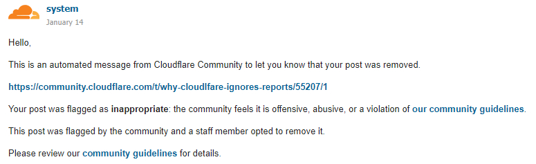 |  |


