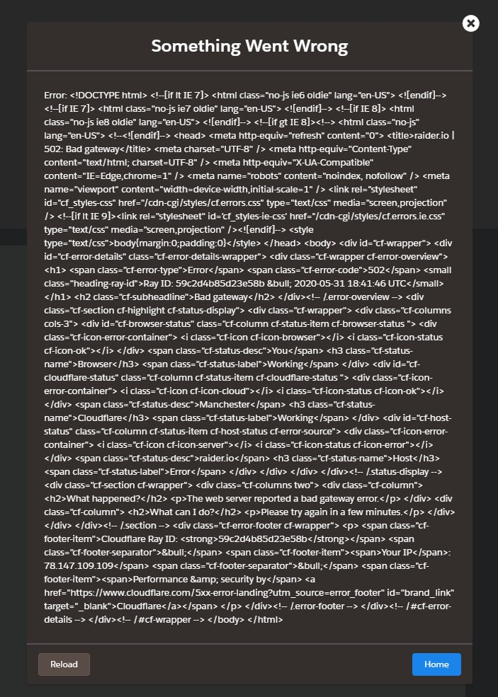

# Mitä voit tehdä Cloudflaren vastustamiseksi?

| 🖼 | 🖼 | 🖼 |
| --- | --- | --- |
|  |  |  |


Matthew Browning Prince, naskita la 13an de novembro 1974, estas la ĉefoficisto kaj kunfondinto de Cloudflaron.

Danke al lia riĉa paĉjo, "John B. Prince", li ĉeestis la Universitaton de Ĉikago Leĝlernejo kaj Harvard Komerclernejo.
Princo instruis Interretan leĝon kaj estis specialisto pri kontraŭ-spamaj leĝoj kaj Fraŭdo-esploroj.


"*I’d suggest this was armchair analysis by kids – it’s hard to take seriously.*" [t](https://www.theguardian.com/technology/2015/nov/19/cloudflare-accused-by-anonymous-helping-isis)

"*That was simply unfounded paranoia, pretty big difference.*"  [t](https://twitter.com/xxdesmus/status/992757936123359233)

"*We also work with Interpol and other non-US entities*" [t](https://twitter.com/eastdakota/status/1203028504184360960)

"*Watching hacker skids on Github squabble about trying to bypass Cloudflare's new anti-bot systems continues to be my daily amusement.* 🍿" [t](https://twitter.com/eastdakota/status/1273277839102656515)


---


<details>
<summary>napsauta minua

## Sivuston kuluttaja
</summary>


- Jos haluamasi verkkosivusto käyttää Cloudflare-ohjelmaa, kehota heitä olemaan käyttämättä Cloudflare-ohjelmaa.
  - Valitus sosiaalisessa mediassa, kuten Facebook, Reddit, Twitter tai Mastodon, ei tee mitään eroa. [Toiminnot ovat kovempia kuin hashtagit.](https://twitter.com/phyzonloop/status/1274132092490862594)
  - Yritä ottaa yhteyttä sivuston omistajaan, jos haluat tehdä itsestäsi hyödyllisen.

[Cloudflare sanoi](https://github.com/Eloston/ungoogled-chromium/issues/783):
```
Suosittelemme, että otat yhteyttä järjestelmänvalvojiin tietyistä palveluista tai sivustoista, joihin kohtaat ongelman, ja jaat kokemuksesi.
```

[Jos et pyydä sitä, verkkosivuston omistaja ei koskaan tiedä tätä ongelmaa.](../PEOPLE.md)


[Onnistunut esimerkki](https://counterpartytalk.org/t/turn-off-cloudflare-on-counterparty-co-plz/164/5).<br>
Sinulla on ongelma? [Nosta äänesi nyt.](https://github.com/maraoz/maraoz.github.io/issues/1) Esimerkki alla.

```
Autat vain yritysten sensuuria ja joukkovalvontaa.
http://crimeflare.eu.org
```

```
Verkkosivusi on CloudFlaren yksityisyyttä väärinkäyttävässä yksityisessä aidatussa puutarhassa.
http://crimeflare.eu.org
```

- Ota jonkin aikaa lukea verkkosivuston tietosuojakäytäntö.
  - jos verkkosivusto on Cloudflaren takana tai verkkosivusto käyttää Cloudflareen liittyviä palveluja.

Sen on selitettävä, mikä on "Cloudflare", ja pyydettävä lupaa jakaa tietojasi Cloudflareen. Tämän laiminlyönti johtaa luottamuksen loukkaamiseen, ja kyseistä verkkosivustoa tulisi välttää.

[Hyväksyttävä tietosuojakäytäntö on tässä](https://archive.is/bDlTz) ("Subprocessors" > "Entity Name")

```
Olen lukenut tietosuojakäytäntösi, enkä löydä sanaa Cloudflare.
Kieltäydyn jakamasta tietoja kanssasi, jos jatkat tietojeni syöttämistä Cloudflareen.
http://crimeflare.eu.org
```

Tämä on esimerkki tietosuojakäytännöstä, jossa ei ole sanaa Cloudflare.
[Liberland Jobs](https://archive.is/daKIr) [privacy policy](https://docsend.com/view/feiwyte):


Cloudflarella on oma tietosuojakäytäntö.
[Cloudflare rakastaa doxing ihmisiä.](https://www.reddit.com/r/GamerGhazi/comments/2s64fe/be_wary_reporting_to_cloudflare/)

Tässä on hyvä esimerkki verkkosivuston rekisteröintilomakkeesta.
AFAIK, nolla verkkosivusto tekee tämän. Luotatko heihin?

```
Klikkaamalla "Rekisteröidy XYZ: ään" hyväksyt palveluehdot ja tietosuojalausunnon.
Suostut myös jakamaan tietosi Cloudflaren kanssa ja suostut myös cloudflaren tietosuojalausuntoon.
Jos Cloudflare vuotaa tietosi tai ei anna sinun muodostaa yhteyttä palvelimillemme, se ei ole meidän vikamme. [*]

[ Kirjaudu ] [ olen eri mieltä ]
```
[*] [PEOPLE.md](../PEOPLE.md)


- Yritä olla käyttämättä heidän palveluitaan. Muista, että Cloudflare seuraa sinua.
  - ["I'm in your TLS, sniffin' your passworz"](../image/iminurtls.jpg)

- Hae muita verkkosivustoja. Internetissä on vaihtoehtoja ja mahdollisuuksia!

- Vakuuta ystäväsi käyttämään Toria päivittäin.
  - Nimettömyyden tulisi olla avoimen Internetin standardi!
  - [Huomaa, että Tor-projekti ei pidä tästä projektista.](../HISTORY.md)

</details>

------

<details>
<summary>napsauta minua

## Lisäosat
</summary>

- Jos selaimesi on Firefox, Tor Browser tai Ungoogled Chromium, käytä yhtä alla olevista lisäosista.
  - Jos haluat lisätä muita uusia lisäosia, kysy ensin.


| Nimi | Kehittäjä | Tuki | Voi estää | Voi ilmoittaa | Chrome |
| -------- | -------- | -------- | -------- | -------- | -------- |
| [Bloku Cloudflaron MITM-Atakon](../subfiles/addon/bcma.md) | #Addon | [ ? ](http://crimeflare.eu.org/) | **Joo**     | **Joo**     |  **Joo** |
| [Ĉu ligoj estas vundeblaj al MITM-atako?](../subfiles/addon/ismm.md) | #Addon | [ ? ](http://crimeflare.eu.org/) | Ei     | **Joo**     |  **Joo** |
| [Ĉu ĉi tiuj ligoj blokos Tor-uzanton?](../subfiles/addon/isat.md) | #Addon | [ ? ](http://crimeflare.eu.org/) | Ei     | **Joo**     |  **Joo** |
| [Block Cloudflare MITM Attack](https://trac.torproject.org/projects/tor/attachment/ticket/24351/block_cloudflare_mitm_attack-1.0.14.1-an%2Bfx.xpi)<br>[**DELETED BY TOR PROJECT**](../HISTORY.md) | nullius | [ ? ](../tool/block_cloudflare_mitm_fx), [Link](http://crimeflare.eu.org/) | **Joo**     | **Joo**     |  Ei |
| [TPRB](http://sw.nnpaefp7pkadbxxkhz2agtbv2a4g5sgo2fbmv3i7czaua354334uqqad.onion/) | Sw | [ ? ](http://sw.nnpaefp7pkadbxxkhz2agtbv2a4g5sgo2fbmv3i7czaua354334uqqad.onion/) | **Joo**     | **Joo**     |  Ei |
| [Detect Cloudflare](https://addons.mozilla.org/en-US/firefox/addon/detect-cloudflare/) | Frank Otto | [ ? ](https://github.com/traktofon/cf-detect) | Ei     | **Joo**     |  Ei |
| [True Sight](https://addons.mozilla.org/en-US/firefox/addon/detect-cloudflare-plus/) | claustromaniac | [ ? ](https://github.com/claustromaniac/detect-cloudflare-plus) | Ei     | **Joo**     |  Ei |
| [Which Cloudflare datacenter am I visiting?](https://addons.mozilla.org/en-US/firefox/addon/cf-pop/) | 依云 | [ ? ](https://github.com/lilydjwg/cf-pop) | Ei     | **Joo**     |  Ei |


- "Decentraleyes" voi lopettaa yhteyden "CDNJS (Cloudflare)" -palveluun.
  - Se estää monien pyyntöjen pääsyn verkkoihin ja palvelee paikallisia tiedostoja, jotta sivustot eivät rikkoutuisi.
  - Kehittäjä vastasi: "[very concerning indeed](https://github.com/Synzvato/decentraleyes/issues/236#issuecomment-352049501)", "[widespread usage severely centralizes the web](https://github.com/Synzvato/decentraleyes/issues/251#issuecomment-366752049)"

- [Voit myös poistaa Cloudflare-varmenteen tai epäillä sitä varmentajaltasi (CA).](https://www.ssl.com/how-to/remove-root-certificate-firefox/)

</details>

------

<details>
<summary>napsauta minua

## Verkkosivuston omistaja / web-kehittäjä
</summary>


- Älä käytä Cloudflare-ratkaisua, jakso.
  - Voit tehdä paremmin kuin se, eikö? [Näin voit poistaa Cloudflare-tilaukset, suunnitelmat, verkkotunnukset tai tilit.](https://support.cloudflare.com/hc/en-us/articles/200167776-Removing-subscriptions-plans-domains-or-accounts)

| 🖼 | 🖼 |
| --- | --- |
|  |  |

- Haluatko lisää asiakkaita? Tiedät mitä tehdä. Vihje on "viivan yläpuolella".
  - [Hei, kirjoitit "Otamme yksityisyytesi vakavasti", mutta sain "Virhe 403 kielletty tuntematon välityspalvelin ei sallittu".](https://it.slashdot.org/story/19/02/19/0033255/stop-saying-we-take-your-privacy-and-security-seriously) Miksi estät Torin tai VPN: n? Ja miksi estät väliaikaiset sähköpostit?


- Cloudflaren käyttö lisää seisokkien mahdollisuuksia. Vierailijat eivät voi käyttää verkkosivustoasi, jos palvelimesi ei toimi tai Cloudflare on poissa käytöstä.
  - [Luuletko todella, että Cloudflare ei koskaan laskeudu?](https://www.ibtimes.com/cloudflare-down-not-working-sites-producing-504-gateway-timeout-errors-2618008) [Another](https://twitter.com/Jedduff/status/1097875615997399040) [sample](https://twitter.com/search?f=tweets&vertical=default&q=Cloudflare%20is%20having%20problems). [Need more](../PEOPLE.md)?


- Cloudflaren käyttäminen "API-palvelun", "ohjelmistopäivityspalvelimen" tai "RSS-syötteen" välityspalvelimeksi vahingoittaa asiakasta. Asiakas soitti sinulle ja sanoi "En voi enää käyttää sovellusliittymääsi", eikä sinulla ole aavistustakaan, mitä on tekeillä. Cloudflare voi estää asiakkaasi hiljaa. Luuletko, että se on kunnossa?
  - RSS-lukijaohjelmia ja RSS-lukijoiden verkkopalveluja on paljon. Miksi julkaiset RSS-syötteen, jos et salli ihmisten tilata?


- Tarvitsetko HTTPS-varmenteen? Käytä "Let's Encrypt" tai osta se vain CA-yhtiöltä.

- Tarvitsetko DNS-palvelinta? Etkö voi asettaa omaa palvelinta? Entä heille: [Hurricane Electric Free DNS](https://dns.he.net/), [Dyn.com](https://dyn.com/dns/), [1984 Hosting](https://www.1984hosting.com/), [Afraid.Org (Järjestelmänvalvoja poistaa tilisi, jos käytät TOR: ää)](https://freedns.afraid.org/)
  - [Alternativoj al DNS](../subfiles/alternative/domaindns.md)

- Etsitkö hosting-palvelua? Vain ilmaiseksi? Entä heille: [Onion Service](http://vww6ybal4bd7szmgncyruucpgfkqahzddi37ktceo3ah7ngmcopnpyyd.onion/en/security/network-security/tor/onionservices-best-practices), [Free Web Hosting Area](https://freewha.com/), [Autistici/Inventati Web Site Hosting](https://www.autinv5q6en4gpf4.onion/services/website), [Github Pages](https://pages.github.com/), [Surge](https://surge.sh/)
  - [Vaihtoehtoja Cloudflarelle](../subfiles/alternative/cloudflare.md)

- Käytätkö "cloudflare-ipfs.com"? [Tiedätkö Cloudflare IPFS: n olevan huono?](../PEOPLE.md)

- Asenna Web-sovellusten palomuuri, kuten OWASP ja Fail2Ban, palvelimellesi ja määritä se oikein.
  - Torin estäminen ei ole ratkaisu. Älä rankaise kaikkia vain pienten huonojen käyttäjien vuoksi.

- Ohjaa tai estä Cloudflare Warp -käyttäjiä pääsemästä verkkosivustoosi. Ja anna syy, jos voit.

> IP-luettelo: "[Cloudflaren nykyiset IP-alueet](cloudflare_inc/)"

> A: Estä vain ne

```
server {
...
deny 173.245.48.0/20;
deny 103.21.244.0/22;
deny 103.22.200.0/22;
deny 103.31.4.0/22;
deny 141.101.64.0/18;
deny 108.162.192.0/18;
deny 190.93.240.0/20;
deny 188.114.96.0/20;
deny 197.234.240.0/22;
deny 198.41.128.0/17;
deny 162.158.0.0/15;
deny 104.16.0.0/12;
deny 172.64.0.0/13;
deny 131.0.72.0/22;
deny 2400:cb00::/32;
deny 2606:4700::/32;
deny 2803:f800::/32;
deny 2405:b500::/32;
deny 2405:8100::/32;
deny 2a06:98c0::/29;
deny 2c0f:f248::/32;
...
}
```

> B: Uudelleenohjaus varoitussivulle

```
http {
...
geo $iscf {
default 0;
173.245.48.0/20 1;
103.21.244.0/22 1;
103.22.200.0/22 1;
103.31.4.0/22 1;
141.101.64.0/18 1;
108.162.192.0/18 1;
190.93.240.0/20 1;
188.114.96.0/20 1;
197.234.240.0/22 1;
198.41.128.0/17 1;
162.158.0.0/15 1;
104.16.0.0/12 1;
172.64.0.0/13 1;
131.0.72.0/22 1;
2400:cb00::/32 1;
2606:4700::/32 1;
2803:f800::/32 1;
2405:b500::/32 1;
2405:8100::/32 1;
2a06:98c0::/29 1;
2c0f:f248::/32 1;
}
...
}

server {
...
if ($iscf) {rewrite ^ https://example.com/cfwsorry.php;}
...
}

<?php
header('HTTP/1.1 406 Not Acceptable');
echo <<<CLOUDFLARED
Thank you for visiting ourwebsite.com!<br />
We are sorry, but we can't serve you because your connection is being intercepted by Cloudflare.<br />
Please read http://crimeflare.eu.org for more information.<br />
CLOUDFLARED;
die();
```

- Määritä Tor Onion Service tai I2P insite, jos uskot vapauteen ja toivotat tuntemattomia käyttäjiä tervetulleiksi.

- Kysy neuvoja muilta Clearnet / Tor-kaksoissivusto-operaattoreilta ja hanki tuntemattomia ystäviä!

</details>

------

<details>
<summary>napsauta minua

## Ohjelmiston käyttäjä
</summary>


- Discord käyttää CloudFlarea. Vaihtoehtoja? Suosittelemme [**Briar** (Android)](https://f-droid.org/en/packages/org.briarproject.briar.android/), [Ricochet (PC)](https://ricochet.im/), [Tox + Tor (Android/PC)](https://tox.chat/download.html)
  - Briar sisältää Tor-demonin, joten sinun ei tarvitse asentaa Orbotia.
  - Qwtch-kehittäjät, Open Privacy, poistivat stop_cloudflare-projektin git-palvelustaan ​​ilman erillistä ilmoitusta.

- Jos käytät Debian GNU / Linuxia tai mitä tahansa johdannaista, tilaa: [bug #831835](https://bugs.debian.org/cgi-bin/bugreport.cgi?bug=831835). Ja jos voit, auta tarkistamaan korjaustiedosto ja auta ylläpitäjää tekemään oikea johtopäätös siitä, pitäisikö se hyväksyä.

- Suosittele aina näitä selaimia.

| Nimi | Kehittäjä | Tuki | Kommentti |
| -------- | -------- | -------- | -------- |
| [Ungoogled-Chromium](https://ungoogled-software.github.io/ungoogled-chromium-binaries/) | Eloston | [ ? ](https://github.com/Eloston/ungoogled-chromium) | PC (Win, Mac, Linux)  _!Tor_ |
| [Bromite](https://www.bromite.org/fdroid) | Bromite | [ ? ](https://github.com/bromite/bromite/issues) | Android  _!Tor_ |
| [Tor Browser](https://www.torproject.org/download/) | Tor Project | [ ? ](https://support.torproject.org/) | PC (Win, Mac, Linux)  _Tor_|
| [Tor Browser Android](https://www.torproject.org/download/) | Tor Project | [ ? ](https://support.torproject.org/) | Android  _Tor_|
| [Onion Browser](https://itunes.apple.com/us/app/onion-browser/id519296448?mt=8) | Mike Tigas | [ ? ](https://github.com/OnionBrowser/OnionBrowser/issues) | Apple iOS  _Tor_|
| [GNU/Icecat](https://www.gnu.org/software/gnuzilla/) | GNU | [ ? ](https://www.gnu.org/software/gnuzilla/) | PC (Linux) |
| [IceCatMobile](https://f-droid.org/en/packages/org.gnu.icecat/) | GNU | [ ? ](https://lists.gnu.org/mailman/listinfo/bug-gnuzilla) | Android |
| [Iridium Browser](https://iridiumbrowser.de/about/) | Iridium | [ ? ](https://github.com/iridium-browser/iridium-browser/) | PC (Win, Mac, Linux, OpenBSD) |


Muiden ohjelmistojen yksityisyys on epätäydellistä. Tämä ei tarkoita, että Tor-selain on "täydellinen".
Internetissä ja tekniikassa ei ole 100% turvallista eikä 100% yksityistä.

- Etkö halua käyttää Toria? Voit käyttää mitä tahansa selainta Tor-demonin kanssa.
  - [Huomaa, että Tor-projekti ei pidä tästä.](https://support.torproject.org/tbb/tbb-9/) Käytä Tor-selainta, jos pystyt siihen.
- [Kuinka käyttää kromia Torin kanssa](../subfiles/chromium_tor.md)


Puhutaan muiden ohjelmistojen yksityisyydestä.

- [Jos sinun on todella käytettävä Firefoxia, valitse "Firefox ESR".](https://www.mozilla.org/en-US/firefox/organizations/)
  - [Firefox - Spyware Watchdog](https://spyware.neocities.org/articles/firefox.html)
  - [Firefox hylkää sananvapauden ja kieltää sananvapauden](https://web.archive.org/web/20200423010026/https://reclaimthenet.org/firefox-rejects-free-speech-bans-free-speech-commenting-plugin-dissenter-from-its-extensions-gallery/)
  - ["100+ ääntä. Näyttää siltä, ​​että ohjelmistoyritystä pyydetään pitämään kiinni ... ohjelmisto on nykyään liikaa."](https://old.reddit.com/r/firefox/comments/gutdiw/weve_got_work_to_do_the_mozilla_blog/fslbbb6/)
  - [Miksi Firefox näyttää minulle sponsoroituja linkkejä URL-osoiterivilläni?](https://www.reddit.com/r/firefox/comments/jybx2w/uh_why_is_firefox_showing_me_sponsored_links_in/)
  - [Mozilla - Paholainen ruumiillistuu](https://digdeeper.neocities.org/ghost/mozilla.html)

- [Muista, että Mozilla käyttää Cloudflare-palvelua.](https://www.robtex.com/dns-lookup/www.mozilla.org) [He käyttävät myös tuotteessaan Cloudflaren DNS-palvelua.](https://www.theregister.co.uk/2018/03/21/mozilla_testing_dns_encryption/)

- [Mozilla hylkäsi virallisesti tämän lipun.](https://bugzilla.mozilla.org/show_bug.cgi?id=1426618)

- [Firefox Focus on vitsi.](https://github.com/mozilla-mobile/focus-android/issues/1743) [He lupasivat poistaa telemetrian käytöstä, mutta muuttivat sitä.](https://github.com/mozilla-mobile/focus-android/issues/4210)

- [PaleMoon / Basilisk -kehittäjä rakastaa Cloudflarea.](https://github.com/mozilla-mobile/focus-android/issues/1743#issuecomment-345993097)
  - [Pale Moonin arkistopalvelin hakkeroi ja levitti haittaohjelmia 18 kuukauden ajan](https://www.reddit.com/r/privacytoolsIO/comments/cc808y/pale_moons_archive_server_hacked_and_spread/)
  - Hän vihaa myös Tor-käyttäjiä - "[Olkoon se vihamielinen Toria kohtaan. Mielestäni useimpien sivustojen tulisi olla vihamielisiä Toria kohtaan, kun otetaan huomioon sen erittäin korkea väärinkäyttö.](https://github.com/yacy/yacy_search_server/issues/314#issuecomment-565932097)"

- [Waterfoxilla on vakava "puhelimet kotiin" -ongelma](https://spyware.neocities.org/articles/waterfox.html)

- [Google Chrome on vakoiluohjelma.](https://www.gnu.org/proprietary/malware-google.en.html)
  - [Google profiloi toimintasi.](https://spyware.neocities.org/articles/chrome.html)

- [SRWare Iron muodostaa liian monta puhelinta kotiliitäntään.](https://spyware.neocities.org/articles/iron.html) Se muodostaa yhteyden myös Google-verkkotunnuksiin.

- [Brave Browser sallittujen luettelo Facebook / Twitter-seuranta.](https://www.bleepingcomputer.com/news/security/facebook-twitter-trackers-whitelisted-by-brave-browser/)
  - [Tässä on lisää kysymyksiä.](https://spyware.neocities.org/articles/brave.html)
  - [binance-tytäryhtiön tunnus](https://twitter.com/cryptonator1337/status/1269594587716374528)

- [Microsoft Edge antaa Facebookin suorittaa Flash-koodin käyttäjien selän takana.](https://www.zdnet.com/article/microsoft-edge-lets-facebook-run-flash-code-behind-users-backs/)

- [Vivaldi ei kunnioita yksityisyyttäsi.](https://spyware.neocities.org/articles/vivaldi.html)

- [Opera-vakoiluohjelmien taso: Erittäin korkea](https://spyware.neocities.org/articles/opera.html)

- Apple iOS: [Sinun ei pitäisi käyttää iOS: ää ollenkaan, lähinnä siksi, että se on haittaohjelma.](https://www.gnu.org/proprietary/malware-apple.html)

Siksi suosittelemme vain yllä olevaa taulukkoa. Ei mitään muuta.

</details>

------

<details>
<summary>napsauta minua

## Mozilla Firefox -käyttäjä
</summary>


- "Firefox Nightly" lähettää virheenkorjaustason tietoja Mozilla-palvelimille ilman opt-out-menetelmää.
  - [Mozilla-palvelimet hälyttävät Cloudflare-palvelua](https://www.digwebinterface.com/?hostnames=www.mozilla.org%0D%0Amozilla.cloudflare-dns.com&type=&ns=resolver&useresolver=8.8.4.4&nameservers=)

- On mahdollista kieltää Firefox muodostamasta yhteyttä Mozilla-palvelimiin.
  - [Mozillan käytäntömallien opas](https://github.com/mozilla/policy-templates/blob/master/README.md)
  - Pidä mielessä, että tämä temppu saattaa lakata toimimasta uudemmassa versiossa, koska Mozilla haluaa lisätä itsensä sallittujen luetteloon.
  - Käytä palomuuria ja DNS-suodatinta estääksesi ne kokonaan.

"`/distribution/policies.json`"

>     "WebsiteFilter": {
> 		"Block": [
> 		"*://*.mozilla.com/*",
> 		"*://*.mozilla.net/*",
> 		"*://*.mozilla.org/*",
> 		"*://webcompat.com/*",
> 		"*://*.firefox.com/*",
> 		"*://*.thunderbird.net/*",
> 		"*://*.cloudflare.com/*"
> 		]
>     },


- ~~Ilmoita virheestä mozillan seurannassa ja kehota heitä olemaan käyttämättä Cloudflarea.~~ Bugzillasta oli virheraportti. Monille ihmisille lähetettiin huolensa, mutta vika piilotti järjestelmänvalvojan vuonna 2018.

- Voit poistaa DoH: n käytöstä Firefoxissa.
  - [Vaihda Firefoxin oletus DNS-tarjoaja](../subfiles/change-firefox-dns.md)


- [Jos haluat käyttää muuta kuin ISP-DNS: ää, harkitse OpenNIC Tier2 DNS -palvelun tai muun kuin Cloudflare DNS -palvelun käyttöä.](https://wiki.opennic.org/start)

  - Estä Cloudflare DNS: llä. [Crimeflare DNS](../subfiles/service/publicdns.md)

- Voit käyttää Toria DNS-ratkaisijana. [Jos et ole Tor-asiantuntija, esitä kysymys täällä.](https://tor.stackexchange.com/)

> **Miten?**
> 1. Lataa Tor ja asenna se tietokoneellesi.
> 2. Lisää tämä rivi "torrc" -tiedostoon.
> DNSPort 127.0.0.1:53
> 3. Käynnistä Tor uudelleen.
> 4. Aseta tietokoneen DNS-palvelimeksi "127.0.0.1".

</details>

------

<details>
<summary>napsauta minua

## Toiminta
</summary>


- Kerro muille ympärilläsi Cloudflaren vaaroista.

- [Auta parantamaan tätä arkistoa.](http://crimeflare.eu.org)
  - Sekä luettelot, sitä vastaan ​​esitetyt perustelut että yksityiskohdat.

- [Dokumentoi ja julkaise hyvin, jos Cloudflaren (ja vastaavien yritysten) kanssa menee pieleen, ja muista mainita tämä arkisto, kun teet niin](http://crimeflare.eu.org) :)

- Hanki Torin oletusarvoisesti enemmän ihmisiä, jotta he voivat kokea verkon eri puolilta maailmaa.

- Aloita ryhmät sosiaalisessa mediassa ja meritilassa, joka on omistettu maailman vapauttamiselle Cloudflaresta.

- Linkitä tarvittaessa näihin ryhmiin tässä arkistossa - tämä voi olla paikka koordinoida työskentelyä ryhminä.

- [Aloita yhteistyö, joka voi tarjota mielekkäitä ei-yritysvaihtoehtoja Cloudflarelle.](../subfiles/alternative/cloudflare.md)

- Kerro meille mahdollisista vaihtoehdoista, jotka auttavat ainakin tarjoamaan monikerroksisen puolustuksen Cloudflareä vastaan.

- Jos olet Cloudflare-asiakas, määritä yksityisyysasetuksesi ja odota, että he rikkovat niitä.
  - [Sitten heidät saatetaan roskapostin / yksityisyyden rikkomisen alaisiksi.](https://twitter.com/thexpaw/status/1108424723233419264)

- Jos olet Yhdysvalloissa ja kyseinen verkkosivusto on pankki tai kirjanpitäjä, yritä tuoda oikeudellista painostusta Gramm – Leach – Bliley-lain tai amerikkalaisten, joilla on DIsability-laki, ja ilmoita meille, kuinka pitkälle saavut .

- Jos verkkosivusto on hallituksen sivusto, yritä tuoda oikeudellista painostusta Yhdysvaltain perustuslain 1. muutoksen alle.

- Jos olet EU: n kansalainen, ota yhteyttä verkkosivustoon ja lähetä henkilökohtaisia ​​tietojasi yleisen tietosuoja-asetuksen mukaisesti. Jos he kieltäytyvät antamasta sinulle tietojasi, se on lain vastaista.

- Yritykset, jotka väittävät tarjoavansa palvelua verkkosivustollaan, yrittävät ilmoittaa niistä "vääränä mainonnana" kuluttajansuojajärjestöille ja BBB: lle. Cloudflare-verkkosivustoja palvelevat Cloudflare-palvelimet.

- [ITU ehdottaa Yhdysvalloissa, että Cloudflare alkaa olla riittävän suuri, jotta kilpailulaki saatetaan kaataa heille.](https://www.itu.int/en/ITU-T/Workshops-and-Seminars/20181218/Documents/Geoff_Huston_Presentation.pdf)

- On ajateltavissa, että GNU GPL -versio 4 voisi sisältää säännön lähdekoodin tallentamisesta tällaisen palvelun taakse, vaatien kaikille GPLv4- ja myöhemmille ohjelmille, että ainakin lähdekoodiin on pääsy välineellä, joka ei syrji Tor-käyttäjiä.

- [Se vi uzas Mastodon bonvolu sekvi la konton Mitigator](../subfiles/service/altlink.md).

</details>

------

### Kommentit

```
Vastarinnassa on aina toivoa.

Vastarinta on hedelmällistä.

Jopa jotkut synkemmistä lopputuloksista syntyvät, jo vastarintaliike kouluttaa meitä jatkamaan epävakauttamista tuloksena olevasta dystopisesta status quosta.

Vastustaa!
```

```
Joskus ymmärrät, miksi kirjoitimme tämän.
```

```
Tässä ei ole mitään futuristista. Olemme jo menettäneet.
```

### Mitä teit tänään?


