# Le Grand Cloudwall

---

## Arrêtez Cloudflare

| 🖹 | 🖼 |
| --- | --- |
| « The Great Cloudwall » est une [société américaine](https://fr.wikipedia.org/wiki/Cloudflare), [Cloudflare Inc.](https://www.cloudflare.com/) Elle fournit des services de [CDN](https://fr.wikipedia.org/wiki/R%C3%A9seau_de_diffusion_de_contenu) (réseau de distribution de contenu), [d'atténuation des DDoS, de sécurité Internet](https://fr.wikipedia.org/wiki/Mitigation_de_DDoS) et des services [DNS](https://fr.wikipedia.org/wiki/Domain_Name_System) (serveur de noms de domaine) distribués. | 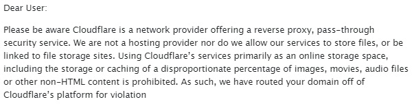 |
| Cloudflare est le [plus grand](https://w3techs.com/technologies/history_overview/proxy) proxy MITM ([proxy inverse](https://fr.wikipedia.org/wiki/Proxy_inverse)) au [monde](https://almanac.httparchive.org/en/2019/cdn). Cloudflare détient [plus de 80 % des parts de marché CDN](https://w3techs.com/technologies/history_overview/proxy) et le [nombre d'utilisateurs de Cloudflare](../cloudflare_users/) augmente chaque jour. [Ils](../cloudflare_inc/cloudflare_members.md) ont étendu leur réseau à plus de [100 pays](https://blog.cloudflare.com/cloudflare-network-expands-to-more-than-100-countries/). Cloudflare dessert [plus de trafic web](https://wp-rocket.me/blog/cloudflare-use-not/) que [Twitter](https://fr.wikipedia.org/wiki/Twitter), [Amazon](https://fr.wikipedia.org/wiki/Amazon), [Apple](https://fr.wikipedia.org/wiki/Apple), [Instagram](https://fr.wikipedia.org/wiki/Instagram), [Bing](https://fr.wikipedia.org/wiki/Microsoft_Bing) et [Wikipedia](https://fr.wikipedia.org/wiki/Wikip%C3%A9dia) réunis. Cloudflare propose un [plan gratuit](https://www.cloudflare.com/plans/) et de nombreuses personnes l'utilisent au lieu de configurer correctement leurs serveurs. Ils ont troqué la [confidentialité](https://fr.wikipedia.org/wiki/Vie_priv%C3%A9e) contre [la commodité](https://news.netcraft.com/archives/2013/10/07/phishers-using-cloudflare-for-ssl.html). |  |
| Cloudflare se place entre vous et le serveur web d'origine, agissant comme un [agent de la police des frontières](https://www.cbp.gov/careers/usbp). Vous ne pouvez pas vous connecter à la destination de votre choix. Vous vous connectez à Cloudflare et toutes vos informations sont décryptées et transmises à la volée. Cloudflare a une [vue globale](https://blog.cloudflare.com/crawler-hints-how-cloudflare-is-reducing-the-environmental-impact-of-web-searches/) du trafic Internet et observe en permanence le trafic qui lui est destiné. |  |
| L'administrateur du serveur web d'origine a permis à l'agent - Cloudflare - de décider qui peut accéder à sa « propriété web » et de définir une « zone restreinte ». | 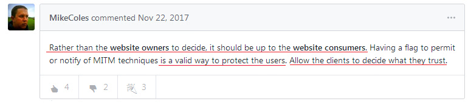 |
| Regardez l'image de droite. Vous penserez que Cloudflare bloque _uniquement_ les [méchants](https://fr.wikipedia.org/wiki/Black_hat). Vous penserez que _Cloudflare est toujours en ligne (ne tombe jamais en [panne](https://twitter.com/bengoldacre/status/1146058200887648258))_. En outre, vous penserez que des robots et des [crawlers](https://fr.wikipedia.org/wiki/Robot_d%27indexation) légitimes peuvent indexer votre site Web. |   |
| Cependant, [ce n'est pas vrai](../PEOPLE.md) du tout. Cloudflare bloque des personnes innocentes sans raison. Cloudflare [peut s'effondrer](](../HISTORY.md#user-content-cloudflare-incidents)). Cloudflare bloque des bots légitimes. |  |
| Comme tout [service d'hébergement](https://fr.wikipedia.org/wiki/H%C3%A9bergeur_web), Cloudflare n'est pas parfait. Vous verrez cet écran [même si le serveur d'origine fonctionne bien](../PEOPLE.md. |  |
| Vous pensez vraiment que Cloudflare a [un temps de fonctionnement](https://fr.wikipedia.org/wiki/Uptime) de 100 % ? Vous n'avez aucune idée du nombre de fois où Cloudflare [tombe en panne](https://www.zerohedge.com/markets/major-part-web-offline-cloudflare-suffers-outage). Si Cloudflare tombe en panne, votre client ne peut pas accéder à votre site Web. |   |
| On l'appelle ainsi en référence au [Grand Pare-feu de la Chine](https://www.comparitech.com/privacy-security-tools/blockedinchina/), qui fait un travail comparable en [empêchant de nombreuses personnes](../PEOPLE.md) de voir le contenu du web (c'est-à-dire tous ceux qui se trouvent en [Chine continentale](https://fr.wikipedia.org/wiki/Chine) et ceux qui sont à l'extérieur), tout en permettant à ceux qui ne sont pas concernés de voir un web radicalement différent, un [web exempt de censure](https://fr.wikipedia.org/wiki/Censure_d%27Internet), comme une image de « [Homme de Tian'anmen](https://fr.wikipedia.org/wiki/Homme_de_Tian%27anmen) » et l'histoire des « [Manifestations de la place Tian'anmen](https://fr.wikipedia.org/wiki/Manifestations_de_la_place_Tian'anmen) ». |  |
| Cloudflare possède un [grand pouvoir](https://digdeeper.neocities.org/ghost/mozilla.html). Dans un sens, ils contrôlent ce que l'utilisateur final [voit](../image/cloudflare_withprivaon.mp4) en fin de compte. Cloudflare vous empêche de naviguer sur le site Web. |  |
| Cloudflare peut être utilisé pour la censure. |  |
| Vous ne pouvez pas afficher le site Web de Cloudflared si vous utilisez un navigateur mineur, dont Cloudflare peut penser qu'il s'agit d'un robot (car peu de gens l'utilisent). |  |
| Vous ne pouvez pas passer ce « contrôle du navigateur » invasif sans activer JavaScript. C'est une perte de cinq secondes (ou plus) de votre précieuse vie. |  |
| Cloudflare [bloque](../PEOPLE.md) également [automatiquement](https://twitter.com/itsybitsydots/status/1212691131508477952) les robots/crawlers légitimes tels que Google, Yandex, Yacy et les [clients API](../PEOPLE.md). Cloudflare [surveille](../PEOPLE.md) activement la communauté « bypass cloudflare » dans le but de casser les robots de recherche légitimes. |   |
| De la même manière, Cloudflare empêche de nombreuses personnes ayant une mauvaise connectivité Internet d'accéder aux sites Web qui se trouvent derrière lui (par exemple, elles peuvent se trouver derrière plus de 7 couches de NAT ou partager la même IP, par exemple un Wi-Fi public), à moins qu'elles ne résolvent plusieurs CAPTCHA d'images. Dans certains cas, [cela peut prendre de 10 à 30 minutes pour satisfaire Google](https://trac.torproject.org/projects/tor/ticket/23840). | 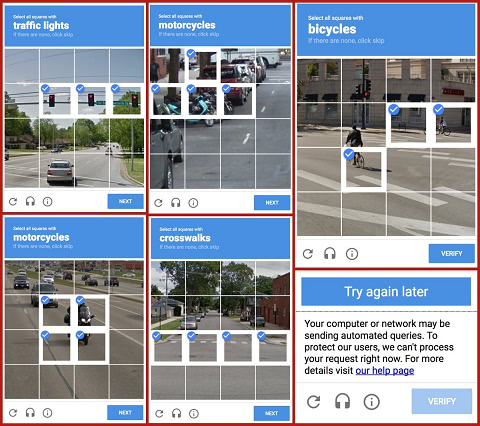 |
| En 2020, Cloudflare est passé du [reCAPTCHA de Google](https://fr.wikipedia.org/wiki/ReCAPTCHA) au [hCaptcha](https://www.hcaptcha.com/), car Google a [l'intention de faire payer](https://professionalhackers.in/cloudflare-dumps-recaptcha-as-google-intends-to-charge-for-its-use/) son utilisation. Cloudflare vous a dit qu'il se souciait de votre vie privée (« [cela aide à résoudre un problème de confidentialité](https://blog.cloudflare.com/moving-from-recaptcha-to-hcaptcha/) ») mais c'est manifestement un mensonge. Il ne s'agit que d'argent. « [hCaptcha](https://www.hcaptcha.com/) permet aux sites web de gagner de l'argent en répondant à cette demande tout en bloquant les bots et autres formes d'abus » |  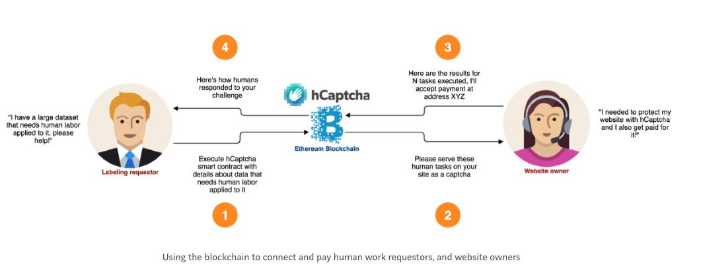 |
| Du point de vue de l'utilisateur, cela ne change pas grand-chose. On vous oblige à le résoudre. | 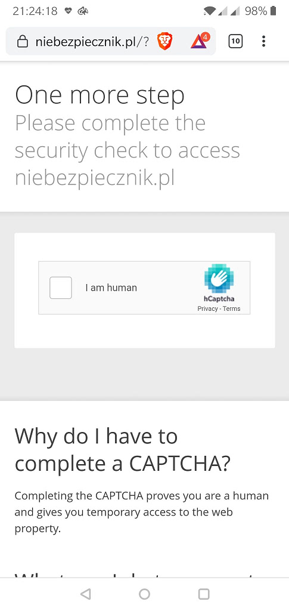 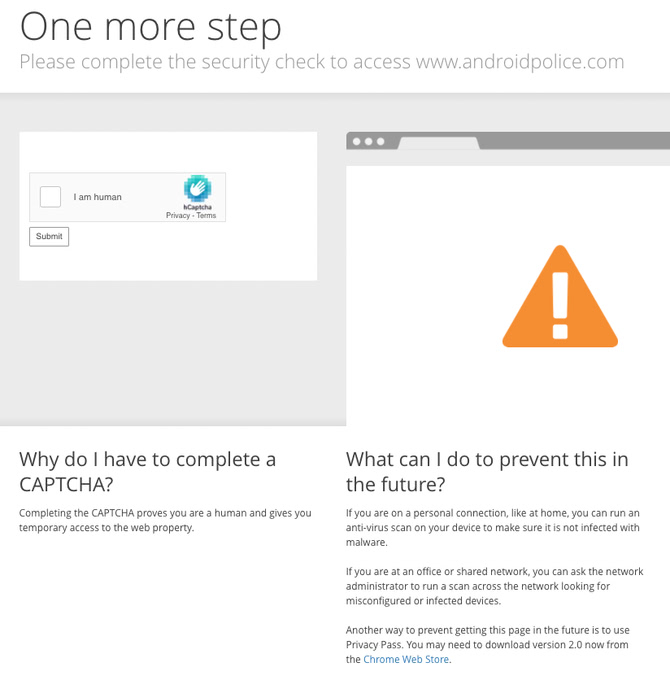 |
| De nombreux humains et logiciels sont bloqués par Cloudflare [chaque jour](../PEOPLE.md). |  |
| Cloudflare [agace de nombreuses personnes](../PEOPLE.md) dans le monde entier. Jetez un œil à la [liste](../PEOPLE.md) et demandez-vous si l'adoption de Cloudflare sur votre site est bénéfique pour l'expérience utilisateur. |  |
| À quoi sert l'internet si vous ne pouvez pas faire ce que vous voulez ? La plupart des personnes qui visitent votre site Web se contenteront de chercher d'autres pages si elles ne [peuvent pas charger](https://www.hostingmanual.net/3-seconds-how-website-speed-impacts-visitors-sales/) une page Web. Vous ne bloquez peut-être aucun visiteur, mais le pare-feu par défaut de Cloudflare est suffisamment strict pour bloquer de nombreuses personnes. | 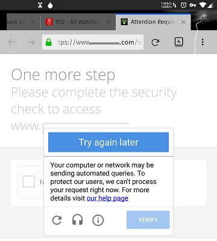 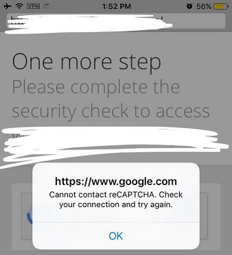 |
| Il n'y a aucun moyen de résoudre le captcha sans activer JavaScript et les cookies. Cloudflare [les utilise](../PEOPLE.md) pour créer une signature de navigateur afin de [vous](../PEOPLE.md) [identifier](https://cryptome.org/2016/07/cloudflare-de-anons-tor.htm). Cloudflare a besoin de connaître votre identité pour décider si vous pouvez continuer à naviguer sur le site. |  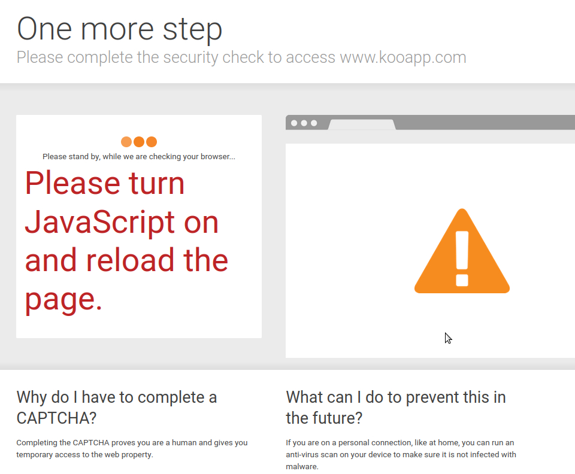 |
| [Les utilisateurs de Tor](https://www.torproject.org/) et de [VPN](https://airvpn.org/topic/23090-cloudflare-often-bans-my-ip-address/) sont également [victimes](https://blog.torproject.org/trouble-cloudflare) de Cloudflare. Ces deux solutions sont utilisées par de nombreuses personnes qui ne peuvent pas s'offrir un Internet non censuré en raison de la politique de leur pays/entreprise/réseau ou qui souhaitent ajouter une couche supplémentaire pour protéger leur vie privée. Cloudflare s'attaque sans vergogne à ces personnes, les forçant à désactiver leur solution proxy. |  |
| Si vous n'avez pas essayé Tor jusqu'à ce moment, nous vous encourageons à [télécharger le navigateur Tor](https://www.torproject.org/) et à visiter vos sites web préférés. (conseil : _Ne vous connectez pas au site de votre banque ou à la page web du gouvernement, ou ils vont signaler votre compte. [Utilisez un VPN](https://www.vpngate.net/en/) pour ces sites web_). |  |
| Vous pourriez vouloir dire, « _Tor est illégal ! Les utilisateurs de Tor sont des criminels ! Tor est mauvais !_ ». Non. Vous pourriez apprendre l'existence de Tor à la télévision, en disant que Tor peut être utilisé pour naviguer sur le [darknet](https://fr.wikipedia.org/wiki/Darknet) et échanger des armes, des drogues ou de la [pornographie enfantine](https://fr.wikipedia.org/wiki/P%C3%A9dopornographie). Bien que l'affirmation ci-dessus soit vraie, il y a beaucoup de sites web où vous pouvez acheter de tels objets, ces sites sont souvent présents sur Clearnet aussi. |  |
| Tor _a été_ développé par [l'armée américaine](https://www.nrl.navy.mil/itd/chacs/dingledine-tor-second-generation-onion-router), mais Tor actuel est développé par le [projet Tor](https://www.torproject.org/). Il y a beaucoup de personnes et d'organisations [qui utilisent Tor](https://blog.torproject.org/tor-misused-criminals), y compris vos futurs amis. Donc, si vous utilisez Cloudflare sur votre site web, vous bloquez de vrais humains. Vous perdrez une amitié potentielle et une affaire commerciale. |  |
| Et leur service DNS, [1.1.1.1](https://1.1.1.1/), empêche également les utilisateurs de visiter le site Web en renvoyant de [fausses](https://trac.torproject.org/projects/tor/ticket/32915) adresses IP [appartenant à Cloudflare](https://www.reddit.com/r/CloudFlare/comments/hiqm4u/no_cloudflare_website_is_loading/), des adresses IP locales telles que « 127.0.0.x », ou en ne renvoyant rien. |   |
| Les DNS de Cloudflare [cassent](https://twitter.com/bowranger/status/1213031783576428550) également [les logiciels](https://twitter.com/No_Style/status/1201525422795710466) [en ligne](https://twitter.com/jb510/status/1212521533907668992), qu'il s'agisse d'[applications](https://www.reddit.com/r/CloudFlare/comments/gmfm4i/us_bank_website_is_not_in_cloudflare_dns/) [pour](https://twitter.com/No_Style/status/1201525422795710466) [smartphones](https://twitter.com/gregortorrence/status/1183102089439805441) ou de [jeux sur ordinateur, à cause de leur fausse réponse DNS](../PEOPLE.md). Cloudflare DNS [ne peut pas interroger](../PEOPLE.md) certains sites Web de banques. |  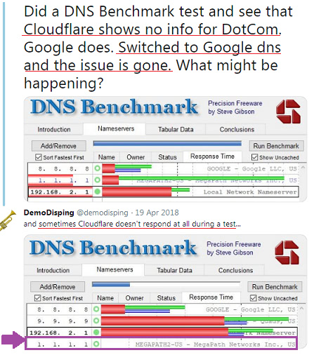 |
| Et là, vous pourriez penser, « _Je n'utilise ni Tor ni VPN, pourquoi de vrais-je m'en soucier?_ » « _Je fais confiance au marketing Cloudflare, pourquoi devrais-je m'en soucier_ » « _Mon site Web est HTTPS pourquoi devrais-je m'en soucier_ » |  |
| Si vous visitez un site Web qui utilise Cloudflare, vous partagez vos informations non seulement avec le propriétaire du site, mais aussi avec Cloudflare. C'est ainsi que fonctionne le [proxy inverse](https://fr.wikipedia.org/wiki/Proxy_inverse). |  |
| Il est impossible de l'[analyser](https://blog.cloudflare.com/the-csam-scanning-tool/) sans [décrypter le trafic TLS](https://github.com/nym-zone/block_cloudflare_mitm_fx/issues/15#issuecomment-354773389=). |  |
| Cloudflare connaît toutes vos données telles que le mot de passe brut. |  |
| [Cloudbeed](https://fr.wikipedia.org/wiki/Cloudbleed) peut arriver n'importe quand. |  |
| Le HTTPS de Cloudflare n'est jamais de bout en bout. |  |
| Voulez-vous vraiment partager vos données avec Cloudflare, et aussi avec une agence à 3 lettres ? |  |
| Le profil en ligne de l'internaute est un « produit » que le gouvernement et les grandes entreprises technologiques veulent acheter. |  |
| Le [département américain de la Sécurité intérieure](https://www.dhs.gov/) a déclaré:   « Avez-vous la moindre idée de la valeur des données que vous avez ? Y a-t-il un moyen pour que vous nous vendiez ces données ? » | 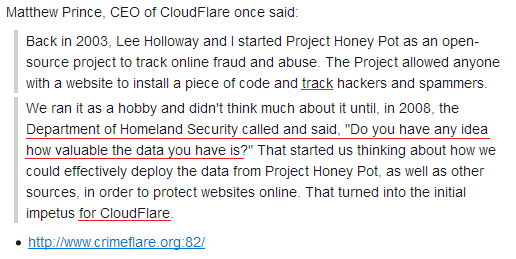 |
| Cloudflare propose également un service VPN _GRATUIT_ appelé « [Cloudflare Warp](https://blog.cloudflare.com/1111-warp-better-vpn/) ». Si vous l'utilisez, toutes les connexions de votre smartphone ([ou de votre ordinateur](https://techniapps.com/2019/09/26/download-cloudflare-warp-vpn-for-pc-windows-10-mac/)) sont envoyées aux serveurs de Cloudflare. Cloudflare peut savoir quel site web vous avez lu, quel commentaire vous avez posté, à qui vous avez parlé, etc. Vous donnez volontairement [toutes vos informations](https://github.com/privacytoolsIO/privacytools.io/issues/374#issuecomment-478686469=) à Cloudflare. Si vous pensez "Vous plaisantez ? Cloudflare est sûr », alors vous devez apprendre comment [fonctionne un VPN](https://en.wikipedia.org/wiki/VPN). |  |
| Cloudflare a déclaré que son service VPN rendait votre Internet [rapide](https://www.wired.com/story/cloudflare-says-new-vpn-service-wont-slow-you-down/). Mais le VPN rend votre connexion internet plus _lente_ que [votre](https://twitter.com/ExYakuza/status/1182317536089526273) [connexion](https://techcrunch.com/2019/04/01/cloudflares-warp-is-a-vpn-that-might-actually-make-your-mobile-connection-better/) [existante](https://twitter.com/waddling/status/1177615384616325120). |  |
| Vous êtes peut-être déjà au courant du scandale [PRISM](https://fr.wikipedia.org/wiki/PRISM_(programme_de_surveillance)). Il est vrai qu'[AT&T](https://fr.wikipedia.org/wiki/AT%26T) laisse la [NSA](https://fr.wikipedia.org/wiki/National_Security_Agency) [copier toutes les données internet](https://www.cnet.com/news/at-t-lets-nsa-hide-and-surveil-in-plain-sight-the-intercept-reports/) pour la surveillance. |  |
| Disons que vous travaillez à la NSA et que vous voulez _connaître le profil Internet de chaque citoyen_. Vous savez que la plupart d'entre eux [font aveuglément confiance à Cloudflare](https://twitter.com/search?q=Cloudflare&f=live) et l'utilisent - une seule passerelle centralisée - pour proxyer leur connexion au serveur de l'entreprise ([SSH](https://blog.cloudflare.com/public-keys-are-not-enough-for-ssh-security/)/[RDP](https://blog.cloudflare.com/cloudflare-access-now-supports-rdp/)), leurs [e-mails](https://developers.cloudflare.com/email-routing/), leur site Web personnel, leur site Web de chat, leur site Web de forum, leur site Web de banque, leur site Web d'assurance, leur moteur de recherche, leur site Web secret réservé aux membres, leur site Web d'enchères, leur [site Web d'achats](https://www.cloudflare.com/case-studies/shopify-powering-the-biggest-shopping-weekend-of-the-year/), leur site Web de vidéos, leur [site Web de jeux](../image/README.md), leur site Web NSFW et leur site Web illégal. Vous savez également qu'ils utilisent le service DNS de Cloudflare (« _1.1.1.1_ ») et le service VPN (« _Cloudflare Warp_ ») pour « _Secure ! Plus rapide ! Meilleure !_ ». La combinaison de ces données avec l'adresse IP de l'utilisateur, l'[empreinte digitale](https://github.com/VeNoMouS/cloudscraper/issues/209#issuecomment-624853689=) du navigateur, les cookies et RAY-ID sera utile pour établir le profil en ligne de la cible. |   |
| Vous voulez leurs données. [Que ferez-vous](https://www.reddit.com/r/privacy/comments/1gb0pa/how_prism_actually_works_1520_att_fiber_optic/) ? |  |
|  **Cloudflare est un pot de miel.** |  |
|  **Du miel gratuit pour tout le monde. Avec _quelques_ conditions.** |  |
|  **N'utilisez pas Cloudflare.** |  |
|  **Décentraliser l'internet.** |  |

---

##    Veuillez continuer à la page suivante:  "[Éthique de Cloudflare](fr.ethics.md)"

---

_clique moi_

## Données et plus d'informations

Ce référentiel est une liste de sites Web derrière « The Great Cloudwall », bloquant les utilisateurs de Tor et d'autres CDN.

**Les données**
* [Cloudflare Inc.](../cloudflare_inc/)
* [Utilisateurs de Cloudflare](../cloudflare_users/)
* [Domaines Cloudflare](../cloudflare_users/domains/)
* [Utilisateurs CDN non Cloudflare](../not_cloudflare/)
* [Utilisateurs Anti-Tor](../anti-tor_users/)

**Plus d'information**
* **[☞ deCloudflare Subfiles ☜](../subfiles/README.md)**
* [The Great Cloudwall](../pdf/2019-Jeff_Cliff_Book1.txt), [Mr. Jeff Cliff](https://shitposter.club/users/jeffcliff)
  * Télécharger: [PDF](../pdf/2019-The_Great_Cloudwall.pdf), [ePUB](../pdf/2019-Jeff_Cliff_The_Great_Cloudwall.epub)
  * Le livre électronique original (ePUB) a été supprimé par BookRix GmbH en raison d'une violation du droit d'auteur du matériel CC0
* [Padlock icon indicates a secure SSL connection established w MITM-ed](https://bugs.debian.org/cgi-bin/bugreport.cgi?bug=831835), Anonymous
* [Block Global Active Adversary Cloudflare](https://trac.torproject.org/projects/tor/ticket/24351), nym-zone
  * Le billet a été vandalisé tant de fois.
  * [Supprimé par le projet Tor.](https://lists.torproject.org/pipermail/anti-censorship-team/2020-May/000098.html) [Voir le billet 34175.](https://trac.torproject.org/projects/tor/ticket/34175)
  * [Dernier ticket d'archive 24351.](https://web.archive.org/web/20200301013104/https://trac.torproject.org/projects/tor/ticket/24351)
* [Cloudflare Watch](http://www.crimeflare.org:82/)
  * Archived - [CloudFlare Watch](../subfiles/classics/README.md)
* [Criticism and controversies](https://en.wikipedia.org/wiki/Cloudflare#Criticism_and_controversies), Wikipédia
* [CloudFlare rap sheet](../subfiles/rapsheet.cloudflare.md)

---

_clique moi_

## Que pouvez-vous faire?

* [Lisez notre liste d'actions recommandées et partagez-la avec vos amis.](fr.action.md)

* [Lisez la voix des autres utilisateurs et écrivez vos pensées.](../PEOPLE.md)

* Rechercher quelque chose : [Ombrelo](../subfiles/service/ombrelo.md)

* Mettre à jour la liste des domaines : [Liste des instructions](../INSTRUCTION.md).

* [Ajoutez Cloudflare ou un événement lié au projet à l'historique.](../HISTORY.md)

* [Essayez et écrivez un nouvel outil/script.](../tool/)
   * [CfDomains](../tool/cfdomains/README.md)

* [Voici quelques PDF/ePUB à lire.](../pdf/)

* [Help translate deCloudflare](translateData/)

---

### À propos des faux comptes

Nous connaissons l'existence de faux comptes usurpant l'identité de nos canaux officiels, que ce soit Twitter, Facebook, Mastodon, Github, Gitea, Patreon, OpenCollective, Villages, etc.
**Nous ne demandons jamais votre email.
Nous ne demandons jamais votre nom.
Nous ne demandons jamais votre identité.
Nous ne demandons jamais votre localisation.
Nous ne demandons jamais votre avis.
Nous ne vous demandons jamais de suivre sur les réseaux sociaux.
Nous ne demandons jamais votre réseau social.**

# NE FAITES PAS CONFIANCE AUX FAUX COMPTES.

---

| 🖼 | 🖼 |
| --- | --- |
|  |  |
|  |  |
| 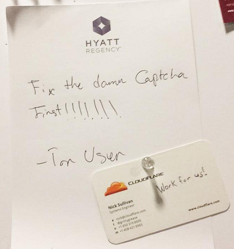 |  |

---

  [🖼 Poster](../image/poster)
