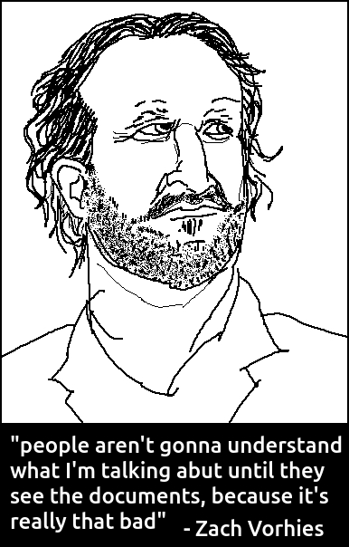
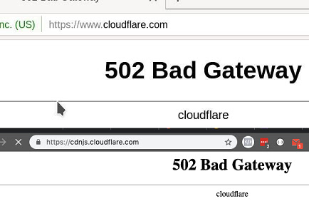
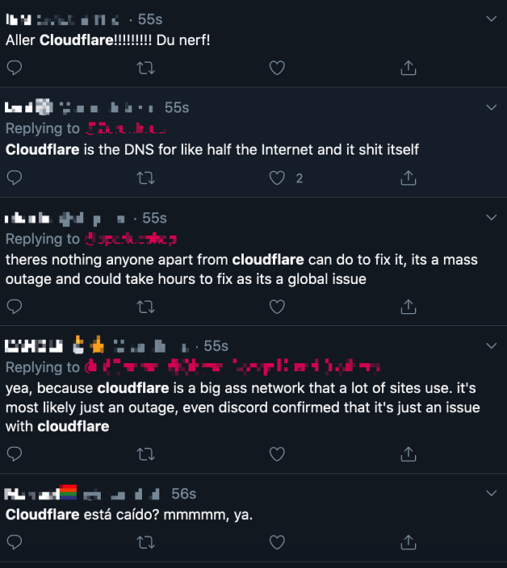
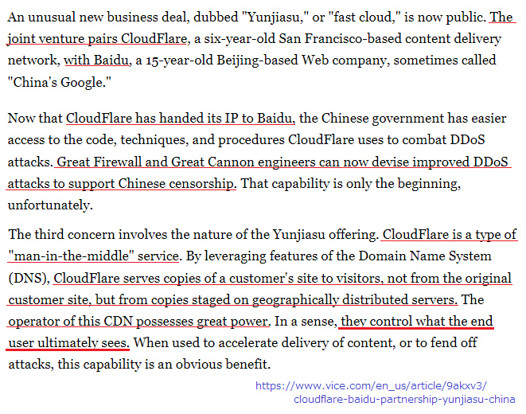
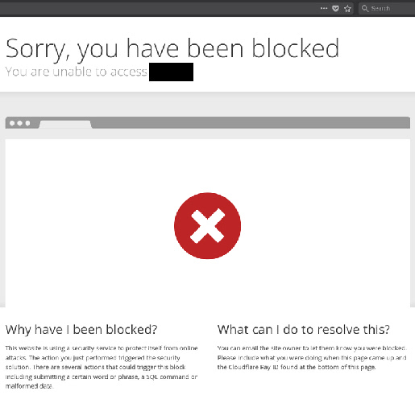
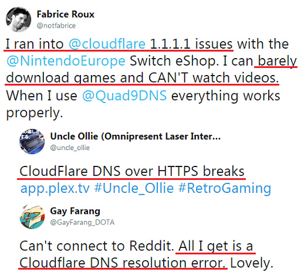
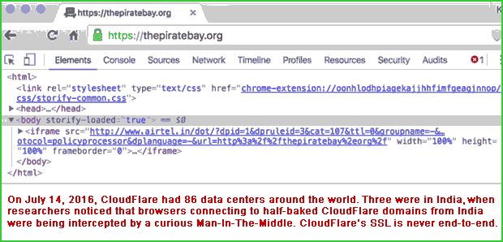
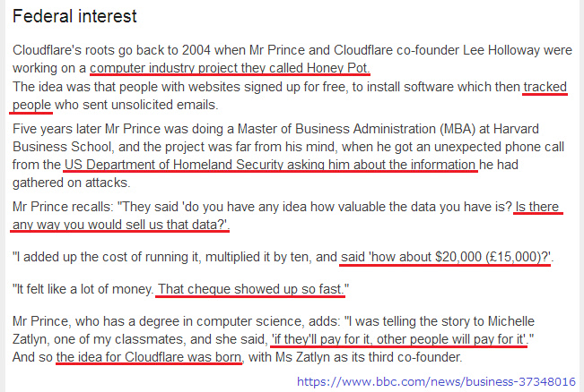

# An Cloudwall Mòr

---

## Cuir stad air Cloudflare

|  🖹  |  🖼 |
| --- | --- |
|  Is e “The Great Cloudwall†Cloudflare Inc., companaidh na SA.Tha e a ’toirt seachad seirbheisean CDN (lìonra lìbhrigidh susbaint), lasachadh DDoS, tèarainteachd eadar-lìn, agus seirbheisean DNS sgaoilte (frithealaiche ainm fearainn).  |   |
|  Is e Cloudflare an neach-ionaid MITM as motha san t-saoghal (neach-ionaid cùil).Tha barrachd air 80% de roinn margaidh CDN aig Cloudflare agus tha an àireamh de luchd-cleachdaidh cloudflare a ’fàs gach latha.Tha iad air an lìonra aca a leudachadh gu còrr air 100 dùthaich.Bidh Cloudflare a ’frithealadh barrachd trafaic lìn na Twitter, Amazon, Apple, Instagram, Bing & Wikipedia còmhla.Tha Cloudflare a ’tabhann plana an-asgaidh agus tha mòran dhaoine ga chleachdadh an àite a bhith a’ rèiteachadh na frithealaichean aca gu ceart.Bha iad a ’malairt prìobhaideachd thar goireasachd.  |    |
|  Bidh Cloudflare na shuidhe eadar thu fhèin agus neach-lìn tùs, ag obair mar àidseant faire crìche.Chan urrainn dhut ceangal a dhèanamh ris a ’cheann-uidhe a thagh thu.Tha thu a ’dèanamh ceangal ri Cloudflare agus tha d’ fhiosrachadh uile ga dhì-chrioptachadh agus ga thoirt seachad air a ’chuileag. Cloudflaro havas tutmondan vidon en la trafikon de la interreto kaj ili observas la trafikon fluanta al kaj de ili kontinue. |    |
|  Leig an neach-rianachd làrach-lìn tùs leis an neach-ionaid - Cloudflare - co-dhùnadh cò as urrainn faighinn chun an “togalach lìn†aca agus “sgìre cuibhrichte†a mhìneachadh.  |    |
|  Thoir sùil air an ìomhaigh cheart.Bidh thu a ’smaoineachadh nach cuir Cloudflare bacadh air ach droch ghillean.Bidh tu a ’smaoineachadh gu bheil Cloudflare an-còmhnaidh air-loidhne (na tèid sìos a-riamh).Bidh thu a ’smaoineachadh gum faod botaichean legit agus crawlers clàr-amais a dhèanamh air an làrach-lìn agad.  |    |
|  Ach chan eil an fheadhainn sin fìor idir.Tha Cloudflare a ’cur casg air daoine neo-chiontach gun adhbhar.Faodaidh Cloudflare a dhol sìos.Bidh Cloudflare a ’blocadh bots legit.  |    |
|  Dìreach mar seirbheis aoigheachd sam bith, chan eil Cloudflare foirfe.Chì thu an scrion seo eadhon ged a tha an frithealaiche tùs ag obair gu math.  |   |
|  A bheil thu dha-rìribh a ’smaoineachadh gu bheil 100% uptime aig Cloudflare?Chan eil dad a dh ’fhios agad cia mheud uair a thèid Cloudflare sìos.Ma thèid Cloudflare sìos chan urrainn don neach-ceannach agad faighinn chun làrach-lìn agad. |   |
|  Is e seo an t-ainm a th ’air a bhith a’ toirt iomradh air Balla-teine ​​Mòr Shìona a bhios a ’dèanamh obair choimeasach de bhith a’ sìoladh a-mach mòran dhaoine bho bhith a ’faicinn susbaint lìn (ie a h-uile duine air tìr-mòr Shìona agus daoine a-muigh).Aig an aon àm an fheadhainn nach tug buaidh air lìon eadar-dhealaichte fhaicinn, lìon saor bho chaisgireachd leithid ìomhaigh de “fear an tanca†agus eachdraidh “gearanan Ceàrnag Tiananmen”. |   |
|  Tha cumhachd mòr aig Cloudflare.Ann an seagh, bidh smachd aca air na tha an neach-cleachdaidh deireannach a ’faicinn aig a’ cheann thall.Tha casg ort bho bhith a ’brobhsadh an làrach-lìn air sgàth Cloudflare. |  |
|  Faodar Cloudflare a chleachdadh airson caisgireachd. |  |
|  Chan urrainn dhut coimhead air làrach-lìn cloudflared ma tha thu a ’cleachdadh mion-bhrobhsair a tha Cloudflare den bheachd gur e bot a th’ ann (leis nach eil mòran dhaoine ga chleachdadh). |  |
|  Chan urrainn dhut an “sgrùdadh brabhsair†ionnsaigheach seo a thoirt seachad gun a bhith a ’comasachadh Javascript.Is e sgudal a tha seo de chòig (no barrachd) diogan de do bheatha luachmhor. |  |
|  Bidh Cloudflare cuideachd gu fèin-ghluasadach a ’cur casg air innealan-fuadain / crawlers legit leithid Google, Yandex, Yacy, agus teachdaichean API.Tha Cloudflare gu gnìomhach a ’cumail sùil air coimhearsnachd“ bypass cloudflare ”le dùil botaichean rannsachaidh legit a bhriseadh. |   |
|  Tha Cloudflare mar an ceudna a ’cur casg air mòran dhaoine aig a bheil droch cheangal eadar-lìn bho bhith a’ faighinn chun làraich-lìn air a chùlaibh (mar eisimpleir, dh ’fhaodadh iad a bhith air cùl 7+ sreathan de NAT no a bhith a’ roinneadh an aon IP, mar eisimpleir Wifi poblach) mura dèan iad fuasgladh air ioma-ìomhaigh CAPTCHAs.Ann an cuid de chùisean, bheir seo 10 gu 30 mionaid airson Google a shàsachadh. |  |
|  Anns a ’bhliadhna 2020 ghluais Cloudflare bho Google’s Recaptcha gu hCaptcha oir tha Google an dùil cosgais a chur airson a chleachdadh.Thuirt Cloudflare riut gu bheil cùram aca air do phrìobhaideachd (“bidh e a’ cuideachadh le bhith a ’dèiligeadh ri dragh prìobhaideachd”) ach tha e soilleir gur e breug a tha seo.Tha e mu dheidhinn airgead.“Tha hCaptcha a’ leigeil le làraich-lìn airgead a dhèanamh a ’frithealadh an iarrtais seo fhad’ s a tha iad a ’cuir casg air botaichean agus seòrsachan eile de dhroch dhìol.†|   |
|  Bho shealladh an neach-cleachdaidh, cha bhith seo ag atharrachadh mòran. Thathas a ’toirt ort fuasgladh fhaighinn air. |   |
|  Tha Cloudflare a ’cur casg air mòran dhaoine agus bathar-bog gach latha. |  |
|  Tha Cloudflare a ’cur dragh air mòran dhaoine air feadh an t-saoghail.Thoir sùil air an liosta agus smaoinich a bheil gabhail ri Cloudflare air an làrach agad math airson eòlas luchd-cleachdaidh. |   |
|  Dè adhbhar an eadar-lìn mura h-urrainn dhut na tha thu ag iarraidh a dhèanamh?Bidh a ’mhòr-chuid a bhios a’ tadhal air an làrach-lìn agad dìreach a ’coimhead airson duilleagan eile mura h-urrainn dhaibh duilleag-lìn a luchdachadh.Is dòcha nach eil thu gu gnìomhach a ’cur bacadh air luchd-tadhail, ach tha am balla-teine ​​àbhaisteach Cloudflare teann gu leòr airson mòran dhaoine a bhacadh. |   |
|  Chan eil dòigh ann air an captcha fhuasgladh gun a bhith a ’comasachadh Javascript agus briosgaidean.Bidh Cloudflare gan cleachdadh gus ainm-sgrìobhte brabhsair a dhèanamh gus d ’aithneachadh.Feumaidh fios a bhith aig Cloudflare d ’aithne gus co-dhùnadh a bheil thu airidh air cumail a’ brobhsadh air an làrach. |   |
|  Tha luchd-cleachdaidh Tor agus luchd-cleachdaidh VPN cuideachd air fulang le Cloudflare.Tha an dà fhuasgladh air an cleachdadh le mòran dhaoine nach urrainn pàigheadh ​​air an eadar-lìn uncensored air sgàth poileasaidh na dùthcha / corporra / lìonra aca no a tha airson còmhdach a bharrachd a chuir ris gus an dìomhaireachd aca a dhìon.Tha Cloudflare gu nàire a ’toirt ionnsaigh air na daoine sin, gan toirt orra am fuasgladh neach-ionaid aca a chuir dheth. |  |
|  Mura dh'fheuch thu Tor gus an ìre seo, tha sinn gad bhrosnachadh gus Tor Browser a luchdachadh sìos agus tadhal air na làraich-lìn as fheàrr leat.Tha sinn a ’moladh dhut gun a bhith a’ logadh a-steach gu làrach-lìn a ’bhanca agad no duilleag-lìn an riaghaltais no cuiridh iad bratach air do chunntas. Cleachd VPN airson na làraich-lìn sin. |  |
|  Is dòcha gum bi thu airson a ràdh “Tha Tor mì-laghail! Tha luchd-cleachdaidh Tor eucorach! Tha Tor dona! ". Chan eil.Is dòcha gu bheil thu air ionnsachadh mu Tor bho telebhisean, ag ràdh gum faodar Tor a chleachdadh gus brobhsadh air darknet agus malairt ghunnaichean, drogaichean no porn chid.Ged a tha an aithris gu h-àrd fìor gu bheil mòran làrach-lìn margaidh ann far am faod thu rudan mar sin a cheannach, bidh na làraich sin gu tric a ’nochdadh air clearnet cuideachd.  |  |
|  Chaidh Tor a leasachadh le Arm na SA, ach tha Tor gnàthach air a leasachadh le pròiseact Tor.Tha mòran dhaoine agus bhuidhnean a ’cleachdadh Tor a’ toirt a-steach do charaidean san àm ri teachd.Mar sin, ma tha thu a ’cleachdadh Cloudflare air an làrach-lìn agad tha thu a’ cur bacadh air daoine fìor.Caillidh tu càirdeas agus cùmhnant gnìomhachais a dh’fhaodadh a bhith ann. |  |
|  Agus tha an t-seirbheis DNS aca, 1.1.1.1, cuideachd a ’sìoladh às luchd-cleachdaidh bho bhith a’ tadhal air an làrach-lìn le bhith a ’tilleadh seòladh IP meallta a tha le Cloudflare, IP localhost leithid“ 127.0.0.x ”, no dìreach a’ tilleadh dad. |   |
|  Bidh Cloudflare DNS cuideachd a ’briseadh bathar-bog air-loidhne bho app fòn cliste gu geama coimpiutair air sgàth an fhreagairt DNS meallta aca.Chan urrainn dha Cloudflare DNS cuid de làraich-lìn banca a cheasnachadh. |   |
|  Agus an seo is dòcha gu bheil thu a ’smaoineachadh, Chan eil mi a ’cleachdadh Tor no VPN, carson a bu chòir dhomh cùram a ghabhail? Tha earbsa agam air margaidheachd Cloudflare, carson a bu chòir dhomh cùram a ghabhail Is e an làrach-lìn agam https carson a bu chòir dhomh cùram a ghabhail |  |
|  Ma thadhlas tu air làrach-lìn a bhios a ’cleachdadh Cloudflare, bidh thu a’ roinneadh an fhiosrachaidh agad chan ann a-mhàin gu sealbhadair làrach-lìn ach cuideachd Cloudflare.Seo mar a bhios an neach-ionaid cùil ag obair. |  |
|  Tha e do-dhèanta sgrùdadh a dhèanamh gun a bhith a ’dì-chrioptachadh trafaic TLS. |  |
|  Tha fios aig Cloudflare air an dàta agad gu lèir leithid facal-faire amh. |  |
|  Faodaidh Cloudbeed tachairt uair sam bith. |  |
|  Chan eil Cloudflare’s https a-riamh deireadh-gu-deireadh. |  |
|  A bheil thu dha-rìribh ag iarraidh an dàta agad a cho-roinn le Cloudflare, agus cuideachd buidheann 3-litir? |  |
|  Is e “toradh†ìomhaigh air-loidhne cleachdaiche eadar-lìn a tha an riaghaltas agus companaidhean mòra teicneòlais ag iarraidh a cheannach. |  |
|  Thuirt Roinn Tèarainteachd Dùthcha na SA:  A bheil beachd agad dè cho luachmhor ‘s a tha an dàta a tha agad? A bheil dòigh sam bith ann gun reiceadh tu an dàta sin dhuinn?  |  |
|  Bidh Cloudflare cuideachd a ’tabhann seirbheis VPN AN-ASGAIDH ris an canar“ Cloudflare Warp ”.Ma chleachdas tu e, thèid a h-uile ceangal fòn cliste agad (no an coimpiutair agad) a chuir gu frithealaichean Cloudflare.Faodaidh fios a bhith aig Cloudflare dè an làrach-lìn a leugh thu, dè am beachd a chuir thu a-steach, cò ris an do bhruidhinn thu, msaa.Tha thu saor-thoileach a ’toirt seachad d’ fhiosrachadh gu Cloudflare.Ma tha thu a ’smaoineachadh“ A bheil thu a ’magadh? Tha Cloudflare tèarainte. †an uairsin feumaidh tu ionnsachadh mar a tha VPN ag obair. |  |
|  Thuirt Cloudflare gum bi an t-seirbheis VPN aca a ’dèanamh an eadar-lìn agad gu sgiobalta.Ach nì VPN an ceangal eadar-lìn agad nas slaodaiche na an ceangal a th ’agad mu thràth. |  |
|  Is dòcha gu bheil fios agad mu sgainneal PRISM mu thràth.Tha e fìor gu bheil AT&T a ’leigeil le NSA lethbhreac a dhèanamh den dàta eadar-lìn gu lèir airson faireachas. |  |
|  Feuch an can thu gu bheil thu ag obair aig an NSA, agus gu bheil thu ag iarraidh ìomhaigh eadar-lìn gach saoranach.Tha fios agad gu bheil earbsa dall aig a ’mhòr-chuid dhiubh ann an Cloudflare agus ga chleachdadh - dìreach aon gheata meadhanaichte - gus an ceangal frithealaiche companaidh aca (SSH / RDP), retmesaÄo, làrach-lìn pearsanta, làrach-lìn cabadaich, làrach-lìn fòram, làrach-lìn banca, làrach-lìn àrachais, einnsean sgrùdaidh, ball dìomhair -only làrach-lìn, làrach-lìn rop, ceannach, làrach-lìn bhidio, làrach-lìn NSFW, agus làrach-lìn mì-laghail.Tha fios agad cuideachd gu bheil iad a ’cleachdadh seirbheis Cloudflare’s DNS (“ 1.1.1.1 ”) agus seirbheis VPN (“ Cloudflare Warp ”) airson“ Secure! Nas luaithe! Nas fheàrr! †eòlas eadar-lìn.Bidh e feumail an ceangal ri seòladh IP an neach-cleachdaidh, lorgan-meòir a ’bhrobhsair, briosgaidean agus RAY-ID gus ìomhaigh air-loidhne an targaid a thogail. |   |
|  Tha thu ag iarraidh an dàta aca. Dè nì thu? |  |
|  **Tha Cloudflare na lus meala.** |  |
|  **Mil an-asgaidh don h-uile duine. Cuid de shreathan ceangailte.** |  |
|  **Na cleachd Cloudflare.** |  |
|  **Dèan dì-mheadhanachadh air an eadar-lìn.** |  |

---

##    Feuch an lean thu air adhart chun ath dhuilleag:  "[Beusachd Cloudflare](gd.ethics.md)"

---

_cliog orm_

## Dàta agus tuilleadh fiosrachaidh

Is e an ath-reic seo liosta de làraich-lìn a tha air cùl “The Great Cloudwall”, a ’cur bacadh air luchd-cleachdaidh Tor agus CDNan eile.

**Dàta**
* [Cloudflare Inc.](../cloudflare_inc/)
* [Luchd-cleachdaidh Cloudflare](../cloudflare_users/)
* [Fearann ​​Cloudflare](../cloudflare_users/domains/)
* [Luchd-cleachdaidh CDN neo-Cloudflare](../not_cloudflare/)
* [Luchd-cleachdaidh an-aghaidh Tor](../anti-tor_users/)

**Barrachd fiosrachaidh**
* **[☞ deCloudflare Subfiles ☜](../subfiles/README.md)**
* [The Great Cloudwall](../pdf/2019-Jeff_Cliff_Book1.txt), [Mr. Jeff Cliff](https://shitposter.club/users/jeffcliff)
  * Luchdaich sìos: [PDF](../pdf/2019-The_Great_Cloudwall.pdf), [ePUB](../pdf/2019-Jeff_Cliff_The_Great_Cloudwall.epub)
  * Chaidh an eBook tùsail (ePUB) a dhubhadh às le BookRix GmbH mar thoradh air briseadh dlighe-sgrìobhaidh air stuth CC0
* [Padlock icon indicates a secure SSL connection established w MITM-ed](https://bugs.debian.org/cgi-bin/bugreport.cgi?bug=831835), Anonymous
* [Block Global Active Adversary Cloudflare](https://trac.torproject.org/projects/tor/ticket/24351), nym-zone
  * Chaidh an tiogaid a mhilleadh cho tric.
  * [Air a dhubhadh às le Pròiseact Tor.](https://lists.torproject.org/pipermail/anti-censorship-team/2020-May/000098.html) [Faic tiogaid 34175.](https://trac.torproject.org/projects/tor/ticket/34175)
  * [Tiogaid tasglann mu dheireadh 24351.](https://web.archive.org/web/20200301013104/https://trac.torproject.org/projects/tor/ticket/24351)
* [Cloudflare Watch](http://www.crimeflare.org:82/)
  * Archived - [CloudFlare Watch](../subfiles/classics/README.md)
* [Criticism and controversies](https://en.wikipedia.org/wiki/Cloudflare#Criticism_and_controversies), Wikipedia
* [CloudFlare rap sheet](../subfiles/rapsheet.cloudflare.md)

---

_cliog orm_

## Dè as urrainn dhut a dhèanamh?

* [Leugh an liosta de na gnìomhan a tha sinn a ’moladh agus roinn e le do charaidean.](gd.action.md)

* [Leugh guth neach-cleachdaidh eile agus sgrìobh do bheachdan.](../PEOPLE.md)

* Rannsaich rudeigin: [Ombrelo](../subfiles/service/ombrelo.md)

* Ùraich an liosta fearainn: [Liostaich stiùireadh](../INSTRUCTION.md).

* [Cuir Cloudflare no tachartas co-cheangailte ris a ’phròiseact ri eachdraidh.](../HISTORY.md)

* [Feuch & sgrìobh Inneal / Sgriobt ùr.](../tool/)
   * [CfDomains](../tool/cfdomains/README.md)

* [Seo beagan PDF / ePUB ri leughadh.](../pdf/)

* [Help translate deCloudflare](translateData/)

---

### Mu chunntasan meallta

Tha fios aig We mu dheidhinn cunntasan meallta a bhith a ’dèanamh atharrais air na seanailean oifigeil againn, biodh sin Twitter, Facebook, Mastodon, Github, Gitea, Patreon, OpenCollective, Villages msaa.
**Cha iarr sinn am post-d agad a-riamh.
Cha bhith sinn a-riamh ag iarraidh d ’ainm.
Cha bhi sinn uair sam bith ag iarraidh d ’aithne.
Cha bhith sinn uair sam bith a ’faighneachd d’ àite.
Cha bhith sinn uair sam bith ag iarraidh do thabhartas.
Cha iarr sinn an ath-bhreithneachadh agad a-riamh.
Cha bhith sinn uair sam bith ag iarraidh ort leantainn air na meadhanan sòisealta.
Cha bhith sinn a-riamh ag iarraidh air na meadhanan sòisealta agad.**

# NA URRAINN CUNNARTAN.

---

| 🖼 | 🖼 |
| --- | --- |
|  |  |
|  |  |
|  |  |

---

  [🖼 Poster](../image/poster)
