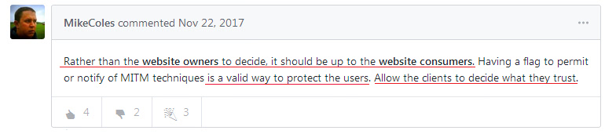
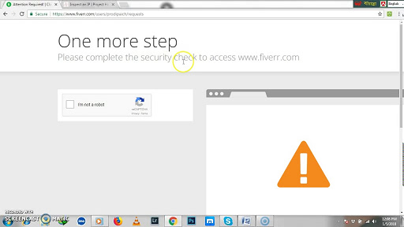
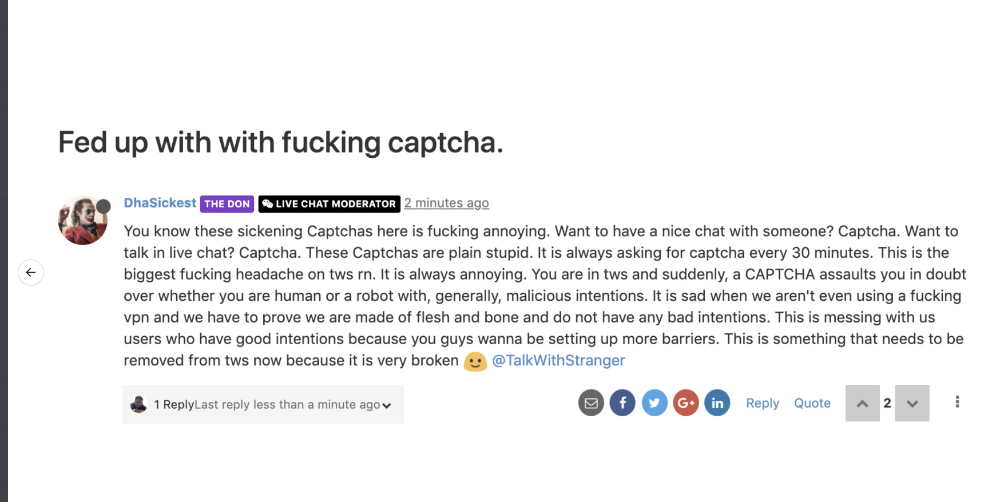
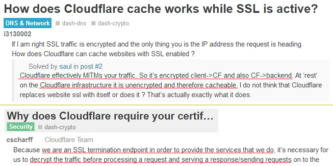

# הענן הגדול

---

## עצור את הענן

|  🖹  |  🖼 |
| --- | --- |
|  "ה- Cloudwall הגדול" הוא Cloudflare Inc., החברה האמריקאית.היא מספקת שירותי CDN (רשת משלוח תוכן), הפחתת DDoS, אבטחת אינטרנט ושירותי DNS (שרת שמות דומיין) מבוזרים.  |   |
|  Cloudflare הוא ה- MITM Proxy הגדול בעולם (פרוקסי הפוך).Cloudflare מחזיקה ביותר Χ- 80% ΧΧ ΧΧ— השוק של CDN ומספר משתמשי ה- Cloudflare גדל מדי יום.הם הרחיבו ΧΧ הרשת שלהם ליותר ממאה מדינות.Cloudflare משרת יותר ΧΧ Χ•ΧΆΧ” באינטרנט מאשר טוויטר, אמזון, אפל, אינסטגרם, בינג וויקיפדיה יחד.Cloudflare מציע תוכנית בחינם ואנשים רבים משתמשים בה במקום להגדיר ΧΧ השרתים שלהם כראוי.הם סחרו בפרטיות בגלל נוחות.  |    |
|  Cloudflare יושב בינך לבין שרת האינטרנט המקורי, מתנהג כמו סוכן סיור גבול.ΧΧ™Χ Χ מצליח להתחבר ליעד שבחרת.ΧΧΧ” מתחבר Χ- Cloudflare וכל המידע Χ©ΧΧ מפוענח ונמסר תוך כדי ΧΧ Χ•ΧΆΧ”. Cloudflaro havas tutmondan vidon en la trafikon de la interreto kaj ili observas la trafikon fluanta al kaj de ili kontinue. |    |
|  מנהל שרת האינטרנט המקורי איפשר לסוכן - Cloudflare - להחליט ΧΧ™ יכול לגשת Χ"רכוש האינטרנט "שלהם ולהגדיר" אזור מוגבל ".  |    |
|  התבונן בתמונה הנכונה.ΧΧΧ תחשבו ש- Cloudflare חוסם רק רעים.ΧΧΧ תחשבו ש- Cloudflare תמיד מקוון (לעולם ΧΧ תרדו).ΧΧΧ תחשבו שבוטים וסורקים חוקיים יכולים להוסיף אינדקס לאתר שלכם.  |    |
|  ΧΆΧ Χ–ΧΧ ΧΧΧ” ΧΧ™Χ Χ נכונים כלל.Cloudflare חוסם אנשים חפים מפשע ΧΧΧ סיבה.הענן יכול לרדת.Cloudflare חוסם בוטים לגיטימיים.  |    |
|  ממש כמו Χ›Χ שירות אירוח, Cloudflare אינו מושלם.תראה מסך זה גם ΧΧ שרת המקור עובד טוב.  |   |
|  האם ΧΧΧ” באמת חושב ש- Cloudflare יש Χ–ΧΧ של 100%?אין ΧΧ מושג כמה פעמים Cloudflare יורד.ΧΧ Cloudflare יורד הלקוח Χ©ΧΧ ΧΧ יכול לגשת לאתר Χ©ΧΧ. |   |
|  זה נקרא Χ›Χ בהתייחסות לחומת האש הגדולה של סין שעושה עבודה דומה לסינון בני אדם רבים מלראות תוכן באינטרנט (כלומר, Χ›Χ•ΧΧ בסין היבשתית ואנשים בחוץ).בעוד שבאותה ΧΆΧ ΧΧΧ” Χ©ΧΧ הושפעו רואים רשת שונה באופן דרטי, רשת נטולת צנזורה כמו דימוי של "איש טנק" והיסטוריה של "מחאות כיכר טיינאנמן". |   |
|  Cloudflare הוא בעל כוח רב.במובן מסוים הם Χ©Χ•ΧΧΧ™Χ במה שמשתמש הקצה רואה בסופו של דבר.ΧΧ Χ•ΧΆΧ” ΧΧΧ לגלוש באתר בגלל Cloudflare. |  |
|  ניתן להשתמש בענן הענן לצנזורה. |  |
|  ΧΧ™Χ Χ יכול להציג ΧΧΧ¨ Cloudflared ΧΧ ΧΧΧ” ΧΧ©ΧΧΧ© בדפדפן מינורי אשר Cloudflare עשוי לחשוב שהוא בוט (מכיוון Χ©ΧΧ רבים משתמשים בו). |  |
|  ΧΧ™Χ Χ יכול לעבור "בדיקת דפדפן" פולשנית זו מבלי להפעיל ΧΧ Javascript.זה בזבוז של חמש שניות (או יותר) מחייך היקרים. |  |
|  Cloudflare גם חוסם אוטומטית רובוטים / סורקים לגיטימיים כמו לקוחות Google, Yandex, Yacy ו- API.Cloudflare עוקב באופן פעיל אחר קהילת "עקיפה של עננים פרטיים" מתוך כוונה לשבור בוטים של מחקר חוקי. |   |
|  Cloudflare באופן דומה מונע מאנשים רבים שיש להם קישוריות אינטרנט לקויה לגשת לאתרי האינטרנט שמאחוריה (לדוגמה, הם עשויים להיות מאחורי 7+ שכבות NAT או ΧΧ©ΧΧ£ אותה IP, למשל Wifi ציבורי) ΧΧΧ ΧΧ Χ›Χ הם פותרים CAPTCHAs תמונה מרובים.בחלק מהמקרים זה ייקח 10 עד 30 דקות כדי לספק ΧΧ גוגל. |  |
|  בשנת 2020 Cloudflare עבר Χ- Recaptcha של גוגל Χ- hCaptcha מכיוון שגוגל מתכוונת לגבות תשלום עבור השימוש בו.Cloudflare ΧΧΧ¨ ΧΧ שאכפת להם מהפרטיות Χ©ΧΧ ("זה עוזר לטפל בדאגה לפרטיות") ΧΧ ברור שזה שקר.הכל קשור לכסף."HCaptcha ΧΧΧ¤Χ©Χ¨ לאתרים להרוויח כסף המשרת ΧΧ הדרישה הזו תוך חסימת בוטים וצורות התעללות ΧΧ—Χ¨Χ•Χ" |   |
|  מבחינת המשתמש זה ΧΧ משתנה הרבה. ΧΧΧ” נאלץ לפתור ΧΧ זה. |   |
|  אנשים ותוכנות רבים נחסמים ΧΆΧ ידי Cloudflare Χ›Χ יום. |  |
|  Cloudflare מרגיז אנשים רבים ברחבי העולם.התבונן ברשימה וחשוב ΧΧ אימוץ Cloudflare באתר Χ©ΧΧ טוב לחוויית המשתמש. |   |
|  מה מטרת האינטרנט ΧΧ ΧΧ™Χ Χ יכול לעשות מה שאתה רוצה?רוב האנשים שפוקדים ΧΧ האתר Χ©ΧΧ יחפשו דפים אחרים ΧΧ הם ΧΧ יכולים לטעון דף אינטרנט.ייתכן שאתה ΧΧ חוסם מבקרים באופן פעיל, ΧΧ חומת האש של ברירת המחדל של Cloudflare מחמירה מספיק כדי לחסום אנשים רבים. |   |
|  אין דרך לפתור ΧΧ הקאפטצ'ה מבלי ΧΧΧ¤Χ©Χ¨ Javascript ועוגיות.Cloudflare ΧΧ©ΧΧΧ© בהם כדי ליצור חתימת דפדפן כדי לזהות ΧΧ•ΧΧ.Cloudflare צריך לדעת ΧΧ זהותך כדי להחליט ΧΧ ΧΧΧ” זכאי להמשיך לגלוש באתר. |   |
|  משתמשי Tor ומשתמשי VPN הם גם קורבן של Cloudflare.שני הפתרונות משמשים אנשים רבים שאינם יכולים להרשות לעצמם אינטרנט ΧΧ מצונזר בגלל מדיניות המדינה / התאגיד / הרשת שלהם או שרוצים להוסיף רובד נוסף לשמירה ΧΆΧ פרטיותם.Cloudflare תוקף ΧΧΧ בושה ΧΧ האנשים האלה, מכריח ΧΧ•ΧΧ לכבות ΧΧ פיתרון ה- Proxy שלהם. |  |
|  ΧΧ ΧΧ ניסית ΧΧ Tor עד לרגע זה, ΧΧ Χ• ממליצים ΧΧ להוריד ΧΧ Tor Browser ולבקר באתרי האינטרנט המועדפים עליך.ΧΧ Χ• ממליצים ΧΧ ΧΧ להיכנס לאתר הבנק Χ©ΧΧ או לדף האינטרנט הממשלתי, אחרת הם יסמנו ΧΧ חשבונך. השתמש ב- VPN עבור ΧΧ•ΧΧ אתרים. |  |
|  אולי תרצו לומר "טור הוא ΧΧ חוקי! משתמשי Tor הם פליליים! טור הוא רע! ". ΧΧ.אולי למדת ΧΆΧ טור מהטלוויזיה, Χ•ΧΧΧ¨ שאתה יכול להשתמש Χ‘ΧΧ•Χ¨ כדי לגלוש ברשת כהה ולסחר בתותחים, סמים או פורנו לרשת.אמנם ההצהרה שלמעלה נכונה שישנם אתרי אינטרנט רבים בשוק בהם תוכלו לקנות פריטים כאלה, ΧΧ אתרים ΧΧΧ” מופיעים לרוב גם ב- clearnet.  |  |
|  טור פותח ΧΆΧ ידי צבא ארה"ב, ΧΧ טור הנוכחי מפותח ΧΆΧ ידי פרויקט טור.ישנם אנשים וארגונים רבים שמשתמשים Χ‘ΧΧ•Χ¨ Χ›Χ•ΧΧ Χ—Χ‘Χ¨Χ™Χ Χ©ΧΧ לעתיד.ΧΧ›Χ, ΧΧ ΧΧΧ” ΧΧ©ΧΧΧ© ב- Cloudflare באתר האינטרנט Χ©ΧΧ ΧΧΧ” חוסם בני אדם אמיתיים.תאבד חברות פוטנציאלית ועסקה עסקית. |  |
|  ושירות ה- DNS שלהם, 1.1.1.1, מסנן גם משתמשים מביקור באתר באמצעות החזרת כתובת IP מזויפת בבעלות Cloudflare, IP של localhost כמו "127.0.0.x", או פשוט ΧΧ מחזיר דבר. |   |
|  ה- Cloudflare DNS גם מפרק תוכנה מקוונת מאפליקציית סמארטפון למשחק מחשב בגלל תשובת ה- DNS המזויפת שלהם.DNS Cloudflare אינו יכול לבצע שאילתות בכמה אתרי בנק. |   |
|  וכאן ΧΧΧ” עשוי לחשוב, אני ΧΧ ΧΧ©ΧΧΧ© ב- Tor או ב- VPN, מדוע אכפת ΧΧ™? אני סומך ΧΆΧ שיווק Cloudflare, מדוע אכפת ΧΧ™ האתר שלי הוא https מדוע אכפת ΧΧ™ |  |
|  ΧΧ ΧΧΧ” מבקר באתר המשתמש ב- Cloudflare, ΧΧΧ” ΧΧ©ΧΧ£ ΧΧ המידע Χ©ΧΧ ΧΧ רק לבעלי האתר ΧΧΧ גם Cloudflare.Χ›Χ עובד ה- proxy ההפוך. |  |
|  ΧΧ™ אפשר ΧΧ ΧΧ— בלי לפענח ΧΧ תעבורת TLS. |  |
|  Cloudflare מכיר ΧΧ Χ›Χ הנתונים Χ©ΧΧ, כגון סיסמא גולמית. |  |
|  עננים יכולים לקרות בכל ΧΆΧ. |  |
|  Https של Cloudflare לעולם אינו ΧΧ§Χ¦Χ” ΧΧ§Χ¦Χ”. |  |
|  האם ΧΧΧ” באמת רוצה ΧΧ©ΧΧ£ ΧΧ הנתונים Χ©ΧΧ ΧΆΧ Cloudflare, וגם סוכנות בת 3 אותיות? |  |
|  הפרופיל המקוון של ΧΧ©ΧΧΧ© האינטרנט הוא "מוצר" שהממשלה וחברות הטכנולוגיה הגדולות מעוניינות לקנות. |  |
|  Χ›Χ נמסר מהמחלקה האמריקאית לביטחון פנים:  האם יש ΧΧ מושג כמה הנתונים Χ©ΧΧ יקרי ערך? האם יש דרך שתמכור ΧΧ Χ• ΧΧ הנתונים האלה?  |  |
|  Cloudflare מציעים גם שירות VPN בחינם הנקרא "Cloudflare Warp".ΧΧ ΧΧΧ” ΧΧ©ΧΧΧ© בו, Χ›Χ חיבורי הטלפון החכם (או המחשב Χ©ΧΧ) נשלחים לשרתי Cloudflare.Cloudflare יכול לדעת איזה ΧΧΧ¨ קראת, איזו תגובה פרסמת, ΧΆΧ ΧΧ™ דיברת וכו '.ΧΧΧ” מרצון למסור ΧΧ Χ›Χ המידע Χ©ΧΧ Χ- Cloudflare.ΧΧ ΧΧΧ” חושב "ΧΧΧ” מתבדח? Cloudflare מאובטח. " אז ΧΧΧ” צריך ללמוד כיצד VPN עובד. |  |
|  Cloudflare ΧΧΧ¨ כי שירות ה- VPN שלהם הופך ΧΧ האינטרנט Χ©ΧΧ למהיר.אבל VPN הופך ΧΧ חיבור האינטרנט לאיטי יותר מהקשר Χ©ΧΧ הקיים. |  |
|  אולי כבר ידעת ΧΆΧ שערוריית ה- PRISM.נכון AT&T ΧΧΧ¤Χ©Χ¨ Χ- NSA להעתיק ΧΧ Χ›Χ נתוני האינטרנט למעקב. |  |
|  נניח שאתה עובד ב- NSA, ואתה מעוניין בפרופיל האינטרנט של Χ›Χ אזרח.ΧΧΧ” יודע שרובם סומכים באופן עיוור ΧΆΧ Cloudflare ומשתמשים בו - רק שער מרכזי אחד - כדי לפרוק ΧΧ חיבור שרת החברה שלהם (SSH / RDP), retmesaĝo, ΧΧΧ¨ אישי, ΧΧΧ¨ צ'ΧΧ, ΧΧΧ¨ פורום, ΧΧΧ¨ בנק, ΧΧΧ¨ ביטוח, מנוע חיפוש, חבר סודי ΧΧΧ¨ אינטרנט בלבד, מכירה פומבית, קניות, ΧΧΧ¨ וידאו, ΧΧΧ¨ NSFW Χ•ΧΧΧ¨ ΧΧ חוקי.ΧΧΧ” גם יודע שהם משתמשים בשירות ה- DNS של Cloudflare ("1.1.1.1") ובשירות VPN ("עיוות Cloudflare") לצורך "מאובטח! מהר יותר! טוב יותר!" חווית אינטרנט.שילובם ΧΆΧ כתובת ה- IP של המשתמש, טביעת אצבע של הדפדפן, קובצי Cookie ומזהה RAY יעיל לבניית פרופיל המקוון של היעד. |   |
|  ΧΧΧ” רוצה ΧΧ הנתונים שלהם. מה תעשה? |  |
|  **Cloudflare הוא דבש.** |  |
|  **דבש חינם לכולם. כמה מיתרים צמודים.** |  |
|  **ΧΧ ΧΧ©ΧΧΧ© ב- Cloudflare.** |  |
|  **ביזר ΧΧ האינטרנט.** |  |

---

##    המשך לדף הבא:  "[אתיקה של פרח ענן](he.ethics.md)"

---

_לחץ עלי_

## נתונים ומידע נוסף

מאגר זה הוא רשימה של אתרים העומדים מאחורי "The Cloudwall הגדול", וחוסמים את משתמשי Tor ו- CDNs אחרים.

**נתונים**
* [Cloudflare בע"מ](../cloudflare_inc/)
* [משתמשי Cloudflare](../cloudflare_users/)
* [תחומי ענן](../cloudflare_users/domains/)
* [משתמשי CDN שאינם עננים](../not_cloudflare/)
* [משתמשי אנטי טור](../anti-tor_users/)

**עוד מידע**
* **[☞ deCloudflare Subfiles ☜](../subfiles/README.md)**
* [The Great Cloudwall](../pdf/2019-Jeff_Cliff_Book1.txt), [Mr. Jeff Cliff](https://shitposter.club/users/jeffcliff)
  * הורד: [PDF](../pdf/2019-The_Great_Cloudwall.pdf), [ePUB](../pdf/2019-Jeff_Cliff_The_Great_Cloudwall.epub)
  * הספר האלקטרוני המקורי (ePUB) נמחק על ידי BookRix GmbH עקב הפרת זכויות יוצרים של חומר CC0
* [Padlock icon indicates a secure SSL connection established w MITM-ed](https://bugs.debian.org/cgi-bin/bugreport.cgi?bug=831835), Anonymous
* [Block Global Active Adversary Cloudflare](https://trac.torproject.org/projects/tor/ticket/24351), nym-zone
  * הכרטיס הושחת כל כך הרבה פעמים.
  * [נמחק על ידי פרויקט טור.](https://lists.torproject.org/pipermail/anti-censorship-team/2020-May/000098.html) [ראו כרטיס 34175.](https://trac.torproject.org/projects/tor/ticket/34175)
  * [כרטיס ארכיב אחרון 24351.](https://web.archive.org/web/20200301013104/https://trac.torproject.org/projects/tor/ticket/24351)
* [Cloudflare Watch](http://www.crimeflare.org:82/)
  * Archived - [CloudFlare Watch](../subfiles/classics/README.md)
* [Criticism and controversies](https://en.wikipedia.org/wiki/Cloudflare#Criticism_and_controversies), Wikipedia
* [CloudFlare rap sheet](../subfiles/rapsheet.cloudflare.md)

---

_לחץ עלי_

## מה אתה יכול לעשות?

* [קרא את רשימת הפעולות המומלצות שלנו ושתף אותה עם חבריך.](he.action.md)

* [קרא את הקול של משתמש אחר וכתוב את מחשבותיך.](../PEOPLE.md)

* חפש משהו: [Ombrelo](../subfiles/service/ombrelo.md)

* עדכן את רשימת הדומיינים: [רשימת הוראות](../INSTRUCTION.md).

* [הוסף היסטוריית Cloudflare או אירוע הקשור לפרויקט.](../HISTORY.md)

* [נסה וכתוב כלי / סקריפט חדש.](../tool/)
   * [CfDomains](../tool/cfdomains/README.md)

* [להלן PDF / ePUB לקריאה.](../pdf/)

* [Help translate deCloudflare](translateData/)

---

### על חשבונות מזויפים

We יודע על קיומם של חשבונות מזויפים המתחזים לערוצים הרשמיים שלנו, יהיה זה טוויטר, פייסבוק, פטרון, OpenCollective, כפרים וכו '.
**לעולם לא נשאל את הדוא"ל שלך.
אנחנו אף פעם לא שואלים את שמך.
אנחנו אף פעם לא שואלים את זהותך.
אנחנו אף פעם לא שואלים את המיקום שלך.
אנחנו אף פעם לא מבקשים את התרומה שלך.
לעולם לא נשאל את הביקורת שלך.
אנחנו אף פעם לא מבקשים מכם לעקוב במדיה החברתית.
לעולם איננו שואלים את המדיה החברתית שלכם.**

# אל תבטח בחשבונות מזויפים.

---

| 🖼 | 🖼 |
| --- | --- |
|  |  |
|  |  |
|  |  |

---

  [🖼 Poster](../image/poster)

