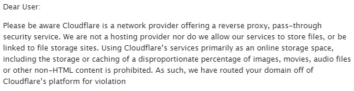
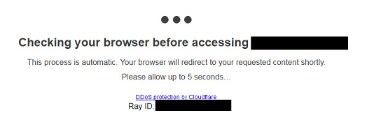
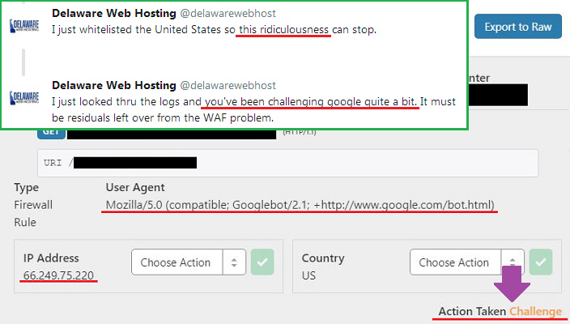
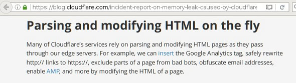
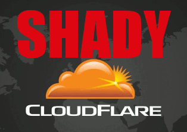
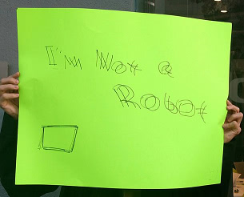
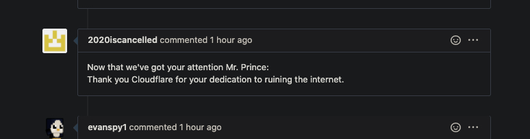

# הענן הגדול

---

## עצור את הענן

|  🖹  |  🖼 |
| --- | --- |
|  "ה- Cloudwall הגדול" הוא Cloudflare Inc., החברה האמריקאית.היא מספקת שירותי CDN (רשת משלוח תוכן), הפחתת DDoS, אבטחת אינטרנט ושירותי DNS (שרת שמות דומיין) מבוזרים.  |   |
|  Cloudflare הוא ה- MITM Proxy הגדול בעולם (פרוקסי הפוך).Cloudflare מחזיקה ביותר מ- 80% מנתח השוק של CDN ומספר משתמשי ה- Cloudflare גדל מדי יום.הם הרחיבו את הרשת שלהם ליותר ממאה מדינות.Cloudflare משרת יותר תנועה באינטרנט מאשר טוויטר, אמזון, אפל, אינסטגרם, בינג וויקיפדיה יחד.Cloudflare מציע תוכנית בחינם ואנשים רבים משתמשים בה במקום להגדיר את השרתים שלהם כראוי.הם סחרו בפרטיות בגלל נוחות.  |    |
|  Cloudflare יושב בינך לבין שרת האינטרנט המקורי, מתנהג כמו סוכן סיור גבול.אינך מצליח להתחבר ליעד שבחרת.אתה מתחבר ל- Cloudflare וכל המידע שלך מפוענח ונמסר תוך כדי תנועה. Cloudflaro havas tutmondan vidon en la trafikon de la interreto kaj ili observas la trafikon fluanta al kaj de ili kontinue. |    |
|  מנהל שרת האינטרנט המקורי איפשר לסוכן - Cloudflare - להחליט מי יכול לגשת ל"רכוש האינטרנט "שלהם ולהגדיר" אזור מוגבל ".  |    |
|  התבונן בתמונה הנכונה.אתם תחשבו ש- Cloudflare חוסם רק רעים.אתם תחשבו ש- Cloudflare תמיד מקוון (לעולם אל תרדו).אתם תחשבו שבוטים וסורקים חוקיים יכולים להוסיף אינדקס לאתר שלכם.  |    |
|  עם זאת אלה אינם נכונים כלל.Cloudflare חוסם אנשים חפים מפשע ללא סיבה.הענן יכול לרדת.Cloudflare חוסם בוטים לגיטימיים.  |    |
|  ממש כמו כל שירות אירוח, Cloudflare אינו מושלם.תראה מסך זה גם אם שרת המקור עובד טוב.  |   |
|  האם אתה באמת חושב ש- Cloudflare יש זמן של 100%?אין לך מושג כמה פעמים Cloudflare יורד.אם Cloudflare יורד הלקוח שלך לא יכול לגשת לאתר שלך. |   |
|  זה נקרא כך בהתייחסות לחומת האש הגדולה של סין שעושה עבודה דומה לסינון בני אדם רבים מלראות תוכן באינטרנט (כלומר, כולם בסין היבשתית ואנשים בחוץ).בעוד שבאותה עת אלה שלא הושפעו רואים רשת שונה באופן דרטי, רשת נטולת צנזורה כמו דימוי של "איש טנק" והיסטוריה של "מחאות כיכר טיינאנמן". |   |
|  Cloudflare הוא בעל כוח רב.במובן מסוים הם שולטים במה שמשתמש הקצה רואה בסופו של דבר.מנועה ממך לגלוש באתר בגלל Cloudflare. |  |
|  ניתן להשתמש בענן הענן לצנזורה. |  |
|  אינך יכול להציג אתר Cloudflared אם אתה משתמש בדפדפן מינורי אשר Cloudflare עשוי לחשוב שהוא בוט (מכיוון שלא רבים משתמשים בו). |  |
|  אינך יכול לעבור "בדיקת דפדפן" פולשנית זו מבלי להפעיל את Javascript.זה בזבוז של חמש שניות (או יותר) מחייך היקרים. |  |
|  Cloudflare גם חוסם אוטומטית רובוטים / סורקים לגיטימיים כמו לקוחות Google, Yandex, Yacy ו- API.Cloudflare עוקב באופן פעיל אחר קהילת "עקיפה של עננים פרטיים" מתוך כוונה לשבור בוטים של מחקר חוקי. |   |
|  Cloudflare באופן דומה מונע מאנשים רבים שיש להם קישוריות אינטרנט לקויה לגשת לאתרי האינטרנט שמאחוריה (לדוגמה, הם עשויים להיות מאחורי 7+ שכבות NAT או לשתף אותה IP, למשל Wifi ציבורי) אלא אם כן הם פותרים CAPTCHAs תמונה מרובים.בחלק מהמקרים זה ייקח 10 עד 30 דקות כדי לספק את גוגל. |  |
|  בשנת 2020 Cloudflare עבר מ- Recaptcha של גוגל ל- hCaptcha מכיוון שגוגל מתכוונת לגבות תשלום עבור השימוש בו.Cloudflare אמר לך שאכפת להם מהפרטיות שלך ("זה עוזר לטפל בדאגה לפרטיות") אך ברור שזה שקר.הכל קשור לכסף."HCaptcha מאפשר לאתרים להרוויח כסף המשרת את הדרישה הזו תוך חסימת בוטים וצורות התעללות אחרות" |   |
|  מבחינת המשתמש זה לא משתנה הרבה. אתה נאלץ לפתור את זה. |   |
|  אנשים ותוכנות רבים נחסמים על ידי Cloudflare כל יום. |  |
|  Cloudflare מרגיז אנשים רבים ברחבי העולם.התבונן ברשימה וחשוב אם אימוץ Cloudflare באתר שלך טוב לחוויית המשתמש. |   |
|  מה מטרת האינטרנט אם אינך יכול לעשות מה שאתה רוצה?רוב האנשים שפוקדים את האתר שלך יחפשו דפים אחרים אם הם לא יכולים לטעון דף אינטרנט.ייתכן שאתה לא חוסם מבקרים באופן פעיל, אך חומת האש של ברירת המחדל של Cloudflare מחמירה מספיק כדי לחסום אנשים רבים. |   |
|  אין דרך לפתור את הקאפטצ'ה מבלי לאפשר Javascript ועוגיות.Cloudflare משתמש בהם כדי ליצור חתימת דפדפן כדי לזהות אותך.Cloudflare צריך לדעת את זהותך כדי להחליט אם אתה זכאי להמשיך לגלוש באתר. |   |
|  משתמשי Tor ומשתמשי VPN הם גם קורבן של Cloudflare.שני הפתרונות משמשים אנשים רבים שאינם יכולים להרשות לעצמם אינטרנט לא מצונזר בגלל מדיניות המדינה / התאגיד / הרשת שלהם או שרוצים להוסיף רובד נוסף לשמירה על פרטיותם.Cloudflare תוקף ללא בושה את האנשים האלה, מכריח אותם לכבות את פיתרון ה- Proxy שלהם. |  |
|  אם לא ניסית את Tor עד לרגע זה, אנו ממליצים לך להוריד את Tor Browser ולבקר באתרי האינטרנט המועדפים עליך.אנו ממליצים לך לא להיכנס לאתר הבנק שלך או לדף האינטרנט הממשלתי, אחרת הם יסמנו את חשבונך. השתמש ב- VPN עבור אותם אתרים. |  |
|  אולי תרצו לומר "טור הוא לא חוקי! משתמשי Tor הם פליליים! טור הוא רע! ". לא.אולי למדת על טור מהטלוויזיה, ואמר שאתה יכול להשתמש בטור כדי לגלוש ברשת כהה ולסחר בתותחים, סמים או פורנו לרשת.אמנם ההצהרה שלמעלה נכונה שישנם אתרי אינטרנט רבים בשוק בהם תוכלו לקנות פריטים כאלה, אך אתרים אלה מופיעים לרוב גם ב- clearnet.  |  |
|  טור פותח על ידי צבא ארה"ב, אך טור הנוכחי מפותח על ידי פרויקט טור.ישנם אנשים וארגונים רבים שמשתמשים בתור כולל חברים שלך לעתיד.לכן, אם אתה משתמש ב- Cloudflare באתר האינטרנט שלך אתה חוסם בני אדם אמיתיים.תאבד חברות פוטנציאלית ועסקה עסקית. |  |
|  ושירות ה- DNS שלהם, 1.1.1.1, מסנן גם משתמשים מביקור באתר באמצעות החזרת כתובת IP מזויפת בבעלות Cloudflare, IP של localhost כמו "127.0.0.x", או פשוט לא מחזיר דבר. |   |
|  ה- Cloudflare DNS גם מפרק תוכנה מקוונת מאפליקציית סמארטפון למשחק מחשב בגלל תשובת ה- DNS המזויפת שלהם.DNS Cloudflare אינו יכול לבצע שאילתות בכמה אתרי בנק. |   |
|  וכאן אתה עשוי לחשוב, אני לא משתמש ב- Tor או ב- VPN, מדוע אכפת לי? אני סומך על שיווק Cloudflare, מדוע אכפת לי האתר שלי הוא https מדוע אכפת לי |  |
|  אם אתה מבקר באתר המשתמש ב- Cloudflare, אתה משתף את המידע שלך לא רק לבעלי האתר אלא גם Cloudflare.כך עובד ה- proxy ההפוך. |  |
|  אי אפשר לנתח בלי לפענח את תעבורת TLS. |  |
|  Cloudflare מכיר את כל הנתונים שלך, כגון סיסמא גולמית. |  |
|  עננים יכולים לקרות בכל עת. |  |
|  Https של Cloudflare לעולם אינו מקצה לקצה. |  |
|  האם אתה באמת רוצה לשתף את הנתונים שלך עם Cloudflare, וגם סוכנות בת 3 אותיות? |  |
|  הפרופיל המקוון של משתמש האינטרנט הוא "מוצר" שהממשלה וחברות הטכנולוגיה הגדולות מעוניינות לקנות. |  |
|  כך נמסר מהמחלקה האמריקאית לביטחון פנים:  האם יש לך מושג כמה הנתונים שלך יקרי ערך? האם יש דרך שתמכור לנו את הנתונים האלה?  |  |
|  Cloudflare מציעים גם שירות VPN בחינם הנקרא "Cloudflare Warp".אם אתה משתמש בו, כל חיבורי הטלפון החכם (או המחשב שלך) נשלחים לשרתי Cloudflare.Cloudflare יכול לדעת איזה אתר קראת, איזו תגובה פרסמת, עם מי דיברת וכו '.אתה מרצון למסור את כל המידע שלך ל- Cloudflare.אם אתה חושב "אתה מתבדח? Cloudflare מאובטח. " אז אתה צריך ללמוד כיצד VPN עובד. |  |
|  Cloudflare אמר כי שירות ה- VPN שלהם הופך את האינטרנט שלך למהיר.אבל VPN הופך את חיבור האינטרנט לאיטי יותר מהקשר שלך הקיים. |  |
|  אולי כבר ידעת על שערוריית ה- PRISM.נכון AT&T מאפשר ל- NSA להעתיק את כל נתוני האינטרנט למעקב. |  |
|  נניח שאתה עובד ב- NSA, ואתה מעוניין בפרופיל האינטרנט של כל אזרח.אתה יודע שרובם סומכים באופן עיוור על Cloudflare ומשתמשים בו - רק שער מרכזי אחד - כדי לפרוק את חיבור שרת החברה שלהם (SSH / RDP), אתר אישי, אתר צ'אט, אתר פורום, אתר בנק, אתר ביטוח, מנוע חיפוש, חבר סודי אתר אינטרנט בלבד, מכירה פומבית, קניות, אתר וידאו, אתר NSFW ואתר לא חוקי.אתה גם יודע שהם משתמשים בשירות ה- DNS של Cloudflare ("1.1.1.1") ובשירות VPN ("עיוות Cloudflare") לצורך "מאובטח! מהר יותר! טוב יותר!" חווית אינטרנט.שילובם עם כתובת ה- IP של המשתמש, טביעת אצבע של הדפדפן, קובצי Cookie ומזהה RAY יעיל לבניית פרופיל המקוון של היעד. |   |
|  אתה רוצה את הנתונים שלהם. מה תעשה? |  |
|  **Cloudflare הוא דבש.** |  |
|  **דבש חינם לכולם. כמה מיתרים צמודים.** |  |
|  **אל תשתמש ב- Cloudflare.** |  |
|  **ביזר את האינטרנט.** |  |

---

##    המשך לדף הבא:  "[אתיקה של פרח ענן](he.ethics.md)"

---

_לחץ עלי_

## נתונים ומידע נוסף

מאגר זה הוא רשימה של אתרים העומדים מאחורי "The Cloudwall הגדול", וחוסמים את משתמשי Tor ו- CDNs אחרים.

**נתונים**
* [Cloudflare בע"מ](../cloudflare_inc/)
* [משתמשי Cloudflare](../cloudflare_users/)
* [תחומי ענן](../cloudflare_users/domains/)
* [משתמשי CDN שאינם עננים](../not_cloudflare/)
* [משתמשי אנטי טור](../anti-tor_users/)

**עוד מידע**
* **[☞ deCloudflare Subfiles ☜](../subfiles/README.md)**
* [The Great Cloudwall](../pdf/2019-Jeff_Cliff_Book1.txt), [Mr. Jeff Cliff](https://shitposter.club/users/jeffcliff)
  * הורד: [PDF](../pdf/2019-The_Great_Cloudwall.pdf), [ePUB](../pdf/2019-Jeff_Cliff_The_Great_Cloudwall.epub)
  * הספר האלקטרוני המקורי (ePUB) נמחק על ידי BookRix GmbH עקב הפרת זכויות יוצרים של חומר CC0
* [Padlock icon indicates a secure SSL connection established w MITM-ed](https://bugs.debian.org/cgi-bin/bugreport.cgi?bug=831835), Anonymous
* [Block Global Active Adversary Cloudflare](https://trac.torproject.org/projects/tor/ticket/24351), nym-zone
  * הכרטיס הושחת כל כך הרבה פעמים.
  * [נמחק על ידי פרויקט טור.](https://lists.torproject.org/pipermail/anti-censorship-team/2020-May/000098.html) [ראו כרטיס 34175.](https://trac.torproject.org/projects/tor/ticket/34175)
  * [כרטיס ארכיב אחרון 24351.](https://web.archive.org/web/20200301013104/https://trac.torproject.org/projects/tor/ticket/24351)
* [Cloudflare Watch](http://www.crimeflare.org:82/)
* [Criticism and controversies](https://en.wikipedia.org/wiki/Cloudflare#Criticism_and_controversies), Wikipedia
* [CloudFlare rap sheet](../subfiles/rapsheet.cloudflare.md)

---

_לחץ עלי_

## מה אתה יכול לעשות?

* [קרא את רשימת הפעולות המומלצות שלנו ושתף אותה עם חבריך.](he.action.md)

* [קרא את הקול של משתמש אחר וכתוב את מחשבותיך.](../PEOPLE.md)

* חפש משהו: [Ss Serĉi](../subfiles/service.sercxi.md)

* עדכן את רשימת הדומיינים: [רשימת הוראות](../INSTRUCTION.md).

* [הוסף היסטוריית Cloudflare או אירוע הקשור לפרויקט.](../HISTORY.md)

* [נסה וכתוב כלי / סקריפט חדש.](../tool/)

* [להלן PDF / ePUB לקריאה.](../pdf/)

* [Por favor considere la donación si le gusta este proyecto.](../DONATION.md)

* [Help translate deCloudflare](translateData/)

---

### על חשבונות מזויפים

We יודע על קיומם של חשבונות מזויפים המתחזים לערוצים הרשמיים שלנו, יהיה זה טוויטר, פייסבוק, פטרון, OpenCollective, כפרים וכו '.
**לעולם לא נשאל את הדוא"ל שלך.
אנחנו אף פעם לא שואלים את שמך.
אנחנו אף פעם לא שואלים את זהותך.
אנחנו אף פעם לא שואלים את המיקום שלך.
אנחנו אף פעם לא מבקשים את התרומה שלך.
לעולם לא נשאל את הביקורת שלך.
אנחנו אף פעם לא מבקשים מכם לעקוב במדיה החברתית.
לעולם איננו שואלים את המדיה החברתית שלכם.**

# אל תבטח בחשבונות מזויפים.

---

| 🖼 | 🖼 |
| --- | --- |
|  |  |
|  |  |
|  |  |

---

  [🖼 Poster](../image/poster)

