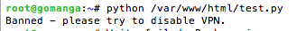
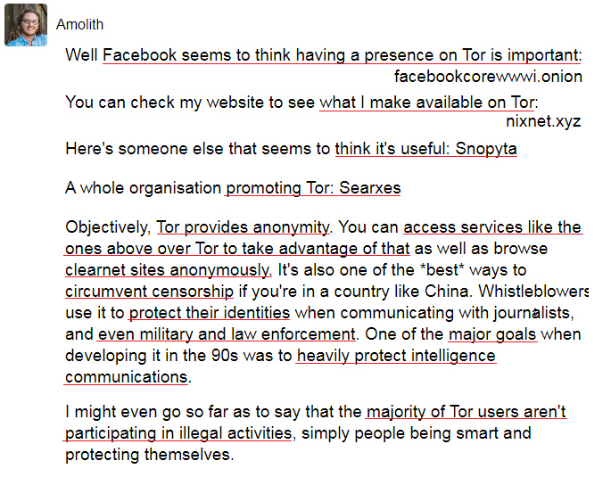
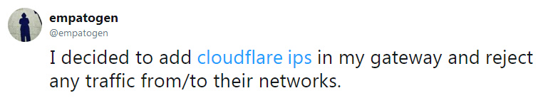

# Veliki oblačni zid

---

## Zaustavite Cloudflare

|  🖹  |  🖼 |
| --- | --- |
|  "Veliki oblačni zid" je Cloudflare Inc., američka tvrtka.Pruža usluge CDN (mreža za isporuku sadržaja), ublažavanje DDoS-a, internetsku sigurnost i distribuirane DNS (poslužitelj imena domena) usluga.  |   |
|  Cloudflare je najveći MITM proxy na svijetu (obrnuti proxy).Cloudflare posjeduje više od 80% udjela na CDN tržištu, a broj cloudflare korisnika svakodnevno raste.Mrežu su proširili na više od 100 zemalja.Cloudflare služi više web prometa od Twittera, Amazona, Applea, Instagrama, Binga i Wikipedije.Cloudflare nudi besplatni plan i mnogi ga koriste umjesto da pravilno konfiguriraju svoje poslužitelje.Trgovali su privatnost zbog praktičnosti.  |    |
|  Cloudflare sjedi između vas i izvornog webservera, ponaša se poput agenta granične patrole.Ne možete se povezati s odabranim odredištem.Spajate s Cloudflare-om i svi se podaci dešifriraju i predaju u pokretu. Cloudflaro havas tutmondan vidon en la trafikon de la interreto kaj ili observas la trafikon fluanta al kaj de ili kontinue. |    |
|  Administrator web hosting poslužitelja omogućio je agentu - Cloudflare - da odluči tko može pristupiti njihovom "web entitetu" i definirati "područje s ograničenim pristupom".  |    |
|  Pogledajte pravu sliku.Mislit ćete da Cloudflare blokira samo negativce.Mislit ćete da je Cloudflare uvijek na mreži (nikad ne silazite).Mislit ćete da legalni robota i indeksi mogu indeksirati vaše web mjesto.  |    |
|  Međutim, to uopće nije istina.Cloudflare bez razloga blokira nevine ljude.Cloudflare može pasti.Cloudflare blokira zakonite robota.  |    |
|  Kao i svaki hosting usluga, Cloudflare nije savršen.Vidjet ćete ovaj ekran čak i ako poslužitelj porijekla dobro radi.  |   |
|  Mislite li zaista da Cloudflare ima 100% produženja?Nemate pojma koliko puta Cloudflare padne.Ako Cloudflare propadne, vaš klijent ne može pristupiti vašoj web lokaciji. |   |
|  To se naziva upućivanjem na Veliki kineski vatrozid koji čini usporedivi posao filtriranja mnogih ljudi od gledanja web sadržaja (tj. Svih u kontinentalnoj Kini i ljudi izvan nje).Dok u isto vrijeme oni koji nisu pogođeni vide drotično drugačiji web, web bez cenzure poput slike "tenkista" i povijesti protesta na "Tiananmen Square". |   |
|  Cloudflare posjeduje veliku moć.U određenom smislu, oni kontroliraju ono što krajnji korisnik u konačnici vidi.Zbog sprječavanja Cloudflare-a spriječeni ste pregledavati web stranicu. |  |
|  Cloudflare se može koristiti za cenzuru. |  |
|  Web mjesto sa oblakom ne možete vidjeti ako koristite manji preglednik za koji Cloudflare može smatrati da je bot (jer ga ne koristi mnogo ljudi). |  |
|  Ne možete proći ovu invazivnu provjeru "preglednika" bez omogućavanja Javascripta.Ovo je gubitak pet (ili više) sekundi vašeg vrijednog života. |  |
|  Cloudflare također automatski blokira zakonite robote / alate kao što su Google, Yandex, Yacy i API klijenti.Cloudflare aktivno nadgleda zajednicu "bypass cloudflare" s namjerom razbijanja zakonitih istraživačkih botova. |   |
|  Cloudflare slično sprečava mnoge ljude koji imaju lošu internetsku povezanost da pristupe web-lokacijama iza njega (na primjer, mogu biti iza 7+ slojeva NAT-a ili dijele isti IP, na primjer javni Wifi), osim ako ne riješe višestruke CAPTCHA-e.U nekim će slučajevima biti potrebno 10 do 30 minuta da Google zadovolji. |  |
|  Godine 2020. Cloudflare je prešao iz Googleove Recaptcha u hCaptcha jer Google namjerava naplatiti njegovu upotrebu.Cloudflare vam je rekao kako brine o vašoj privatnosti ("pomaže u rješavanju problema privatnosti"), ali to je očito laž.Sve se vrti oko novca."HCaptcha dopušta web-lokacijama da zarađuju novac na ovom zahtjevu, a istovremeno blokira botove i druge oblike zlostavljanja" |   |
|  Iz perspektive korisnika, to se ne mijenja puno. Prisiljeni ste to riješiti. |   |
|  Cloudflare svakodnevno blokira mnoge ljude i softver. |  |
|  Cloudflare nervira mnoge ljude širom svijeta.Pogledajte popis i razmislite je li prihvaćanje Cloudflare-a na vašoj web lokaciji dobro za korisničko iskustvo. |   |
|  Koja je svrha interneta ako ne možete raditi ono što želite?Većina ljudi koji posjećuju vašu web stranicu tražit će druge stranice ako ne mogu učitati web stranicu.Možda nećete blokirati nijednog posjetitelja, ali zadani vatrozid Cloudflarea dovoljno je strog da blokira mnoge ljude. |   |
|  Nema načina da se riješi captcha bez omogućavanja Javascripta i Cookies.Cloudflare ih koristi za izradu potpisa u pregledniku koji vas identificira.Cloudflare mora znati vaš identitet da bi se odlučio želite li nastaviti pregledavati web mjesto. |   |
|  Tor korisnici i VPN korisnici također su žrtva Cloudflare-a.Oba rješenja koriste mnogi ljudi koji ne mogu priuštiti necenzurirani internet zbog svoje države / korporacije / mrežne politike ili koji žele dodati dodatni sloj kako bi zaštitili svoju privatnost.Cloudflare besramno napada te ljude, prisiljavajući ih da isključe svoje proxy rješenje. |  |
|  Ako do sada niste probali Tor, preporučujemo vam da preuzmete Tor preglednik i posjetite omiljene web stranice.Predlažemo vam da se ne prijavljujete na web stranicu svoje banke ili web stranicu vlade ili će oni označiti vaš račun. Za te web stranice koristite VPN. |  |
|  Možda ćete htjeti reći "Tor je nelegalan! Korisnici Tor-a su zločinački! Tor je loš! ". Ne.Možda ste o Toru saznali s televizije, rekavši da se Tor može koristiti za pregledavanje darkneta i trgovinu oružjem, drogom ili chid pornografijom.Iako je gornja izjava istinita da postoji mnogo tržišnih web stranica na kojima možete kupiti takve predmete, te se stranice često pojavljuju na clearnetu.  |  |
|  Tor je razvila američka vojska, ali trenutni Tor razvijen je projektom Tor.Postoje mnogi ljudi i organizacije koji koriste Tor uključujući i vaše buduće prijatelje.Dakle, ako koristite Cloudflare na svojoj web stranici, blokirate prave ljude.Izgubit ćete potencijalno prijateljstvo i poslovni dogovor. |  |
|  A njihova DNS usluga, 1.1.1.1, također filtrira korisnike od posjećivanja web mjesta vraćanjem lažne IP adrese u vlasništvu Cloudflare, localhost IP-a kao što je "127.0.0.x", ili jednostavno ne vraćaju ništa. |   |
|  Cloudflare DNS također lomira internetski softver od pametne aplikacije do računalne igre zbog lažnog DNS odgovora.Cloudflare DNS ne može upitati neke web stranice banke. |   |
|  A ovdje biste mogli pomisliti, Ne koristim Tor ili VPN, zašto bih se trebao brinuti? Vjerujem u Cloudflare marketing, zašto bih se trebao brinuti Moja web stranica je https zašto bih se trebao brinuti |  |
|  Ako posjetite web mjesto koje koristi Cloudflare, dijelite svoje podatke ne samo vlasniku web stranice već i Cloudflare.Ovako radi obrnuti proxy. |  |
|  Nemoguće je analizirati bez dešifriranja TLS prometa. |  |
|  Cloudflare zna sve vaše podatke kao što su neobrađena lozinka. |  |
|  Cloudbeed može se dogoditi bilo kada. |  |
|  Cloudflare-ovi https nikada ne dolaze do kraja. |  |
|  Želite li zaista podijeliti svoje podatke s Cloudflareom, ali i agencijom s 3 slova? |  |
|  Internetski profil internetskog korisnika je "proizvod" koji vlada i velike tehnološke tvrtke žele kupiti. |  |
|  Američki odjel za unutarnju sigurnost rekao je:  Imate li ideju koliko su vaši podaci vrijedni? Postoji li neki način da nam prodate te podatke?  |  |
|  Cloudflare nudi i BESPLATNU VPN uslugu pod nazivom "Cloudflare Warp".Ako ga upotrebljavate, sve veze vašeg pametnog telefona (ili računala) šalju se na Cloudflare poslužitelje.Cloudflare može znati koju ste web stranicu pročitali, koji ste komentar objavili, s kim ste razgovarali itd.Sve svoje podatke dobrovoljno dajete Cloudflareu.Ako mislite "da li se šališ? Cloudflare je siguran. " tada morate naučiti kako funkcionira VPN. |  |
|  Cloudflare je rekao kako njihova VPN usluga ubrzava vaš internet.Ali VPN vašu internetsku vezu čini sporijom od vaše postojeće. |  |
|  Možda već znate za skandal s PRIZMOM.Istina je da AT&T omogućuje NSA-u da kopira sve podatke na internetu radi nadzora. |  |
|  Recimo da radite u NSA-u i želite da se internetski profil svakog građanina.Znate da većina njih slijepo vjeruje Cloudflare-u i koriste ga - samo jedan centralizirani gateway - da proxy vezu svoje poslužiteljske tvrtke (SSH / RDP), osobne web stranice, web stranice za chat, web stranice foruma, web stranice banke, web stranice osiguranja, pretraživača, tajnog člana samo web mjesto, web mjesto za aukcije, web mjesto za kupnju, videozapis, web mjesto NSFW i ilegalno web mjesto.Također znate da koriste Cloudflare-ovu DNS uslugu ("1.1.1.1") i VPN uslugu ("Cloudflare Warp") za "Sigurno! Brže! Bolje!" internetsko iskustvo.Kombinacija njih s korisničkom IP adresom, otiskom prsta preglednika, kolačićima i RAY-ID-om bit će korisni za izgradnju mrežnog profila cilja. |   |
|  Vi želite njihove podatke. Što ćeš učiniti? |  |
|  **Cloudflare je mednica.** |  |
|  **Besplatan med za sve. Neke žice u prilogu.** |  |
|  **Ne koristite Cloudflare.** |  |
|  **Decentralizirajte Internet.** |  |

---

##    Nastavite do sljedeće stranice:  "[Cloudflare etika](hr.ethics.md)"

---

_klikni me_

## Podaci i više informacija

Ovo spremište je popis web stranica koje stoje iza "Velikog oblačnog zida", a blokiraju korisnike Tora i ostale CDN-ove.

**Podaci**
* [Cloudflare Inc.](../cloudflare_inc/)
* [Korisnici Cloudflare-a](../cloudflare_users/)
* [Cloudflare domene](../cloudflare_users/domains/)
* [Korisnici CDN koji nisu Cloudflare](../not_cloudflare/)
* [Korisnici protiv Tor-a](../anti-tor_users/)

**Više informacija**
* **[☞ deCloudflare Subfiles ☜](../subfiles/README.md)**
* [The Great Cloudwall](../pdf/2019-Jeff_Cliff_Book1.txt), [Mr. Jeff Cliff](https://shitposter.club/users/jeffcliff)
  * preuzimanje datoteka: [PDF](../pdf/2019-The_Great_Cloudwall.pdf), [ePUB](../pdf/2019-Jeff_Cliff_The_Great_Cloudwall.epub)
  * Originalnu e-knjigu (ePUB) izbrisala je BookRix GmbH zbog kršenja autorskih prava CC0 materijala
* [Padlock icon indicates a secure SSL connection established w MITM-ed](https://bugs.debian.org/cgi-bin/bugreport.cgi?bug=831835), Anonymous
* [Block Global Active Adversary Cloudflare](https://trac.torproject.org/projects/tor/ticket/24351), nym-zone
  * Ulaznica je toliko puta uništena.
  * [Izbrisano iz Tor projekta.](https://lists.torproject.org/pipermail/anti-censorship-team/2020-May/000098.html) [Pogledajte kartu 34175.](https://trac.torproject.org/projects/tor/ticket/34175)
  * [Zadnja arhivska karta 24351.](https://web.archive.org/web/20200301013104/https://trac.torproject.org/projects/tor/ticket/24351)
* [Cloudflare Watch](http://www.crimeflare.org:82/)
* [Criticism and controversies](https://en.wikipedia.org/wiki/Cloudflare#Criticism_and_controversies), Wikipedia
* [CloudFlare rap sheet](../subfiles/rapsheet.cloudflare.md)

---

_klikni me_

## Što možeš učiniti?

* [Pročitajte naš popis preporučenih akcija i podijelite ga sa svojim prijateljima.](hr.action.md)

* [Pročitajte glas drugog korisnika i napišite svoje misli.](../PEOPLE.md)

* Pretražite nešto: [Ansero](https://ansero.nnpaefp7pkadbxxkhz2agtbv2a4g5sgo2fbmv3i7czaua354334uqqad.onion/) ([clearnet](https://ansero.eu.org/)), [Ss \#Search](https://sercxi.nnpaefp7pkadbxxkhz2agtbv2a4g5sgo2fbmv3i7czaua354334uqqad.onion/?ul=hr) ([clearnet](https://sercxi.eu.org/))

* Ažurirajte popis domena: [Popis uputa](../INSTRUCTION.md).

* [Dodajte Cloudflare ili događaj u vezi s projektom u povijest.](../HISTORY.md)

* [Isprobajte i napišite novi alat / skriptu.](../tool/)

* [Evo nekoliko PDF / ePUB-a za čitanje.](../pdf/)

* [Por favor considere la donación si le gusta este proyecto.](../DONATION.md)

* [Help translate deCloudflare](translateData/)

---

### O lažnim računima

We zna za postojanje lažnih računa koji nameću naše službene kanale, bilo da su to Twitter, Facebook, Mastodon, Github, Gitea, Patreon, OpenCollective, Villageges itd.
**Nikada ne pitamo vašu e-poštu.
Nikad ne pitamo tvoje ime.
Nikad ne tražimo vaš identitet.
Nikad ne tražimo vašu lokaciju.
Nikada ne tražimo vašu donaciju.
Nikad ne tražimo vašu recenziju.
Nikad vas ne molimo da to pratite na društvenim medijima.
Nikada ne pitamo vaše društvene medije.**

# NE vjerujte u lažne račune.

---

| 🖼 | 🖼 |
| --- | --- |
|  |  |
|  |  |
|  |  |

---

  [🖼 Poster](../image/poster)
