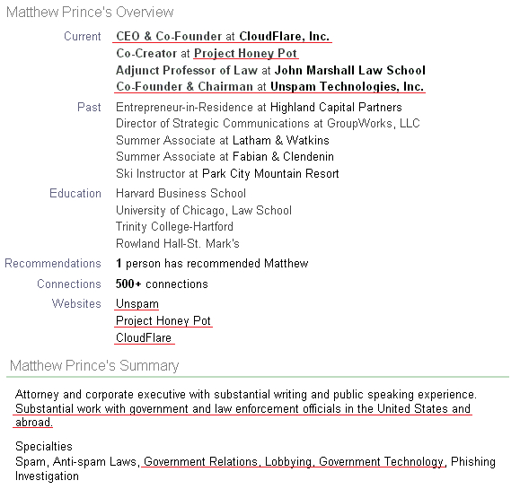
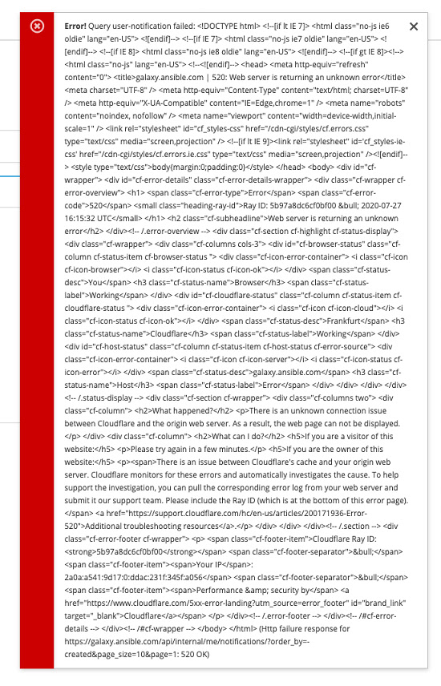
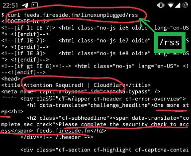

# Ի՞նչ կարող եք անել Cloudflare- ին դիմակայելու համար:

| 🖼 | 🖼 | 🖼 |
| --- | --- | --- |
|  |  |  |


Matthew Browning Prince, naskita la 13an de novembro 1974, estas la ĉefoficisto kaj kunfondinto de Cloudflaron.

Danke al lia riĉa paĉjo, "John B. Prince", li ĉeestis la Universitaton de Ĉikago Leĝlernejo kaj Harvard Komerclernejo.
Princo instruis Interretan leĝon kaj estis specialisto pri kontraŭ-spamaj leĝoj kaj Fraŭdo-esploroj.


"*I’d suggest this was armchair analysis by kids – it’s hard to take seriously.*" [t](https://www.theguardian.com/technology/2015/nov/19/cloudflare-accused-by-anonymous-helping-isis)

"*That was simply unfounded paranoia, pretty big difference.*"  [t](https://twitter.com/xxdesmus/status/992757936123359233)

"*We also work with Interpol and other non-US entities*" [t](https://twitter.com/eastdakota/status/1203028504184360960)

"*Watching hacker skids on Github squabble about trying to bypass Cloudflare's new anti-bot systems continues to be my daily amusement.* 🍿" [t](https://twitter.com/eastdakota/status/1273277839102656515)




---


<details>
<summary>կտտացրեք ինձ

## Վեբ կայքի սպառող
</summary>


- Եթե ​​ձեր նախընտրած կայքն օգտագործում է Cloudflare, ասեք նրանց, որ չօգտագործեն Cloudflare:
  - Facebook- ի, Reddit- ի, Twitter- ի կամ Mastodon- ի նման սոցիալական մեդիայի նվնվոցը ոչ մի տարբերություն չունի: [Գործողություններն ավելի բարձր են, քան հեշթեգերը:](https://twitter.com/phyzonloop/status/1274132092490862594)
  - Փորձեք կապվել կայքի սեփականատիրոջ հետ, եթե ցանկանում եք ձեզ օգտակար դարձնել:

[Cloudflare- ն ասաց](https://github.com/Eloston/ungoogled-chromium/issues/783):
```
Խորհուրդ ենք տալիս ադմինիստրատորներին դիմել հատուկ ծառայությունների կամ կայքերի համար, որոնց հետ խնդիրներ եք առաջացնում և կիսվեք ձեր փորձով:
```

[Եթե ​​դուք չեք խնդրում դա, կայքի սեփականատերը երբեք չգիտի այս խնդիրը:](../PEOPLE.md)


[Հաջող օրինակ](https://counterpartytalk.org/t/turn-off-cloudflare-on-counterparty-co-plz/164/5).<br>
Դուք խնդիր ունեք [Ձայնդ բարձրացրու հիմա:](https://github.com/maraoz/maraoz.github.io/issues/1) Ստորև բերված օրինակը:

```
Դուք պարզապես օգնում եք կորպորատիվ գրաքննությանը և զանգվածային վերահսկողությանը:
http://crimeflare.eu.org
```

```
Ձեր վեբ էջը գտնվում է CloudFlare- ի գաղտնիությունը չարաշահող մասնավոր պարսպապատ պարտեզում:
http://crimeflare.eu.org
```

- Որոշ ժամանակ տրամադրեք ՝ կայքի գաղտնիության քաղաքականությունը կարդալու համար:
  - եթե կայքը Cloudflare- ի ետևում է, կամ կայքը օգտագործում է Cloudflare- ին միացված ծառայություններ:

Այն պետք է բացատրի, թե որն է «Cloudflare» - ը, և թույլտվություն խնդրի ՝ ձեր տվյալները Cloudflare- ին կիսելու համար: Դա չկատարելը կհանգեցնի վստահության ոտնահարման, և պետք է խուսափել քննարկվող կայքից:

[Գաղտնիության քաղաքականության ընդունելի օրինակն այստեղ է](https://archive.is/bDlTz) ("Subprocessors" > "Entity Name")

```
Ես կարդացել եմ ձեր գաղտնիության քաղաքականությունը և չեմ կարող գտնել Cloudflare բառը:
Ես հրաժարվում եմ ձեզ հետ տվյալների փոխանակումից, եթե շարունակեք իմ տվյալները Cloudflare- ին կերակրել:
http://crimeflare.eu.org
```

Սա գաղտնիության քաղաքականության օրինակ է, որը չունի Cloudflare բառը:
[Liberland Jobs](https://archive.is/daKIr) [privacy policy](https://docsend.com/view/feiwyte):


Cloudflare- ն ունի իրենց գաղտնիության քաղաքականությունը:
[Cloudflare- ը սիրում է doxxing մարդկանց:](https://www.reddit.com/r/GamerGhazi/comments/2s64fe/be_wary_reporting_to_cloudflare/)

Ահա մի լավ օրինակ կայքի գրանցման ձևի համար:
AFAIK, զրո կայք դա անում է: Կվստահե՞ք նրանց:

```
Սեղմելով «Գրանցվել XYZ» - ին ՝ դուք համաձայն եք մեր ծառայության պայմանների և գաղտնիության հայտարարության հետ:
Դուք նաև համաձայն եք կիսել ձեր տվյալները Cloudflare- ի հետ, ինչպես նաև համաձայն եք cloudflare- ի գաղտնիության հայտարարության հետ:
Եթե ​​Cloudflare- ը արտահոսում է ձեր տվյալները կամ թույլ չի տալիս միանալ մեր սերվերներին, դա մեր մեղքը չէ: [*]

[ Գրանցվել ] [ ես համաձայն չեմ ]
```
[*] [PEOPLE.md](../PEOPLE.md)


- Փորձեք չօգտագործել նրանց ծառայությունը: Հիշեք, որ ձեզ դիտում է Cloudflare- ը:
  - ["I'm in your TLS, sniffin' your passworz"](../image/iminurtls.jpg)

- Որոնել այլ կայք: Ինտերնետում կան այլընտրանքներ և հնարավորություններ:

- Համոզեք ձեր ընկերներին օգտագործել Tor ամեն օր:
  - Անանունությունը պետք է լինի բաց ինտերնետի ստանդարտը:
  - [Նկատի ունեցեք, որ Tor նախագիծը չի հավանում այս նախագիծը:](../HISTORY.md)

</details>

------

<details>
<summary>կտտացրեք ինձ

## Լրացուցիչներ
</summary>

- Եթե ​​ձեր զննարկիչը Firefox, Tor Browser կամ Ungoogled Chromium է, օգտագործեք ստորև նշված այս հավելումներից մեկը:
  - Եթե ​​ցանկանում եք ավելացնել այլ նոր հավելում, նախ հարցրեք դրա մասին:


| Անուն | Կառուցապատող | Աջակցություն | Կարող է արգելափակել | Կարող է ծանուցել | Chrome |
| -------- | -------- | -------- | -------- | -------- | -------- |
| [Bloku Cloudflaron MITM-Atakon](../subfiles/about.bcma.md) | #Addon | [ ? ](http://crimeflare.eu.org/) | **Այո**     | **Այո**     |  **Այո** |
| [Ĉu ligoj estas vundeblaj al MITM-atako?](../subfiles/about.ismm.md) | #Addon | [ ? ](http://crimeflare.eu.org/) | Ոչ     | **Այո**     |  **Այո** |
| [Ĉu ĉi tiuj ligoj blokos Tor-uzanton?](../subfiles/about.isat.md) | #Addon | [ ? ](http://crimeflare.eu.org/) | Ոչ     | **Այո**     |  **Այո** |
| [Block Cloudflare MITM Attack](https://trac.torproject.org/projects/tor/attachment/ticket/24351/block_cloudflare_mitm_attack-1.0.14.1-an%2Bfx.xpi)<br>[**DELETED BY TOR PROJECT**](../HISTORY.md) | nullius | [ ? ](../tool/block_cloudflare_mitm_fx), [Link](http://crimeflare.eu.org/) | **Այո**     | **Այո**     |  Ոչ |
| [TPRB](http://34ahehcli3epmhbu2wbl6kw6zdfl74iyc4vg3ja4xwhhst332z3knkyd.onion/) | Sw | [ ? ](http://34ahehcli3epmhbu2wbl6kw6zdfl74iyc4vg3ja4xwhhst332z3knkyd.onion/) | **Այո**     | **Այո**     |  Ոչ |
| [Detect Cloudflare](https://addons.mozilla.org/en-US/firefox/addon/detect-cloudflare/) | Frank Otto | [ ? ](https://github.com/traktofon/cf-detect) | Ոչ     | **Այո**     |  Ոչ |
| [True Sight](https://addons.mozilla.org/en-US/firefox/addon/detect-cloudflare-plus/) | claustromaniac | [ ? ](https://github.com/claustromaniac/detect-cloudflare-plus) | Ոչ     | **Այո**     |  Ոչ |
| [Which Cloudflare datacenter am I visiting?](https://addons.mozilla.org/en-US/firefox/addon/cf-pop/) | 依云 | [ ? ](https://github.com/lilydjwg/cf-pop) | Ոչ     | **Այո**     |  Ոչ |


- «Decentraleyes» - ը կարող է դադարեցնել կապը «CDNJS (Cloudflare)» - ի հետ:
  - Այն կանխում է շատ խնդրանքների ցանցեր հասնելը և ծառայում է տեղական ֆայլերին ՝ կայքերը չխախտվելուց:
  - Կառուցապատողը պատասխանեց: "[very concerning indeed](https://github.com/Synzvato/decentraleyes/issues/236#issuecomment-352049501)", "[widespread usage severely centralizes the web](https://github.com/Synzvato/decentraleyes/issues/251#issuecomment-366752049)"

- [Կարող եք նաև Cloudflare սերտիֆիկատը հանել կամ չվստահել ձեր Վկայագրման մարմնի (ԿԱ) կողմից:](https://www.ssl.com/how-to/remove-root-certificate-firefox/)

</details>

------

<details>
<summary>կտտացրեք ինձ

## Վեբ կայքի սեփականատեր / վեբ մշակող
</summary>


- Մի օգտագործեք Cloudflare լուծում, eriամանակաշրջան:
  - Դրանից կարող ես ավելի լավ անել, չէ՞: [Ահա, թե ինչպես հեռացնել Cloudflare- ի բաժանորդագրությունները, ծրագրերը, տիրույթները կամ հաշիվները:](https://support.cloudflare.com/hc/en-us/articles/200167776-Removing-subscriptions-plans-domains-or-accounts)

| 🖼 | 🖼 |
| --- | --- |
|  |  |

- Moreանկանում եք ավելի շատ հաճախորդներ Գիտեք ինչ անել: Ակնարկը «գծից վեր է»:
  - [Ողջույն, դուք գրել եք «Մենք լուրջ ենք վերաբերվում ձեր գաղտնիությանը», բայց ես ստացել եմ «Սխալ 403 արգելված անանուն վստահված անձը չի թույլատրվում»:](https://it.slashdot.org/story/19/02/19/0033255/stop-saying-we-take-your-privacy-and-security-seriously) Ինչու եք արգելափակում Tor Or VPN- ը: Եվ ինչու՞ եք արգելափակում ժամանակավոր նամակները:


- Cloudflare- ի օգտագործումը կմեծացնի խափանումների հավանականությունը: Այցելուները չեն կարող մուտք գործել ձեր կայք, եթե ձեր սերվերը խափանված է կամ Cloudflare- ը խափանված է:
  - [Դուք իսկապե՞ս կարծում էիք, որ Cloudflare- ը երբեք չի ընկնում:](https://www.ibtimes.com/cloudflare-down-not-working-sites-producing-504-gateway-timeout-errors-2618008) [Another](https://twitter.com/Jedduff/status/1097875615997399040) [sample](https://twitter.com/search?f=tweets&vertical=default&q=Cloudflare%20is%20having%20problems). [Need more](../PEOPLE.md)?


- Cloudflare- ի օգտագործումը ձեր «API ծառայությունը», «ծրագրակազմի թարմացման սերվերը» կամ «RSS հոսքը» վստահված անձի համար վնաս կհասցնի ձեր հաճախորդին: Հաճախորդը զանգահարեց ձեզ և ասաց. «Ես այլևս չեմ կարող օգտագործել ձեր API- ն», և դուք գաղափար չունեք, թե ինչ է կատարվում: Cloudflare- ը կարող է լուռ արգելափակել ձեր հաճախորդին: Կարծում եք ՝ լա՞վ է:
  - Կան բազմաթիվ RSS ընթերցող հաճախորդներ և RSS ընթերցողներ առցանց ծառայություններ: Ինչու եք RSS հոսք հրատարակում, եթե թույլ չեք տալիս մարդկանց բաժանորդագրվել:



- Ձեզ հարկավո՞ր է HTTPS սերտիֆիկատ: Օգտագործեք «Եկեք գաղտնագրենք» կամ պարզապես գնեք այն CA ընկերությունից:

- Ձեզ հարկավոր է DNS սերվեր: Չե՞ք կարող կարգավորել ձեր սեփական սերվերը: Ինչ վերաբերում է նրանց: [Hurricane Electric Free DNS](https://dns.he.net/), [Dyn.com](https://dyn.com/dns/), [1984 Hosting](https://www.1984hosting.com/), [Afraid.Org (Ադմինիստրատորը ջնջում է ձեր հաշիվը, եթե օգտագործում եք TOR)](https://freedns.afraid.org/)

- Փնտրու՞մ եք հոստինգի ծառայություն: Միայն անվճար Ինչ վերաբերում է նրանց: [Onion Service](http://vww6ybal4bd7szmgncyruucpgfkqahzddi37ktceo3ah7ngmcopnpyyd.onion/en/security/network-security/tor/onionservices-best-practices), [Free Web Hosting Area](https://freewha.com/), [Autistici/Inventati Web Site Hosting](https://www.autinv5q6en4gpf4.onion/services/website), [Github Pages](https://pages.github.com/), [Surge](https://surge.sh/)
  - [Cloudflare- ի այլընտրանքներ](../subfiles/cloudflare-alternatives.md)

- Դուք օգտագործում եք «cloudflare-ipfs.com»: [Գիտե՞ք Cloudflare IPFS- ը վատն է:](../PEOPLE.md)

- Տեղադրեք Web Application Firewall- ը, ինչպիսիք են OWASP- ը և Fail2Ban- ը, ձեր սերվերի վրա և կազմաձևեք այն պատշաճ կերպով:
  - Tor- ի արգելափակումը լուծում չէ: Մի պատժեք բոլորին պարզապես փոքր վատ օգտվողների համար:

- Վերահասցեագրեք կամ արգելափակեք «Cloudflare Warp» - ի օգտվողներին ձեր կայք մուտք գործելը: Եվ պատճառաբանիր, եթե կարող ես:

> IP ցուցակ: "[Cloudflare- ի ներկայիս IP տիրույթները](cloudflare_inc/)"

> A: Ուղղակի արգելափակեք դրանք

```
server {
...
deny 173.245.48.0/20;
deny 103.21.244.0/22;
deny 103.22.200.0/22;
deny 103.31.4.0/22;
deny 141.101.64.0/18;
deny 108.162.192.0/18;
deny 190.93.240.0/20;
deny 188.114.96.0/20;
deny 197.234.240.0/22;
deny 198.41.128.0/17;
deny 162.158.0.0/15;
deny 104.16.0.0/12;
deny 172.64.0.0/13;
deny 131.0.72.0/22;
deny 2400:cb00::/32;
deny 2606:4700::/32;
deny 2803:f800::/32;
deny 2405:b500::/32;
deny 2405:8100::/32;
deny 2a06:98c0::/29;
deny 2c0f:f248::/32;
...
}
```

> B: Վերահղել նախազգուշացման էջին

```
http {
...
geo $iscf {
default 0;
173.245.48.0/20 1;
103.21.244.0/22 1;
103.22.200.0/22 1;
103.31.4.0/22 1;
141.101.64.0/18 1;
108.162.192.0/18 1;
190.93.240.0/20 1;
188.114.96.0/20 1;
197.234.240.0/22 1;
198.41.128.0/17 1;
162.158.0.0/15 1;
104.16.0.0/12 1;
172.64.0.0/13 1;
131.0.72.0/22 1;
2400:cb00::/32 1;
2606:4700::/32 1;
2803:f800::/32 1;
2405:b500::/32 1;
2405:8100::/32 1;
2a06:98c0::/29 1;
2c0f:f248::/32 1;
}
...
}

server {
...
if ($iscf) {rewrite ^ https://example.com/cfwsorry.php;}
...
}

<?php
header('HTTP/1.1 406 Not Acceptable');
echo <<<CLOUDFLARED
Thank you for visiting ourwebsite.com!<br />
We are sorry, but we can't serve you because your connection is being intercepted by Cloudflare.<br />
Please read http://crimeflare.eu.org for more information.<br />
CLOUDFLARED;
die();
```

- Կարգավորեք Tor Onion Service- ը կամ I2P insite- ը, եթե հավատում եք ազատությանը և ողջունում եք անանուն օգտվողներին:

- Խորհրդատվություն խնդրեք Clearnet / Tor երկակի կայքի այլ օպերատորներից և անանուն ընկերներ ձեռք բերեք:

</details>

------

<details>
<summary>կտտացրեք ինձ

## Softwareրագրաշար օգտագործող
</summary>


- Անհամաձայնությունն օգտագործում է CloudFlare: Այլընտրանքներ Մենք խորհուրդ ենք տալիս [**Briar** (Android)](https://f-droid.org/en/packages/org.briarproject.briar.android/), [Ricochet (PC)](https://ricochet.im/), [Tox + Tor (Android/PC)](https://tox.chat/download.html)
  - Briar- ը ներառում է Tor daemon- ը, որպեսզի դուք ստիպված չլինեք տեղադրել Orbot- ը:
  - Qwtch մշակողները, Open Privacy- ը, առանց ծանուցման, ջնջել են stop_cloudflare նախագիծը իրենց git ծառայությունից:

- Եթե ​​օգտագործում եք Debian GNU / Linux, կամ որևէ ածանցյալ, բաժանորդագրվեք: [bug #831835](https://bugs.debian.org/cgi-bin/bugreport.cgi?bug=831835). Եվ եթե կարող եք, օգնեք ստուգել կարկատուն և օգնեք սպասարկողին ճիշտ եզրակացություն անել ՝ արդյոք այն պետք է ընդունվի:

- Միշտ առաջարկեք այս զննարկիչները:

| Անուն | Կառուցապատող | Աջակցություն | Մեկնաբանություն |
| -------- | -------- | -------- | -------- |
| [Ungoogled-Chromium](https://ungoogled-software.github.io/ungoogled-chromium-binaries/) | Eloston | [ ? ](https://github.com/Eloston/ungoogled-chromium) | PC (Win, Mac, Linux)  _!Tor_ |
| [Bromite](https://www.bromite.org/fdroid) | Bromite | [ ? ](https://github.com/bromite/bromite/issues) | Android  _!Tor_ |
| [Tor Browser](https://www.torproject.org/download/) | Tor Project | [ ? ](https://support.torproject.org/) | PC (Win, Mac, Linux)  _Tor_|
| [Tor Browser Android](https://www.torproject.org/download/) | Tor Project | [ ? ](https://support.torproject.org/) | Android  _Tor_|
| [Onion Browser](https://itunes.apple.com/us/app/onion-browser/id519296448?mt=8) | Mike Tigas | [ ? ](https://github.com/OnionBrowser/OnionBrowser/issues) | Apple iOS  _Tor_|
| [GNU/Icecat](https://www.gnu.org/software/gnuzilla/) | GNU | [ ? ](https://www.gnu.org/software/gnuzilla/) | PC (Linux) |
| [IceCatMobile](https://f-droid.org/en/packages/org.gnu.icecat/) | GNU | [ ? ](https://lists.gnu.org/mailman/listinfo/bug-gnuzilla) | Android |
| [Iridium Browser](https://iridiumbrowser.de/about/) | Iridium | [ ? ](https://github.com/iridium-browser/iridium-browser/) | PC (Win, Mac, Linux, OpenBSD) |


Այլ ծրագրակազմի գաղտնիությունն անկատար է: Սա չի նշանակում, որ Tor զննարկիչը «կատարյալ» է:
Ինտերնետում և տեխնոլոգիայում չկա 100% անվտանգ, ոչ էլ 100% մասնավոր:

- Չե՞ք ուզում օգտագործել Tor- ը: Tor daemon- ով կարող եք օգտագործել ցանկացած զննարկիչ:
  - [Նշենք, որ Tor նախագծին դա դուր չի գալիս:](https://support.torproject.org/tbb/tbb-9/) Օգտագործեք Tor զննարկիչը, եթե ունակ եք դա անել:
- [Ինչպես օգտագործել Chromium- ը Tor- ի հետ](../subfiles/chromium_tor.md)


Եկեք խոսենք այլ ծրագրակազմի գաղտնիության մասին:

- [Եթե ​​իսկապես անհրաժեշտ է օգտագործել Firefox, ընտրեք «Firefox ESR»:](https://www.mozilla.org/en-US/firefox/organizations/)
  - [Firefox - Լրտեսող ծրագրերի դիտորդ](https://spyware.neocities.org/articles/firefox.html)
  - [Firefox- ը մերժում է ազատ խոսքը, արգելում է ազատ խոսքը](https://web.archive.org/web/20200423010026/https://reclaimthenet.org/firefox-rejects-free-speech-bans-free-speech-commenting-plugin-dissenter-from-its-extensions-gallery/)
  - ["100+ դեմ ձայն: Թվում է, թե ծրագրային ապահովման ընկերությանը խնդրելու հավատարիմ մնալ ... այս օրերին ծրագրաշարը պարզապես չափազանց շատ է:"](https://old.reddit.com/r/firefox/comments/gutdiw/weve_got_work_to_do_the_mozilla_blog/fslbbb6/)
  - [Ուհ, ինչու է Firefox- ը ինձ ցույց տալիս հովանավորվող հղումներ իմ URL- ի գոտում:](https://www.reddit.com/r/firefox/comments/jybx2w/uh_why_is_firefox_showing_me_sponsored_links_in/)
  - [Mozilla - Մարմնավորված սատանա](https://digdeeper.neocities.org/ghost/mozilla.html)

- [Հիշեք, որ Mozilla- ն օգտագործում է Cloudflare ծառայությունը:](https://www.robtex.com/dns-lookup/www.mozilla.org) [Նրանք նաև օգտագործում են Cloudflare- ի DNS ծառայությունն իրենց արտադրանքի վրա:](https://www.theregister.co.uk/2018/03/21/mozilla_testing_dns_encryption/)

- [Mozilla- ն պաշտոնապես մերժեց այս տոմսը:](https://bugzilla.mozilla.org/show_bug.cgi?id=1426618)

- [Firefox Focus- ը կատակ է:](https://github.com/mozilla-mobile/focus-android/issues/1743) [Նրանք խոստացան անջատել հեռաչափությունը, բայց փոխեցին այն:](https://github.com/mozilla-mobile/focus-android/issues/4210)

- [PaleMoon / Basilisk մշակողը սիրում է Cloudflare:](https://github.com/mozilla-mobile/focus-android/issues/1743#issuecomment-345993097)
  - [Pale Moon- ի արխիվային սերվերը կոտրեց և չարամիտ ծրագրեր տարածեց 18 ամիսների ընթացքում](https://www.reddit.com/r/privacytoolsIO/comments/cc808y/pale_moons_archive_server_hacked_and_spread/)
  - Նա նաև ատում է Tor օգտագործողներին - "[Թող դա թշնամաբար վերաբերվի Tor- ին: Կարծում եմ, որ կայքերի մեծ մասը պետք է թշնամաբար վերաբերվի Tor- ին `հաշվի առնելով դրա չափազանց բարձր չարաշահման գործոնը:](https://github.com/yacy/yacy_search_server/issues/314#issuecomment-565932097)"

- [Waterfox- ը լուրջ «հեռախոսների տան» խնդիր ունի](https://spyware.neocities.org/articles/waterfox.html)

- [Google Chrome- ը լրտեսող ծրագիր է:](https://www.gnu.org/proprietary/malware-google.en.html)
  - [Google- ը պրոֆիլավորում է ձեր գործունեությունը:](https://spyware.neocities.org/articles/chrome.html)

- [SRWare Iron- ը չափազանց շատ հեռախոսներ է կապում տան հետ:](https://spyware.neocities.org/articles/iron.html) Այն նաև միանում է google տիրույթներին:

- [Brave Browser սպիտակ ցուցակի Facebook / Twitter հետևորդները:](https://www.bleepingcomputer.com/news/security/facebook-twitter-trackers-whitelisted-by-brave-browser/)
  - [Ահա ավելի շատ խնդիրներ:](https://spyware.neocities.org/articles/brave.html)
  - [binance- ի դուստր ձեռնարկության ID- ն](https://twitter.com/cryptonator1337/status/1269594587716374528)

- [Microsoft Edge- ը թույլ է տալիս Facebook- ին գործարկել Flash կոդ ՝ օգտագործողների մեջքի հետեւում:](https://www.zdnet.com/article/microsoft-edge-lets-facebook-run-flash-code-behind-users-backs/)

- [Վիվալդին չի հարգում ձեր գաղտնիությունը:](https://spyware.neocities.org/articles/vivaldi.html)

- [Opera լրտեսող ծրագրերի ազդեցության մակարդակը ՝ չափազանց բարձր](https://spyware.neocities.org/articles/opera.html)

- Apple iOS: [Դուք ընդհանրապես չպետք է օգտագործեք iOS- ը, հիմնականում այն ​​պատճառով, որ դա վնասակար ծրագիր է:](https://www.gnu.org/proprietary/malware-apple.html)

Ուստի խորհուրդ ենք տալիս միայն վերը նշված աղյուսակը: Ոչ մի ուրիշ բան.

</details>

------

<details>
<summary>կտտացրեք ինձ

## Mozilla Firefox- ի օգտագործող
</summary>


- «Firefox Nightly» - ը կարգաբերման մակարդակի տեղեկատվություն կուղարկի Mozilla սերվերներին `առանց հրաժարվելու մեթոդի:
  - [Mozilla սերվերները բերում են Cloudflare- ին](https://www.digwebinterface.com/?hostnames=www.mozilla.org%0D%0Amozilla.cloudflare-dns.com&type=&ns=resolver&useresolver=8.8.4.4&nameservers=)

- Հնարավոր է արգելել Firefox- ին միանալ Mozilla սերվերներին:
  - [Mozilla- ի քաղաքականության ձևանմուշների ուղեցույց](https://github.com/mozilla/policy-templates/blob/master/README.md)
  - Նկատի ունեցեք, որ այս հնարքը կարող է դադարեցնել աշխատել ավելի ուշ տարբերակում, քանի որ Mozilla- ն սիրում է իրենք իրենց ընտրել սպիտակ ցուցակում:
  - Օգտագործեք firewall և DNS զտիչներ ՝ դրանք ամբողջությամբ արգելափակելու համար:

"`/distribution/policies.json`"

>     "WebsiteFilter": {
> 		"Block": [
> 		"*://*.mozilla.com/*",
> 		"*://*.mozilla.net/*",
> 		"*://*.mozilla.org/*",
> 		"*://webcompat.com/*",
> 		"*://*.firefox.com/*",
> 		"*://*.thunderbird.net/*",
> 		"*://*.cloudflare.com/*"
> 		]
>     },


- ~~Հայտնեք սխալի մասին mozilla- ի հետագծողին ՝ ասելով, որ չօգտագործեն Cloudflare:~~ Տեղի ունեցավ bugzilla- ի մասին սխալի մասին: Շատերին տեղադրեցին իրենց մտահոգությունները, սակայն սխալը ադմինիստրատորը թաքցրել էր 2018-ին:

- Դուք կարող եք անջատել DoH- ը Firefox- ում:
  - [Փոխեք Firefox- ի կանխադրված DNS մատակարարը](../subfiles/change-firefox-dns.md)


- [Եթե ​​ցանկանում եք օգտագործել ոչ ISP DNS, հաշվի առեք OpenNIC Tier2 DNS ծառայությունը կամ որևէ այլ Cloudflare DNS ծառայություն:](https://wiki.opennic.org/start)

  - Արգելափակել Cloudflare- ը DNS- ով: [Crimeflare DNS](../subfiles/service.publicdns.md)

- Դուք կարող եք օգտագործել Tor- ը որպես DNS լուծիչ: [Եթե ​​Tor- ի փորձագետ չեք, հարց տվեք այստեղ:](https://tor.stackexchange.com/)

> **Ինչպե՞ս**
> 1. Ներբեռնեք Tor- ը և տեղադրեք այն ձեր համակարգչում:
> 2. Այս տողը ավելացրեք «torrc» ֆայլում:
> DNSPort 127.0.0.1:53
> 3. Վերագործարկեք Tor- ը:
> 4. Ձեր համակարգչի DNS սերվերը սահմանեք «127.0.0.1»:

</details>

------

<details>
<summary>կտտացրեք ինձ

## Գործողություն
</summary>


- Պատմեք Cloudflare- ի վտանգների մասին ձեր շրջապատին:

- [Օգնեք բարելավել այս պահոցը:](http://crimeflare.eu.org)
  - Թե՛ ցուցակները, թե՛ դրա դեմ փաստարկները, թե՛ մանրամասները:

- [Փաստաթղթավորեք և շատ հանրայնացրեք, թե ինչն է սխալ տեղի ունենում Cloudflare- ի (և նմանատիպ ընկերությունների) հետ `անելով դա անպայման նշելով այս պահեստը](http://crimeflare.eu.org) :)

- Լռելյայնորեն օգտագործեք Tor- ից օգտվողներ, որպեսզի նրանք կարողանան համացանց զգալ աշխարհի տարբեր մասերի տեսանկյունից:

- Ստեղծեք խմբեր սոցիալական լրատվամիջոցներում և մսային տարածքում ՝ նվիրված Cloudflare- ից աշխարհը ազատելուն:

- Անհրաժեշտության դեպքում հղումը դեպի այս պահեստի այս խմբերը. Սա կարող է լինել մի տեղ ՝ որպես խմբեր համատեղ աշխատանքը համակարգելու համար:

- [Սկսեք համագործակցություն, որը կարող է Cloudflare- ին նշանակալից ոչ կորպորատիվ այլընտրանք ապահովել:](../subfiles/cloudflare-alternatives.md)

- Տեղեկացրեք մեզ ցանկացած այլընտրանքների մասին, որոնք կօգնեն առնվազն ապահովել Cloudflare- ի դեմ բազմաշերտ պաշտպանություն:

- Եթե ​​Cloudflare- ի հաճախորդ եք, դրեք ձեր գաղտնիության կարգավորումները և սպասեք, որ նրանք խախտեն դրանք:
  - [Ապա նրանց բերեք հակասպամ / գաղտնիության խախտման մեղադրանքների ներքո:](https://twitter.com/thexpaw/status/1108424723233419264)

- Եթե ​​դուք գտնվում եք Ամերիկայի Միացյալ Նահանգներում, և տվյալ կայքը բանկ կամ հաշվապահ է, փորձեք իրավական ճնշում գործադրել Gramm-Leach – Bliley Act- ի կամ «Դիամոլություն ունեցող ամերիկացիներ» օրենքի ներքո և մեզ հետ զեկուցեք, թե որքանով եք հասել: ,

- Եթե ​​կայքը պետական ​​կայք է, փորձեք իրավական ճնշում գործադրել ԱՄՆ Սահմանադրության 1-ին փոփոխության ներքո:

- Եթե ​​ԵՄ քաղաքացի եք, կապվեք կայքի հետ `ձեր տվյալների պաշտպանության ընդհանուր կանոնակարգով սահմանված ձեր անձնական տեղեկություններն ուղարկելու համար: Եթե ​​նրանք հրաժարվում են ձեզ տրամադրել ձեր տեղեկատվությունը, դա օրենքի խախտում է:

- Ընկերությունների համար, ովքեր պնդում են, որ իրենց կայքում ծառայություն են առաջարկում, փորձեք դրանք որպես «կեղծ գովազդ» հաղորդել սպառողների պաշտպանության կազմակերպություններին և BBB- ին: Cloudflare կայքերը սպասարկվում են Cloudflare սերվերների կողմից:

- [ITU- ն ԱՄՆ համատեքստում առաջարկում է, որ Cloudflare- ը սկսի այնքան մեծանալ, որ հակամենաշնորհային օրենսդրությունը կարող է իրենց վրա դրվել:](https://www.itu.int/en/ITU-T/Workshops-and-Seminars/20181218/Documents/Geoff_Huston_Presentation.pdf)

- Գաղափարելի է, որ GNU GPL 4 տարբերակը կարող է ներառել այնպիսի դրույթ, որը պահպանում է այդպիսի աղբյուրի աղբյուրի կոդը, որը պահանջում է բոլոր GPLv4 և հետագա ծրագրերի համար, որ առնվազն աղբյուրի կոդը հասանելի լինի միջավայրի միջոցով, որը խտրականություն չի դնում Tor օգտագործողների նկատմամբ:

</details>

------

### Մեկնաբանություններ

```
Դիմադրության միշտ հույս կա:

Դիմադրությունը բերրի է:

Անգամ որոշ մութ արդյունքների ի հայտ գալը, դիմադրության հենց գործողությունը մեզ մարզում է շարունակել ապակայունացնել արդյունքում առաջացող դիստոպիկ ստատուս քվոն:

Դիմադրել!
```

```
Մի օր, դուք կհասկանաք, թե ինչու ենք սա գրել:
```

```
Այս հարցում ոչ մի ֆուտուրիստական ​​բան չկա: Մենք արդեն կորցրել ենք:
```

### Հիմա ի՞նչ եք արել այսօր:


