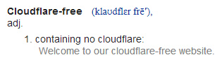

# Cloudflareに抵抗するためにあなたは何ができますか？

| 🖼 | 🖼 | 🖼 |
| --- | --- | --- |
|  |  |  |


1974年11月13日に生まれたマシューブラウニングプリンスは、CLEOのCLOUSFLAREのCEOと共同創設者です。

彼の豊かなお父さん、「ジョンB.王子」のおかげで、彼はシカゴのラベルの学校とハーバードビジネススクール大学に参加しました。
王子はインターネット法を教え、スパム防止法と詐欺研究の専門家でした。 


"*I’d suggest this was armchair analysis by kids – it’s hard to take seriously.*" [t](https://www.theguardian.com/technology/2015/nov/19/cloudflare-accused-by-anonymous-helping-isis)

"*That was simply unfounded paranoia, pretty big difference.*"  [t](https://twitter.com/xxdesmus/status/992757936123359233)

"*We also work with Interpol and other non-US entities*" [t](https://twitter.com/eastdakota/status/1203028504184360960)

"*Watching hacker skids on Github squabble about trying to bypass Cloudflare's new anti-bot systems continues to be my daily amusement.* 🍿" [t](https://twitter.com/eastdakota/status/1273277839102656515)


---


<details>
<summary>私をクリックしてください

## ウェブサイトの消費者
</summary>


- あなたが好きなウェブサイトがCloudflareを使用している場合は、Cloudflareを使用しないように伝えてください。
  - Facebook、Reddit、Twitter、Mastodonなどのソーシャルメディアで泣き言を言っても違いはありません。 [アクションはハッシュタグよりも大きいです。](https://twitter.com/phyzonloop/status/1274132092490862594)
  - 自分を役立てたい場合は、ウェブサイトの所有者に連絡してみてください。

[Cloudflareは言った](https://github.com/Eloston/ungoogled-chromium/issues/783):
```
問題が発生した特定のサービスまたはサイトについて管理者に連絡し、経験を共有することをお勧めします。
```

[あなたがそれを求めなければ、ウェブサイトの所有者はこの問題を決して知りません。](../PEOPLE.md)


[成功例](https://counterpartytalk.org/t/turn-off-cloudflare-on-counterparty-co-plz/164/5).<br>
問題がありますか？ [今すぐ声を上げてください。](https://github.com/maraoz/maraoz.github.io/issues/1) 以下の例。

```
あなたは企業の検閲と大量監視を支援しているだけです。
http://crimeflare.eu.org
```

```
あなたのウェブページはCloudFlareのプライバシーを乱用するプライベートウォールガーデンにあります。
http://crimeflare.eu.org
```

- ウェブサイトのプライバシーポリシーをお読みください。
  - ウェブサイトがCloudflareの背後にある場合、またはウェブサイトがCloudflareに接続されたサービスを使用している場合。

「Cloudflare」とは何かを説明し、Cloudflareとデータを共有する許可を求める必要があります。 そうしないと、信頼が侵害されることになり、問題のWebサイトは回避する必要があります。

[許容できるプライバシーポリシーの例はこちらです](https://archive.is/bDlTz) ("Subprocessors" > "Entity Name")

```
あなたのプライバシーポリシーを読みましたが、Cloudflareという単語が見つかりません。
あなたが私のデータをCloudflareに供給し続けるならば、私はあなたとデータを共有することを拒否します。
http://crimeflare.eu.org
```

これは、Cloudflareという単語が含まれていないプライバシーポリシーの例です。
[Liberland Jobs](https://archive.is/daKIr) [privacy policy](https://docsend.com/view/feiwyte):


Cloudflareには独自のプライバシーポリシーがあります。
[Cloudflareは人々を晒すのが大好きです。](https://www.reddit.com/r/GamerGhazi/comments/2s64fe/be_wary_reporting_to_cloudflare/)

これは、Webサイトのサインアップフォームの良い例です。
AFAIK、ゼロのウェブサイトがこれを行います。あなたは彼らを信頼しますか？

```
「XYZにサインアップ」をクリックすると、利用規約とプライバシーに関する声明に同意したことになります。
また、Cloudflareとデータを共有することに同意し、cloudflareのプライバシーに関する声明にも同意します。
Cloudflareがあなたの情報を漏らしたり、あなたが私たちのサーバーに接続することを許可しない場合、それは私たちのせいではありません。 [*]

[ サインアップ ] [ 同意しません ]
```
[*] [PEOPLE.md](../PEOPLE.md)


- 彼らのサービスを利用しないようにしてください。 Cloudflareによって監視されていることを忘れないでください。
  - ["I'm in your TLS, sniffin' your passworz"](../image/iminurtls.jpg)

- 他のウェブサイトを検索します。 インターネット上には選択肢と機会があります！

- 友達にTorを毎日使うように説得してください。
  - 匿名性はオープンインターネットの標準であるべきです！
  - [Torプロジェクトはこのプロジェクトを嫌っていることに注意してください。](../HISTORY.md)

</details>

------

<details>
<summary>私をクリックしてください

## アドオン
</summary>

- お使いのブラウザがFirefox、Tor Browser、またはUngoogled Chromiumの場合は、以下のアドオンのいずれかを使用してください。
  - 他の新しいアドオンを追加したい場合は、最初にそれについて尋ねてください。


| 名前 | 開発者 | サポート | ブロックできます | 通知できます | Chrome |
| -------- | -------- | -------- | -------- | -------- | -------- |
| [Bloku Cloudflaron MITM-Atakon](../subfiles/about.bcma.md) | #Addon | [ ? ](http://crimeflare.eu.org/) | **はい**     | **はい**     |  **はい** |
| [Ĉu ligoj estas vundeblaj al MITM-atako?](../subfiles/about.ismm.md) | #Addon | [ ? ](http://crimeflare.eu.org/) | 番号     | **はい**     |  **はい** |
| [Ĉu ĉi tiuj ligoj blokos Tor-uzanton?](../subfiles/about.isat.md) | #Addon | [ ? ](http://crimeflare.eu.org/) | 番号     | **はい**     |  **はい** |
| [Block Cloudflare MITM Attack](https://trac.torproject.org/projects/tor/attachment/ticket/24351/block_cloudflare_mitm_attack-1.0.14.1-an%2Bfx.xpi)<br>[**DELETED BY TOR PROJECT**](../HISTORY.md) | nullius | [ ? ](../tool/block_cloudflare_mitm_fx), [Link](http://crimeflare.eu.org/) | **はい**     | **はい**     |  番号 |
| [TPRB](http://34ahehcli3epmhbu2wbl6kw6zdfl74iyc4vg3ja4xwhhst332z3knkyd.onion/) | Sw | [ ? ](http://34ahehcli3epmhbu2wbl6kw6zdfl74iyc4vg3ja4xwhhst332z3knkyd.onion/) | **はい**     | **はい**     |  番号 |
| [Detect Cloudflare](https://addons.mozilla.org/en-US/firefox/addon/detect-cloudflare/) | Frank Otto | [ ? ](https://github.com/traktofon/cf-detect) | 番号     | **はい**     |  番号 |
| [True Sight](https://addons.mozilla.org/en-US/firefox/addon/detect-cloudflare-plus/) | claustromaniac | [ ? ](https://github.com/claustromaniac/detect-cloudflare-plus) | 番号     | **はい**     |  番号 |
| [Which Cloudflare datacenter am I visiting?](https://addons.mozilla.org/en-US/firefox/addon/cf-pop/) | 依云 | [ ? ](https://github.com/lilydjwg/cf-pop) | 番号     | **はい**     |  番号 |


- 「Decentraleyes」は「CDNJS（Cloudflare）」への接続を停止できます。
  - 多くのリクエストがネットワークに到達するのを防ぎ、サイトが壊れないようにローカルファイルを提供します。
  - 開発者は答えた: "[very concerning indeed](https://github.com/Synzvato/decentraleyes/issues/236#issuecomment-352049501)", "[widespread usage severely centralizes the web](https://github.com/Synzvato/decentraleyes/issues/251#issuecomment-366752049)"

- [認証局（CA）からCloudflare証明書を削除または不信にすることもできます。](https://www.ssl.com/how-to/remove-root-certificate-firefox/)

</details>

------

<details>
<summary>私をクリックしてください

## ウェブサイトの所有者/ウェブ開発者
</summary>




- Cloudflareソリューション、期間を使用しないでください。
  - あなたはそれよりもうまくやれるでしょう？ [Cloudflareのサブスクリプション、プラン、ドメイン、またはアカウントを削除する方法は次のとおりです。](https://support.cloudflare.com/hc/en-us/articles/200167776-Removing-subscriptions-plans-domains-or-accounts)

| 🖼 | 🖼 |
| --- | --- |
|  |  |

- より多くの顧客が欲しいですか？ あなたは何をするべきか知っています。 ヒントは「境界線より上」です。
  - [こんにちは、あなたは「私たちはあなたのプライバシーを真剣に受け止めています」と書きましたが、私は「エラー403 Forbidden Anonymous ProxyNotAllowed」を受け取りました。](https://it.slashdot.org/story/19/02/19/0033255/stop-saying-we-take-your-privacy-and-security-seriously) なぜTorまたはVPNをブロックしているのですか？ そして、なぜあなたは一時的な電子メールをブロックしているのですか？


- Cloudflareを使用すると、停止の可能性が高くなります。 サーバーがダウンしている場合、またはCloudflareがダウンしている場合、訪問者はWebサイトにアクセスできません。
  - [Cloudflareがダウンすることはないと本当に思いましたか？](https://www.ibtimes.com/cloudflare-down-not-working-sites-producing-504-gateway-timeout-errors-2618008) [Another](https://twitter.com/Jedduff/status/1097875615997399040) [sample](https://twitter.com/search?f=tweets&vertical=default&q=Cloudflare%20is%20having%20problems). [Need more](../PEOPLE.md)?


- Cloudflareを使用して「APIサービス」、「ソフトウェア更新サーバー」、または「RSSフィード」をプロキシすると、顧客に害を及ぼします。 顧客から電話があり、「APIを使用できなくなりました」と言われましたが、何が起こっているのかわかりません。 Cloudflareは静かにあなたの顧客をブロックすることができます。 大丈夫だと思いますか？
  - 多くのRSSリーダークライアントとRSSリーダーオンラインサービスがあります。 人々に購読を許可しないのに、なぜRSSフィードを公開するのですか？


- HTTPS証明書が必要ですか？ 「Let'sEncrypt」を使用するか、CA会社から購入してください。

- DNSサーバーが必要ですか？ 独自のサーバーをセットアップできませんか？ それらはどうですか: [Hurricane Electric Free DNS](https://dns.he.net/), [Dyn.com](https://dyn.com/dns/), [1984 Hosting](https://www.1984hosting.com/), [Afraid.Org (TORを使用している場合、管理者はアカウントを削除します)](https://freedns.afraid.org/)

- ホスティングサービスをお探しですか？ 無料のみ？ それらはどうですか: [Onion Service](http://vww6ybal4bd7szmgncyruucpgfkqahzddi37ktceo3ah7ngmcopnpyyd.onion/en/security/network-security/tor/onionservices-best-practices), [Free Web Hosting Area](https://freewha.com/), [Autistici/Inventati Web Site Hosting](https://www.autinv5q6en4gpf4.onion/services/website), [Github Pages](https://pages.github.com/), [Surge](https://surge.sh/)
  - [Cloudflareの代替](../subfiles/cloudflare-alternatives.md)

- 「cloudflare-ipfs.com」を使用していますか？ [Cloudflare IPFSが悪いことを知っていますか？](../PEOPLE.md)

- サーバーにOWASPやFail2BanなどのWebアプリケーションファイアウォールをインストールし、適切に構成します。
  - Torをブロックすることは解決策ではありません。小さな悪いユーザーのためだけに全員を罰しないでください。

- 「CloudflareWarp」ユーザーがあなたのウェブサイトにアクセスするのをリダイレクトまたはブロックします。 そして、可能であれば理由を提供してください。

> IPリスト: "[Cloudflareの現在のIP範囲](cloudflare_inc/)"

> A: それらをブロックするだけです

```
server {
...
deny 173.245.48.0/20;
deny 103.21.244.0/22;
deny 103.22.200.0/22;
deny 103.31.4.0/22;
deny 141.101.64.0/18;
deny 108.162.192.0/18;
deny 190.93.240.0/20;
deny 188.114.96.0/20;
deny 197.234.240.0/22;
deny 198.41.128.0/17;
deny 162.158.0.0/15;
deny 104.16.0.0/12;
deny 172.64.0.0/13;
deny 131.0.72.0/22;
deny 2400:cb00::/32;
deny 2606:4700::/32;
deny 2803:f800::/32;
deny 2405:b500::/32;
deny 2405:8100::/32;
deny 2a06:98c0::/29;
deny 2c0f:f248::/32;
...
}
```

> B: 警告ページにリダイレクトする

```
http {
...
geo $iscf {
default 0;
173.245.48.0/20 1;
103.21.244.0/22 1;
103.22.200.0/22 1;
103.31.4.0/22 1;
141.101.64.0/18 1;
108.162.192.0/18 1;
190.93.240.0/20 1;
188.114.96.0/20 1;
197.234.240.0/22 1;
198.41.128.0/17 1;
162.158.0.0/15 1;
104.16.0.0/12 1;
172.64.0.0/13 1;
131.0.72.0/22 1;
2400:cb00::/32 1;
2606:4700::/32 1;
2803:f800::/32 1;
2405:b500::/32 1;
2405:8100::/32 1;
2a06:98c0::/29 1;
2c0f:f248::/32 1;
}
...
}

server {
...
if ($iscf) {rewrite ^ https://example.com/cfwsorry.php;}
...
}

<?php
header('HTTP/1.1 406 Not Acceptable');
echo <<<CLOUDFLARED
Thank you for visiting ourwebsite.com!<br />
We are sorry, but we can't serve you because your connection is being intercepted by Cloudflare.<br />
Please read http://crimeflare.eu.org for more information.<br />
CLOUDFLARED;
die();
```

- 自由を信じて匿名ユーザーを歓迎する場合は、Tor OnionServiceまたはI2Pをインサイトでセットアップしてください。

- 他のClearnet / Torデュアルウェブサイト運営者にアドバイスを求め、匿名の友達を作りましょう！

</details>

------

<details>
<summary>私をクリックしてください

## ソフトウェアユーザー
</summary>


- DiscordはCloudFlareを使用しています。 代替案？ おすすめ [**Briar** (Android)](https://f-droid.org/en/packages/org.briarproject.briar.android/), [Ricochet (PC)](https://ricochet.im/), [Tox + Tor (Android/PC)](https://tox.chat/download.html)
  - BriarにはTorデーモンが含まれているため、Orbotをインストールする必要はありません。
  - Qwtch開発者、Open Privacyは、通知なしにgitサービスからstop_cloudflareプロジェクトを削除しました。

- Debian GNU / Linuxまたはその派生物を使用している場合は、サブスクライブしてください: [bug #831835](https://bugs.debian.org/cgi-bin/bugreport.cgi?bug=831835). そして、可能であれば、パッチの検証を支援し、メンテナがそれを受け入れるべきかどうかについて正しい結論に達するのを支援します。

- これらのブラウザを常にお勧めします。

| 名前 | 開発者 | サポート | コメント |
| -------- | -------- | -------- | -------- |
| [Ungoogled-Chromium](https://ungoogled-software.github.io/ungoogled-chromium-binaries/) | Eloston | [ ? ](https://github.com/Eloston/ungoogled-chromium) | PC (Win, Mac, Linux)  _!Tor_ |
| [Bromite](https://www.bromite.org/fdroid) | Bromite | [ ? ](https://github.com/bromite/bromite/issues) | Android  _!Tor_ |
| [Tor Browser](https://www.torproject.org/download/) | Tor Project | [ ? ](https://support.torproject.org/) | PC (Win, Mac, Linux)  _Tor_|
| [Tor Browser Android](https://www.torproject.org/download/) | Tor Project | [ ? ](https://support.torproject.org/) | Android  _Tor_|
| [Onion Browser](https://itunes.apple.com/us/app/onion-browser/id519296448?mt=8) | Mike Tigas | [ ? ](https://github.com/OnionBrowser/OnionBrowser/issues) | Apple iOS  _Tor_|
| [GNU/Icecat](https://www.gnu.org/software/gnuzilla/) | GNU | [ ? ](https://www.gnu.org/software/gnuzilla/) | PC (Linux) |
| [IceCatMobile](https://f-droid.org/en/packages/org.gnu.icecat/) | GNU | [ ? ](https://lists.gnu.org/mailman/listinfo/bug-gnuzilla) | Android |
| [Iridium Browser](https://iridiumbrowser.de/about/) | Iridium | [ ? ](https://github.com/iridium-browser/iridium-browser/) | PC (Win, Mac, Linux, OpenBSD) |


他のソフトウェアのプライバシーは不完全です。 これは、Torブラウザが「完璧」であるという意味ではありません。
インターネットとテクノロジーには、100％安全でも100％プライベートでもありません。

- Torを使いたくないですか？ Torデーモンで任意のブラウザを使用できます。
  - [Torプロジェクトはこれを好まないことに注意してください。](https://support.torproject.org/tbb/tbb-9/) 可能であれば、Torブラウザを使用してください。
- [TorでChromiumを使用する方法](../subfiles/chromium_tor.md)


他のソフトウェアのプライバシーについて話しましょう。

- [本当にFirefoxを使用する必要がある場合は、「FirefoxESR」を選択してください。](https://www.mozilla.org/en-US/firefox/organizations/)
  - [Firefox-スパイウェアウォッチドッグ](https://spyware.neocities.org/articles/firefox.html)
  - [Firefoxは言論の自由を拒否し、言論の自由を禁止します](https://web.archive.org/web/20200423010026/https://reclaimthenet.org/firefox-rejects-free-speech-bans-free-speech-commenting-plugin-dissenter-from-its-extensions-gallery/)
  - ["100以上の反対票。ソフトウェア会社に固執するように頼んでいるようです...ソフトウェアは最近あまりにも多すぎます。"](https://old.reddit.com/r/firefox/comments/gutdiw/weve_got_work_to_do_the_mozilla_blog/fslbbb6/)
  - [ええと、FirefoxがURLバーにスポンサーリンクを表示するのはなぜですか？](https://www.reddit.com/r/firefox/comments/jybx2w/uh_why_is_firefox_showing_me_sponsored_links_in/)
  - [Mozilla-悪魔の化身](https://digdeeper.neocities.org/ghost/mozilla.html)

- [MozillaはCloudflareサービスを使用していることを忘れないでください。](https://www.robtex.com/dns-lookup/www.mozilla.org) [彼らはまた彼らの製品でCloudflareのDNSサービスを使用しています。](https://www.theregister.co.uk/2018/03/21/mozilla_testing_dns_encryption/)

- [Mozillaはこのチケットを公式に拒否しました。](https://bugzilla.mozilla.org/show_bug.cgi?id=1426618)

- [FirefoxFocusは冗談です。](https://github.com/mozilla-mobile/focus-android/issues/1743) [彼らはテレメトリをオフにすることを約束しましたが、それを変更しました。](https://github.com/mozilla-mobile/focus-android/issues/4210)

- [PaleMoon / Basilisk開発者はCloudflareが大好きです。](https://github.com/mozilla-mobile/focus-android/issues/1743#issuecomment-345993097)
  - [Pale Moonのアーカイブサーバーが18か月間、マルウェアをハッキングして拡散しました](https://www.reddit.com/r/privacytoolsIO/comments/cc808y/pale_moons_archive_server_hacked_and_spread/)
  - 彼はTorユーザーも嫌いです - "[Torに対して敵対的にしましょう。非常に高い悪用要因を考えると、ほとんどのサイトはTorに対して敵対的であるはずだと思います。](https://github.com/yacy/yacy_search_server/issues/314#issuecomment-565932097)"

- [Waterfoxには深刻な「電話の家」の問題があります](https://spyware.neocities.org/articles/waterfox.html)

- [GoogleChromeはスパイウェアです。](https://www.gnu.org/proprietary/malware-google.en.html)
  - [Googleはあなたの活動をプロファイリングします。](https://spyware.neocities.org/articles/chrome.html)

- [SRWare Ironは、ホーム接続を行う電話が多すぎます。](https://spyware.neocities.org/articles/iron.html) また、Googleドメインに接続します。

- [ブレイブブラウザはFacebook / Twitterトラッカーをホワイトリストに登録します。](https://www.bleepingcomputer.com/news/security/facebook-twitter-trackers-whitelisted-by-brave-browser/)
  - [ここにもっと問題があります。](https://spyware.neocities.org/articles/brave.html)
  - [バイナンスアフィリエイトID](https://twitter.com/cryptonator1337/status/1269594587716374528)

- [Microsoft Edgeを使用すると、Facebookはユーザーの背後でFlashコードを実行できます。](https://www.zdnet.com/article/microsoft-edge-lets-facebook-run-flash-code-behind-users-backs/)

- [Vivaldiはあなたのプライバシーを尊重しません。](https://spyware.neocities.org/articles/vivaldi.html)

- [Operaスパイウェアレベル：非常に高い](https://spyware.neocities.org/articles/opera.html)

- Apple iOS: [iOSはマルウェアであることが主な理由で、iOSを使用するべきではありません。](https://www.gnu.org/proprietary/malware-apple.html)

したがって、上記の表のみをお勧めします。他には何もありません。

</details>

------

<details>
<summary>私をクリックしてください

## MozillaFirefoxユーザー
</summary>


- 「FirefoxNightly」は、オプトアウト方式なしでデバッグレベルの情報をMozillaサーバーに送信します。
  - [MozillaサーバーはCloudflareを使用しています](https://www.digwebinterface.com/?hostnames=www.mozilla.org%0D%0Amozilla.cloudflare-dns.com&type=&ns=resolver&useresolver=8.8.4.4&nameservers=)

- FirefoxがMozillaサーバーに接続することを禁止することができます。
  - [Mozillaのポリシーテンプレートガイド](https://github.com/mozilla/policy-templates/blob/master/README.md)
  - Mozillaは自分自身をホワイトリストに登録するのが好きなので、このトリックは後のバージョンでは機能しなくなる可能性があることに注意してください。
  - ファイアウォールとDNSフィルターを使用して、それらを完全にブロックします。

"`/distribution/policies.json`"

>     "WebsiteFilter": {
> 		"Block": [
> 		"*://*.mozilla.com/*",
> 		"*://*.mozilla.net/*",
> 		"*://*.mozilla.org/*",
> 		"*://webcompat.com/*",
> 		"*://*.firefox.com/*",
> 		"*://*.thunderbird.net/*",
> 		"*://*.cloudflare.com/*"
> 		]
>     },


- ~~Cloudflareを使用しないように伝えて、mozillaのトラッカーのバグを報告してください。~~ bugzillaに関するバグレポートがありました。多くの人が懸念を表明しましたが、バグは2018年に管理者によって隠されました。

- FirefoxでDoHを無効にすることができます。
  - [FirefoxのデフォルトのDNSプロバイダーを変更する](../subfiles/change-firefox-dns.md)


- [非ISPDNSを使用する場合は、OpenNIC Tier2DNSサービスまたは非CloudflareDNSサービスの使用を検討してください。](https://wiki.opennic.org/start)

  - DNSでCloudflareをブロックします。 [Crimeflare DNS](../subfiles/service.publicdns.md)

- TorをDNSリゾルバーとして使用できます。 [Torの専門家でない場合は、ここで質問してください。](https://tor.stackexchange.com/)

> **どうやって？**
> 1. Torをダウンロードしてコンピューターにインストールします。
> 2. この行を「torrc」ファイルに追加します。
> DNSPort 127.0.0.1:53
> 3. Torを再起動します。
> 4. コンピューターのDNSサーバーを「127.0.0.1」に設定します。

</details>

------

<details>
<summary>私をクリックしてください

## アクション
</summary>


- Cloudflareの危険性について周りの人に伝えてください。

- [このリポジトリの改善にご協力ください。](http://crimeflare.eu.org)
  - 両方のリスト、それに対する議論と詳細。

- [Cloudflare（および同様の会社）で問題が発生した場所を文書化して非常に公開し、そうするときは必ずこのリポジトリに言及してください](http://crimeflare.eu.org) :)

- デフォルトでTorを使用する人を増やして、世界のさまざまな部分の視点からWebを体験できるようにします。

- Cloudflareから世界を解放することに専念するソーシャルメディアとミートスペースのグループを開始します。

- 必要に応じて、このリポジトリ上のこれらのグループにリンクします。これは、グループとして一緒に作業することを調整するための場所になります。

- [Cloudflareの意味のある非企業の代替手段を提供できる協同組合を開始します。](../subfiles/cloudflare-alternatives.md)

- 少なくともCloudflareに対して多層防御を提供するのに役立つ代替案を教えてください。

- Cloudflareをご利用の場合は、プライバシー設定を行い、違反するのを待ちます。
  - [次に、それらをスパム対策/プライバシー違反の料金で請求します。](https://twitter.com/thexpaw/status/1108424723233419264)

- アメリカ合衆国にいて、問題のWebサイトが銀行または会計士である場合は、グラム・リーチ・ブライリー法または障害を持つアメリカ人法に基づいて法的な圧力をかけ、どこまで到達できるかを報告してください。 。

- ウェブサイトが政府のサイトである場合は、米国憲法修正第1条に基づいて法的な圧力をかけるようにしてください。

- EU市民の場合は、一般データ保護規則に基づいて個人情報を送信するためにWebサイトに連絡してください。彼らがあなたにあなたの情報を提供することを拒否した場合、それは法律違反です。

- ウェブサイトでサービスを提供していると主張する企業の場合は、消費者保護団体やBBBに「虚偽の広告」として報告してみてください。 CloudflareのウェブサイトはCloudflareサーバーによって提供されます。

- [ITUは、米国の文脈で、Cloudflareが十分に大きくなり始めており、独占禁止法が適用される可能性があることを示唆しています。](https://www.itu.int/en/ITU-T/Workshops-and-Seminars/20181218/Documents/Geoff_Huston_Presentation.pdf)

- GNU GPLバージョン4には、そのようなサービスの背後にソースコードを保存することに対する規定が含まれている可能性があり、すべてのGPLv4以降のプログラムでは、少なくともソースコードはTorユーザーを差別しない媒体を介してアクセスできる必要があります。

</details>

------

### コメント

```
抵抗には常に希望があります。

抵抗は肥沃です。

より暗い結果のいくつかでさえ、抵抗の行為そのものが、結果として生じる異所性の現状を不安定にし続けるように私たちを訓練します。

抵抗する！
```

```
いつか、私たちがこれを書いた理由を理解するでしょう。
```

```
これについて未来的なことは何もありません。私たちはすでに負けています。
```

### さて、今日は何をしましたか？


