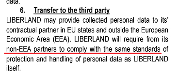

# რა შეგიძლიათ გააკეთოთ Cloudflare– ს წინააღმდეგობის გაწევისთვის?

| 🖼 | 🖼 | 🖼 |
| --- | --- | --- |
|  |  |  |


Matthew Browning Prince, naskita la 13an de novembro 1974, estas la ĉefoficisto kaj kunfondinto de Cloudflaron.

Danke al lia riĉa paĉjo, "John B. Prince", li ĉeestis la Universitaton de Ĉikago Leĝlernejo kaj Harvard Komerclernejo.
Princo instruis Interretan leĝon kaj estis specialisto pri kontraŭ-spamaj leĝoj kaj Fraŭdo-esploroj.


"*I’d suggest this was armchair analysis by kids – it’s hard to take seriously.*" [t](https://www.theguardian.com/technology/2015/nov/19/cloudflare-accused-by-anonymous-helping-isis)

"*That was simply unfounded paranoia, pretty big difference.*"  [t](https://twitter.com/xxdesmus/status/992757936123359233)

"*We also work with Interpol and other non-US entities*" [t](https://twitter.com/eastdakota/status/1203028504184360960)

"*Watching hacker skids on Github squabble about trying to bypass Cloudflare's new anti-bot systems continues to be my daily amusement.* 🍿" [t](https://twitter.com/eastdakota/status/1273277839102656515)


---


<details>
<summary>დამაკლიკე

## ვებსაიტის მომხმარებელი
</summary>


- თუ თქვენთვის სასურველი ვებსაიტი იყენებს Cloudflare- ს, უთხარით, რომ არ გამოიყენონ Cloudflare.
  - სოციალურ ქსელებში, როგორიცაა Facebook, Reddit, Twitter ან Mastodon, წუწუნი არ აქვს მნიშვნელობა. [მოქმედებები უფრო ხმამაღალია, ვიდრე ჰეშთეგები.](https://twitter.com/phyzonloop/status/1274132092490862594)
  - შეეცადეთ დაუკავშირდეთ ვებ – გვერდის მფლობელს, თუ გსურთ გახდეთ სასარგებლო.

[თქვა Cloudflare- მ](https://github.com/Eloston/ungoogled-chromium/issues/783):
```
ჩვენ გირჩევთ, რომ დაუკავშირდით ადმინისტრატორებს კონკრეტული სერვისების ან საიტებისთვის, რომლებთან დაკავშირებითაც გიქმნით პრობლემები და გაუზიარეთ თქვენი გამოცდილება.
```

[თუ ამას არ ითხოვთ, ვებსაიტის მფლობელმა არასოდეს იცის ეს პრობლემა.](../PEOPLE.md)


[წარმატებული მაგალითი](https://counterpartytalk.org/t/turn-off-cloudflare-on-counterparty-co-plz/164/5).<br>
პრობლემა გაქვს? [ახლავე ასწიე ხმა.](https://github.com/maraoz/maraoz.github.io/issues/1) მაგალითი ქვემოთ.

```
თქვენ უბრალოდ ეხმარებით კორპორაციულ ცენზურას და მასობრივ მეთვალყურეობას.
http://crimeflare.eu.org
```

```
თქვენი ვებსაიტი დაცულია კონფიდენციალურობის ბოროტად გამოყენების CloudFlare კერძო გალავნის ბაღში.
http://crimeflare.eu.org
```

- გარკვეული დრო დაუთმეთ ვებსაიტის კონფიდენციალურობის პოლიტიკის წაკითხვას.
  - თუ ვებსაიტი Cloudflare- ს უკან დგას ან ვებსაიტი იყენებს Cloudflare- სთან დაკავშირებულ მომსახურებებს.

მან უნდა განმარტოს, თუ რა არის "Cloudflare" და მოითხოვოს ნებართვა თქვენი მონაცემების Cloudflare- სთვის გაზიარებისთვის. ამის შეუსრულებლობა გამოიწვევს ნდობის დარღვევას და თავიდან უნდა იქნას აცილებული მოცემული ვებ – გვერდი.

[კონფიდენციალურობის პოლიტიკის მისაღები მაგალითია აქ](https://archive.is/bDlTz) ("Subprocessors" > "Entity Name")

```
მე წავიკითხე თქვენი კონფიდენციალურობის პოლიტიკა და ვერ ვპოულობ სიტყვას Cloudflare.
მე უარს ვამბობ მონაცემების გაზიარებაზე, თუ თქვენ განაგრძობთ ჩემი მონაცემების Cloudflare მიწოდებას.
http://crimeflare.eu.org
```

ეს არის კონფიდენციალურობის პოლიტიკის მაგალითი, რომელსაც არ აქვს სიტყვა Cloudflare.
[Liberland Jobs](https://archive.is/daKIr) [privacy policy](https://docsend.com/view/feiwyte):



Cloudflare– ს აქვს საკუთარი კონფიდენციალურობის პოლიტიკა.
[Cloudflare უყვარს doxxing ადამიანი.](https://www.reddit.com/r/GamerGhazi/comments/2s64fe/be_wary_reporting_to_cloudflare/)

ეს კარგი მაგალითია ვებსაიტის რეგისტრაციის ფორმისთვის.
AFAIK, ნულოვანი ვებსაიტი ამას აკეთებს. ენდობით მათ?

```
„დარეგისტრირდით XYZ“ - ზე დაწკაპუნებით, თქვენ ეთანხმებით ჩვენი მომსახურების პირობებსა და კონფიდენციალურობის დებულებას.
თქვენ ასევე ეთანხმებით თქვენი მონაცემების Cloudflare- ს გაზიარებას და ასევე ეთანხმებით Cloudflare- ს კონფიდენციალურობის დებულებას.
თუ Cloudflare– მა გაჟონა თქვენი ინფორმაცია ან არ მოგცემთ საშუალებას დაუკავშირდეთ ჩვენს სერვერებს, ეს ჩვენი ბრალი არ არის. [*]

[ დარეგისტრირება ] [ არ ვეთანხმები ]
```
[*] [PEOPLE.md](../PEOPLE.md)


- შეეცადეთ არ გამოიყენოთ მათი სერვისი. გახსოვდეთ, რომ Cloudflare გიყურებთ.
  - ["I'm in your TLS, sniffin' your passworz"](../image/iminurtls.jpg)

- სხვა ვებსაიტის ძებნა. ინტერნეტში არსებობს ალტერნატივები და შესაძლებლობები!

- დაარწმუნე შენი მეგობრები, გამოიყენონ Tor ყოველდღიურად.
  - ანონიმურობა უნდა იყოს ღია ინტერნეტის სტანდარტი!
  - [გაითვალისწინეთ, რომ Tor პროექტს არ მოსწონს ეს პროექტი.](../HISTORY.md)

</details>

------

<details>
<summary>დამაკლიკე

## დამატებები
</summary>

- თუ თქვენი ბრაუზერი არის Firefox, Tor Browser ან Ungoogled Chromium გამოიყენეთ ქვემოთ მოცემული ერთ-ერთი დანამატი.
  - თუ გსურთ სხვა ახალი დანამატის დამატება, ჯერ იკითხეთ ამის შესახებ.


| სახელი | შემქმნელი | მხარდაჭერა | შეუძლია დაბლოკოს | შეუძლია შეატყობინოს | Chrome |
| -------- | -------- | -------- | -------- | -------- | -------- |
| [Bloku Cloudflaron MITM-Atakon](../subfiles/about.bcma.md) | #Addon | [ ? ](http://crimeflare.eu.org/) | **დიახ**     | **დიახ**     |  **დიახ** |
| [Ĉu ligoj estas vundeblaj al MITM-atako?](../subfiles/about.ismm.md) | #Addon | [ ? ](http://crimeflare.eu.org/) | არა     | **დიახ**     |  **დიახ** |
| [Ĉu ĉi tiuj ligoj blokos Tor-uzanton?](../subfiles/about.isat.md) | #Addon | [ ? ](http://crimeflare.eu.org/) | არა     | **დიახ**     |  **დიახ** |
| [Block Cloudflare MITM Attack](https://trac.torproject.org/projects/tor/attachment/ticket/24351/block_cloudflare_mitm_attack-1.0.14.1-an%2Bfx.xpi)<br>[**DELETED BY TOR PROJECT**](../HISTORY.md) | nullius | [ ? ](../tool/block_cloudflare_mitm_fx), [Link](http://crimeflare.eu.org/) | **დიახ**     | **დიახ**     |  არა |
| [TPRB](http://34ahehcli3epmhbu2wbl6kw6zdfl74iyc4vg3ja4xwhhst332z3knkyd.onion/) | Sw | [ ? ](http://34ahehcli3epmhbu2wbl6kw6zdfl74iyc4vg3ja4xwhhst332z3knkyd.onion/) | **დიახ**     | **დიახ**     |  არა |
| [Detect Cloudflare](https://addons.mozilla.org/en-US/firefox/addon/detect-cloudflare/) | Frank Otto | [ ? ](https://github.com/traktofon/cf-detect) | არა     | **დიახ**     |  არა |
| [True Sight](https://addons.mozilla.org/en-US/firefox/addon/detect-cloudflare-plus/) | claustromaniac | [ ? ](https://github.com/claustromaniac/detect-cloudflare-plus) | არა     | **დიახ**     |  არა |
| [Which Cloudflare datacenter am I visiting?](https://addons.mozilla.org/en-US/firefox/addon/cf-pop/) | 依云 | [ ? ](https://github.com/lilydjwg/cf-pop) | არა     | **დიახ**     |  არა |


- "Decentraleyes" - ს შეუძლია შეაჩეროს კავშირი "CDNJS (Cloudflare)".
  - ეს ხელს უშლის ბევრ მოთხოვნას ქსელებში მოხვედრისგან და ემსახურება ადგილობრივ ფაილებს საიტების გაწყვეტისგან.
  - დეველოპერმა უპასუხა: "[very concerning indeed](https://github.com/Synzvato/decentraleyes/issues/236#issuecomment-352049501)", "[widespread usage severely centralizes the web](https://github.com/Synzvato/decentraleyes/issues/251#issuecomment-366752049)"

- [თქვენ ასევე შეგიძლიათ წაშალოთ ან არ ენდოთ Cloudflare სერთიფიკატს თქვენი სასერთიფიკატო ორგანოსგან (CA).](https://www.ssl.com/how-to/remove-root-certificate-firefox/)

</details>

------

<details>
<summary>დამაკლიკე

## ვებსაიტის მფლობელი / ვებ დეველოპერი
</summary>


- არ გამოიყენოთ Cloudflare ხსნარი, პერიოდი.
  - ამაზე უკეთესობის გაკეთება შეგიძლია, არა? [აქ მოცემულია, თუ როგორ შეგიძლიათ წაშალოთ Cloudflare გამოწერები, გეგმები, დომენები ან ანგარიშები.](https://support.cloudflare.com/hc/en-us/articles/200167776-Removing-subscriptions-plans-domains-or-accounts)

| 🖼 | 🖼 |
| --- | --- |
|  |  |

- მეტი მომხმარებელი გინდა? თქვენ იცით რა უნდა გააკეთოთ. მინიშნება არის "ხაზის ზემოთ".
  - [გამარჯობა, თქვენ დაწერეთ "ჩვენ სერიოზულად ვეკიდებით თქვენს კონფიდენციალურობას", მაგრამ მე მივიღე "შეცდომა 403 აკრძალული ანონიმური მარიონეტული არ არის დაშვებული".](https://it.slashdot.org/story/19/02/19/0033255/stop-saying-we-take-your-privacy-and-security-seriously) რატომ დაბლოკავთ Tor- ს ან VPN- ს? და რატომ იბლოკება დროებითი ელ.ფოსტა?


- Cloudflare– ის გამოყენება გაზრდის გათიშვის ალბათობას. სტუმრებს არ შეუძლიათ თქვენს ვებსაიტზე წვდომა, თუ სერვერი გათიშულია ან Cloudflare გათიშულია.
  - [მართლა ფიქრობთ, რომ Cloudflare არასდროს იშლება?](https://www.ibtimes.com/cloudflare-down-not-working-sites-producing-504-gateway-timeout-errors-2618008) [Another](https://twitter.com/Jedduff/status/1097875615997399040) [sample](https://twitter.com/search?f=tweets&vertical=default&q=Cloudflare%20is%20having%20problems). [Need more](../PEOPLE.md)?


- Cloudflare- ის გამოყენება თქვენი "API სერვისის", "პროგრამული უზრუნველყოფის განახლების სერვერის" ან "RSS არხის" პროქსიკისთვის ზიანს აყენებს თქვენს მომხმარებელს. მომხმარებელმა დაგირეკა და უთხრა: "შენი API აღარ შემიძლია", და შენ წარმოდგენა არ გაქვს რა ხდება. Cloudflare– ს შეუძლია ჩუმად დაბლოკოს თქვენი მომხმარებელი. როგორ ფიქრობთ, კარგია?
  - უამრავი RSS მკითხველი კლიენტი და RSS მკითხველი ონლაინ სერვისია. რატომ აქვეყნებთ RSS არხს, თუ ხალხს გამოწერის უფლებას არ აძლევთ?


- გჭირდებათ HTTPS სერთიფიკატი? გამოიყენეთ "მოდით დაშიფვრა" ან უბრალოდ იყიდეთ CA კომპანიისგან.

- გჭირდებათ DNS სერვერი? ვერ დააყენეთ თქვენი სერვერი? მათ შესახებ: [Hurricane Electric Free DNS](https://dns.he.net/), [Dyn.com](https://dyn.com/dns/), [1984 Hosting](https://www.1984hosting.com/), [Afraid.Org (თუ ადმინისტრატორი იყენებთ, ადმინისტრატორი წაშლის თქვენს ანგარიშს)](https://freedns.afraid.org/)

- ეძებთ ჰოსტინგის სერვისს? მხოლოდ უფასოა? მათ შესახებ: [Onion Service](http://vww6ybal4bd7szmgncyruucpgfkqahzddi37ktceo3ah7ngmcopnpyyd.onion/en/security/network-security/tor/onionservices-best-practices), [Free Web Hosting Area](https://freewha.com/), [Autistici/Inventati Web Site Hosting](https://www.autinv5q6en4gpf4.onion/services/website), [Github Pages](https://pages.github.com/), [Surge](https://surge.sh/)
  - [Cloudflare- ის ალტერნატივა](../subfiles/cloudflare-alternatives.md)

- იყენებთ "cloudflare-ipfs.com" - ს? [იცით თუ არა Cloudflare IPFS ცუდი?](../PEOPLE.md)

- თქვენს სერვერზე დააინსტალირეთ ვებ აპლიკაციის Firewall, როგორიცაა OWASP და Fail2Ban და გამართეთ მისი კონფიგურაცია.
  - Tor- ის დაბლოკვა არ არის გამოსავალი. ნუ დასჯით ყველას მხოლოდ მცირე ცუდი მომხმარებლებისთვის.

- გადაამისამართეთ ან დაბლოკეთ "Cloudflare Warp" მომხმარებლების წვდომა თქვენს ვებსაიტზე. თუ მიზეზი შეგიძიათ.

> IP სია: "[Cloudflare- ის ამჟამინდელი IP დიაპაზონები](cloudflare_inc/)"

> A: უბრალოდ დაბლოკეთ ისინი

```
server {
...
deny 173.245.48.0/20;
deny 103.21.244.0/22;
deny 103.22.200.0/22;
deny 103.31.4.0/22;
deny 141.101.64.0/18;
deny 108.162.192.0/18;
deny 190.93.240.0/20;
deny 188.114.96.0/20;
deny 197.234.240.0/22;
deny 198.41.128.0/17;
deny 162.158.0.0/15;
deny 104.16.0.0/12;
deny 172.64.0.0/13;
deny 131.0.72.0/22;
deny 2400:cb00::/32;
deny 2606:4700::/32;
deny 2803:f800::/32;
deny 2405:b500::/32;
deny 2405:8100::/32;
deny 2a06:98c0::/29;
deny 2c0f:f248::/32;
...
}
```

> B: გადამისამართების გვერდზე გადამისამართება

```
http {
...
geo $iscf {
default 0;
173.245.48.0/20 1;
103.21.244.0/22 1;
103.22.200.0/22 1;
103.31.4.0/22 1;
141.101.64.0/18 1;
108.162.192.0/18 1;
190.93.240.0/20 1;
188.114.96.0/20 1;
197.234.240.0/22 1;
198.41.128.0/17 1;
162.158.0.0/15 1;
104.16.0.0/12 1;
172.64.0.0/13 1;
131.0.72.0/22 1;
2400:cb00::/32 1;
2606:4700::/32 1;
2803:f800::/32 1;
2405:b500::/32 1;
2405:8100::/32 1;
2a06:98c0::/29 1;
2c0f:f248::/32 1;
}
...
}

server {
...
if ($iscf) {rewrite ^ https://example.com/cfwsorry.php;}
...
}

<?php
header('HTTP/1.1 406 Not Acceptable');
echo <<<CLOUDFLARED
Thank you for visiting ourwebsite.com!<br />
We are sorry, but we can't serve you because your connection is being intercepted by Cloudflare.<br />
Please read http://crimeflare.eu.org for more information.<br />
CLOUDFLARED;
die();
```

- დააყენეთ Tor Onion Service ან I2P insite, თუ გჯერათ თავისუფლების და მიესალმებით ანონიმურ მომხმარებლებს.

- ითხოვეთ რჩევა Clearnet / Tor- ის ორმაგი ვებსაიტის ოპერატორებისგან და დაუმეგობრდით მეგობრებს!

</details>

------

<details>
<summary>დამაკლიკე

## პროგრამული უზრუნველყოფის მომხმარებელი
</summary>


- Discord იყენებს CloudFlare- ს. ალტერნატივები? Ჩვენ გირჩევთ [**Briar** (Android)](https://f-droid.org/en/packages/org.briarproject.briar.android/), [Ricochet (PC)](https://ricochet.im/), [Tox + Tor (Android/PC)](https://tox.chat/download.html)
  - Briar მოიცავს Tor daemon– ს, ასე რომ თქვენ არ გჭირდებათ Orbot– ის დაყენება.
  - Qwtch დეველოპერებმა, Open Privacy– მა, გაფრთხილების გარეშე წაშალეს stop_cloudflare პროექტი git სერვისიდან.

- თუ იყენებთ Debian GNU / Linux- ს, ან რაიმე წარმოებულს, გამოიწერეთ ხელმოწერა: [bug #831835](https://bugs.debian.org/cgi-bin/bugreport.cgi?bug=831835). თუ შეგიძლიათ, დაეხმარეთ პატჩის გადამოწმებაში და დაეხმარეთ შემნახველს სწორი დასკვნის გაკეთებაში, მიიღებს თუ არა მას.

- ყოველთვის გირჩევთ ამ ბრაუზერებს.

| სახელი | შემქმნელი | მხარდაჭერა | კომენტარი |
| -------- | -------- | -------- | -------- |
| [Ungoogled-Chromium](https://ungoogled-software.github.io/ungoogled-chromium-binaries/) | Eloston | [ ? ](https://github.com/Eloston/ungoogled-chromium) | PC (Win, Mac, Linux)  _!Tor_ |
| [Bromite](https://www.bromite.org/fdroid) | Bromite | [ ? ](https://github.com/bromite/bromite/issues) | Android  _!Tor_ |
| [Tor Browser](https://www.torproject.org/download/) | Tor Project | [ ? ](https://support.torproject.org/) | PC (Win, Mac, Linux)  _Tor_|
| [Tor Browser Android](https://www.torproject.org/download/) | Tor Project | [ ? ](https://support.torproject.org/) | Android  _Tor_|
| [Onion Browser](https://itunes.apple.com/us/app/onion-browser/id519296448?mt=8) | Mike Tigas | [ ? ](https://github.com/OnionBrowser/OnionBrowser/issues) | Apple iOS  _Tor_|
| [GNU/Icecat](https://www.gnu.org/software/gnuzilla/) | GNU | [ ? ](https://www.gnu.org/software/gnuzilla/) | PC (Linux) |
| [IceCatMobile](https://f-droid.org/en/packages/org.gnu.icecat/) | GNU | [ ? ](https://lists.gnu.org/mailman/listinfo/bug-gnuzilla) | Android |
| [Iridium Browser](https://iridiumbrowser.de/about/) | Iridium | [ ? ](https://github.com/iridium-browser/iridium-browser/) | PC (Win, Mac, Linux, OpenBSD) |


სხვა პროგრამული უზრუნველყოფის კონფიდენციალურობა არასრულყოფილია. ეს არ ნიშნავს, რომ Tor ბრაუზერი არის "სრულყოფილი".
ინტერნეტში და ტექნოლოგიაში არ არის 100% უსაფრთხო და არც 100% პირადი.

- არ გსურთ Tor- ის გამოყენება? Tor daemon- ით შეგიძლიათ გამოიყენოთ ნებისმიერი ბრაუზერი.
  - [გაითვალისწინეთ, რომ Tor პროექტს ეს არ მოსწონს.](https://support.torproject.org/tbb/tbb-9/) თუ ამის შესაძლებლობა გაქვთ გამოიყენეთ Tor Browser.
- [როგორ გამოვიყენოთ Chromium Tor- ით](../subfiles/chromium_tor.md)


მოდით ვისაუბროთ სხვა პროგრამული უზრუნველყოფის კონფიდენციალობაზე.

- [თუ ნამდვილად გჭირდებათ Firefox- ის გამოყენება, აირჩიეთ "Firefox ESR".](https://www.mozilla.org/en-US/firefox/organizations/)
  - [Firefox - Spyware მაკონტროლებელი](https://spyware.neocities.org/articles/firefox.html)
  - [Firefox უარყოფს სიტყვის თავისუფლებას, კრძალავს სიტყვის თავისუფლებას](https://web.archive.org/web/20200423010026/https://reclaimthenet.org/firefox-rejects-free-speech-bans-free-speech-commenting-plugin-dissenter-from-its-extensions-gallery/)
  - ["100+ ხმის მიცემა როგორც ჩანს, პროგრამული უზრუნველყოფის კომპანიას სთხოვს, დაიცვას ... პროგრამული უზრუნველყოფა ამ დღეებში ძალიან ბევრია."](https://old.reddit.com/r/firefox/comments/gutdiw/weve_got_work_to_do_the_mozilla_blog/fslbbb6/)
  - [უჰ, რატომ მაჩვენებს Firefox სპონსორულ ბმულებს ჩემს URL ზოლში?](https://www.reddit.com/r/firefox/comments/jybx2w/uh_why_is_firefox_showing_me_sponsored_links_in/)
  - [Mozilla - ეშმაკის ხორცშესხმული](https://digdeeper.neocities.org/ghost/mozilla.html)

- [გახსოვდეთ, Mozilla იყენებს Cloudflare სერვისს.](https://www.robtex.com/dns-lookup/www.mozilla.org) [ისინი ასევე იყენებენ Cloudflare- ის DNS სერვისს თავიანთ პროდუქტზე.](https://www.theregister.co.uk/2018/03/21/mozilla_testing_dns_encryption/)

- [Mozilla– მ ოფიციალურად უარყო ეს ბილეთი.](https://bugzilla.mozilla.org/show_bug.cgi?id=1426618)

- [Firefox Focus ხუმრობაა.](https://github.com/mozilla-mobile/focus-android/issues/1743) [მათ პირობა დადეს, რომ ტელემეტრიას გამორთავდნენ, მაგრამ შეცვალეს.](https://github.com/mozilla-mobile/focus-android/issues/4210)

- [PaleMoon / Basilisk დეველოპერი უყვარს Cloudflare.](https://github.com/mozilla-mobile/focus-android/issues/1743#issuecomment-345993097)
  - [Pale Moon- ის არქივის სერვერმა 18 თვის განმავლობაში გატეხა და გაავრცელა მავნე პროგრამები](https://www.reddit.com/r/privacytoolsIO/comments/cc808y/pale_moons_archive_server_hacked_and_spread/)
  - მას ასევე სძულს Tor მომხმარებლები - "[დაე, ის მტრული იყოს Tor- ს მიმართ. მე ვფიქრობ, რომ საიტების უმეტესობა მტრული დამოკიდებულება უნდა ჰქონდეს Tor- ს მიმართ, მისი ძალიან მაღალი ბოროტად გამოყენების ფაქტორის გათვალისწინებით.](https://github.com/yacy/yacy_search_server/issues/314#issuecomment-565932097)"

- [Waterfox– ს აქვს "ტელეფონების სახლის" სერიოზული პრობლემა](https://spyware.neocities.org/articles/waterfox.html)

- [Google Chrome არის ჯაშუში პროგრამა.](https://www.gnu.org/proprietary/malware-google.en.html)
  - [Google ახდენს თქვენი აქტივობის პროფილს.](https://spyware.neocities.org/articles/chrome.html)

- [SRWare Iron ძალიან ბევრ ტელეფონს ამყარებს სახლის კავშირით.](https://spyware.neocities.org/articles/iron.html) ის ასევე უკავშირდება google დომენებს.

- [Brave Browser- ის თეთრი სიის Facebook / Twitter ტრეკერები.](https://www.bleepingcomputer.com/news/security/facebook-twitter-trackers-whitelisted-by-brave-browser/)
  - [აქ უფრო მეტი საკითხია.](https://spyware.neocities.org/articles/brave.html)
  - [binance შვილობილი ID](https://twitter.com/cryptonator1337/status/1269594587716374528)

- [Microsoft Edge საშუალებას აძლევს Facebook- ს გაუშვას Flash კოდი მომხმარებლების ზურგს უკან.](https://www.zdnet.com/article/microsoft-edge-lets-facebook-run-flash-code-behind-users-backs/)

- [ვივალდი არ პატივს სცემს შენს საიდუმლოებას.](https://spyware.neocities.org/articles/vivaldi.html)

- [ოპერის spyware დონე: ძალიან მაღალი](https://spyware.neocities.org/articles/opera.html)

- Apple iOS: [IOS საერთოდ არ უნდა გამოიყენოთ, ძირითადად იმიტომ, რომ ეს მავნე პროგრამაა.](https://www.gnu.org/proprietary/malware-apple.html)

ამიტომ ჩვენ გირჩევთ მხოლოდ ცხრილის ზემოთ. Არაფერი სხვა.

</details>

------

<details>
<summary>დამაკლიკე

## Mozilla Firefox მომხმარებელი
</summary>


- "Firefox Nightly" გააგზავნის გამართვის დონის ინფორმაციას Mozilla სერვერებზე უარის თქმის მეთოდის გარეშე.
  - [Mozilla სერვერები აჩერებენ Cloudflare- ს](https://www.digwebinterface.com/?hostnames=www.mozilla.org%0D%0Amozilla.cloudflare-dns.com&type=&ns=resolver&useresolver=8.8.4.4&nameservers=)

- შესაძლებელია Firefox– ის აკრძალვა Mozilla– ს სერვერებთან დაკავშირება.
  - [Mozilla- ს პოლიტიკის შაბლონების სახელმძღვანელო](https://github.com/mozilla/policy-templates/blob/master/README.md)
  - გაითვალისწინეთ, რომ ამ ხრიკმა შეიძლება შეწყვიტოს მუშაობა მოგვიანებით ვერსიაში, რადგან Mozilla- ს თავად უყვარს სიაში სიაში შეყვანა.
  - გამოიყენეთ Firewall და DNS ფილტრი, რომ მთლიანად დაბლოკოთ.

"`/distribution/policies.json`"

>     "WebsiteFilter": {
> 		"Block": [
> 		"*://*.mozilla.com/*",
> 		"*://*.mozilla.net/*",
> 		"*://*.mozilla.org/*",
> 		"*://webcompat.com/*",
> 		"*://*.firefox.com/*",
> 		"*://*.thunderbird.net/*",
> 		"*://*.cloudflare.com/*"
> 		]
>     },


- ~~შეატყობინეთ შეცდომას Mozilla- ს ტრეკერზე და უთხარით, რომ არ გამოიყენონ Cloudflare.~~ იყო შეცდომების შესახებ bugzilla. ბევრმა ადამიანმა გამოაქვეყნა შეშფოთება, თუმცა შეცდომა ადმინისტრაციამ 2018 წელს დამალა.

- შეგიძლიათ DoH გამორთოთ Firefox- ში.
  - [შეცვალეთ Firefox– ის ნაგულისხმევი DNS პროვაიდერი](../subfiles/change-firefox-dns.md)


- [თუ გსურთ გამოიყენოთ არა ISP DNS, გაითვალისწინეთ OpenNIC Tier2 DNS სერვისის ან Cloudflare ნებისმიერი DNS სერვისის გამოყენება.](https://wiki.opennic.org/start)

  - Cloudflare- ის დაბლოკვა DNS- ით. [Crimeflare DNS](../subfiles/service.publicdns.md)

- შეგიძლიათ გამოიყენოთ Tor როგორც DNS გადაჭრის. [თუ Tor- ის ექსპერტი არ ხართ, დასვით კითხვა აქ.](https://tor.stackexchange.com/)

> **Როგორ?**
> 1. ჩამოტვირთეთ Tor და დააინსტალირეთ თქვენს კომპიუტერში.
> 2. დაამატეთ ეს სტრიქონი "torrc" ფაილში.
> DNSPort 127.0.0.1:53
> 3. გადატვირთეთ Tor.
> 4. დააყენეთ თქვენი კომპიუტერის DNS სერვერი "127.0.0.1" - ზე.

</details>

------

<details>
<summary>დამაკლიკე

## მოქმედება
</summary>


- მოუყევით თქვენს გარშემომყოფებს Cloudflare- ის საშიშროების შესახებ.

- [დაეხმარეთ ამ საცავის გაუმჯობესებაში.](http://crimeflare.eu.org)
  - როგორც სიები, საწინააღმდეგო არგუმენტები და დეტალები.

- [დოკუმენტირება და საჯაროდ გასაჯაროება Cloudflare- ს (და მსგავსი კომპანიების) შეცდომასთან დაკავშირებით, დარწმუნდით, რომ აღნიშნეთ ეს საცავი ამის გაკეთებისას](http://crimeflare.eu.org) :)

- მოიძიეთ მეტი ადამიანი Tor- ს გამოყენებით, რომ მათ შეეძლოთ ინტერნეტის გამოცდილება მსოფლიოს სხვადასხვა კუთხიდან.

- დაიწყეთ ჯგუფები სოციალურ მედიასა და ხორცის სივრცეში, რომლებიც ეძღვნება სამყაროს Cloudflare– სგან გათავისუფლებას.

- საჭიროების შემთხვევაში, მიაბით ამ ჯგუფების ჯგუფებს ამ საცავში - ეს შეიძლება იყოს ჯგუფებად მუშაობის კოორდინაციის ადგილი.

- [დაიწყეთ თანამშრომლობა, რომელსაც შეუძლია Cloudflare- ის მნიშვნელოვანი არაკომერციული ალტერნატივა.](../subfiles/cloudflare-alternatives.md)

- გვაცნობეთ ნებისმიერი ალტერნატივა Cloudflare– სგან მრავალჯერადი ფენიანი დაცვის მინიმუმამდე დასახმარებლად.

- თუ Cloudflare მომხმარებელი ხართ, დააყენეთ თქვენი კონფიდენციალურობის პარამეტრები და დაელოდეთ, როდის დაარღვევს მათ.
  - [შემდეგ წაიყვანეთ სპამის საწინააღმდეგო / კონფიდენციალურობის დარღვევის ბრალდებით.](https://twitter.com/thexpaw/status/1108424723233419264)

- თუ თქვენ ამერიკის შეერთებულ შტატებში ხართ და ვებსაიტი არის ბანკი ან ბუღალტერი, შეეცადეთ მოახდინოთ იურიდიული ზეწოლა გრამ – ლეჩ – ბლილის კანონის, ან უნარშეზღუდული ამერიკელების კანონის შესაბამისად და გვითხარით, თუ რამდენად შორს მიდიხართ .

- თუ ვებსაიტი სამთავრობო საიტია, შეეცადეთ იურიდიული ზეწოლა მოახდინოთ აშშ-ს კონსტიტუციის 1-ლი შესწორების ქვეშ.

- თუ თქვენ ევროკავშირის მოქალაქე ხართ, დაუკავშირდით ვებ – გვერდს თქვენი პერსონალური ინფორმაციის გასაგზავნად მონაცემთა დაცვის ზოგადი რეგულაციის შესაბამისად. თუ ისინი უარს იტყვიან თქვენი ინფორმაციის გადმოცემაზე, ეს კანონის დარღვევაა.

- კომპანიებისთვის, რომლებიც აცხადებენ, რომ სთავაზობენ მომსახურებას თავიანთ ვებ – გვერდზე, შეეცადეთ აცნობონ მათ, როგორც "ყალბი რეკლამირება" მომხმარებელთა დაცვის ორგანიზაციებსა და BBB– სთვის Cloudflare ვებსაიტებს ემსახურებიან Cloudflare სერვერები.

- [ITU აშშ – ს კონტექსტში ვარაუდობს, რომ Cloudflare იწყებს იმდენად დიდ მასშტაბებს, რომ ანტიმონოპოლური კანონი შეიძლება დაეშვას მათზე.](https://www.itu.int/en/ITU-T/Workshops-and-Seminars/20181218/Documents/Geoff_Huston_Presentation.pdf)

- საფიქრებელია, რომ GNU GPL 4 ვერსია შეიძლება შეიცავდეს დებულებას, რომ ასეთი კოდი არ შეინახოს კოდის კოდი, რომელიც მოითხოვს ყველა GPLv4 და მოგვიანებით პროგრამებს, რომ მინიმუმ საწყისი კოდი იყოს ხელმისაწვდომი საშუალებით, რომელიც არ განასხვავებს Tor მომხმარებლებს.

</details>

------

### კომენტარები

```
ყოველთვის არის იმედი წინააღმდეგობისკენ.

წინააღმდეგობა ნაყოფიერია.

ზოგიერთი უფრო მუქი შედეგიც კი შეიძლება დადგეს, წინააღმდეგობის თვით მოქმედება გვარწმუნებს, რომ გავაგრძელოთ დესტოპიური სტატუს ქვოს დესტაბილიზაცია.

წინააღმდეგობა გაუწიეთ!
```

```
ოდესმე, მიხვდებით, რატომ დავწერეთ ეს.
```

```
ამაში არაფერია ფუტურისტული. ჩვენ უკვე წავაგეთ.
```

### ახლა რა გააკეთე დღეს?


