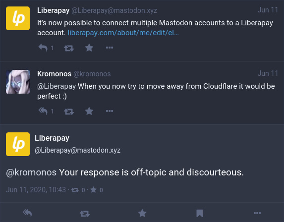
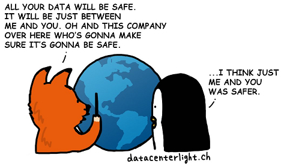

# Cloudflare-ге қарсы тұру үшін не істей аласыз?

| 🖼 | 🖼 | 🖼 |
| --- | --- | --- |
|  |  |  |


Matthew Browning Prince, naskita la 13an de novembro 1974, estas la ĉefoficisto kaj kunfondinto de Cloudflaron.

Danke al lia riĉa paĉjo, "John B. Prince", li ĉeestis la Universitaton de Ĉikago Leĝlernejo kaj Harvard Komerclernejo.
Princo instruis Interretan leĝon kaj estis specialisto pri kontraŭ-spamaj leĝoj kaj Fraŭdo-esploroj.


"*I’d suggest this was armchair analysis by kids – it’s hard to take seriously.*" [t](https://www.theguardian.com/technology/2015/nov/19/cloudflare-accused-by-anonymous-helping-isis)

"*That was simply unfounded paranoia, pretty big difference.*"  [t](https://twitter.com/xxdesmus/status/992757936123359233)

"*We also work with Interpol and other non-US entities*" [t](https://twitter.com/eastdakota/status/1203028504184360960)

"*Watching hacker skids on Github squabble about trying to bypass Cloudflare's new anti-bot systems continues to be my daily amusement.* 🍿" [t](https://twitter.com/eastdakota/status/1273277839102656515)


---


<details>
<summary>мені нұқыңыз

## Веб-сайт тұтынушысы
</summary>


- Егер сізге ұнайтын веб-сайт Cloudflare қолданып жатса, оларға Cloudflare қолданбауын айтыңыз.
  - Facebook, Reddit, Twitter немесе Mastodon сияқты әлеуметтік медиада қыңқылдаудың ешқандай айырмашылығы жоқ. [Әрекеттер хэштегтерге қарағанда күштірек.](https://twitter.com/phyzonloop/status/1274132092490862594)
  - Өзіңізді пайдалы еткіңіз келсе, веб-сайт иесімен байланысуға тырысыңыз.

[Cloudflare деді](https://github.com/Eloston/ungoogled-chromium/issues/783):
```
Сізге белгілі бір қызметтер немесе сайттар үшін әкімшілермен байланысып, тәжірибеңізбен бөлісуге кеңес береміз.
```

[Егер сіз оны сұрамасаңыз, веб-сайт иесі бұл мәселені ешқашан білмейді.](../PEOPLE.md)



[Сәтті мысал](https://counterpartytalk.org/t/turn-off-cloudflare-on-counterparty-co-plz/164/5).<br>
Сізде проблема бар ма? [Дауысыңызды қазір көтеріңіз.](https://github.com/maraoz/maraoz.github.io/issues/1) Төмендегі мысал.

```
Сіз жай корпоративтік цензура мен жаппай бақылауға көмектесесіз.
http://crimeflare.eu.org
```

```
Сіздің веб-сайтыңыз құпиялылықты бұзатын CloudFlare жеке қоршауында орналасқан.
http://crimeflare.eu.org
```

- Уақыт бөліп, веб-сайттың құпиялылық саясатын оқып шығыңыз.
  - егер веб-сайт Cloudflare артында тұрса немесе веб-сайт Cloudflare қосылған қызметтерді қолданса.

Ол «Cloudflare» не екенін түсіндіріп, деректеріңізді Cloudflare-мен бөлісуге рұқсат сұрауы керек. Мұны жасамау сенімнің бұзылуына әкеледі және қарастырылып отырған веб-сайтты болдырмау керек.

[Құпиялылық саясатының қолайлы мысалы осы жерде](https://archive.is/bDlTz) ("Subprocessors" > "Entity Name")

```
Мен сіздің құпиялылық саясатыңызды оқыдым және Cloudflare сөзін таба алмадым.
Егер сіз менің деректерімді Cloudflare-ге жібере берсеңіз, сізбен деректер алмасудан бас тартамын.
http://crimeflare.eu.org
```

Бұл Cloudflare сөзі жоқ құпиялылық саясатының мысалы.
[Liberland Jobs](https://archive.is/daKIr) [privacy policy](https://docsend.com/view/feiwyte):


Cloudflare-дің жеке құпиялылық саясаты бар.
[Cloudflare доксингпен айналысатын адамдарды жақсы көреді.](https://www.reddit.com/r/GamerGhazi/comments/2s64fe/be_wary_reporting_to_cloudflare/)

Мұнда веб-сайтқа тіркелу үлгісі үшін жақсы мысал келтірілген.
AFAIK, нөлдік сайт. Сіз оларға сенесіз бе?

```
«XYZ-ге жазылуды» басу арқылы сіз біздің қызмет көрсету шарттарымен және құпиялылық туралы мәлімдемемен келісесіз.
Сіз сонымен бірге Cloudflare-мен деректеріңізді бөлісуге келісесіз және cloudflare құпиялылық туралы мәлімдемесімен келісесіз.
Егер Cloudflare сіздің ақпаратыңызды жіберіп алса немесе біздің серверлерге қосылуға мүмкіндік бермесе, бұл біздің кінәміз емес. [*]

[ Тіркелу ] [ мен келіспеймін ]
```
[*] [PEOPLE.md](../PEOPLE.md)


- Олардың қызметін пайдаланбауға тырысыңыз. Cloudflare сізді бақылап отырғанын ұмытпаңыз.
  - ["I'm in your TLS, sniffin' your passworz"](../image/iminurtls.jpg)

- Басқа веб-сайтты іздеңіз. Интернетте баламалар мен оппортунттар бар!

- Достарыңызды Tor-ды күнделікті қолдануға кеңес беріңіз.
  - Анонимдік ашық интернеттің стандарты болуы керек!
  - [Тор жобасы бұл жобаны ұнатпайтынын ескеріңіз.](../HISTORY.md)

</details>

------

<details>
<summary>мені нұқыңыз

## Қосымшалар
</summary>

- Егер сіздің браузеріңіз Firefox, Tor Browser немесе Ungoogled Chromium болса, төмендегі осы қондырмалардың бірін қолданыңыз.
  - Егер сіз басқа жаңа қондырма қосқыңыз келсе, алдымен осы туралы сұраңыз.


| Аты-жөні | Әзірлеуші | Қолдау | Блоктай алады | Хабарлай алады | Chrome |
| -------- | -------- | -------- | -------- | -------- | -------- |
| [Bloku Cloudflaron MITM-Atakon](../subfiles/about.bcma.md) | #Addon | [ ? ](http://crimeflare.eu.org/) | **Иә**     | **Иә**     |  **Иә** |
| [Ĉu ligoj estas vundeblaj al MITM-atako?](../subfiles/about.ismm.md) | #Addon | [ ? ](http://crimeflare.eu.org/) | Жоқ     | **Иә**     |  **Иә** |
| [Ĉu ĉi tiuj ligoj blokos Tor-uzanton?](../subfiles/about.isat.md) | #Addon | [ ? ](http://crimeflare.eu.org/) | Жоқ     | **Иә**     |  **Иә** |
| [Block Cloudflare MITM Attack](https://trac.torproject.org/projects/tor/attachment/ticket/24351/block_cloudflare_mitm_attack-1.0.14.1-an%2Bfx.xpi)<br>[**DELETED BY TOR PROJECT**](../HISTORY.md) | nullius | [ ? ](../tool/block_cloudflare_mitm_fx), [Link](http://crimeflare.eu.org/) | **Иә**     | **Иә**     |  Жоқ |
| [TPRB](http://34ahehcli3epmhbu2wbl6kw6zdfl74iyc4vg3ja4xwhhst332z3knkyd.onion/) | Sw | [ ? ](http://34ahehcli3epmhbu2wbl6kw6zdfl74iyc4vg3ja4xwhhst332z3knkyd.onion/) | **Иә**     | **Иә**     |  Жоқ |
| [Detect Cloudflare](https://addons.mozilla.org/en-US/firefox/addon/detect-cloudflare/) | Frank Otto | [ ? ](https://github.com/traktofon/cf-detect) | Жоқ     | **Иә**     |  Жоқ |
| [True Sight](https://addons.mozilla.org/en-US/firefox/addon/detect-cloudflare-plus/) | claustromaniac | [ ? ](https://github.com/claustromaniac/detect-cloudflare-plus) | Жоқ     | **Иә**     |  Жоқ |
| [Which Cloudflare datacenter am I visiting?](https://addons.mozilla.org/en-US/firefox/addon/cf-pop/) | 依云 | [ ? ](https://github.com/lilydjwg/cf-pop) | Жоқ     | **Иә**     |  Жоқ |


- «Орталықсызданушылар» «CDNJS (Cloudflare)» -ге қосылуды тоқтата алады.
  - Бұл көптеген сұраныстардың желілерге жетуіне жол бермейді және сайттардың бұзылуына жол бермеу үшін жергілікті файлдарға қызмет етеді.
  - Әзірлеуші ​​жауап берді: "[very concerning indeed](https://github.com/Synzvato/decentraleyes/issues/236#issuecomment-352049501)", "[widespread usage severely centralizes the web](https://github.com/Synzvato/decentraleyes/issues/251#issuecomment-366752049)"

- [Сіз Cloudflare сертификатын Куәлік Орталығынан (CA) алып тастауға немесе оған сенімсіздікпен қарай аласыз.](https://www.ssl.com/how-to/remove-root-certificate-firefox/)

</details>

------

<details>
<summary>мені нұқыңыз

## Веб-сайт иесі / веб-әзірлеуші
</summary>


- Cloudflare шешімін, мерзімін қолданбаңыз.
  - Одан да жақсысын жасай аласыз, иә? [Cloudflare жазылымдарын, жоспарларын, домендерін немесе есептік жазбаларын жою әдісі.](https://support.cloudflare.com/hc/en-us/articles/200167776-Removing-subscriptions-plans-domains-or-accounts)

| 🖼 | 🖼 |
| --- | --- |
|  |  |

- Басқа клиенттерді қалайсыз ба? Сіз не істеу керектігін білесіз. Нұсқау «жоғарыдан жоғары».
  - [Сәлеметсіз бе, сіз «Біз сіздің құпиялылығыңызға мән береміз» деп жаздыңыз, бірақ менде «403 тыйым салынған анонимді прокси-серверге рұқсат берілмеген» деген қате пайда болды.](https://it.slashdot.org/story/19/02/19/0033255/stop-saying-we-take-your-privacy-and-security-seriously) Неге Tor Or VPN-ді бұғаттап отырсыз? Неліктен уақытша хаттарды бұғаттап отырсыз?


- Cloudflare-ді пайдалану үзіліс мүмкіндігін арттырады. Егер сіздің серверіңіз жұмыс істемесе немесе Cloudflare жұмыс істемесе, келушілер сіздің сайтыңызға кіре алмайды.
  - [Сіз шынымен Cloudflare ешқашан төмендемейді деп ойладыңыз ба?](https://www.ibtimes.com/cloudflare-down-not-working-sites-producing-504-gateway-timeout-errors-2618008) [Another](https://twitter.com/Jedduff/status/1097875615997399040) [sample](https://twitter.com/search?f=tweets&vertical=default&q=Cloudflare%20is%20having%20problems). [Need more](../PEOPLE.md)?


- Cloudflare-ді «API қызметіне», «бағдарламалық жасақтаманы жаңарту серверіне» немесе «RSS арнасына» прокси жасау үшін пайдалану сіздің тұтынушыңызға зиян тигізеді. Клиент сізге қоңырау шалып: «Мен енді сіздің API-ні қолдана алмаймын» деді, ал сіз не болып жатқанын білмейсіз. Cloudflare сіздің клиентіңізді үнсіз блоктауы мүмкін. Қалай ойлайсыз, бұл жақсы ма?
  - Көптеген RSS оқырмандары мен RSS оқырмандары онлайн қызметі бар. Егер сіз адамдарға жазылуға мүмкіндік бермесеңіз, неге RSS арнасын жариялап отырсыз?


- Сізге HTTPS сертификаты керек пе? «Келіңіздер, шифрлайық» қолданыңыз немесе оны CA компаниясынан сатып алыңыз.

- Сізге DNS сервері керек пе? Өзіңіздің серверіңізді орната алмайсыз ба? Олар туралы: [Hurricane Electric Free DNS](https://dns.he.net/), [Dyn.com](https://dyn.com/dns/), [1984 Hosting](https://www.1984hosting.com/), [Afraid.Org (Егер сіз TOR қолдансаңыз, әкімші есептік жазбаңызды өшіреді)](https://freedns.afraid.org/)

- Хостинг қызметін іздеп жүрсіз бе? Тек тегін бе? Олар туралы: [Onion Service](http://vww6ybal4bd7szmgncyruucpgfkqahzddi37ktceo3ah7ngmcopnpyyd.onion/en/security/network-security/tor/onionservices-best-practices), [Free Web Hosting Area](https://freewha.com/), [Autistici/Inventati Web Site Hosting](https://www.autinv5q6en4gpf4.onion/services/website), [Github Pages](https://pages.github.com/), [Surge](https://surge.sh/)
  - [Cloudflare баламалары](../subfiles/cloudflare-alternatives.md)

- Сіз «cloudflare-ipfs.com» пайдаланасыз ба? [Cloudflare IPFS жаман екенін білесіз бе?](../PEOPLE.md)

- Серверіңізге OWASP және Fail2Ban сияқты веб-қосымшаның брандмауэрін орнатыңыз және оны дұрыс конфигурациялаңыз.
  - Торды бұғаттау - бұл шешім емес. Кішкентай жаман пайдаланушылар үшін бәрін жазаламаңыз.

- «Cloudflare Warp» пайдаланушыларына сіздің сайтыңызға кіруді қайта бағыттаңыз немесе бұғаттаңыз. Мүмкіндігінше себеп келтіріңіз.

> IP тізімі: "[Cloudflare-дің қазіргі IP ауқымдары](cloudflare_inc/)"

> A: Оларды бұғаттаңыз

```
server {
...
deny 173.245.48.0/20;
deny 103.21.244.0/22;
deny 103.22.200.0/22;
deny 103.31.4.0/22;
deny 141.101.64.0/18;
deny 108.162.192.0/18;
deny 190.93.240.0/20;
deny 188.114.96.0/20;
deny 197.234.240.0/22;
deny 198.41.128.0/17;
deny 162.158.0.0/15;
deny 104.16.0.0/12;
deny 172.64.0.0/13;
deny 131.0.72.0/22;
deny 2400:cb00::/32;
deny 2606:4700::/32;
deny 2803:f800::/32;
deny 2405:b500::/32;
deny 2405:8100::/32;
deny 2a06:98c0::/29;
deny 2c0f:f248::/32;
...
}
```

> B: Ескерту бетіне бағыттаңыз

```
http {
...
geo $iscf {
default 0;
173.245.48.0/20 1;
103.21.244.0/22 1;
103.22.200.0/22 1;
103.31.4.0/22 1;
141.101.64.0/18 1;
108.162.192.0/18 1;
190.93.240.0/20 1;
188.114.96.0/20 1;
197.234.240.0/22 1;
198.41.128.0/17 1;
162.158.0.0/15 1;
104.16.0.0/12 1;
172.64.0.0/13 1;
131.0.72.0/22 1;
2400:cb00::/32 1;
2606:4700::/32 1;
2803:f800::/32 1;
2405:b500::/32 1;
2405:8100::/32 1;
2a06:98c0::/29 1;
2c0f:f248::/32 1;
}
...
}

server {
...
if ($iscf) {rewrite ^ https://example.com/cfwsorry.php;}
...
}

<?php
header('HTTP/1.1 406 Not Acceptable');
echo <<<CLOUDFLARED
Thank you for visiting ourwebsite.com!<br />
We are sorry, but we can't serve you because your connection is being intercepted by Cloudflare.<br />
Please read http://crimeflare.eu.org for more information.<br />
CLOUDFLARED;
die();
```

- Tor Onion Service немесе I2P insite орнатыңыз, егер сіз бостандыққа сенсеңіз және жасырын қолданушыларды қарсы алсаңыз.

- Clearnet / Tor қос веб-сайтының басқа операторларынан кеңес сұраңыз және жасырын достар табыңыз!

</details>

------

<details>
<summary>мені нұқыңыз

## Бағдарламалық жасақтама пайдаланушысы
</summary>


- Discord CloudFlare қолданады. Балама? Біз ұсынамыз [**Briar** (Android)](https://f-droid.org/en/packages/org.briarproject.briar.android/), [Ricochet (PC)](https://ricochet.im/), [Tox + Tor (Android/PC)](https://tox.chat/download.html)
  - Briar-ға Tor демоны кіреді, сондықтан Orbot-ты орнатудың қажеті жоқ.
  - Qwtch жасаушылары, Open Privacy, stop_cloudflare жобасын өздерінің git қызметінен ескертусіз жойды.

- Егер сіз Debian GNU / Linux немесе кез-келген туынды қолдансаңыз, жазылыңыз: [bug #831835](https://bugs.debian.org/cgi-bin/bugreport.cgi?bug=831835). Мүмкіндігінше, патчты тексеріп, оны қабылдауға болатындығы туралы дұрыс шешім қабылдауға көмектесіңіз.

- Әрдайым осы браузерлерге кеңес беріңіз.

| Аты-жөні | Әзірлеуші | Қолдау | Түсініктеме |
| -------- | -------- | -------- | -------- |
| [Ungoogled-Chromium](https://ungoogled-software.github.io/ungoogled-chromium-binaries/) | Eloston | [ ? ](https://github.com/Eloston/ungoogled-chromium) | PC (Win, Mac, Linux)  _!Tor_ |
| [Bromite](https://www.bromite.org/fdroid) | Bromite | [ ? ](https://github.com/bromite/bromite/issues) | Android  _!Tor_ |
| [Tor Browser](https://www.torproject.org/download/) | Tor Project | [ ? ](https://support.torproject.org/) | PC (Win, Mac, Linux)  _Tor_|
| [Tor Browser Android](https://www.torproject.org/download/) | Tor Project | [ ? ](https://support.torproject.org/) | Android  _Tor_|
| [Onion Browser](https://itunes.apple.com/us/app/onion-browser/id519296448?mt=8) | Mike Tigas | [ ? ](https://github.com/OnionBrowser/OnionBrowser/issues) | Apple iOS  _Tor_|
| [GNU/Icecat](https://www.gnu.org/software/gnuzilla/) | GNU | [ ? ](https://www.gnu.org/software/gnuzilla/) | PC (Linux) |
| [IceCatMobile](https://f-droid.org/en/packages/org.gnu.icecat/) | GNU | [ ? ](https://lists.gnu.org/mailman/listinfo/bug-gnuzilla) | Android |
| [Iridium Browser](https://iridiumbrowser.de/about/) | Iridium | [ ? ](https://github.com/iridium-browser/iridium-browser/) | PC (Win, Mac, Linux, OpenBSD) |


Басқа бағдарламалық жасақтаманың құпиялығы жетілмеген. Бұл Tor браузері «мінсіз» дегенді білдірмейді.
Интернетте және технологияда 100% қауіпсіз немесе 100% жеке жоқ.

- Торды қолданғыңыз келмей ме? Tor демоны бар кез-келген шолғышты пайдалануға болады.
  - [Тор жобасына бұл ұнамайтынын ескеріңіз.](https://support.torproject.org/tbb/tbb-9/) Егер мүмкіндігіңіз болса, Tor шолғышын пайдаланыңыз.
- [Tor-мен бірге хромды қалай қолдануға болады](../subfiles/chromium_tor.md)


Енді басқа бағдарламалық жасақтаманың құпиялылығы туралы сөйлесейік.

- [Егер сізге Firefox пайдалану қажет болса, «Firefox ESR» таңдаңыз.](https://www.mozilla.org/en-US/firefox/organizations/)
  - [Firefox - тыңшылық бағдарламалар](https://spyware.neocities.org/articles/firefox.html)
  - [Firefox сөз сөйлеуден бас тартады, сөйлеуге тыйым салады](https://web.archive.org/web/20200423010026/https://reclaimthenet.org/firefox-rejects-free-speech-bans-free-speech-commenting-plugin-dissenter-from-its-extensions-gallery/)
  - ["100+ теріс пікір. Қазіргі кезде бағдарламалық жасақтама компаниясынан ... бағдарламалық жасақтаманы ұстануды сұрайтын сияқты."](https://old.reddit.com/r/firefox/comments/gutdiw/weve_got_work_to_do_the_mozilla_blog/fslbbb6/)
  - [Ух, неге Firefox менің URL жолағымда демеушілік сілтемелерді көрсетіп жатыр?](https://www.reddit.com/r/firefox/comments/jybx2w/uh_why_is_firefox_showing_me_sponsored_links_in/)
  - [Mozilla - Ібіліс](https://digdeeper.neocities.org/ghost/mozilla.html)

- [Есіңізде болсын, Mozilla Cloudflare қызметін пайдаланады.](https://www.robtex.com/dns-lookup/www.mozilla.org) [Олар өз өнімдерінде Cloudflare's DNS қызметін пайдаланады.](https://www.theregister.co.uk/2018/03/21/mozilla_testing_dns_encryption/)

- [Mozilla бұл билеттен ресми түрде бас тартты.](https://bugzilla.mozilla.org/show_bug.cgi?id=1426618)

- [Firefox Focus - бұл әзіл.](https://github.com/mozilla-mobile/focus-android/issues/1743) [Олар телеметрияны өшіруге уәде берді, бірақ олар оны өзгертті.](https://github.com/mozilla-mobile/focus-android/issues/4210)

- [PaleMoon / Basilisk әзірлеушісі Cloudflare-ді жақсы көреді.](https://github.com/mozilla-mobile/focus-android/issues/1743#issuecomment-345993097)
  - [Pale Moon мұрағат сервері 18 ай ішінде зиянды бағдарламаны бұзып, таратты](https://www.reddit.com/r/privacytoolsIO/comments/cc808y/pale_moons_archive_server_hacked_and_spread/)
  - Ол сонымен қатар Tor қолданушыларын жек көреді - "[Бұл Торға қарсы болсын. Менің ойымша, сайттардың көпшілігі Tor-ға деген өте қатал факторды ескере отырып, оған дұшпандық етуі керек.](https://github.com/yacy/yacy_search_server/issues/314#issuecomment-565932097)"

- [Waterfox-та «үйдегі телефон» проблемасы бар](https://spyware.neocities.org/articles/waterfox.html)

- [Google Chrome - тыңшылық бағдарлама.](https://www.gnu.org/proprietary/malware-google.en.html)
  - [Google сіздің әрекеттеріңізге профиль жасайды.](https://spyware.neocities.org/articles/chrome.html)

- [SRWare Iron үйге тым көп телефон қосады.](https://spyware.neocities.org/articles/iron.html) Ол сондай-ақ Google домендеріне қосылады.

- [Brave Browser ақ тізіміне Facebook / Twitter трекерлері кіреді.](https://www.bleepingcomputer.com/news/security/facebook-twitter-trackers-whitelisted-by-brave-browser/)
  - [Міне, басқа мәселелер.](https://spyware.neocities.org/articles/brave.html)
  - [binance серіктестігінің идентификаторы](https://twitter.com/cryptonator1337/status/1269594587716374528)

- [Microsoft Edge Facebook-ке флэш кодты пайдаланушылардың артында басқаруға мүмкіндік береді.](https://www.zdnet.com/article/microsoft-edge-lets-facebook-run-flash-code-behind-users-backs/)

- [Vivaldi сіздің жеке өміріңізді құрметтемейді.](https://spyware.neocities.org/articles/vivaldi.html)

- [Opera тыңшылық бағдарламасының деңгейі: Өте жоғары](https://spyware.neocities.org/articles/opera.html)

- Apple iOS: [Сіз iOS-ты мүлдем қолданбауыңыз керек, негізінен бұл зиянды бағдарлама.](https://www.gnu.org/proprietary/malware-apple.html)

Сондықтан біз жоғарыдағы кестені ғана ұсынамыз. Басқа ештеңе.

</details>

------

<details>
<summary>мені нұқыңыз

## Mozilla Firefox қолданушысы
</summary>


- «Firefox Nightly» түзету деңгейіндегі ақпаратты Mozilla серверлеріне бас тарту әдіссіз жібереді.
  - [Mozilla серверлері Cloudflare-ден демалуда](https://www.digwebinterface.com/?hostnames=www.mozilla.org%0D%0Amozilla.cloudflare-dns.com&type=&ns=resolver&useresolver=8.8.4.4&nameservers=)

- Firefox-қа Mozilla серверлеріне қосылуға тыйым салуға болады.
  - [Mozilla саясат шаблондары бойынша нұсқаулық](https://github.com/mozilla/policy-templates/blob/master/README.md)
  - Есіңізде болсын, бұл трюк кейінгі нұсқада жұмыс істемей қалуы мүмкін, өйткені Mozilla өздерін ақ тізімге қосқанды ұнатады.
  - Оларды толығымен бұғаттау үшін брандмауэр мен DNS сүзгісін пайдаланыңыз.

"`/distribution/policies.json`"

>     "WebsiteFilter": {
> 		"Block": [
> 		"*://*.mozilla.com/*",
> 		"*://*.mozilla.net/*",
> 		"*://*.mozilla.org/*",
> 		"*://webcompat.com/*",
> 		"*://*.firefox.com/*",
> 		"*://*.thunderbird.net/*",
> 		"*://*.cloudflare.com/*"
> 		]
>     },


- ~~Mozilla трекеріндегі қателік туралы хабарлаңыз, оларға Cloudflare қолданбаңыз.~~ Bugzilla туралы қате туралы есеп болды. Көптеген адамдар өздерінің алаңдаушылықтарын жариялады, дегенмен қатені 2018 жылы әкімші жасырды.

- DoH функциясын Firefox-та өшіруге болады.
  - [Firefox стандартты DNS провайдерін өзгертіңіз](../subfiles/change-firefox-dns.md)



- [Егер сіз ISP емес DNS пайдаланғыңыз келсе, OpenNIC Tier2 DNS қызметін немесе Cloudflare емес кез келген DNS қызметтерін пайдаланыңыз.](https://wiki.opennic.org/start)

  - Cloudflare-ді DNS көмегімен блоктаңыз. [Crimeflare DNS](../subfiles/service.publicdns.md)

- Торды DNS шешуші ретінде пайдалануға болады. [Егер сіз Tor маманы болмасаңыз, мына жерден сұрақ қойыңыз.](https://tor.stackexchange.com/)

> **Қалай?**
> 1. Tor бағдарламасын жүктеп, компьютеріңізге орнатыңыз.
> 2. Бұл жолды «torrc» файлына қосыңыз.
> DNSPort 127.0.0.1:53
> 3. Торды қайта іске қосыңыз.
> 4. Компьютердің DNS серверін «127.0.0.1» етіп орнатыңыз.

</details>

------

<details>
<summary>мені нұқыңыз

## Әрекет
</summary>


- Cloudflare қаупі туралы айналаңыздағы адамдарға айтыңыз.

- [Бұл репозиторийді жақсартуға көмектесіңіз.](http://crimeflare.eu.org)
  - Тізімдер де, оған қарсы дәлелдер де, бөлшектер де.

- [Cloudflare-де (және осыған ұқсас компанияларда) ақаулар орын алған жағдайда құжат жасаңыз және көпшілікке жариялаңыз, мұны жасаған кезде осы репозитарийді міндетті түрде атап өтіңіз](http://crimeflare.eu.org) :)

- Әдетте Tor-ды қолданатын адамдардың санын көбейтіңіз, сонда олар ғаламторды әлемнің әр түкпірінен көре алады.

- Әлемді Cloudflare-ден босатуға арналған әлеуметтік медиада және ет кеңістігінде топтарды бастаңыз.

- Қажет болған жағдайда, осы репозитарийдегі осы топтарға сілтеме жасаңыз - бұл топ ретінде бірлесіп жұмыс істеуді үйлестіру орны болуы мүмкін.

- [Cloudflare-ге корпоративті емес альтернативті балама ұсына алатын ынтымақтастықты бастаңыз.](../subfiles/cloudflare-alternatives.md)

- Кем дегенде, Cloudflare-тен бірнеше қабатты қорғанысты қамтамасыз етуге көмектесетін кез-келген балама туралы хабарлаңыз.

- Егер сіз Cloudflare тұтынушысы болсаңыз, құпиялылық параметрлерін орнатыңыз және олардың бұзылғанын күтіңіз.
  - [Одан кейін оларды спамға / құпиялылықты бұзғаны үшін айыптауға тартыңыз](https://twitter.com/thexpaw/status/1108424723233419264)

- Егер сіз Америка Құрама Штаттарында болсаңыз және бұл веб-сайт банк немесе есепші болса, онда Грамм-Лич-Блайли Заңы немесе Мүмкіндігі шектеулі американдықтар туралы заңға сәйкес қысым көрсетуге тырысыңыз және бізге қанша қашықтыққа жеткеніңізді айтып беріңіз. .

- Егер веб-сайт мемлекеттік сайт болса, АҚШ Конституциясының 1-ші түзетуіне сәйкес заңдық қысым көрсетуге тырысыңыз.

- Егер сіз ЕО азаматы болсаңыз, деректерді қорғаудың жалпы ережелеріне сәйкес жеке ақпаратыңызды жіберу үшін веб-сайтқа хабарласыңыз. Егер олар сізге ақпарат беруден бас тартса, бұл заң бұзушылық.

- Веб-сайтында қызмет ұсынамын деген компаниялар үшін тұтынушылар құқығын қорғау ұйымдары мен BBB-ге «жалған жарнама» ретінде хабарлауға тырысыңыз. Cloudflare веб-сайттарына Cloudflare серверлері қызмет көрсетеді.

- [МӘС АҚШ контекстінде Cloudflare кеңейе бастайды, олар монополияларға қарсы заң шығарылуы мүмкін.](https://www.itu.int/en/ITU-T/Workshops-and-Seminars/20181218/Documents/Geoff_Huston_Presentation.pdf)

- GNU GPL 4-нұсқасында барлық серверлердің ішінде GPLv4 және одан кейінгі бағдарламалар үшін, ең болмағанда бастапқы кодқа Tor қолданушыларын кемсітпейтін орта арқылы қол жетімділікті талап ететін бастапқы кодты сақтауға қарсы ереже болуы мүмкін.

</details>

------

### Түсініктемелер

```
Қарсылықта әрдайым үміт бар.

Қарсылық құнарлы.

Тіпті кейбір қараңғы нәтижелер пайда болады, қарсылықтың өзі бізді нәтижесінде пайда болатын дистопиялық статус-квоны тұрақсыздандыруды жалғастыруға үйретеді.

Қарсыласыңыз!
```

```
Бірде сіз мұны не үшін жазғанымызды түсінесіз.
```

```
Бұл туралы футуристік ештеңе жоқ. Біз қазірдің өзінде жеңіліп қалдық.
```

### Енді сен бүгін не істедің?


