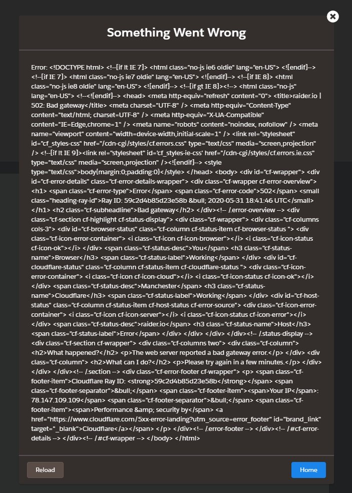

# Ko jūs varat darīt, lai pretotos Cloudflare?

| 🖼 | 🖼 | 🖼 |
| --- | --- | --- |
|  |  |  |


Matthew Browning Prince, dzimis 1974. gada 13. novembrī, ir Colleflare izpilddirektors un līdzdibinātājs.

Pateicoties viņa bagātajam tēvam, "Jāņa B. Prince", viņš piedalījās Čikāgas etiķetes skolas un Hārvarda biznesa skolā.
Princis mācīja interneta likumu un bija speciālists pret surogātpasta likumiem un krāpšanas pētījumiem.


"*I’d suggest this was armchair analysis by kids – it’s hard to take seriously.*" [t](https://www.theguardian.com/technology/2015/nov/19/cloudflare-accused-by-anonymous-helping-isis)

"*That was simply unfounded paranoia, pretty big difference.*"  [t](https://twitter.com/xxdesmus/status/992757936123359233)

"*We also work with Interpol and other non-US entities*" [t](https://twitter.com/eastdakota/status/1203028504184360960)

"*Watching hacker skids on Github squabble about trying to bypass Cloudflare's new anti-bot systems continues to be my daily amusement.* 🍿" [t](https://twitter.com/eastdakota/status/1273277839102656515)


---


<details>
<summary>noklikšķiniet uz manis

## Vietnes patērētājs
</summary>


- Ja vietne, kas jums patīk, izmanto Cloudflare, pasakiet viņiem, ka neizmantojiet Cloudflare.
  - Vaimanāšana sociālajos medijos, piemēram, Facebook, Reddit, Twitter vai Mastodon, neko neatšķir. [Darbības ir skaļākas nekā hashtags.](https://twitter.com/phyzonloop/status/1274132092490862594)
  - Mēģiniet sazināties ar vietnes īpašnieku, ja vēlaties sevi padarīt noderīgu.

[Cloudflare teica](https://github.com/Eloston/ungoogled-chromium/issues/783):
```
Mēs iesakām sazināties ar administratoriem par konkrētiem pakalpojumiem vai vietnēm, ar kurām jūs saskaraties, un dalīties pieredzē.
```

[Ja jūs to neprasāt, vietnes īpašnieks nekad nezina šo problēmu.](../PEOPLE.md)


[Veiksmīgs piemērs](https://counterpartytalk.org/t/turn-off-cloudflare-on-counterparty-co-plz/164/5).<br>
Tev ir problēma? [Tagad paceliet balsi.](https://github.com/maraoz/maraoz.github.io/issues/1) Piemērs zemāk.

```
Jūs vienkārši palīdzat korporatīvajai cenzūrai un masveida uzraudzībai.
http://crimeflare.eu.org
```

```
Jūsu tīmekļa lapa atrodas CloudFlare privātajā sienu dārzā, kurā tiek ļaunprātīgi izmantota privātums.
http://crimeflare.eu.org
```

- Veltiet laiku, lai izlasītu vietnes konfidencialitātes politiku.
  - ja vietne atrodas aiz Cloudflare vai vietne izmanto ar Cloudflare saistītus pakalpojumus.

Tajā ir jāpaskaidro, kas ir "Cloudflare", un jāpieprasa atļauja koplietot jūsu datus ar Cloudflare. Ja tas netiks izdarīts, tiks pārkāpta uzticība, un no attiecīgās tīmekļa vietnes ir jāizvairās.

[Šeit ir pieņemams privātuma politikas piemērs](https://archive.is/bDlTz) ("Subprocessors" > "Entity Name")

```
Esmu izlasījis jūsu konfidencialitātes politiku un nevaru atrast vārdu Cloudflare.
Es atsakos kopīgot datus ar jums, ja turpināsiet manu datu padevi Cloudflare.
http://crimeflare.eu.org
```

Šis ir privātuma politikas piemērs, kurā nav vārda Cloudflare.
[Liberland Jobs](https://archive.is/daKIr) [privacy policy](https://docsend.com/view/feiwyte):


Cloudflare ir sava privātuma politika.
[Cloudflare mīl cilvēkus, kas dungo.](https://www.reddit.com/r/GamerGhazi/comments/2s64fe/be_wary_reporting_to_cloudflare/)

Šis ir labs piemērs vietnes reģistrēšanās veidlapai.
AFAIK, nulles vietne to dara. Vai tu viņiem uzticēsies?

```
Noklikšķinot uz “Reģistrēties XYZ”, jūs piekrītat mūsu pakalpojumu sniegšanas noteikumiem un paziņojumam par konfidencialitāti.
Jūs arī piekrītat koplietot savus datus ar Cloudflare un piekrītat arī cloudflare privātuma paziņojumam.
Ja Cloudflare nopludina jūsu informāciju vai neļaus jums izveidot savienojumu ar mūsu serveriem, tā nav mūsu vaina. [*]

[ Pierakstīties ] [ ES nepiekrītu ]
```
[*] [PEOPLE.md](../PEOPLE.md)


- Centieties neizmantot viņu pakalpojumu. Atcerieties, ka jūs novēro Cloudflare.
  - ["I'm in your TLS, sniffin' your passworz"](../image/iminurtls.jpg)

- Meklējiet citu vietni. Internetā ir alternatīvas un iespējas!

- Pārlieciniet savus draugus izmantot Tor katru dienu.
  - Anonimitātei jābūt atvērtā interneta standartam!
  - [Ņemiet vērā, ka Tor projekts nepatīk šim projektam.](../HISTORY.md)

</details>

------

<details>
<summary>noklikšķiniet uz manis

## Papildinājumi
</summary>

- Ja jūsu pārlūkprogramma ir Firefox, Tor Browser vai Ungoogled Chromium, izmantojiet kādu no šiem zemāk esošajiem papildinājumiem.
  - Ja vēlaties pievienot citu jaunu papildinājumu, vispirms jautājiet par to.


| Nosaukums | Izstrādātājs | Atbalsts | Var bloķēt | Var paziņot | Chrome |
| -------- | -------- | -------- | -------- | -------- | -------- |
| [Bloku Cloudflaron MITM-Atakon](../subfiles/about.bcma.md) | #Addon | [ ? ](http://crimeflare.eu.org/) | **Jā**     | **Jā**     |  **Jā** |
| [Ĉu ligoj estas vundeblaj al MITM-atako?](../subfiles/about.ismm.md) | #Addon | [ ? ](http://crimeflare.eu.org/) | Nē     | **Jā**     |  **Jā** |
| [Ĉu ĉi tiuj ligoj blokos Tor-uzanton?](../subfiles/about.isat.md) | #Addon | [ ? ](http://crimeflare.eu.org/) | Nē     | **Jā**     |  **Jā** |
| [Block Cloudflare MITM Attack](https://trac.torproject.org/projects/tor/attachment/ticket/24351/block_cloudflare_mitm_attack-1.0.14.1-an%2Bfx.xpi)<br>[**DELETED BY TOR PROJECT**](../HISTORY.md) | nullius | [ ? ](../tool/block_cloudflare_mitm_fx), [Link](http://crimeflare.eu.org/) | **Jā**     | **Jā**     |  Nē |
| [TPRB](http://34ahehcli3epmhbu2wbl6kw6zdfl74iyc4vg3ja4xwhhst332z3knkyd.onion/) | Sw | [ ? ](http://34ahehcli3epmhbu2wbl6kw6zdfl74iyc4vg3ja4xwhhst332z3knkyd.onion/) | **Jā**     | **Jā**     |  Nē |
| [Detect Cloudflare](https://addons.mozilla.org/en-US/firefox/addon/detect-cloudflare/) | Frank Otto | [ ? ](https://github.com/traktofon/cf-detect) | Nē     | **Jā**     |  Nē |
| [True Sight](https://addons.mozilla.org/en-US/firefox/addon/detect-cloudflare-plus/) | claustromaniac | [ ? ](https://github.com/claustromaniac/detect-cloudflare-plus) | Nē     | **Jā**     |  Nē |
| [Which Cloudflare datacenter am I visiting?](https://addons.mozilla.org/en-US/firefox/addon/cf-pop/) | 依云 | [ ? ](https://github.com/lilydjwg/cf-pop) | Nē     | **Jā**     |  Nē |


- "Decentraleyes" var pārtraukt savienojumu ar "CDNJS (Cloudflare)".
  - Tas neļauj daudziem pieprasījumiem nokļūt tīklos un apkalpo vietējos failus, lai vietnes netiktu sadalītas.
  - Izstrādātājs atbildēja: "[very concerning indeed](https://github.com/Synzvato/decentraleyes/issues/236#issuecomment-352049501)", "[widespread usage severely centralizes the web](https://github.com/Synzvato/decentraleyes/issues/251#issuecomment-366752049)"

- [Varat arī noņemt vai neuzticēties Cloudflare sertifikātam no savas sertifikātu iestādes (CA).](https://www.ssl.com/how-to/remove-root-certificate-firefox/)

</details>

------

<details>
<summary>noklikšķiniet uz manis

## Vietnes īpašnieks / tīmekļa izstrādātājs
</summary>


- Nelietojiet Cloudflare solution, Period.
  - Jūs varat darīt labāk nekā tas, vai ne? [Lūk, kā noņemt Cloudflare abonementus, plānus, domēnus vai kontus.](https://support.cloudflare.com/hc/en-us/articles/200167776-Removing-subscriptions-plans-domains-or-accounts)

| 🖼 | 🖼 |
| --- | --- |
|  |  |

- Vai vēlaties vairāk klientu? Jūs zināt, ko darīt. Padoms ir "virs līnijas".
  - [Labdien, jūs rakstījāt “Mēs nopietni uztveram jūsu privātumu”, bet es saņēmu “Kļūda 403 Aizliegts anonīms starpniekserveris nav atļauts”.](https://it.slashdot.org/story/19/02/19/0033255/stop-saying-we-take-your-privacy-and-security-seriously) Kāpēc jūs bloķējat Tor vai VPN? Un kāpēc jūs bloķējat pagaidu e-pastus?


- Izmantojot Cloudflare, palielināsies pārtraukuma iespējamība. Apmeklētāji nevar piekļūt jūsu vietnei, ja jūsu serveris nedarbojas vai Cloudflare nedarbojas.
  - [Vai jūs tiešām domājāt, ka Cloudflare nekad nenokrīt?](https://www.ibtimes.com/cloudflare-down-not-working-sites-producing-504-gateway-timeout-errors-2618008) [Another](https://twitter.com/Jedduff/status/1097875615997399040) [sample](https://twitter.com/search?f=tweets&vertical=default&q=Cloudflare%20is%20having%20problems). [Need more](../PEOPLE.md)?


- Izmantojot Cloudflare, lai starpniekserverētu savu "API pakalpojumu", "programmatūras atjaunināšanas serveri" vai "RSS plūsmu", tas kaitēs jūsu klientam. Jums piezvanīja klients un teica: "Es vairs nevaru izmantot jūsu API", un jums nav ne mazākās nojausmas, kas notiek. Cloudflare var klusi bloķēt jūsu klientu. Vai jūs domājat, ka tas ir labi?
  - Ir daudz RSS lasītāju klientu un RSS lasītāju tiešsaistes pakalpojumu. Kāpēc jūs publicējat RSS plūsmu, ja neļaujat cilvēkiem abonēt?


- Vai jums ir nepieciešams HTTPS sertifikāts? Izmantojiet “Let's Encrypt” vai vienkārši iegādājieties to CA uzņēmumā.

- Vai jums ir nepieciešams DNS serveris? Vai nevarat izveidot savu serveri? Kā ar viņiem: [Hurricane Electric Free DNS](https://dns.he.net/), [Dyn.com](https://dyn.com/dns/), [1984 Hosting](https://www.1984hosting.com/), [Afraid.Org (Administrators dzēš jūsu kontu, ja izmantojat TOR)](https://freedns.afraid.org/)

- Vai meklējat mitināšanas pakalpojumu? Tikai bez maksas? Kā ar viņiem: [Onion Service](http://vww6ybal4bd7szmgncyruucpgfkqahzddi37ktceo3ah7ngmcopnpyyd.onion/en/security/network-security/tor/onionservices-best-practices), [Free Web Hosting Area](https://freewha.com/), [Autistici/Inventati Web Site Hosting](https://www.autinv5q6en4gpf4.onion/services/website), [Github Pages](https://pages.github.com/), [Surge](https://surge.sh/)
  - [Alternatīvas Cloudflare](../subfiles/cloudflare-alternatives.md)

- Vai izmantojat vietni "cloudflare-ipfs.com"? [Vai jūs zināt, ka Cloudflare IPFS ir slikta?](../PEOPLE.md)

- Instalējiet savā serverī tīmekļa lietojumprogrammu ugunsmūri, piemēram, OWASP un Fail2Ban, un pareizi konfigurējiet to.
  - Tor bloķēšana nav risinājums. Nesodiet visus tikai par maziem sliktiem lietotājiem.

- Novirziet vai bloķējiet "Cloudflare Warp" lietotājiem piekļuvi jūsu vietnei. Un, ja varat, norādiet iemeslu.

> IP saraksts: "[Cloudflare pašreizējie IP diapazoni](cloudflare_inc/)"

> A: Vienkārši bloķējiet tos

```
server {
...
deny 173.245.48.0/20;
deny 103.21.244.0/22;
deny 103.22.200.0/22;
deny 103.31.4.0/22;
deny 141.101.64.0/18;
deny 108.162.192.0/18;
deny 190.93.240.0/20;
deny 188.114.96.0/20;
deny 197.234.240.0/22;
deny 198.41.128.0/17;
deny 162.158.0.0/15;
deny 104.16.0.0/12;
deny 172.64.0.0/13;
deny 131.0.72.0/22;
deny 2400:cb00::/32;
deny 2606:4700::/32;
deny 2803:f800::/32;
deny 2405:b500::/32;
deny 2405:8100::/32;
deny 2a06:98c0::/29;
deny 2c0f:f248::/32;
...
}
```

> B: Novirzīšana uz brīdinājuma lapu

```
http {
...
geo $iscf {
default 0;
173.245.48.0/20 1;
103.21.244.0/22 1;
103.22.200.0/22 1;
103.31.4.0/22 1;
141.101.64.0/18 1;
108.162.192.0/18 1;
190.93.240.0/20 1;
188.114.96.0/20 1;
197.234.240.0/22 1;
198.41.128.0/17 1;
162.158.0.0/15 1;
104.16.0.0/12 1;
172.64.0.0/13 1;
131.0.72.0/22 1;
2400:cb00::/32 1;
2606:4700::/32 1;
2803:f800::/32 1;
2405:b500::/32 1;
2405:8100::/32 1;
2a06:98c0::/29 1;
2c0f:f248::/32 1;
}
...
}

server {
...
if ($iscf) {rewrite ^ https://example.com/cfwsorry.php;}
...
}

<?php
header('HTTP/1.1 406 Not Acceptable');
echo <<<CLOUDFLARED
Thank you for visiting ourwebsite.com!<br />
We are sorry, but we can't serve you because your connection is being intercepted by Cloudflare.<br />
Please read http://crimeflare.eu.org for more information.<br />
CLOUDFLARED;
die();
```

- Iestatiet Tor Onion Service vai I2P insite, ja ticat brīvībai un uzņemat anonīmus lietotājus.

- Jautājiet padomu citiem Clearnet / Tor divu vietņu operatoriem un iegūstiet anonīmus draugus!

</details>

------

<details>
<summary>noklikšķiniet uz manis

## Programmatūras lietotājs
</summary>


- Discord izmanto CloudFlare. Alternatīvas? Mēs rekomendējam [**Briar** (Android)](https://f-droid.org/en/packages/org.briarproject.briar.android/), [Ricochet (PC)](https://ricochet.im/), [Tox + Tor (Android/PC)](https://tox.chat/download.html)
  - Briar ietver Tor dēmonu, tāpēc jums nav jāinstalē Orbot.
  - Qwtch izstrādātāji, Open Privacy, bez brīdinājuma izdzēsa stop_cloudflare projektu no sava git pakalpojuma.

- Ja izmantojat Debian GNU / Linux vai kādu citu atvasinājumu, abonējiet: [bug #831835](https://bugs.debian.org/cgi-bin/bugreport.cgi?bug=831835). Un, ja jūs varat, palīdziet pārbaudīt plāksteri un palīdziet uzturētājam izdarīt pareizo secinājumu par to, vai tas ir jāpieņem.

- Vienmēr iesakiet šīs pārlūkprogrammas.

| Nosaukums | Izstrādātājs | Atbalsts | Komentēt |
| -------- | -------- | -------- | -------- |
| [Ungoogled-Chromium](https://ungoogled-software.github.io/ungoogled-chromium-binaries/) | Eloston | [ ? ](https://github.com/Eloston/ungoogled-chromium) | PC (Win, Mac, Linux)  _!Tor_ |
| [Bromite](https://www.bromite.org/fdroid) | Bromite | [ ? ](https://github.com/bromite/bromite/issues) | Android  _!Tor_ |
| [Tor Browser](https://www.torproject.org/download/) | Tor Project | [ ? ](https://support.torproject.org/) | PC (Win, Mac, Linux)  _Tor_|
| [Tor Browser Android](https://www.torproject.org/download/) | Tor Project | [ ? ](https://support.torproject.org/) | Android  _Tor_|
| [Onion Browser](https://itunes.apple.com/us/app/onion-browser/id519296448?mt=8) | Mike Tigas | [ ? ](https://github.com/OnionBrowser/OnionBrowser/issues) | Apple iOS  _Tor_|
| [GNU/Icecat](https://www.gnu.org/software/gnuzilla/) | GNU | [ ? ](https://www.gnu.org/software/gnuzilla/) | PC (Linux) |
| [IceCatMobile](https://f-droid.org/en/packages/org.gnu.icecat/) | GNU | [ ? ](https://lists.gnu.org/mailman/listinfo/bug-gnuzilla) | Android |
| [Iridium Browser](https://iridiumbrowser.de/about/) | Iridium | [ ? ](https://github.com/iridium-browser/iridium-browser/) | PC (Win, Mac, Linux, OpenBSD) |


Citas programmatūras privātums ir nepilnīgs. Tas nenozīmē, ka Tor pārlūks ir "ideāls".
Internetā un tehnoloģijās nav 100% droša un 100% privāta.

- Vai nevēlaties izmantot Tor? Ar Tor dēmonu varat izmantot jebkuru pārlūku.
  - [Ņemiet vērā, ka Tor projektam tas nepatīk.](https://support.torproject.org/tbb/tbb-9/) Izmantojiet Tor pārlūku, ja jūs to varat izdarīt.
- [Kā lietot hromu ar Tor](../subfiles/chromium_tor.md)


Parunāsim par citas programmatūras privātumu.

- [Ja jums patiešām ir jāizmanto Firefox, izvēlieties "Firefox ESR".](https://www.mozilla.org/en-US/firefox/organizations/)
  - [Firefox - spiegprogrammatūru novērošanas suns](https://spyware.neocities.org/articles/firefox.html)
  - [Firefox noraida vārda brīvību, aizliedz vārda brīvību](https://web.archive.org/web/20200423010026/https://reclaimthenet.org/firefox-rejects-free-speech-bans-free-speech-commenting-plugin-dissenter-from-its-extensions-gallery/)
  - ["100+ negatīvas balsis. Šķiet, ka mūsdienās prasīt programmatūras uzņēmumam pieturēties pie ... programmatūras ir pārāk daudz."](https://old.reddit.com/r/firefox/comments/gutdiw/weve_got_work_to_do_the_mozilla_blog/fslbbb6/)
  - [Uh, kāpēc Firefox manā URL joslā rāda sponsorētas saites?](https://www.reddit.com/r/firefox/comments/jybx2w/uh_why_is_firefox_showing_me_sponsored_links_in/)
  - [Mozilla - iemiesojies velns](https://digdeeper.neocities.org/ghost/mozilla.html)

- [Atcerieties, ka Mozilla izmanto Cloudflare pakalpojumu.](https://www.robtex.com/dns-lookup/www.mozilla.org) [Viņi savā produktā izmanto arī Cloudflare DNS pakalpojumu.](https://www.theregister.co.uk/2018/03/21/mozilla_testing_dns_encryption/)

- [Mozilla oficiāli noraidīja šo biļeti.](https://bugzilla.mozilla.org/show_bug.cgi?id=1426618)

- [Firefox Focus ir joks.](https://github.com/mozilla-mobile/focus-android/issues/1743) [Viņi apsolīja izslēgt telemetriju, bet viņi to mainīja.](https://github.com/mozilla-mobile/focus-android/issues/4210)

- [PaleMoon / Basilisk izstrādātājs mīl Cloudflare.](https://github.com/mozilla-mobile/focus-android/issues/1743#issuecomment-345993097)
  - [Pale Moon arhīva serveris uzlauza un izplatīja ļaunprātīgu programmatūru 18 mēnešus](https://www.reddit.com/r/privacytoolsIO/comments/cc808y/pale_moons_archive_server_hacked_and_spread/)
  - Viņš ienīst arī Tor lietotājus - "[Lai tas būtu naidīgs pret Toru. Es domāju, ka lielākajai daļai vietņu vajadzētu būt naidīgām pret Tor, ņemot vērā tā ārkārtīgi augsto ļaunprātīgas izmantošanas faktoru.](https://github.com/yacy/yacy_search_server/issues/314#issuecomment-565932097)"

- [Waterfox ir nopietna problēma "tālruņi mājās"](https://spyware.neocities.org/articles/waterfox.html)

- [Google Chrome ir spiegprogrammatūra.](https://www.gnu.org/proprietary/malware-google.en.html)
  - [Google profilē jūsu darbību.](https://spyware.neocities.org/articles/chrome.html)

- [SRWare Iron padara pārāk daudz tālruņu mājas savienojumu.](https://spyware.neocities.org/articles/iron.html) Tas arī izveido savienojumu ar Google domēniem.

- [Drosmīgs pārlūka baltais saraksts Facebook / Twitter izsekotāji.](https://www.bleepingcomputer.com/news/security/facebook-twitter-trackers-whitelisted-by-brave-browser/)
  - [Šeit ir vairāk jautājumu.](https://spyware.neocities.org/articles/brave.html)
  - [binance filiāles ID](https://twitter.com/cryptonator1337/status/1269594587716374528)

- [Microsoft Edge ļauj Facebook palaist Flash kodu aiz lietotāju muguras.](https://www.zdnet.com/article/microsoft-edge-lets-facebook-run-flash-code-behind-users-backs/)

- [Vivaldi neciena jūsu privātumu.](https://spyware.neocities.org/articles/vivaldi.html)

- [Opera spiegprogrammatūras līmenis: ārkārtīgi augsts](https://spyware.neocities.org/articles/opera.html)

- Apple iOS: [Jums vispār nevajadzētu izmantot iOS, galvenokārt tāpēc, ka tā ir ļaunprātīga programmatūra.](https://www.gnu.org/proprietary/malware-apple.html)

Tāpēc mēs iesakām tikai iepriekš minēto tabulu. Nekas cits.

</details>

------

<details>
<summary>noklikšķiniet uz manis

## Mozilla Firefox lietotājs
</summary>


- "Firefox Nightly" nosūtīs atkļūdošanas līmeņa informāciju uz Mozilla serveriem bez atteikšanās metodes.
  - [Mozilla serveri pūta Cloudflare](https://www.digwebinterface.com/?hostnames=www.mozilla.org%0D%0Amozilla.cloudflare-dns.com&type=&ns=resolver&useresolver=8.8.4.4&nameservers=)

- Ir iespējams aizliegt Firefox savienojumu ar Mozilla serveriem.
  - [Mozilla politikas veidņu ceļvedis](https://github.com/mozilla/policy-templates/blob/master/README.md)
  - Paturiet prātā, ka šis triks var beigties darboties jaunākā versijā, jo Mozilla patīk sevi iekļaut baltajā sarakstā.
  - Izmantojiet ugunsmūri un DNS filtru, lai tos pilnībā bloķētu.

"`/distribution/policies.json`"

>     "WebsiteFilter": {
> 		"Block": [
> 		"*://*.mozilla.com/*",
> 		"*://*.mozilla.net/*",
> 		"*://*.mozilla.org/*",
> 		"*://webcompat.com/*",
> 		"*://*.firefox.com/*",
> 		"*://*.thunderbird.net/*",
> 		"*://*.cloudflare.com/*"
> 		]
>     },


- ~~Ziņojiet par kļūdu mozilla izsekotājā, sakot, ka viņi neizmanto Cloudflare.~~ Bugzilla bija ziņojums par kļūdu. Daudzi cilvēki bija noraizējušies par viņu bažām, tomēr kļūda tika slēpta administratora 2018. gadā.

- Firefox var atspējot DoH.
  - [Mainīt Firefox noklusējuma DNS nodrošinātāju](../subfiles/change-firefox-dns.md)


- [Ja vēlaties izmantot DNS, kas nav ISP, apsveriet iespēju izmantot OpenNIC Tier2 DNS pakalpojumu vai jebkuru citu no Cloudflare DNS pakalpojumiem.](https://wiki.opennic.org/start)

  - Bloķējiet Cloudflare ar DNS. [Crimeflare DNS](../subfiles/service.publicdns.md)

- Jūs varat izmantot Tor kā DNS risinātāju. [Ja neesat Tor eksperts, uzdodiet jautājumu šeit.](https://tor.stackexchange.com/)

> **Kā?**
> 1. Lejupielādējiet Tor un instalējiet to savā datorā.
> 2. Pievienojiet šo rindu failam "torrc".
> DNSPort 127.0.0.1:53
> 3. Restartējiet Tor.
> 4. Iestatiet sava datora DNS serveri uz "127.0.0.1".

</details>

------

<details>
<summary>noklikšķiniet uz manis

## Darbība
</summary>


- Pastāstiet citiem apkārtējiem par Cloudflare bīstamību.

- [Palīdziet uzlabot šo krātuvi.](http://crimeflare.eu.org)
  - Gan saraksti, argumenti pret to, gan detaļas.

- [Dokumentējiet un publiskojiet, kur ar Cloudflare (un līdzīgiem uzņēmumiem) notiek nepareizi, to darot, noteikti miniet šo krātuvi](http://crimeflare.eu.org) :)

- Piesakiet vairāk cilvēku, izmantojot Tor pēc noklusējuma, lai viņi varētu iepazīties ar tīmekli no dažādu pasaules daļu perspektīvas.

- Sākt grupas sociālajos medijos un izklaides telpā, kas veltītas pasaules atbrīvošanai no Cloudflare.

- Vajadzības gadījumā saite uz šīm repozitorija grupām - tā var būt vieta, kur koordinēt kopīgu darbu kā grupām.

- [Sāciet sadarbību, kas var sniegt nozīmīgu, nevis korporatīvu alternatīvu Cloudflare.](../subfiles/cloudflare-alternatives.md)

- Informējiet mūs par visām alternatīvām, kas palīdzētu vismaz nodrošināt daudzslāņu aizsardzību pret Cloudflare.

- Ja esat Cloudflare klients, iestatiet savus konfidencialitātes iestatījumus un pagaidiet, līdz viņi tos pārkāpj.
  - [Tad pakļaujiet viņus apsūdzībām pret surogātpastu / privātuma pārkāpumiem.](https://twitter.com/thexpaw/status/1108424723233419264)

- Ja atrodaties Amerikas Savienotajās Valstīs un attiecīgā vietne ir banka vai grāmatvede, mēģiniet izdarīt juridisku spiedienu saskaņā ar Gramm – Leach – Bliley likumu vai amerikāņiem ar DIsability likumu un ziņojiet mums, cik tālu jūs esat .

- Ja vietne ir valdības vietne, mēģiniet izdarīt juridisku spiedienu saskaņā ar 1. grozījumu ASV konstitūcijā.

- Ja esat ES pilsonis, sazinieties ar vietni, lai nosūtītu personisko informāciju saskaņā ar Vispārīgo datu aizsardzības regulu. Ja viņi atsakās sniegt jums jūsu informāciju, tas ir likuma pārkāpums.

- Uzņēmumiem, kuri apgalvo, ka piedāvā pakalpojumu savā vietnē, mēģiniet ziņot par patērētāju aizsardzības organizācijām un BBB par “nepatiesu reklāmu”. Cloudflare vietnes apkalpo Cloudflare serveri.

- [ITU ASV kontekstā ierosina, ka Cloudflare sāk kļūt pietiekami liels, lai viņiem varētu likt pretmonopola likumus.](https://www.itu.int/en/ITU-T/Workshops-and-Seminars/20181218/Documents/Geoff_Huston_Presentation.pdf)

- Var iedomāties, ka GNU GPL 4. versija varētu ietvert noteikumu par avota koda glabāšanu aiz šāda pakalpojuma, pieprasot visām GPLv4 un jaunākām programmām, ka vismaz pirmkodam jābūt pieejamam, izmantojot nesēju, kas nediskriminē Tor lietotājus.

</details>

------

### Komentāri

```
Pretestībā vienmēr ir cerība.

Pretestība ir auglīga.

Pat daži tumšāki iznākumi rodas, pats pretestības akts mūs māca turpināt destabilizēt iegūto distopisko status quo.

Pretoties!
```

```
Kādreiz jūs sapratīsit, kāpēc mēs to rakstījām.
```

```
Šajā ziņā nav nekā futūristiska. Mēs jau esam zaudējuši.
```

### Ko jūs šodien darījāt?


