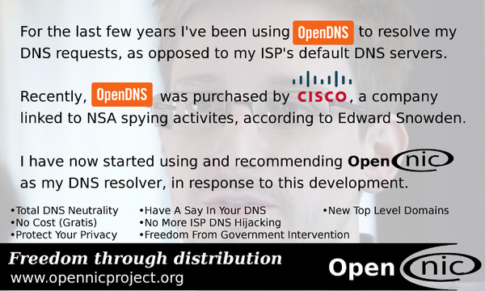

# Ce puteți face pentru a rezista Cloudflare?

| 🖼 | 🖼 | 🖼 |
| --- | --- | --- |
|  |  |  |


Matthew Browning Prince, născut la 13 noiembrie 1974, este CEO-ul și co-fondatorul Cloudflare.

Datorită tatălui său bogat, "John B. Prince", a participat la Universitatea din Școala Etichetă din Chicago și Școala de Business Harvard.
Prințul a învățat o lege privind internetul și a fost un specialist în legile anti-spam și în cercetarea fraudei.


"*I’d suggest this was armchair analysis by kids – it’s hard to take seriously.*" [t](https://www.theguardian.com/technology/2015/nov/19/cloudflare-accused-by-anonymous-helping-isis)

"*That was simply unfounded paranoia, pretty big difference.*"  [t](https://twitter.com/xxdesmus/status/992757936123359233)

"*We also work with Interpol and other non-US entities*" [t](https://twitter.com/eastdakota/status/1203028504184360960)

"*Watching hacker skids on Github squabble about trying to bypass Cloudflare's new anti-bot systems continues to be my daily amusement.* 🍿" [t](https://twitter.com/eastdakota/status/1273277839102656515)


---


<details>
<summary>faceți clic pe mine

## Consumator de site-uri web
</summary>


- Dacă site-ul web care vă place folosește Cloudflare, spuneți-le să nu folosească Cloudflare.
  - Vâjâitul pe rețelele sociale precum Facebook, Reddit, Twitter sau Mastodon nu face nicio diferență. [Acțiunile sunt mai puternice decât hashtagurile.](https://twitter.com/phyzonloop/status/1274132092490862594)
  - Încercați să contactați proprietarul site-ului web dacă doriți să vă faceți util.

[A spus Cloudflare](https://github.com/Eloston/ungoogled-chromium/issues/783):
```
Vă recomandăm să contactați administratorii pentru serviciile sau site-urile specifice cu care vă confruntați și să vă împărtășiți experiența.
```

[Dacă nu o solicitați, proprietarul site-ului nu știe niciodată această problemă.](../PEOPLE.md)


[Exemplu de succes](https://counterpartytalk.org/t/turn-off-cloudflare-on-counterparty-co-plz/164/5).<br>
Aveți o problemă? [Ridică-ți vocea acum.](https://github.com/maraoz/maraoz.github.io/issues/1) Exemplul de mai jos.

```
Doar ajutați cenzura corporativă și supravegherea în masă.
http://crimeflare.eu.org
```

```
Pagina dvs. web se află în grădina privată cu ziduri private care abuzează de confidențialitate a CloudFlare.
http://crimeflare.eu.org
```

- Luați ceva timp pentru a citi politica de confidențialitate a site-ului web.
  - dacă site-ul web se află în spatele Cloudflare sau site-ul web folosește servicii conectate la Cloudflare.

Acesta trebuie să explice ce este „Cloudflare” și să solicite permisiunea de a partaja datele dvs. cu Cloudflare. Nerespectarea acestui lucru va duce la încălcarea încrederii, iar site-ul web în cauză ar trebui evitat.

[Un exemplu acceptabil de politică de confidențialitate este aici](https://archive.is/bDlTz) ("Subprocessors" > "Entity Name")

```
Am citit politica dvs. de confidențialitate și nu găsesc cuvântul Cloudflare.
Refuz să vă împărtășesc date dacă continuați să furnizați datele mele către Cloudflare.
http://crimeflare.eu.org
```

Acesta este un exemplu de politică de confidențialitate care nu are cuvântul Cloudflare.
[Liberland Jobs](https://archive.is/daKIr) [privacy policy](https://docsend.com/view/feiwyte):


Cloudflare are propria politică de confidențialitate.
[Cloudflare iubește oamenii cu sex.](https://www.reddit.com/r/GamerGhazi/comments/2s64fe/be_wary_reporting_to_cloudflare/)

Iată un exemplu bun pentru formularul de înscriere al site-ului web.
AFAIK, site-ul zero face acest lucru. Vei avea încredere în ei?

```
Dând clic pe „Înscrieți-vă la XYZ”, sunteți de acord cu termenii noștri de servicii și declarația de confidențialitate.
De asemenea, sunteți de acord să partajați datele dvs. cu Cloudflare și, de asemenea, sunteți de acord cu declarația de confidențialitate a cloudflare.
Dacă Cloudflare vă scurge informațiile sau nu vă permite să vă conectați la serverele noastre, nu este vina noastră. [*]

[ Inscrie-te ] [ Nu sunt de acord ]
```
[*] [PEOPLE.md](../PEOPLE.md)


- Încercați să nu utilizați serviciul lor. Amintiți-vă că sunteți urmărit de Cloudflare.
  - ["I'm in your TLS, sniffin' your passworz"](../image/iminurtls.jpg)

- Căutați alt site. Există alternative și oportunități pe internet!

- Convinge-ți prietenii să folosească Tor zilnic.
  - Anonimatul ar trebui să fie standardul internetului deschis!
  - [Rețineți că proiectului Tor nu-i place acest proiect.](../HISTORY.md)

</details>

------

<details>
<summary>faceți clic pe mine

## Suplimente
</summary>

- Dacă browserul dvs. este Firefox, Tor Browser sau Ungoogled Chromium, utilizați unul dintre aceste programe de completare de mai jos.
  - Dacă doriți să adăugați un alt supliment nou, întrebați mai întâi despre acesta.


| Nume | Dezvoltator | A sustine | Poate bloca | Pot notifica | Chrome |
| -------- | -------- | -------- | -------- | -------- | -------- |
| [Bloku Cloudflaron MITM-Atakon](../subfiles/addon/bcma.md) | #Addon | [ ? ](http://crimeflare.eu.org/) | **da**     | **da**     |  **da** |
| [Ĉu ligoj estas vundeblaj al MITM-atako?](../subfiles/addon/ismm.md) | #Addon | [ ? ](http://crimeflare.eu.org/) | Nu     | **da**     |  **da** |
| [Ĉu ĉi tiuj ligoj blokos Tor-uzanton?](../subfiles/addon/isat.md) | #Addon | [ ? ](http://crimeflare.eu.org/) | Nu     | **da**     |  **da** |
| [Block Cloudflare MITM Attack](https://trac.torproject.org/projects/tor/attachment/ticket/24351/block_cloudflare_mitm_attack-1.0.14.1-an%2Bfx.xpi)<br>[**DELETED BY TOR PROJECT**](../HISTORY.md) | nullius | [ ? ](../tool/block_cloudflare_mitm_fx), [Link](http://crimeflare.eu.org/) | **da**     | **da**     |  Nu |
| [TPRB](http://sw.nnpaefp7pkadbxxkhz2agtbv2a4g5sgo2fbmv3i7czaua354334uqqad.onion/) | Sw | [ ? ](http://sw.nnpaefp7pkadbxxkhz2agtbv2a4g5sgo2fbmv3i7czaua354334uqqad.onion/) | **da**     | **da**     |  Nu |
| [Detect Cloudflare](https://addons.mozilla.org/en-US/firefox/addon/detect-cloudflare/) | Frank Otto | [ ? ](https://github.com/traktofon/cf-detect) | Nu     | **da**     |  Nu |
| [True Sight](https://addons.mozilla.org/en-US/firefox/addon/detect-cloudflare-plus/) | claustromaniac | [ ? ](https://github.com/claustromaniac/detect-cloudflare-plus) | Nu     | **da**     |  Nu |
| [Which Cloudflare datacenter am I visiting?](https://addons.mozilla.org/en-US/firefox/addon/cf-pop/) | 依云 | [ ? ](https://github.com/lilydjwg/cf-pop) | Nu     | **da**     |  Nu |


- „Decentraleyes” poate opri conexiunea la „CDNJS (Cloudflare)”.
  - Împiedică multe solicitări să ajungă la rețele și servește fișiere locale pentru a împiedica ruperea site-urilor.
  - Dezvoltatorul a răspuns: "[very concerning indeed](https://github.com/Synzvato/decentraleyes/issues/236#issuecomment-352049501)", "[widespread usage severely centralizes the web](https://github.com/Synzvato/decentraleyes/issues/251#issuecomment-366752049)"

- [De asemenea, puteți să eliminați sau să nu aveți încredere în certificatul Cloudflare de la autoritatea dvs. de certificare (CA).](https://www.ssl.com/how-to/remove-root-certificate-firefox/)

</details>

------

<details>
<summary>faceți clic pe mine

## Proprietar de site web / dezvoltator web
</summary>


- Nu utilizați soluția Cloudflare, Perioada.
  - Poți face mai bine decât asta, nu? [Iată cum să eliminați abonamentele, planurile, domeniile sau conturile Cloudflare.](https://support.cloudflare.com/hc/en-us/articles/200167776-Removing-subscriptions-plans-domains-or-accounts)

| 🖼 | 🖼 |
| --- | --- |
|  |  |

- Vrei mai mulți clienți? Știi ce să faci. Sugestia este „deasupra liniei”.
  - [Bună ziua, ați scris „Vă luăm în serios confidențialitatea”, dar am primit „Eroarea 403 Prohibit Anonim Proxy nu este permis”.](https://it.slashdot.org/story/19/02/19/0033255/stop-saying-we-take-your-privacy-and-security-seriously) De ce blochezi Tor Or VPN? Și de ce blocați e-mailurile temporare?


- Utilizarea Cloudflare va crește șansele unei întreruperi. Vizitatorii nu pot accesa site-ul dvs. web dacă serverul dvs. este defect sau Cloudflare este defect.
  - [Chiar ai crezut că Cloudflare nu coboară niciodată?](https://www.ibtimes.com/cloudflare-down-not-working-sites-producing-504-gateway-timeout-errors-2618008) [Another](https://twitter.com/Jedduff/status/1097875615997399040) [sample](https://twitter.com/search?f=tweets&vertical=default&q=Cloudflare%20is%20having%20problems). [Need more](../PEOPLE.md)?


- Utilizarea Cloudflare pentru a vă proxy „serviciul API”, „server de actualizare software” sau „flux RSS” vă va afecta clientul. Un client v-a sunat și a spus „Nu vă mai pot folosi API-ul” și nu aveți nicio idee despre ce se întâmplă. Cloudflare vă poate bloca în tăcere clientul. Crezi că este în regulă?
  - Există mulți clienți de citire RSS și servicii de citire RSS online. De ce publicați flux RSS dacă nu permiteți oamenilor să se aboneze?


- Aveți nevoie de certificat HTTPS? Utilizați „Să criptăm” sau pur și simplu cumpărați-l de la compania CA.

- Ai nevoie de server DNS? Nu vă puteți configura propriul server? Ce zici de ei: [Hurricane Electric Free DNS](https://dns.he.net/), [Dyn.com](https://dyn.com/dns/), [1984 Hosting](https://www.1984hosting.com/), [Afraid.Org (Administratorul șterge contul dvs. dacă utilizați TOR)](https://freedns.afraid.org/)
  - [Alternativoj al DNS](../subfiles/alternative/domaindns.md)

- Căutați un serviciu de găzduire? Doar gratuit? Ce zici de ei: [Onion Service](http://vww6ybal4bd7szmgncyruucpgfkqahzddi37ktceo3ah7ngmcopnpyyd.onion/en/security/network-security/tor/onionservices-best-practices), [Free Web Hosting Area](https://freewha.com/), [Autistici/Inventati Web Site Hosting](https://www.autinv5q6en4gpf4.onion/services/website), [Github Pages](https://pages.github.com/), [Surge](https://surge.sh/)
  - [Alternative la Cloudflare](../subfiles/alternative/cloudflare.md)

- Folosiți „cloudflare-ipfs.com”? [Știți că Cloudflare IPFS este rău?](../PEOPLE.md)

- Instalați Firewall pentru aplicații web, cum ar fi OWASP și Fail2Ban pe serverul dvs. și configurați-l corect.
  - Blocarea Tor nu este o soluție. Nu pedepsiți pe toți doar pentru micii utilizatori răi.

- Redirecționați sau blocați utilizatorii „Cloudflare Warp” să vă acceseze site-ul web. Și oferiți un motiv dacă puteți.

> Lista IP: "[Intervalele IP curente ale Cloudflare](cloudflare_inc/)"

> A: Blochează-le

```
server {
...
deny 173.245.48.0/20;
deny 103.21.244.0/22;
deny 103.22.200.0/22;
deny 103.31.4.0/22;
deny 141.101.64.0/18;
deny 108.162.192.0/18;
deny 190.93.240.0/20;
deny 188.114.96.0/20;
deny 197.234.240.0/22;
deny 198.41.128.0/17;
deny 162.158.0.0/15;
deny 104.16.0.0/12;
deny 172.64.0.0/13;
deny 131.0.72.0/22;
deny 2400:cb00::/32;
deny 2606:4700::/32;
deny 2803:f800::/32;
deny 2405:b500::/32;
deny 2405:8100::/32;
deny 2a06:98c0::/29;
deny 2c0f:f248::/32;
...
}
```

> B: Redirecționați la pagina de avertizare

```
http {
...
geo $iscf {
default 0;
173.245.48.0/20 1;
103.21.244.0/22 1;
103.22.200.0/22 1;
103.31.4.0/22 1;
141.101.64.0/18 1;
108.162.192.0/18 1;
190.93.240.0/20 1;
188.114.96.0/20 1;
197.234.240.0/22 1;
198.41.128.0/17 1;
162.158.0.0/15 1;
104.16.0.0/12 1;
172.64.0.0/13 1;
131.0.72.0/22 1;
2400:cb00::/32 1;
2606:4700::/32 1;
2803:f800::/32 1;
2405:b500::/32 1;
2405:8100::/32 1;
2a06:98c0::/29 1;
2c0f:f248::/32 1;
}
...
}

server {
...
if ($iscf) {rewrite ^ https://example.com/cfwsorry.php;}
...
}

<?php
header('HTTP/1.1 406 Not Acceptable');
echo <<<CLOUDFLARED
Thank you for visiting ourwebsite.com!<br />
We are sorry, but we can't serve you because your connection is being intercepted by Cloudflare.<br />
Please read http://crimeflare.eu.org for more information.<br />
CLOUDFLARED;
die();
```

- Configurați Tor Onion Service sau I2P insite dacă credeți în libertate și primiți utilizatori anonimi.

- Cereți sfaturi de la alți operatori de site-uri web Clearnet / Tor și faceți prieteni anonimi!

</details>

------

<details>
<summary>faceți clic pe mine

## Utilizator de software
</summary>


- Discord folosește CloudFlare. Alternative? Iti recomandam [**Briar** (Android)](https://f-droid.org/en/packages/org.briarproject.briar.android/), [Ricochet (PC)](https://ricochet.im/), [Tox + Tor (Android/PC)](https://tox.chat/download.html)
  - Briar include un demon Tor, deci nu trebuie să instalați Orbot.
  - Dezvoltatorii Qwtch, Open Privacy, au șters proiectul stop_cloudflare din serviciul lor git fără notificare prealabilă.

- Dacă utilizați Debian GNU / Linux sau orice derivat, abonați-vă: [bug #831835](https://bugs.debian.org/cgi-bin/bugreport.cgi?bug=831835). Și dacă puteți, ajutați la verificarea patch-ului și ajutați întreținătorul să ajungă la concluzia corectă cu privire la acceptarea acestuia.

- Recomandați întotdeauna aceste browsere.

| Nume | Dezvoltator | A sustine | cometariu |
| -------- | -------- | -------- | -------- |
| [Ungoogled-Chromium](https://ungoogled-software.github.io/ungoogled-chromium-binaries/) | Eloston | [ ? ](https://github.com/Eloston/ungoogled-chromium) | PC (Win, Mac, Linux)  _!Tor_ |
| [Bromite](https://www.bromite.org/fdroid) | Bromite | [ ? ](https://github.com/bromite/bromite/issues) | Android  _!Tor_ |
| [Tor Browser](https://www.torproject.org/download/) | Tor Project | [ ? ](https://support.torproject.org/) | PC (Win, Mac, Linux)  _Tor_|
| [Tor Browser Android](https://www.torproject.org/download/) | Tor Project | [ ? ](https://support.torproject.org/) | Android  _Tor_|
| [Onion Browser](https://itunes.apple.com/us/app/onion-browser/id519296448?mt=8) | Mike Tigas | [ ? ](https://github.com/OnionBrowser/OnionBrowser/issues) | Apple iOS  _Tor_|
| [GNU/Icecat](https://www.gnu.org/software/gnuzilla/) | GNU | [ ? ](https://www.gnu.org/software/gnuzilla/) | PC (Linux) |
| [IceCatMobile](https://f-droid.org/en/packages/org.gnu.icecat/) | GNU | [ ? ](https://lists.gnu.org/mailman/listinfo/bug-gnuzilla) | Android |
| [Iridium Browser](https://iridiumbrowser.de/about/) | Iridium | [ ? ](https://github.com/iridium-browser/iridium-browser/) | PC (Win, Mac, Linux, OpenBSD) |


Confidențialitatea altor programe software este imperfectă. Acest lucru nu înseamnă că browserul Tor este „perfect”.
Nu există 100% sigur și nici 100% privat pe internet și tehnologie.

- Nu vrei să folosești Tor? Puteți utiliza orice browser cu daemon Tor.
  - [Rețineți că proiectului Tor nu-i place asta.](https://support.torproject.org/tbb/tbb-9/) Folosiți Tor Browser dacă puteți face acest lucru.
- [Cum se utilizează Chromium cu Tor](../subfiles/chromium_tor.md)


Să vorbim despre confidențialitatea altor programe.

- [Dacă într-adevăr trebuie să utilizați Firefox, alegeți „Firefox ESR”.](https://www.mozilla.org/en-US/firefox/organizations/)
  - [Firefox - Spyware Watchdog](https://spyware.neocities.org/articles/firefox.html)
  - [Firefox respinge libera exprimare, interzice libera exprimare](https://web.archive.org/web/20200423010026/https://reclaimthenet.org/firefox-rejects-free-speech-bans-free-speech-commenting-plugin-dissenter-from-its-extensions-gallery/)
  - ["Peste 100 de voturi negative. Se pare că ați cere unei companii de software să rămână la ... software-ul este prea mult în zilele noastre."](https://old.reddit.com/r/firefox/comments/gutdiw/weve_got_work_to_do_the_mozilla_blog/fslbbb6/)
  - [Uh, de ce Firefox îmi arată linkuri sponsorizate în bara mea de adrese URL?](https://www.reddit.com/r/firefox/comments/jybx2w/uh_why_is_firefox_showing_me_sponsored_links_in/)
  - [Mozilla - Diavolul întrupat](https://digdeeper.neocities.org/ghost/mozilla.html)

- [Amintiți-vă, Mozilla folosește serviciul Cloudflare.](https://www.robtex.com/dns-lookup/www.mozilla.org) [De asemenea, utilizează serviciul DNS Cloudflare pe produsul lor.](https://www.theregister.co.uk/2018/03/21/mozilla_testing_dns_encryption/)

- [Mozilla a respins oficial acest bilet.](https://bugzilla.mozilla.org/show_bug.cgi?id=1426618)

- [Firefox Focus este o glumă.](https://github.com/mozilla-mobile/focus-android/issues/1743) [Au promis că vor opri telemetria, dar au schimbat-o.](https://github.com/mozilla-mobile/focus-android/issues/4210)

- [Dezvoltatorul PaleMoon / Basilisk iubește Cloudflare.](https://github.com/mozilla-mobile/focus-android/issues/1743#issuecomment-345993097)
  - [Serverul de arhive Pale Moon a piratat și răspândit malware timp de 18 luni](https://www.reddit.com/r/privacytoolsIO/comments/cc808y/pale_moons_archive_server_hacked_and_spread/)
  - De asemenea, urăște utilizatorii Tor - "[Să fie ostil față de Tor. Cred că majoritatea site-urilor ar trebui să fie ostile față de Tor, având în vedere factorul său extrem de ridicat de abuz.](https://github.com/yacy/yacy_search_server/issues/314#issuecomment-565932097)"

- [Waterfox au o problemă severă de „telefoane la domiciliu”](https://spyware.neocities.org/articles/waterfox.html)

- [Google Chrome este un spyware.](https://www.gnu.org/proprietary/malware-google.en.html)
  - [Google vă profilează activitatea.](https://spyware.neocities.org/articles/chrome.html)

- [SRWare Iron creează prea multe telefoane pentru conectarea la domiciliu.](https://spyware.neocities.org/articles/iron.html) De asemenea, se conectează la domeniile Google.

- [Brave Browser whitelist Facebook / Twitter trackers.](https://www.bleepingcomputer.com/news/security/facebook-twitter-trackers-whitelisted-by-brave-browser/)
  - [Iată mai multe numere.](https://spyware.neocities.org/articles/brave.html)
  - [ID afiliat binance](https://twitter.com/cryptonator1337/status/1269594587716374528)

- [Microsoft Edge permite Facebook să ruleze cod Flash în spatele utilizatorilor.](https://www.zdnet.com/article/microsoft-edge-lets-facebook-run-flash-code-behind-users-backs/)

- [Vivaldi nu vă respectă confidențialitatea.](https://spyware.neocities.org/articles/vivaldi.html)

- [Nivel spyware Opera: extrem de ridicat](https://spyware.neocities.org/articles/opera.html)

- Apple iOS: [Nu ar trebui să utilizați deloc iOS, mai ales pentru că este malware.](https://www.gnu.org/proprietary/malware-apple.html)

Prin urmare, vă recomandăm numai tabelul de mai sus. Nimic altceva.

</details>

------

<details>
<summary>faceți clic pe mine

## Utilizator Mozilla Firefox
</summary>


- „Firefox Nightly” va trimite informații la nivel de depanare pe serverele Mozilla fără metoda de renunțare.
  - [Serverele Mozilla primesc Cloudflare](https://www.digwebinterface.com/?hostnames=www.mozilla.org%0D%0Amozilla.cloudflare-dns.com&type=&ns=resolver&useresolver=8.8.4.4&nameservers=)

- Este posibil să se interzică conectarea Firefox la serverele Mozilla.
  - [Ghidul de șabloane de politici Mozilla](https://github.com/mozilla/policy-templates/blob/master/README.md)
  - Rețineți că acest truc ar putea să nu mai funcționeze în versiunea ulterioară, deoarece Mozilla îi place să se înscrie pe lista albă.
  - Utilizați firewall-ul și filtrul DNS pentru a le bloca complet.

"`/distribution/policies.json`"

>     "WebsiteFilter": {
> 		"Block": [
> 		"*://*.mozilla.com/*",
> 		"*://*.mozilla.net/*",
> 		"*://*.mozilla.org/*",
> 		"*://webcompat.com/*",
> 		"*://*.firefox.com/*",
> 		"*://*.thunderbird.net/*",
> 		"*://*.cloudflare.com/*"
> 		]
>     },


- ~~Raportați o eroare pe tracker-ul mozilla, spunându-le să nu folosească Cloudflare.~~ A existat un raport de erori despre bugzilla. Mulți oameni și-au exprimat îngrijorarea, însă bug-ul a fost ascuns de administrator în 2018.

- Puteți dezactiva DoH în Firefox.
  - [Schimbați furnizorul DNS implicit al Firefox](../subfiles/change-firefox-dns.md)


- [Dacă doriți să utilizați DNS non-ISP, luați în considerare utilizarea serviciului DNS OpenNIC Tier2 sau oricare dintre serviciile DNS non-Cloudflare.](https://wiki.opennic.org/start)

  - Blocați Cloudflare cu DNS. [Crimeflare DNS](../subfiles/service/publicdns.md)

- Puteți utiliza Tor ca rezolvator DNS. [Dacă nu sunteți expert Tor, puneți întrebări aici.](https://tor.stackexchange.com/)

> **Cum?**
> 1. Descărcați Tor și instalați-l pe computer.
> 2. Adăugați această linie în fișierul „torrc”.
> DNSPort 127.0.0.1:53
> 3. Reporniți Tor.
> 4. Setați serverul DNS al computerului la „127.0.0.1”.

</details>

------

<details>
<summary>faceți clic pe mine

## Acțiune
</summary>


- Spuneți altora din jurul vostru despre pericolele Cloudflare.

- [Ajutați la îmbunătățirea acestui depozit.](http://crimeflare.eu.org)
  - Atât listele, argumentele împotriva ei, cât și detaliile.

- [Documentați-vă și faceți foarte public locul în care lucrurile merg prost cu Cloudflare (și companii similare), asigurându-vă că menționați acest depozit atunci când faceți acest lucru](http://crimeflare.eu.org) :)

- Obțineți mai mulți oameni care folosesc Tor în mod implicit, astfel încât să poată experimenta internetul din perspectiva diferitelor părți ale lumii.

- Începeți grupuri, în rețelele sociale și în spațiul de carne, dedicate eliberării lumii de Cloudflare.

- Dacă este cazul, conectați-vă la aceste grupuri din acest depozit - acesta poate fi un loc pentru coordonarea lucrării împreună ca grupuri.

- [Începeți o cooperare care poate oferi o alternativă semnificativă non-corporativă la Cloudflare.](../subfiles/alternative/cloudflare.md)

- Spuneți-ne despre orice alternative pentru a ajuta cel puțin să oferiți o apărare pe mai multe straturi împotriva Cloudflare.

- Dacă sunteți client Cloudflare, setați setările de confidențialitate și așteptați ca acestea să le încalce.
  - [Apoi, aduceți-le sub taxe anti-spam / încălcare a vieții private.](https://twitter.com/thexpaw/status/1108424723233419264)

- Dacă vă aflați în Statele Unite ale Americii și site-ul în cauză este o bancă sau un contabil, încercați să faceți presiuni legale în temeiul Legii Gramm-Leach-Bliley sau al Actului american cu DIsabilities și raportați-ne cât de departe ajungeți .

- Dacă site-ul web este un site guvernamental, încercați să faceți presiune legală în temeiul primului amendament al Constituției SUA.

- Dacă sunteți cetățean al UE, contactați site-ul web pentru a vă trimite informațiile personale conform Regulamentului general privind protecția datelor. Dacă refuză să vă ofere informațiile dvs., aceasta reprezintă o încălcare a legii.

- Pentru companiile care pretind că oferă servicii pe site-ul lor, încercați să le raportați ca „publicitate falsă” către organizațiile de protecție a consumatorilor și către BBB. Site-urile Cloudflare sunt deservite de servere Cloudflare.

- [UIT sugerează în contextul SUA că Cloudflare începe să devină suficient de mare pentru ca legea antitrust să poată fi doborâtă asupra lor.](https://www.itu.int/en/ITU-T/Workshops-and-Seminars/20181218/Documents/Geoff_Huston_Presentation.pdf)

- Este de conceput că GNU GPL versiunea 4 ar putea include o prevedere împotriva stocării codului sursă în spatele unui astfel de serviciu, necesitând pentru toate programele GPLv4 și ulterioare că cel puțin codul sursă este accesibil printr-un mediu care nu discriminează utilizatorii Tor.

- [Se vi uzas Mastodon bonvolu sekvi la konton Mitigator](../subfiles/service/altlink.md).

</details>

------

### Comentarii

```
Există întotdeauna speranță în rezistență.

Rezistența este fertilă.

Chiar și unele dintre rezultatele mai întunecate vin să fie, chiar actul de rezistență ne antrenează să continuăm să destabilizăm status quo-ul distopic care rezultă.

A rezista!
```

```
Într-o zi, veți înțelege de ce am scris acest lucru.
```

```
Nu există nimic futurist în acest sens. Am pierdut deja.
```

### Acum, ce ai făcut azi?


