# Великий Cloudwall

---

## Остановите Cloudflare

|  🖹  |  🖼 |
| --- | --- |
|  «Великий Cloudwall» — это [американская](https://ru.wikipedia.org/wiki/Cloudflare) компания [Cloudflare Inc.](https://www.cloudflare.com/). Она предоставляет услуги [CDN](https://ru.wikipedia.org/wiki/Content_Delivery_Network) (сети доставки контента), [предотвращения DDoS-атак](https://ru.wikipedia.org/wiki/DoS-атака), [интернет-безопасности](https://ru.wikipedia.org/wiki/Интернет-безопасность) и услуги распределенного [DNS](https://ru.wikipedia.org/wiki/DNS) (сервера доменных имен).  |   |
|  Cloudflare — это [крупнейший](https://w3techs.com/technologies/history_overview/proxy) [в мире](https://almanac.httparchive.org/en/2019/cdn) прокси-сервер [MITM](https://ru.wikipedia.org/wiki/%D0%90%D1%82%D0%B0%D0%BA%D0%B0_%D0%BF%D0%BE%D1%81%D1%80%D0%B5%D0%B4%D0%BD%D0%B8%D0%BA%D0%B0) ([обратный прокси](https://ru.wikipedia.org/wiki/%D0%9E%D0%B1%D1%80%D0%B0%D1%82%D0%BD%D1%8B%D0%B9_%D0%BF%D1%80%D0%BE%D0%BA%D1%81%D0%B8)). Cloudflare принадлежит [более 80% доли рынка CDN](https://w3techs.com/technologies/history_overview/proxy), и количество [пользователей Cloudflare](../cloudflare_users/) растет с каждым днем. [Они](../cloudflare_inc/cloudflare_members.md) расширили свою сеть до [более чем 100 стран](https://blog.cloudflare.com/cloudflare-network-expands-to-more-than-100-countries/). Cloudflare обслуживает [больше веб-трафика](https://wp-rocket.me/blog/cloudflare-use-not/), чем [Twitter](https://ru.wikipedia.org/wiki/%D0%A2%D0%B2%D0%B8%D1%82%D1%82%D0%B5%D1%80), [Amazon](https://ru.wikipedia.org/wiki/Amazon), [Apple](https://ru.wikipedia.org/wiki/Apple), [Instagram](https://ru.wikipedia.org/wiki/Instagram), [Bing](https://ru.wikipedia.org/wiki/Bing) и [Wikipedia](https://ru.wikipedia.org/wiki/%D0%92%D0%B8%D0%BA%D0%B8%D0%BF%D0%B5%D0%B4%D0%B8%D1%8F) вместе взятые. Cloudflare предоставляет бесплатную подписку, и многие люди используют её вместо того, чтобы правильно настроить свои серверы. Они предпочли [приватность](https://ru.wikipedia.org/wiki/%D0%9D%D0%B5%D0%BF%D1%80%D0%B8%D0%BA%D0%BE%D1%81%D0%BD%D0%BE%D0%B2%D0%B5%D0%BD%D0%BD%D0%BE%D1%81%D1%82%D1%8C_%D1%87%D0%B0%D1%81%D1%82%D0%BD%D0%BE%D0%B9_%D0%B6%D0%B8%D0%B7%D0%BD%D0%B8) [удобству](https://news.netcraft.com/archives/2013/10/07/phishers-using-cloudflare-for-ssl.html).  |  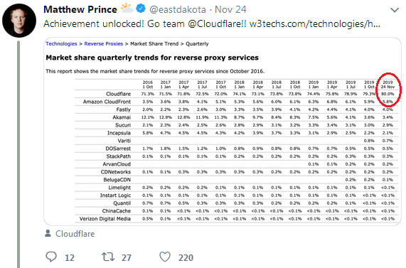  |
|  Cloudflare находится между вами и исходным веб-сервером, как [агент пограничного патрулирования](https://www.cbp.gov/careers/bpa). Вы не можете напрямую подключиться туда куда вы выбрали. Вместо этого вы подключаетесь к Cloudflare, и по пути вся ваша информация расшифровывается и передаётся. Cloudflare непрерывно следит [за всем](https://web.archive.org/web/20210730102406/https://blog.cloudflare.com/crawler-hints-how-cloudflare-is-reducing-the-environmental-impact-of-web-searches/) интернет-трафиком, который к поступает к ним или исходит от них. |  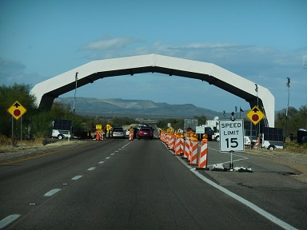  |
|  Администратор исходного веб-сервера позволил агенту — Cloudflare — решать, [кто может получить доступ](https://web.archive.org/web/https://gitlab.com/iblech/tor-appeal/issues/1) к их «веб-ресурсу» и определять «запретную зону».  |    |
|  Взгляните на изображение справа. Вам покажется, что Cloudflare блокирует _только_ [плохих парней](https://en.wikipedia.org/wiki/Black_hat_(computer_security)). Вы покажется, что _Cloudflare всегда в сети (никогда не выходит из строя)_. Вам покажется, что легальные боты и [поисковые роботы](https://ru.wikipedia.org/wiki/%D0%9F%D0%BE%D0%B8%D1%81%D0%BA%D0%BE%D0%B2%D1%8B%D0%B9_%D1%80%D0%BE%D0%B1%D0%BE%D1%82) могут индексировать ваш сайт.  |  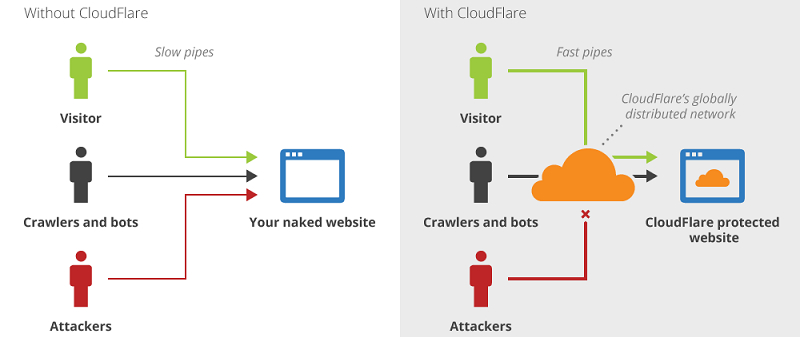  |
|  Но это [совсем не так](https://framagit.org/dCF/deCloudflare/-/blob/master/PEOPLE.md). Cloudflare блокирует невиновных людей без причины. Cloudflare [может выйти из строя](https://framagit.org/dCF/deCloudflare/-/blob/master/HISTORY.md#user-content-cloudflare-incidents). Cloudflare блокирует легальных ботов.  |  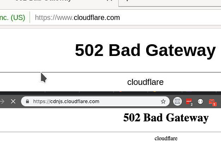  |
|  Как и любой хостинг, Cloudflare не идеален. Вы увидите этот экран, [даже если исходный сервер работает нормально](https://framagit.org/dCF/deCloudflare/-/blob/master/PEOPLE.md).  |  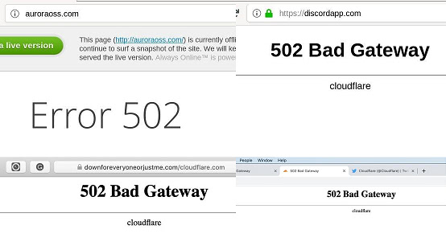 |
|  Вы действительно думаете, что время безотказной работы Cloudflare составляет 100%? [Вы не представляете](https://framagit.org/dCF/deCloudflare/-/blob/master/PEOPLE.md), [сколько раз](https://framagit.org/dCF/deCloudflare/-/blob/master/HISTORY.md#cloudflare-incidents) Cloudflare [падает](https://web.archive.org/web/20200717232437/https://www.zerohedge.com/markets/major-part-web-offline-cloudflare-suffers-outage). Если Cloudflare выйдет из строя, ваш клиент не сможет получить доступ к вашему сайту. |  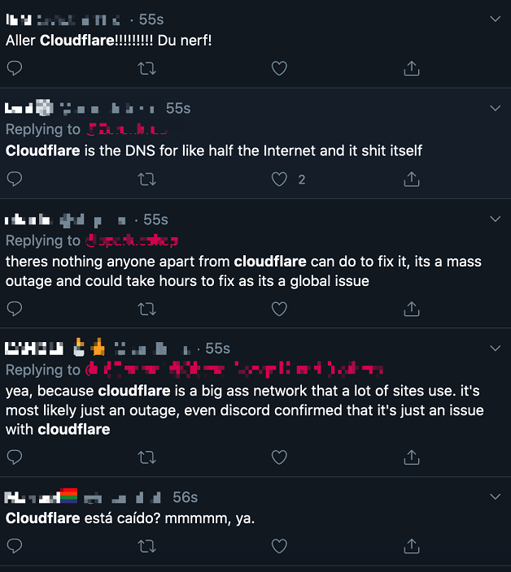 |
|  Называние отсылает к [Великому китайскому фаерволу](https://www.comparitech.com/privacy-security-tools/blockedinchina/), который выполняет аналогичную работу, [запрещая многим людям](https://framagit.org/dCF/deCloudflare/-/blob/master/PEOPLE.md) просмотр веб-контента (т.е. всем в [материковом Китае](https://ru.wikipedia.org/wiki/%D0%9A%D0%B8%D1%82%D0%B0%D0%B9) и за его пределами). Но те, кого это он не затронул, увидят совершенно иную сеть, сеть, свободную от цензуры, например изображение [«танкиста»](https://ru.wikipedia.org/wiki/%D0%9D%D0%B5%D0%B8%D0%B7%D0%B2%D0%B5%D1%81%D1%82%D0%BD%D1%8B%D0%B9_%D0%B1%D1%83%D0%BD%D1%82%D0%B0%D1%80%D1%8C) и историю [«протестов на площади Тяньаньмэнь»](https://en.wikipedia.org/wiki/1989_Tiananmen_Square_protests_and_massacre#Censorship_in_China). | 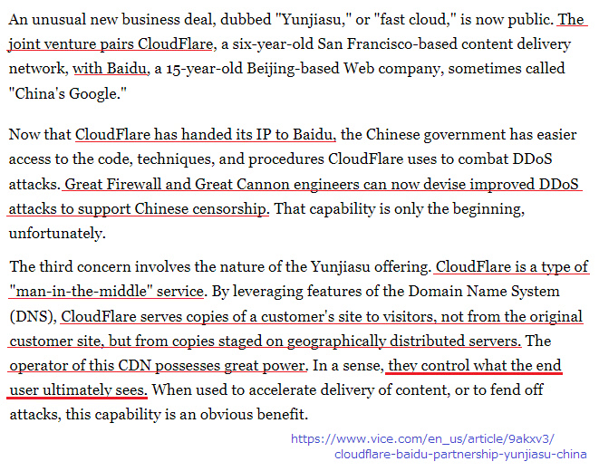  |
|  Cloudflare обладает [огромной силой](https://web.archive.org/web/20220329115719/https://digdeeper.neocities.org/ghost/mozilla.html). В каком-то смысле они контролируют, что в конечном итоге увидит пользователь. Вы можете и не увидеть сайт вовсе, из-за Cloudflare. |  |
|  Cloudflare может быть использован для цензуры. | 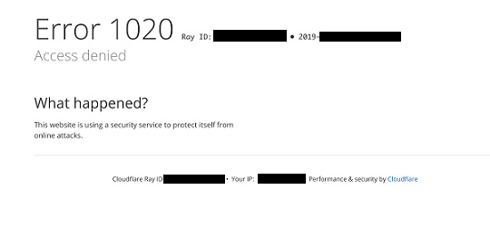 |
|  Вы не попадёте на сайт, если используете непопулярный браузер, из-за которого Cloudflare может решить, что вы бот (потому что не так много людей им пользуются). | 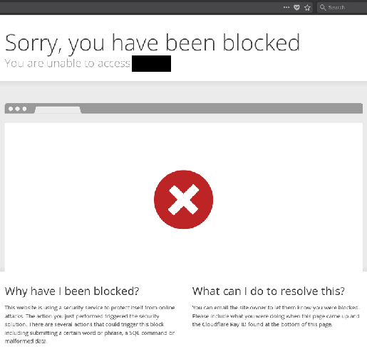 |
|  Вы не сможете пройти эту агрессивную «проверку браузера», не включив Javascript. Это пустая трата пяти (или более) секунд вашей драгоценной жизни. | 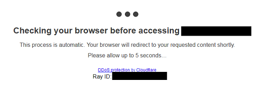 |
|  Cloudflare также [автоматически](https://twitter.com/itsybitsydots/status/1212691131508477952) [блокирует](https://framagit.org/dCF/deCloudflare/-/blob/master/PEOPLE.md) легальных поисковых роботов, таких как Google, Яндекс, Yacy и [клиентские API](https://framagit.org/dCF/deCloudflare/-/blob/master/PEOPLE.md). Cloudflare активно [следит](https://framagit.org/dCF/deCloudflare/-/blob/master/PEOPLE.md) за сообществом «обхода cloudflare» с целью сломать законных исследовательских ботов. | 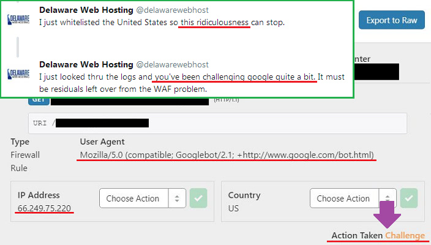  |
|  Точно так же Cloudflare не позволяет многим людям с плохим подключением к Интернету получить доступ к сайтам (например, они могут находиться за 7+ слоями NAT или использовать один и тот же IP-адрес, например общедоступный Wi-Fi), пока они не решат несколько капч с изображениями. Иногда, чтобы удовлетворить Google, [на это может потребоваться от 10 до 30 минут](https://trac.torproject.org/projects/tor/ticket/23840). |  |
|  В 2020 году Cloudflare перешла с [Recaptcha от Google](https://ru.wikipedia.org/wiki/ReCAPTCHA) на hCaptcha, поскольку Google [собирается взимать плату](https://professionalhackers.in/cloudflare-dumps-recaptcha-as-google-intends-to-charge-for-its-use/) за ее использование. Cloudflare рассказали вам, что они заботятся о вашей приватности ([«это помогает решить проблему приватности»](https://blog.cloudflare.com/moving-from-recaptcha-to-hcaptcha/)), но это очевидная ложь. Все дело в деньгах. «[HCaptcha](https://www.hcaptcha.com/) позволяет сайтам зарабатывать деньги, удовлетворяя этот спрос, в то же время блокируя ботов и другие формы злоупотреблений» | 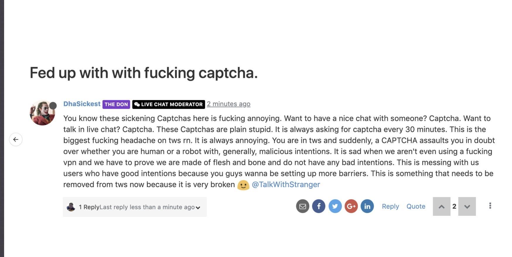  |
|  С точки зрения пользователя, это ничего особенно меняет. Вас заставляют ее решить. |   |
|  Cloudflare [каждый день](https://framagit.org/dCF/deCloudflare/-/blob/master/PEOPLE.md) блокирует множество людей и программного обеспечения. | 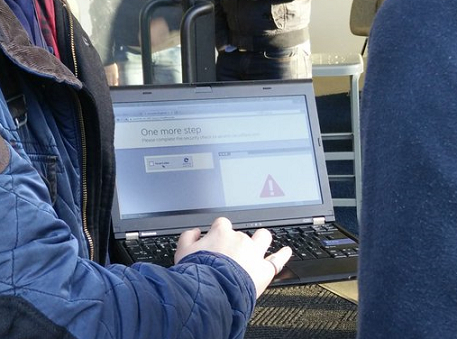 |
|  Cloudflare [раздражает людей по всему миру](https://framagit.org/dCF/deCloudflare/-/blob/master/PEOPLE.md). Взгляните на [список](https://framagit.org/dCF/deCloudflare/-/blob/master/PEOPLE.md) и подумайте, хорошо ли повлияет на удобство пользователей внедрение Cloudflare на ваш сайт. |   |
|  В чём смысл Интернета, если вы не можете делать то, что хотите? Большинство людей, которые посещают ваш сайт, просто пойдут искать другие сайты, если [не смогут загрузить](https://www.hostingmanual.net/3-seconds-how-website-speed-impacts-visitors-sales/) страницу. Вы, возможно, и не блокируете посетителей, но стандартного брандмауэра Cloudflare достаточно, чтобы заблокировать множество людей. |   |
|  Невозможно решить капчу, без включения Javascript и файлов cookie. Cloudflare [использует их](https://framagit.org/dCF/deCloudflare/-/blob/master/PEOPLE.md) для создания отпечатка браузера, чтобы [идентифицировать](browser signature) [вас](browser signature). Cloudflare нужно знать кто вы, чтобы решить, имеете ли вы право продолжать просмотр сайта. | 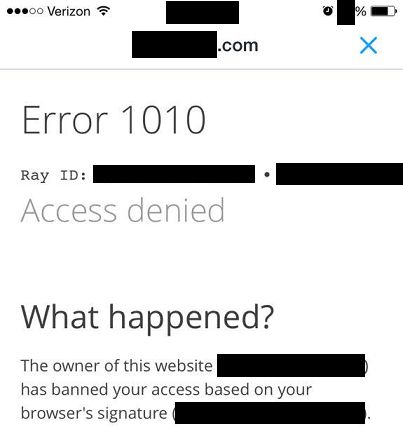  |
|  [Пользователи Tor](https://www.torproject.org/) и [пользователи VPN](identity) также становятся [жертвами](https://blog.torproject.org/trouble-cloudflare) Cloudflare. И тем и другим пользуются многие люди, которые не могут себе позволить Интернет без цензуры из-за своей страны/корпорации/сетевой политики, или те кто хочет добавить дополнительный слой защиты для своей приватности. Cloudflare бесстыдно атакует этих людей, вынуждая их отключить свои прокси-решения. | 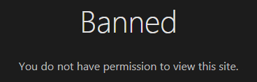 |
|  Если вы никогда раньше не пробовали Tor, мы рекомендуем вам [скачать Tor Browser](https://www.torproject.org/) и посетить свои любимые сайты. (совет: Не входите на сайт вашего банка или правительства, а то они могут отметить ваш аккаунт. Для таких сайтов используйте VPN.)| 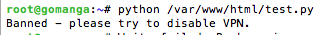 |
|  Вам наверное захочется сказать: «Tor это незаконно! Пользователи Tor преступники! Tor — это плохо!». Нет. По телевидению вы можете узнать, что Tor может быть использован для просмотра [даркнета](https://ru.wikipedia.org/wiki/%D0%94%D0%B0%D1%80%D0%BA%D0%BD%D0%B5%D1%82) и торговли оружием, наркотиками или [детской порнографией](https://ru.wikipedia.org/wiki/%D0%94%D0%B5%D1%82%D1%81%D0%BA%D0%B0%D1%8F_%D0%BF%D0%BE%D1%80%D0%BD%D0%BE%D0%B3%D1%80%D0%B0%D1%84%D0%B8%D1%8F). И хотя то, что сказанное выше — правда, и в даркнете есть множество веб-сайтов, на которых вы можете купить такие товары, подобные сайты часто появляются и в обычном Интернете.  | 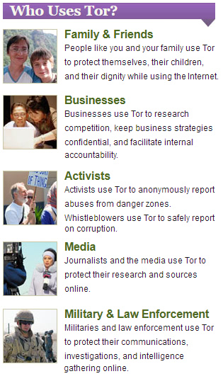 |
|  Tor _был_ [разработан армией США](https://www.nrl.navy.mil/itd/chacs/dingledine-tor-second-generation-onion-router), но сегодня Tor разрабатывается [проектом Tor](https://www.torproject.org/). Многие люди и организации используют Tor, включая ваших будущих друзей. Таким образом, если вы используете Cloudflare на своем сайте, вы блокируете _реальных_ людей. Вы лишитесь потенциальной дружбы и деловой сделки. | 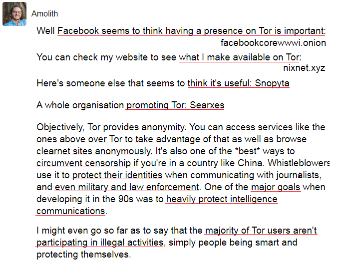 |
|  И их служба DNS [1.1.1.1](https://1.1.1.1/) также не даёт пользователям попасть на сайт, возвращая [поддельный](https://trac.torproject.org/projects/tor/ticket/32915) IP-адрес, [принадлежащий Cloudflare](https://www.reddit.com/r/CloudFlare/comments/hiqm4u/no_cloudflare_website_is_loading/), локальный IP-адрес, такой как «127.0.0.x», или попросту ничего. | 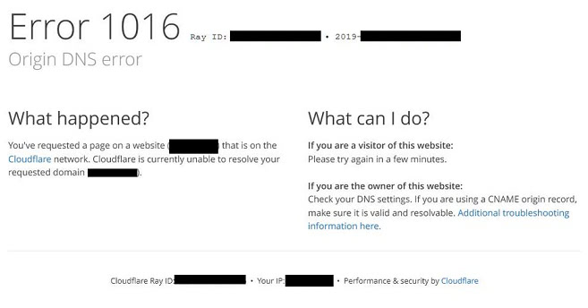 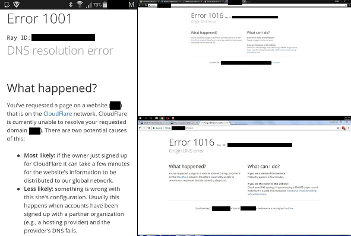 |
|  Cloudflare DNS также [ломает](https://twitter.com/bowranger/status/1213031783576428550) [онлайн](https://twitter.com/jb510/status/1212521533907668992) [программное обеспечение](https://twitter.com/No_Style/status/1201525422795710466) [от](https://twitter.com/daemuth/status/1187758306535903233) [приложения](https://twitter.com/gregortorrence/status/1183102089439805441) [для смартфона](https://www.reddit.com/r/CloudFlare/comments/gmfm4i/us_bank_website_is_not_in_cloudflare_dns/) [до компьютерной игры из-за своего поддельного DNS-ответа](https://framagit.org/dCF/deCloudflare/-/blob/master/PEOPLE.md).Cloudflare DNS [не может отправлять запросы](https://framagit.org/dCF/deCloudflare/-/blob/master/PEOPLE.md) сайтам некоторых банков. | 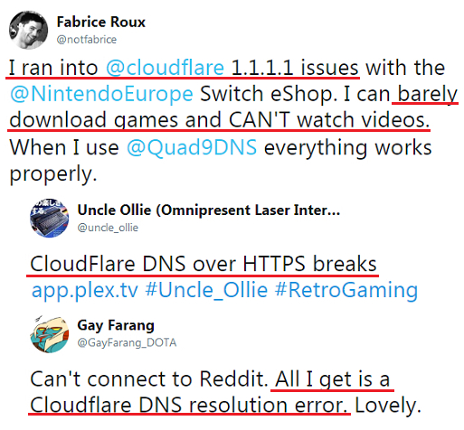  |
|  И тут вы можете подумать, Я не использую Tor или VPN, какая разница? Я доверяю маркетингу Cloudflare, какая разница Мой сайт на https, какая разница |  |
|  Когда вы посещаете сайт, который использует Cloudflare, вы делитесь своей информацией не только с владельцем сайта, но и с Cloudflare. Так и работает [обратный прокси](https://ru.wikipedia.org/wiki/%D0%9E%D0%B1%D1%80%D0%B0%D1%82%D0%BD%D1%8B%D0%B9_%D0%BF%D1%80%D0%BE%D0%BA%D1%81%D0%B8). | 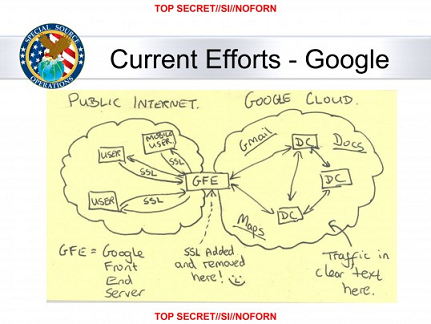 |
|  [Анализировать](https://blog.cloudflare.com/the-csam-scanning-tool/) без [расшифровки TLS-трафика](https://github.com/nym-zone/block_cloudflare_mitm_fx/issues/15#issuecomment-354773389) невозможно. | 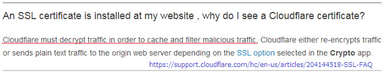 |
|  Cloudflare знает всё о ваших данных, даже необработанный пароль. | 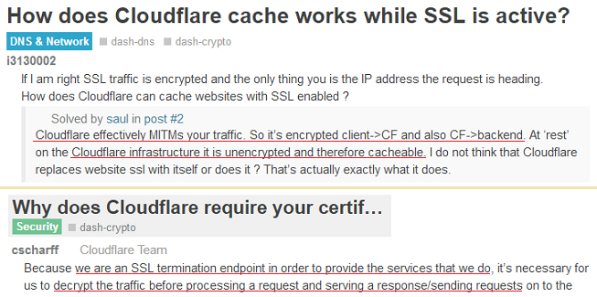 |
|  [Cloudbeed](https://en.wikipedia.org/wiki/Cloudbleed) может случиться когда угодно. | 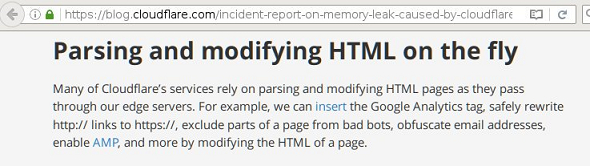 |
|  Https от Cloudflare никогда не защищено сквозным шифрованием. |  |
|  Вы действительно хотите поделиться своими данными с Cloudflare, а также с агентством из трёх букв? | 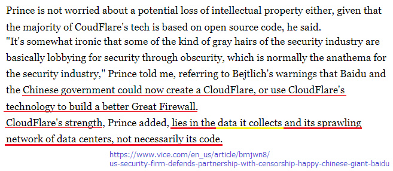 |
|  Онлайн-профиль пользователя Интернета — это «продукт», который хотят купить правительство и крупные технологические компании. | 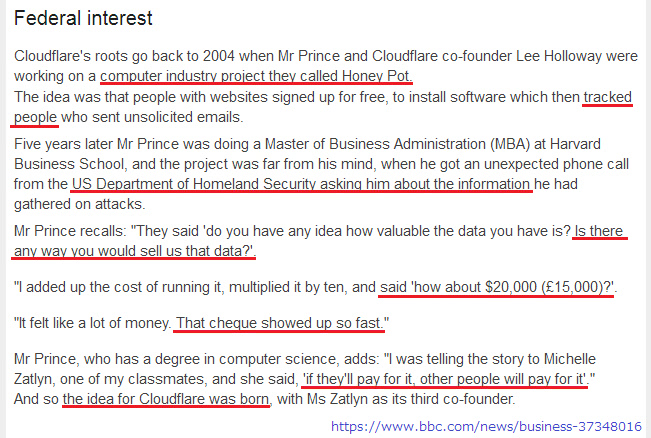 |
|  [Министерство внутренней безопасности](https://www.dhs.gov/) США заявило:  Вы хоть представляете, насколько ценны данные, которые у вас есть? Не могли бы вы продать их нам?  |  |
|  Cloudflare также предлагает _БЕСПЛАТНЫЙ_ VPN-сервис под названием «[Cloudflare Warp](https://blog.cloudflare.com/1111-warp-better-vpn/)». Если вы его используете, все соединения вашего смартфона ([или компьютера](https://techniapps.com/2019/09/26/download-cloudflare-warp-vpn-for-pc-windows-10-mac/)) отправляются на серверы Cloudflare. Cloudflare может знать, какой сайт вы посещали, какие комментарии вы оставляли, с кем разговаривали и т. д. Вы добровольно отдаёте [всю свою информацию](https://github.com/privacytoolsIO/privacytools.io/issues/374#issuecomment-478686469) в руки Cloudflare. Если вы думаете: _«Вы что шутите? Cloudflare безопасен»_. тогда вам нужно узнать, [как работает VPN](https://ru.wikipedia.org/wiki/VPN). | 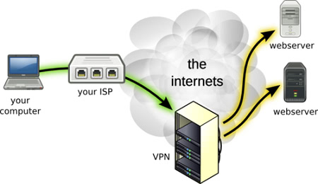 |
|  Cloudflare заявили, что их VPN-сервис сделает ваш интернет [быстрее](https://www.wired.com/story/cloudflare-says-new-vpn-service-wont-slow-you-down/). Но VPN делает ваше интернет-соединение _медленнее_, чем [ваше существующее соединение](https://twitter.com/ExYakuza/status/1182317536089526273). | 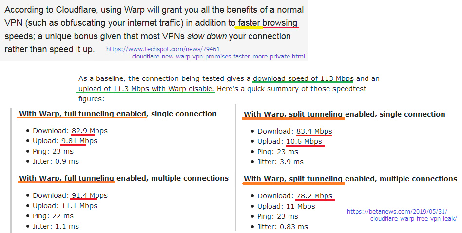 |
|  Возможно, вы уже знаете о скандале с [PRISM](https://ru.wikipedia.org/wiki/PRISM_(%D0%BF%D1%80%D0%BE%D0%B3%D1%80%D0%B0%D0%BC%D0%BC%D0%B0_%D1%80%D0%B0%D0%B7%D0%B2%D0%B5%D0%B4%D0%BA%D0%B8)). Это правда, что [AT&T](https://ru.wikipedia.org/wiki/AT%26T) позволяет [АНБ](https://ru.wikipedia.org/wiki/%D0%90%D0%B3%D0%B5%D0%BD%D1%82%D1%81%D1%82%D0%B2%D0%BE_%D0%BD%D0%B0%D1%86%D0%B8%D0%BE%D0%BD%D0%B0%D0%BB%D1%8C%D0%BD%D0%BE%D0%B9_%D0%B1%D0%B5%D0%B7%D0%BE%D0%BF%D0%B0%D1%81%D0%BD%D0%BE%D1%81%D1%82%D0%B8) [копировать все данные из Интернета](https://www.cnet.com/news/at-t-lets-nsa-hide-and-surveil-in-plain-sight-the-intercept-reports/) для слежки. |  |
|  Допустим, вы работаете в АНБ и хотите, чтобы _у каждого гражданина был профиль в Интернете_. Вы знаете, что большинство из них [слепо доверяют Cloudflare](https://twitter.com/search?q=Cloudflare&f=live) и используют его — только один централизованный шлюз — для проксирования соединения с сервером своей компании (SSH/RDP), [электронной почтой](https://developers.cloudflare.com/email-routing/), личным сайтом, чатом, форумом, сайтом банка, сайтом страхования, поисковой системой, сайтом, доступного только для тайным участников, сайтом аукциона, [онлайн-магазином](https://www.cloudflare.com/case-studies/shopify-powering-the-biggest-shopping-weekend-of-the-year/), сайтом с видео, [сайтом с играми](https://framagit.org/dCF/deCloudflare/-/blob/master/image/README.md), сайтами 18+ и незаконными сайтами. Вы также знаете, что они используют службу DNS от Cloudflare («1.1.1.1») и службу VPN («Cloudflare Warp») чтобы сделать пребывание в интернете «Безопаснее! Быстрее! Лучше!». Если объединить их с IP-адресом пользователя, [отпечатком](https://github.com/VeNoMouS/cloudscraper/issues/209#issuecomment-624853689) браузера, файлами cookie и RAY-ID, можно составить полный онлайн-профиль цели. |   |
|  Вам нужны их данные. [Что же вы сделаете](https://www.reddit.com/r/privacy/comments/1gb0pa/how_prism_actually_works_1520_att_fiber_optic/)? |  |
|  **Cloudflare - это ловушка.** |  |
|  **Бесплатный мед для всех. С _парочкой_ дополнительных условий.** | 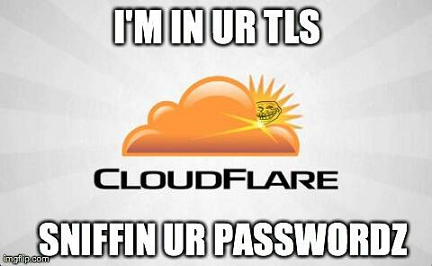 |
|  **Не используйте Cloudflare.** | 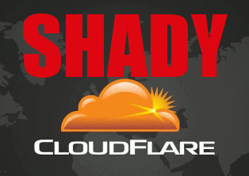 |
|  **Децентрализируйте Интернет.** |  |

---

##    Пожалуйста, перейдите на следующую страницу:  "[Этика Cloudflare](ru.ethics.md)"

---

_нажми на меня_

## Данные и дополнительная информация

Этот репозиторий представляет собой список веб-сайтов, которые находятся за «Великим Cloudwall'ом», блокируя пользователей Tor и другие CDN.

**Данные**
* [Cloudflare Inc.](../cloudflare_inc/)
* [Пользователи Cloudflare](../cloudflare_users/)
* [Cloudflare Домены](../cloudflare_users/domains/)
* [Пользователи CDN, не относящиеся к Cloudflare](../not_cloudflare/)
* [Пользователи Anti-Tor](../anti-tor_users/)

**Больше информации**
* **[☞ deCloudflare Subfiles ☜](../subfiles/README.md)**
* [The Great Cloudwall](../pdf/2019-Jeff_Cliff_Book1.txt), [Mr. Jeff Cliff](https://shitposter.club/users/jeffcliff)
  * Скачать: [PDF](../pdf/2019-The_Great_Cloudwall.pdf), [ePUB](../pdf/2019-Jeff_Cliff_The_Great_Cloudwall.epub)
  * Исходная электронная книга (ePUB) была удалена BookRix GmbH из-за нарушения авторских прав на материал CC0.
* [Padlock icon indicates a secure SSL connection established w MITM-ed](https://bugs.debian.org/cgi-bin/bugreport.cgi?bug=831835), Anonymous
* [Block Global Active Adversary Cloudflare](https://trac.torproject.org/projects/tor/ticket/24351), nym-zone
  * Тикет много раз подвергался вандализму.
  * [Удалено проектом Tor.](https://lists.torproject.org/pipermail/anti-censorship-team/2020-May/000098.html) [См. Билет 34175.](https://trac.torproject.org/projects/tor/ticket/34175)
  * [Последний архивный тикет 24351.](https://web.archive.org/web/20200301013104/https://trac.torproject.org/projects/tor/ticket/24351)
* [Cloudflare Watch](http://www.crimeflare.org:82/)
  * Archived - [CloudFlare Watch](../subfiles/classics/README.md)
* [Criticism and controversies](https://en.wikipedia.org/wiki/Cloudflare#Criticism_and_controversies), Wikipedia
* [CloudFlare rap sheet](../subfiles/rapsheet.cloudflare.md)

---

_нажми на меня_

## Что вы можете сделать?

* [Прочитайте наш список рекомендуемых действий и поделитесь им с друзьями.](ru.action.md)

* [Прочитайте, что пишут другие пользователи и запишите свои мысли.](../PEOPLE.md)

* Поищите что-нибудь в интернете: [Ombrelo](../subfiles/service/ombrelo.md)

* Обновите список доменов: [Список инструкций](../INSTRUCTION.md).

* [Добавить Cloudflare связанные события в историю.](../HISTORY.md)

* [Попробуйте и напишите новый инструмент/скрипт.](../tool/)
   * [CfDomains](../tool/cfdomains/README.md)

* [Вот несколько PDF/ePUB для чтения.](../pdf/)

---

### О фальшивых аккаунтах

Мы знаем о существовании фальшивых аккаунтов, выдающих себя за наши официальные каналы, будь то Twitter, Facebook, Mastodon, Github, Gitea, Patreon, OpenCollective, Villages и т. д. **Мы никогда не просим адрес вашей электронной почты. Мы никогда не спрашиваем, как вас зовут, кто вы и где вы находитесь. Мы никогда не просим написать отзыв или подписаться в социальных сетях. Мы никогда не спрашиваем ваш аккаунт в социальных сетях.**

# НЕ ДОВЕРЯЙТЕ ФАЛЬШИВЫМ АККАУНТАМ.

---

| 🖼 | 🖼 |
| --- | --- |
|  |  |
| 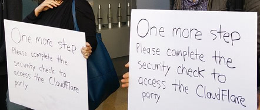 |  |
|  | 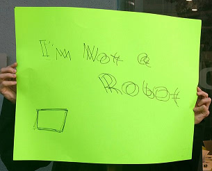 |

---

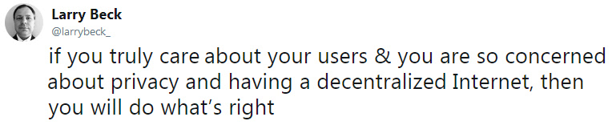

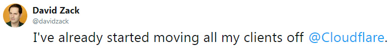

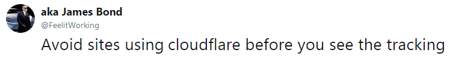

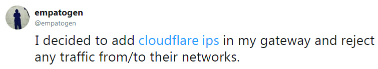

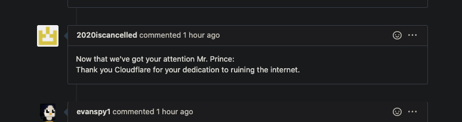

[🖼 Плакаты](../image/poster)
