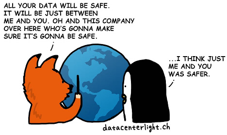

# Maxaad sameyn kartaa si aad isaga caabbiso Cloudflare?

| 🖼 | 🖼 | 🖼 |
| --- | --- | --- |
|  |  |  |


Matthew Browning Prince, naskita la 13an de novembro 1974, estas la ĉefoficisto kaj kunfondinto de Cloudflaron.

Danke al lia riĉa paĉjo, "John B. Prince", li ĉeestis la Universitaton de Ĉikago Leĝlernejo kaj Harvard Komerclernejo.
Princo instruis Interretan leĝon kaj estis specialisto pri kontraŭ-spamaj leĝoj kaj Fraŭdo-esploroj.


"*I’d suggest this was armchair analysis by kids – it’s hard to take seriously.*" [t](https://www.theguardian.com/technology/2015/nov/19/cloudflare-accused-by-anonymous-helping-isis)

"*That was simply unfounded paranoia, pretty big difference.*"  [t](https://twitter.com/xxdesmus/status/992757936123359233)

"*We also work with Interpol and other non-US entities*" [t](https://twitter.com/eastdakota/status/1203028504184360960)

"*Watching hacker skids on Github squabble about trying to bypass Cloudflare's new anti-bot systems continues to be my daily amusement.* 🍿" [t](https://twitter.com/eastdakota/status/1273277839102656515)


---


<details>
<summary>i guji

## Macaamiil websaydh ah
</summary>


- Haddii websaydhka aad jeceshahay uu adeegsanayo Cloudflare, u sheeg inaysan isticmaalin Cloudflare.
  - Ku guulaysiga baraha bulshada sida Facebook, Reddit, Twitter ama Mastodon wax farqi ah ma lahan. [Waxqabadka ayaa ka xoog badan hashtags.](https://twitter.com/phyzonloop/status/1274132092490862594)
  - Isku day inaad la xiriirto milkiilaha websaydhka haddii aad rabto inaad naftaada ka dhigto mid waxtar leh.

[Cloudflare ayaa yiri](https://github.com/Eloston/ungoogled-chromium/issues/783):
```
Waxaan kugula talineynaa inaad la xiriirto maamulayaasha adeegyada ama boggaga gaarka ah ee aad dhibaatada kala kulanto oo aad la wadaagto khibradaada.
```

[Haddii aadan weydiisan, milkiilaha degelku weligiis ma ogaan doono dhibaatadan.](../PEOPLE.md)


[Tusaale guul leh](https://counterpartytalk.org/t/turn-off-cloudflare-on-counterparty-co-plz/164/5).<br>
Dhibaato ayaad qabtaa? [Codkaaga hada kor uqaad.](https://github.com/maraoz/maraoz.github.io/issues/1) Tusaalaha hoose.

```
Kaliya waxaad caawineysaa faafreebka shirkadaha iyo kormeerka ballaaran.
http://crimeflare.eu.org
```

```
Boggaaga internetka wuxuu ku dhexyaalaa-qarsoodiga-ku-xadgudubka-darbiga-gaarka ah ee CloudFlare.
http://crimeflare.eu.org
```

- Waqti qaado si aad u aqriso siyaasada asturnaanta bogga.
  - haddii degelku ka dambeeyo Cloudflare ama degelku adeegsanayo adeegyo ku xiran Cloudflare.

Waa inay sharraxdo waxa uu yahay "Cloudflare", oo ay weydiisato rukhsad ay kula wadaagaan xogtaada Cloudflare. Ka gaabinta in sidaas la sameeyo waxay keeni doontaa jebinta kalsoonida iyo websaydhka laga hadlayo waa in laga fogaadaa.

[Tusaalaha siyaasada asturnaanta ee la aqbali karo ayaa halkan ku taal](https://archive.is/bDlTz) ("Subprocessors" > "Entity Name")

```
Waan aqriyay siyaasadaada asturnaanta mana heli karo erayga Cloudflare.
Waan diidey inaan kula wadaago xogta haddii aad sii wadatid inaad xogteyda ku quudiso Cloudflare.
http://crimeflare.eu.org
```

Tani waa tusaale siyaasad gaar ah oo aan lahayn erayga Cloudflare.
[Liberland Jobs](https://archive.is/daKIr) [privacy policy](https://docsend.com/view/feiwyte):


Cloudflare waxay leeyihiin siyaasadooda u gaarka ah.
[Cloudflare wuxuu jecel yahay dadka da 'yarta ah.](https://www.reddit.com/r/GamerGhazi/comments/2s64fe/be_wary_reporting_to_cloudflare/)

Waa kuwan tusaale wanaagsan oo loogu talagalay foomka is-qoritaanka websaydhka.
AFAIK, websaydh eber ah ayaa sidan sameeya. Miyaad ku kalsoon tahay iyaga?

```
Adoo gujinaya "Saxiix XYZ", waxaad ogolaatay shuruudahayaga adeegga iyo bayaanka asturnaanta.
Waxaad sidoo kale ogolaatay inaad la wadaagto xogtaada Cloudflare sidoo kale waxaad ogolaatay bayaanka asturnaanta Cloudflare.
Haddii Cloudflare ay daadato macluumaadkaaga ama aysan kuu oggolaan doonin inaad ku xirnaato adeegeyaasheena, annaga khaladkeena ma aha. [*]

[ Saxiix ] [ Waan diidanahay ]
```
[*] [PEOPLE.md](../PEOPLE.md)


- Isku day inaadan adeegsan adeegooda. Xusuusnow waxaa ku daawanaya Cloudflare.
  - ["I'm in your TLS, sniffin' your passworz"](../image/iminurtls.jpg)

- Raadi degel kale. Waxaa jira badallo iyo fursado internetka!

- Ku qanci saaxiibbadaa inay adeegsadaan Tor maalin kasta.
  - Aqoonsi la'aantu waa inay noqotaa halbeegga internetka furan!
  - [Xusuusnow in mashruuca Tor uusan necbayn mashruucan.](../HISTORY.md)

</details>

------

<details>
<summary>i guji

## Kudarro
</summary>

- Haddii biraawsarkaagu yahay Firefox, Tor Browser, ama Ungoogled Chromium isticmaal mid ka mid ah ku darrada hoose.
  - Haddii aad rabto inaad ku darto waxyaabo kale oo cusub oo cusub weydii marka hore.


| Magaca | Horumar | Taageero | Joojin Karaa | Ogeysiin karaa | Chrome |
| -------- | -------- | -------- | -------- | -------- | -------- |
| [Bloku Cloudflaron MITM-Atakon](../subfiles/addon/bcma.md) | #Addon | [ ? ](http://crimeflare.eu.org/) | **Haa**     | **Haa**     |  **Haa** |
| [Ĉu ligoj estas vundeblaj al MITM-atako?](../subfiles/addon/ismm.md) | #Addon | [ ? ](http://crimeflare.eu.org/) | Maya     | **Haa**     |  **Haa** |
| [Ĉu ĉi tiuj ligoj blokos Tor-uzanton?](../subfiles/addon/isat.md) | #Addon | [ ? ](http://crimeflare.eu.org/) | Maya     | **Haa**     |  **Haa** |
| [Block Cloudflare MITM Attack](https://trac.torproject.org/projects/tor/attachment/ticket/24351/block_cloudflare_mitm_attack-1.0.14.1-an%2Bfx.xpi)<br>[**DELETED BY TOR PROJECT**](../HISTORY.md) | nullius | [ ? ](../tool/block_cloudflare_mitm_fx), [Link](http://crimeflare.eu.org/) | **Haa**     | **Haa**     |  Maya |
| [TPRB](http://sw.nnpaefp7pkadbxxkhz2agtbv2a4g5sgo2fbmv3i7czaua354334uqqad.onion/) | Sw | [ ? ](http://sw.nnpaefp7pkadbxxkhz2agtbv2a4g5sgo2fbmv3i7czaua354334uqqad.onion/) | **Haa**     | **Haa**     |  Maya |
| [Detect Cloudflare](https://addons.mozilla.org/en-US/firefox/addon/detect-cloudflare/) | Frank Otto | [ ? ](https://github.com/traktofon/cf-detect) | Maya     | **Haa**     |  Maya |
| [True Sight](https://addons.mozilla.org/en-US/firefox/addon/detect-cloudflare-plus/) | claustromaniac | [ ? ](https://github.com/claustromaniac/detect-cloudflare-plus) | Maya     | **Haa**     |  Maya |
| [Which Cloudflare datacenter am I visiting?](https://addons.mozilla.org/en-US/firefox/addon/cf-pop/) | 依云 | [ ? ](https://github.com/lilydjwg/cf-pop) | Maya     | **Haa**     |  Maya |


- "Decentraleyes" waxay joojin kartaa isku xirka "CDNJS (Cloudflare)".
  - Waxay ka hortagtaa codsiyo badan inay gaaraan shabakadaha, waxayna u adeegtaa faylasha maxalliga ah si looga ilaaliyo goobaha inay jabaan.
  - Horumariyaha ayaa ku jawaabay: "[very concerning indeed](https://github.com/Synzvato/decentraleyes/issues/236#issuecomment-352049501)", "[widespread usage severely centralizes the web](https://github.com/Synzvato/decentraleyes/issues/251#issuecomment-366752049)"

- [Waxa kale oo aad ka saari kartaa ama ku kalsoonaan kartaa shahaadada Cloudflare ee Maamulka Shahaadada (CA).](https://www.ssl.com/how-to/remove-root-certificate-firefox/)

</details>

------

<details>
<summary>i guji

## Milkiilaha websaydhka / Soosaaraha Webka
</summary>


- Ha isticmaalin xalka Cloudflare, Muddada.
  - Waad ka fiicnaan kartaa taas, sax? [Waa tan sida looga saaro diiwaangelinta Cloudflare, qorshayaasha, bogagga, ama koontooyinka.](https://support.cloudflare.com/hc/en-us/articles/200167776-Removing-subscriptions-plans-domains-or-accounts)

| 🖼 | 🖼 |
| --- | --- |
|  |  |

- Ma rabtaa macaamiil badan? Waad ogtahay waxa la sameeyo. Tilmaamku waa "khadka sare".
  - [Waad salaaman tahay, waxaad qortay "Waxaan u qaadaneynaa arimahaaga gaarka ah si dhab ah" laakiin waxaan helay "Error 403 Rexy Anonymous Proxy Lama ogola".](https://it.slashdot.org/story/19/02/19/0033255/stop-saying-we-take-your-privacy-and-security-seriously) Maxaad u xireysaa Tor Or VPN? Oo maxaad u xannibaysaa emayllada ku meel gaarka ah?


- Isticmaalka Cloudflare waxay kordhin doontaa fursadaha go'itaanka. Soo-booqdayaashu ma geli karaan websaydhkaaga haddii server-kaagu hoos u socdo ama Cloudflare uu hoos u dhaco.
  - [Runtii miyaad u maleyneysay in Cloudflare uusan waligiis hoos u dhicin?](https://www.ibtimes.com/cloudflare-down-not-working-sites-producing-504-gateway-timeout-errors-2618008) [Another](https://twitter.com/Jedduff/status/1097875615997399040) [sample](https://twitter.com/search?f=tweets&vertical=default&q=Cloudflare%20is%20having%20problems). [Need more](../PEOPLE.md)?


- Isticmaalka Cloudflare si aad wakiil uga dhigto "adeeggaaga API", "serverka cusbooneysiinta softiweerka" ama "RSS feed" ayaa waxyeellayn doonta macmiilkaaga. Qof macaamil ah ayaa ku soo wacay oo ku yiri "mar dambe ma isticmaali karo API-gaaga", wax fikrad ahna kama lihid waxa socda. Cloudflare ayaa si aamusnaan ah u xannibaya macmiilkaaga. Ma kula tahay inay caadi tahay?
  - Waxaa jira macmiil aqristaha akhristaha RSS iyo adeegga khadka tooska ah ee akhristaha RSS. Maxaad u faafineysaa quudinta RSS haddii aadan dadka u oggolaanayn inay isdiiwaangeliyaan?


- Ma u baahan tahay shahaadada HTTPS? Adeegso "Aynu Encrypt" ama ka iibso shirkadda CA.

- Ma u baahan tahay server-ka DNS? Ma sameyn kartid server-kaaga? Sidee iyaga ku saabsan: [Hurricane Electric Free DNS](https://dns.he.net/), [Dyn.com](https://dyn.com/dns/), [1984 Hosting](https://www.1984hosting.com/), [Afraid.Org (Maamulka tirtiro koontadaada haddii aad isticmaasho TOR)](https://freedns.afraid.org/)
  - [Alternativoj al DNS](../subfiles/alternative/domaindns.md)

- Ma raadineysaa adeeg martigelin ah? Bilaash kaliya? Sidee iyaga ku saabsan: [Onion Service](http://vww6ybal4bd7szmgncyruucpgfkqahzddi37ktceo3ah7ngmcopnpyyd.onion/en/security/network-security/tor/onionservices-best-practices), [Free Web Hosting Area](https://freewha.com/), [Autistici/Inventati Web Site Hosting](https://www.autinv5q6en4gpf4.onion/services/website), [Github Pages](https://pages.github.com/), [Surge](https://surge.sh/)
  - [Beddelka Cloudflare](../subfiles/alternative/cloudflare.md)

- Ma isticmaaleysaa "Cloudflare-ipfs.com"? [Ma ogtahay in Cloudflare IPFS uu xun yahay?](../PEOPLE.md)

- Ku rakib Firewall Codsiga Webka sida OWASP iyo Fail2Ban ee server-kaaga oo si sax ah u qaabee.
  - Joojinta Tor xal maahan. Ha ku ciqaabin qof walba kaliya isticmaaleyaasha xun ee xun.

- Toosi ama ka jooji isticmaaleyaasha "Cloudflare Warp" inay marin ka helaan websaydhkaaga. Oo sabab keen hadaad awoodid.

> Liiska IP: "[Cloudflare ee xilligan IP-ga](cloudflare_inc/)"

> A: Kaliya iyaga xannib

```
server {
...
deny 173.245.48.0/20;
deny 103.21.244.0/22;
deny 103.22.200.0/22;
deny 103.31.4.0/22;
deny 141.101.64.0/18;
deny 108.162.192.0/18;
deny 190.93.240.0/20;
deny 188.114.96.0/20;
deny 197.234.240.0/22;
deny 198.41.128.0/17;
deny 162.158.0.0/15;
deny 104.16.0.0/12;
deny 172.64.0.0/13;
deny 131.0.72.0/22;
deny 2400:cb00::/32;
deny 2606:4700::/32;
deny 2803:f800::/32;
deny 2405:b500::/32;
deny 2405:8100::/32;
deny 2a06:98c0::/29;
deny 2c0f:f248::/32;
...
}
```

> B: U dariiji bogga digniinta

```
http {
...
geo $iscf {
default 0;
173.245.48.0/20 1;
103.21.244.0/22 1;
103.22.200.0/22 1;
103.31.4.0/22 1;
141.101.64.0/18 1;
108.162.192.0/18 1;
190.93.240.0/20 1;
188.114.96.0/20 1;
197.234.240.0/22 1;
198.41.128.0/17 1;
162.158.0.0/15 1;
104.16.0.0/12 1;
172.64.0.0/13 1;
131.0.72.0/22 1;
2400:cb00::/32 1;
2606:4700::/32 1;
2803:f800::/32 1;
2405:b500::/32 1;
2405:8100::/32 1;
2a06:98c0::/29 1;
2c0f:f248::/32 1;
}
...
}

server {
...
if ($iscf) {rewrite ^ https://example.com/cfwsorry.php;}
...
}

<?php
header('HTTP/1.1 406 Not Acceptable');
echo <<<CLOUDFLARED
Thank you for visiting ourwebsite.com!<br />
We are sorry, but we can't serve you because your connection is being intercepted by Cloudflare.<br />
Please read http://crimeflare.eu.org for more information.<br />
CLOUDFLARED;
die();
```

- Samee Adeegga Basasha ee 'Tor Onion' ama 'I2P' haddii aad aaminsan tahay xorriyadda oo aad soo dhaweyso isticmaaleyaasha aan la aqoon.

- Weydiiso talo lataliyayaasha kale ee shabakadda Clearnet / Tor oo samee saaxiibo aan lagaranayn!

</details>

------

<details>
<summary>i guji

## Isticmaalaha softiweerka
</summary>


- Discord ayaa adeegsanaya CloudFlare. Beddelka? Waxaan ku talinaynaa [**Briar** (Android)](https://f-droid.org/en/packages/org.briarproject.briar.android/), [Ricochet (PC)](https://ricochet.im/), [Tox + Tor (Android/PC)](https://tox.chat/download.html)
  - Briar waxaa ku jira Tor daemon sidaa darteed maahan inaad rakibato Orbot.
  - Soosaarayaasha Qwtch, Asturnaanta Furan, ayaa tirtiray mashruuca stop_cloudflare adeeggooda git ogeysiis la'aan.

- Haddii aad isticmaasho Debian GNU / Linux, ama wax soo saar ah, iska qor: [bug #831835](https://bugs.debian.org/cgi-bin/bugreport.cgi?bug=831835). Haddiise aad awoodid, ka caawi sidii loo xaqiijin lahaa balastarka, oo aad ka caawin lahayd ilaaliyaha inuu la yimaado gabagabada saxda ah haddii la aqbalayo iyo in kale.

- Had iyo jeer kugula taliya daalacashadaas.

| Magaca | Horumar | Taageero | Faallo |
| -------- | -------- | -------- | -------- |
| [Ungoogled-Chromium](https://ungoogled-software.github.io/ungoogled-chromium-binaries/) | Eloston | [ ? ](https://github.com/Eloston/ungoogled-chromium) | PC (Win, Mac, Linux)  _!Tor_ |
| [Bromite](https://www.bromite.org/fdroid) | Bromite | [ ? ](https://github.com/bromite/bromite/issues) | Android  _!Tor_ |
| [Tor Browser](https://www.torproject.org/download/) | Tor Project | [ ? ](https://support.torproject.org/) | PC (Win, Mac, Linux)  _Tor_|
| [Tor Browser Android](https://www.torproject.org/download/) | Tor Project | [ ? ](https://support.torproject.org/) | Android  _Tor_|
| [Onion Browser](https://itunes.apple.com/us/app/onion-browser/id519296448?mt=8) | Mike Tigas | [ ? ](https://github.com/OnionBrowser/OnionBrowser/issues) | Apple iOS  _Tor_|
| [GNU/Icecat](https://www.gnu.org/software/gnuzilla/) | GNU | [ ? ](https://www.gnu.org/software/gnuzilla/) | PC (Linux) |
| [IceCatMobile](https://f-droid.org/en/packages/org.gnu.icecat/) | GNU | [ ? ](https://lists.gnu.org/mailman/listinfo/bug-gnuzilla) | Android |
| [Iridium Browser](https://iridiumbrowser.de/about/) | Iridium | [ ? ](https://github.com/iridium-browser/iridium-browser/) | PC (Win, Mac, Linux, OpenBSD) |


Sirta kale ee software-ka ayaa ah mid aan dhammaystirnayn. Tani macnaheedu maaha in biraawsarka Tor uu yahay "mid hagaagsan".
Ma jiro 100% amaan ah ama 100% gaar ah internetka iyo tikniyoolajiyadda.

- Miyaadan rabin inaad isticmaasho Tor? Waxaad u adeegsan kartaa biraawsar kasta Tor daemon.
  - [Ogsoonow in mashruuca Tor uusan sidan jeclayn.](https://support.torproject.org/tbb/tbb-9/) Isticmaal Tor Browser haddii aad awoodo inaad sidaas sameyso.
- [Sida loogu isticmaalo Chromium Tor](../subfiles/chromium_tor.md)


Aynu ka hadalno waxyaabaha kale ee gaarka ah ee software-ka.

- [Haddii aad runtii u baahan tahay inaad isticmaasho Firefox, soo qaado "Firefox ESR".](https://www.mozilla.org/en-US/firefox/organizations/)
  - [Firefox - Spydo Watchdog](https://spyware.neocities.org/articles/firefox.html)
  - [Firefox way diiday hadalka hadalka, waxay mamnuucday hadalka xorta ah](https://web.archive.org/web/20200423010026/https://reclaimthenet.org/firefox-rejects-free-speech-bans-free-speech-commenting-plugin-dissenter-from-its-extensions-gallery/)
  - ["100+ codad hoos loo dhigo. Waxay umuuqataa inaad weydiisato shirkad softiweer inay ku dhegto ... softiweerka ayaamahan aad u badan."](https://old.reddit.com/r/firefox/comments/gutdiw/weve_got_work_to_do_the_mozilla_blog/fslbbb6/)
  - [Haa, waa maxay sababta Firefox ay iigu tusayso xiriiriyeyaal la kafaala qaaday barkayga URL?](https://www.reddit.com/r/firefox/comments/jybx2w/uh_why_is_firefox_showing_me_sponsored_links_in/)
  - [Mozilla - Ibliis jidhkiisa](https://digdeeper.neocities.org/ghost/mozilla.html)

- [Xusuusnow, Mozilla waxay isticmaaleysaa adeegga Cloudflare.](https://www.robtex.com/dns-lookup/www.mozilla.org) [Waxay sidoo kale u adeegsanayaan adeegga 'Cloudflare' adeegga DNS badeecadooda.](https://www.theregister.co.uk/2018/03/21/mozilla_testing_dns_encryption/)

- [Mozilla waxay si rasmi ah u diiday tikidhkan.](https://bugzilla.mozilla.org/show_bug.cgi?id=1426618)

- [Firefox Focus waa kaftan.](https://github.com/mozilla-mobile/focus-android/issues/1743) [Waxay balanqaadeen inay daminayaan telemetry laakiin way badaleen.](https://github.com/mozilla-mobile/focus-android/issues/4210)

- [Soosaaraha PaleMoon / Basilisk wuxuu jecel yahay Cloudflare.](https://github.com/mozilla-mobile/focus-android/issues/1743#issuecomment-345993097)
  - [Server Pale Moon's Archive Server ayaa jabsaday oo faafiyay furin muddo 18 Bilood ah](https://www.reddit.com/r/privacytoolsIO/comments/cc808y/pale_moons_archive_server_hacked_and_spread/)
  - Wuxuu kaloo neceb yahay dadka isticmaala Tor - "[Cadaawad ha u noqoto Tor. Waxaan u maleynayaa in bogagga badankood ay tahay inay cadaawad u muujiyaan Tor iyagoo tixgelinaya cunsuriyaddeeda aadka u saraysa.](https://github.com/yacy/yacy_search_server/issues/314#issuecomment-565932097)"

- [Waterfox waxay leedahay dhibaato "telefoonada guriga" oo daran](https://spyware.neocities.org/articles/waterfox.html)

- [Google Chrome waa basaas.](https://www.gnu.org/proprietary/malware-google.en.html)
  - [Google wuxuu muujiyaa waxqabadkaaga.](https://spyware.neocities.org/articles/chrome.html)

- [SRWare Iron wuxuu sameeyaa telefoonno aad u tiro badan oo isku xira guriga.](https://spyware.neocities.org/articles/iron.html) Waxay kaloo kuxirantahay google domains.

- [Brackers Browser liistada liiska Facebook / Twitter.](https://www.bleepingcomputer.com/news/security/facebook-twitter-trackers-whitelisted-by-brave-browser/)
  - [Waa tan arrimo dheeraad ah.](https://spyware.neocities.org/articles/brave.html)
  - [aqoonsi ku xiran binance](https://twitter.com/cryptonator1337/status/1269594587716374528)

- [Microsoft Edge wuxuu u oggolaanayaa Facebook inuu ku shaqeeyo lambarka Flash-ka gadaashiisa dhabarka isticmaalayaasha.](https://www.zdnet.com/article/microsoft-edge-lets-facebook-run-flash-code-behind-users-backs/)

- [Vivaldi ma ixtiraamto arimahaaga gaarka ah.](https://spyware.neocities.org/articles/vivaldi.html)

- [Heerka spyware Opera: Aad iyo aad u sareeya](https://spyware.neocities.org/articles/opera.html)

- Apple iOS: [Waa inaadan isticmaalin macruufka gebi ahaanba, badanaa maxaa yeelay waa khayaano.](https://www.gnu.org/proprietary/malware-apple.html)

Sidaa darteed waxaan kugula talineynaa miiska kor ku xusan oo keliya. Wax kale maahan.

</details>

------

<details>
<summary>i guji

## Isticmaalaha Mozilla Firefox
</summary>


- "Firefox Nightly" waxay u diri doontaa macluumaad heer khaldan ah server-yada Mozilla iyada oo aan la isticmaalin habka ka bixitaanka.
  - [Server Mozilla ayaa ku shubaya Cloudflare](https://www.digwebinterface.com/?hostnames=www.mozilla.org%0D%0Amozilla.cloudflare-dns.com&type=&ns=resolver&useresolver=8.8.4.4&nameservers=)

- Waa suurtagal in la mamnuuco Firefox si loogu xiro serverka Mozilla.
  - [Hagaha siyaasada-moodeellada](https://github.com/mozilla/policy-templates/blob/master/README.md)
  - Maskaxda ku hay in khiyaanadan ay joojin karto ka shaqeynta qaybta dambe maxaa yeelay Mozilla waxay jeceshahay inay naftooda caddeyso.
  - Isticmaal firewall iyo filterka DNS si aad u joojiso gebi ahaanba.

"`/distribution/policies.json`"

>     "WebsiteFilter": {
> 		"Block": [
> 		"*://*.mozilla.com/*",
> 		"*://*.mozilla.net/*",
> 		"*://*.mozilla.org/*",
> 		"*://webcompat.com/*",
> 		"*://*.firefox.com/*",
> 		"*://*.thunderbird.net/*",
> 		"*://*.cloudflare.com/*"
> 		]
>     },


- ~~Ka warbixi cayayaanka mozilla tracker, adoo u sheegaya inaysan isticmaalin Cloudflare.~~ Waxaa jiray warbixin cillad ku saabsan bugzilla. Dad badan ayaa la soo dhigay dareenkooda, si kastaba ha ahaatee cayayaanka ayaa qariyey maamulka sanadka 2018.

- Waad ka joojin kartaa DoH Firefox.
  - [Beddel bixiyaha DNS-ka ah ee Firefox](../subfiles/change-firefox-dns.md)



- [Haddii aad jeclaan lahayd inaad isticmaasho DNS aan ISP ahayn, tixgeli adeegsiga adeegga OpenNIC Tier2 DNS ama mid ka mid ah adeegyada aan Cloudflare DNS ahayn.](https://wiki.opennic.org/start)

  - Ka jooji Cloudflare leh DNS. [Crimeflare DNS](../subfiles/service/publicdns.md)

- Waxaad u isticmaali kartaa Tor sida xalliyaha DNS. [Haddii aadan aheyn khabiir Tor, halkaan weydii su'aal.](https://tor.stackexchange.com/)

> **Sidee?**
> 1. Soo dejiso Tor oo ku dheji kombuyuutarkaaga.
> 2. Kudar khadkan faylka "torrc".
> DNSPort 127.0.0.1:53
> 3. Dib u bilaabi Tor.
> 4. U dhig server-kaaga DNS-ka kombuyuutarka "127.0.0.1".

</details>

------

<details>
<summary>i guji

## Ficil
</summary>


- U sheeg dadka kale ee kugu hareeraysan khataraha Cloudflare.

- [Caawi hagaajinta keydkaan.](http://crimeflare.eu.org)
  - Labada liisba, doodaha ka dhanka ah iyo faahfaahinta.

- [Diiwaangeli oo aad u muuji dadweynaha halka ay wax ka khaldan yihiin Cloudflare (iyo shirkadaha la midka ah), hubinta inaad sheegto bakhaarkan markaad sidaas sameyso](http://crimeflare.eu.org) :)

- U hel dad badan oo isticmaalaya Tor markii ugu horraysay si ay ula kulmaan shabakadda marka loo eego aragtida qaybaha kala duwan ee adduunka.

- Kooxo ku bilow, baraha bulshada iyo cimilada, oo loogu tala galay in adduunka laga xoreeyo Cloudflare.

- Meeshii ku habboon, ku xiriir kooxahaan kaydkan - tani waxay noqon kartaa goob isku dubaridka wada shaqeynta koox ahaan.

- [Bilow coof kaas oo bixin kara beddelaad aan shirkad ahayn oo macno leh Cloudflare.](../subfiles/alternative/cloudflare.md)

- Noosoo sheeg wax kasta oo beddelaad ah si aan uga caawino ugu yaraan bixinta difaac dhowr lakab ah oo ka dhan ah Cloudflare.

- Haddii aad tahay macmiil Cloudflare, deji dejintaada sirta ah, oo sug inay ku xadgudbaan.
  - [Ka dib iyaga hoos imaado eedeymaha ka-hortagga spam / asturnaanta.](https://twitter.com/thexpaw/status/1108424723233419264)

- Haddii aad ku sugan tahay Mareykanka Mareykanka oo shabakadda laga hadlayo ay tahay bangi ama xisaabiye, iskuday inaad cadaadis sharci ah ku hoos keento Sharciga Gramm – Leach – Bliley, ama Sharciga DIsabilities ee Mareykanka oo aad dib noogu soo sheegto inta aad gaarsiisay .

- Haddii websaydhku yahay goob dawladeed, iskuday inaad cadaadis sharci ah ku hoos keento Beddelka 1aad ee Dastuurka Mareykanka.

- Haddii aad tahay muwaadin Midowga Yurub ah, la xiriir websaydhka si aad ugu dirto macluumaadkaaga shakhsiyeed hoosta Xeerka Ilaalinta Xogta Guud. Haddii ay diidaan inay ku siiyaan macluumaadkaaga, taasi waa ku xadgudub sharciga.

- Shirkadaha sheegta inay ku bixiyaan adeeg degelkooda waxay isku dayaan inay ugu sheegaan inay yihiin "xayaysiis been ah" ururada ilaalinta macaamiisha iyo BBB. Shabakadaha Cloudflare waxaa u adeega adeegeyaasha Cloudflare.

- [ITU waxay soo jeedineysaa macnaha guud ee Mareykanka in Cloudflare ay bilaabeyso inay weynaato in sharciga ka dhanka ah kalsooni darada lagu soo dejiyo iyaga.](https://www.itu.int/en/ITU-T/Workshops-and-Seminars/20181218/Documents/Geoff_Huston_Presentation.pdf)

- Waa macquul in GNU GPL nooca 4 ay ka mid noqon karto qodob ka dhan ah keydinta koodhka ilaha ka dambeeya adeegan, oo looga baahan yahay dhammaan GPLv4 iyo barnaamijyada dambe ee ugu yaraan lambarka isha laga heli karo iyada oo la adeegsanayo warbaahin aan kala sooc lahayn dadka isticmaala Tor.

- [Se vi uzas Mastodon bonvolu sekvi la konton Mitigator](../subfiles/service/altlink.md).

</details>

------

### Faallooyin

```
Had iyo jeer rajo ayaa ku jirta iska caabinta.

Wax iska caabintu waa bacrin.

Xitaa qaar ka mid ah natiijooyinka mugdiga ah ayaa imanaya, ficil ahaan iska caabinta ayaa nagu tababbaraysa inaan sii wadno xasiloonida xaaladda dystopic ee natiijooyinka.

Iska caabi!
```

```
Maalin maalmaha ka mid ah, waad fahmi doontaa sababta aan tan u qornay.
```

```
Ma jiro wax mustaqbal ah oo ku saabsan tan. Mar hore ayaynu khasaarnay.
```

### Hadda, maxaad maanta qabatay?


