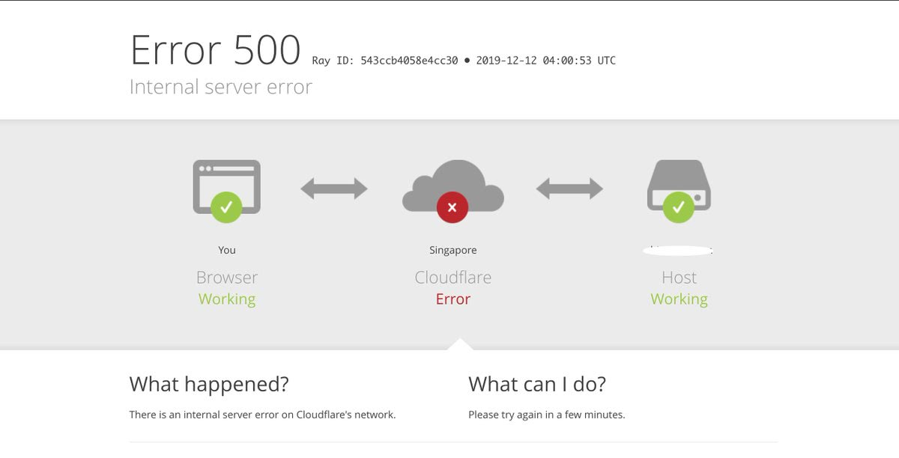

# Seo u ka se etsang ho hanela Cloudflare?

| 🖼 | 🖼 | 🖼 |
| --- | --- | --- |
|  |  |  |


Matthew Browning Prince, naskita la 13an de novembro 1974, estas la ĉefoficisto kaj kunfondinto de Cloudflaron.

Danke al lia riĉa paĉjo, "John B. Prince", li ĉeestis la Universitaton de Ĉikago Leĝlernejo kaj Harvard Komerclernejo.
Princo instruis Interretan leĝon kaj estis specialisto pri kontraŭ-spamaj leĝoj kaj Fraŭdo-esploroj.


"*I’d suggest this was armchair analysis by kids – it’s hard to take seriously.*" [t](https://www.theguardian.com/technology/2015/nov/19/cloudflare-accused-by-anonymous-helping-isis)

"*That was simply unfounded paranoia, pretty big difference.*"  [t](https://twitter.com/xxdesmus/status/992757936123359233)

"*We also work with Interpol and other non-US entities*" [t](https://twitter.com/eastdakota/status/1203028504184360960)

"*Watching hacker skids on Github squabble about trying to bypass Cloudflare's new anti-bot systems continues to be my daily amusement.* 🍿" [t](https://twitter.com/eastdakota/status/1273277839102656515)


---


<details>
<summary>tobetsa nna

## Moreki oa sebaka sa marang-rang
</summary>


- Haeba sebaka sa marang-rang seo u se ratang se sebelisa Cloudflare, ba bolelle hore ba se sebelise Cloudflare.
  - Ho lla mecheng ea litaba tsa sechaba joalo ka Facebook, Reddit, Twitter kapa Mastodon ha ho etse phapang. [Liketso li phahametse li-hashtag.](https://twitter.com/phyzonloop/status/1274132092490862594)
  - Leka ho ikopanya le mong'a sebaka sa marang-rang haeba u batla ho iketsa thuso.

[Cloudflare o boletse](https://github.com/Eloston/ungoogled-chromium/issues/783):
```
Re khothaletsa hore o atamele batsamaisi bakeng sa lits'ebeletso tse khethehileng kapa libaka tsa marang-rang tseo u ka bang le bothata le tsona 'me u arolelane boiphihlelo ba hau.
```

[Haeba u sa e batle, mong'a sebaka sa marang-rang ha a tsebe bothata bona.](../PEOPLE.md)


[Mohlala o atlehileng](https://counterpartytalk.org/t/turn-off-cloudflare-on-counterparty-co-plz/164/5).<br>
O na le bothata? [Phahamisa lentsoe la hau joale.](https://github.com/maraoz/maraoz.github.io/issues/1) Mohlala o ka tlase.

```
U ntse u thusa ho thibela le ho beha leihlo batho ba bangata.
http://crimeflare.eu.org
```

```
Leqephe la hau la marang-rang le sebakeng sa lekunutu le sebelisang hampe serapa sa poraefete sa CloudFlare.
http://crimeflare.eu.org
```

- Iphe nako ea ho bala leano la lekunutu la webosaete.
  - haeba sebaka sa marang-rang se ka mora Cloudflare kapa sebaka sa marang-rang se sebelisa lits'ebeletso tse hokahantsoeng le Cloudflare.

E tlameha ho hlalosa hore "Cloudflare" ke eng, 'me u kope tumello ea ho arolelana data ea hau le Cloudflare. Ho sitoa ho etsa joalo ho tla baka hore ho rojoe ts'epo mme sebaka sa marang-rang se botsoang se lokela ho qojoa.

[Mohlala o amohelehang oa leano la lekunutu o mona](https://archive.is/bDlTz) ("Subprocessors" > "Entity Name")

```
Ke balile leano la hau la lekunutu mme ha ke fumane lentsoe Cloudflare.
Ke hana ho arolelana le uena data haeba u tsoelapele ho fepa data ea ka ho Cloudflare.
http://crimeflare.eu.org
```

Ona ke mohlala oa leano la lekunutu le se nang lentsoe Cloudflare.
[Liberland Jobs](https://archive.is/daKIr) [privacy policy](https://docsend.com/view/feiwyte):


Cloudflare e na le melaoana ea bona ea lekunutu.
[Cloudflare e rata batho ba etsang thobalano.](https://www.reddit.com/r/GamerGhazi/comments/2s64fe/be_wary_reporting_to_cloudflare/)

Mona ke mohlala o motle oa foromo ea ho ingolisa webosaeteng.
AFAIK, webosaete ea zero e etsa sena. Na u tla ba tšepa?

```
Ka ho tobetsa "Sign up for XYZ", u lumela lipehelo tsa rona tsa ts'ebeletso le polelo ea lekunutu.
Hape o lumela ho arolelana data ea hau le Cloudflare hape o lumela polelo ea lekunutu ea cloudflare.
Haeba Cloudflare e lutla tlhahisoleseling ea hau kapa e sa u lumelle ho hokela ho li-server tsa rona, ha se molato oa rona. [*]

[ ngolisa ] [ ke a hana ]
```
[*] [PEOPLE.md](../PEOPLE.md)


- Leka ho se sebelise tšebeletso ea bona. Hopola hore o shebelletsoe ke Cloudflare.
  - ["I'm in your TLS, sniffin' your passworz"](../image/iminurtls.jpg)

- Batla sebaka se seng sa marang-rang. Ho na le mekhoa le menyetla e meng inthaneteng!

- Kholisa metsoalle ea hau hore e sebelise Tor letsatsi le letsatsi.
  - Ho se tsejoe e lokela ho ba maemo a inthanete e bulehileng!
  - [Hlokomela hore projeke ea Tor ha e rate morero ona.](../HISTORY.md)

</details>

------

<details>
<summary>tobetsa nna

## Lisebelisoa
</summary>

- Haeba sebatli sa hau ke Firefox, Tor Browser, kapa Ungoogled Chromium sebelisa e 'ngoe ea likeketso tse ka tlase.
  - Haeba u batla ho eketsa tlatsetso e ncha botsa ka eona pele.


| Lebitso | Moqapi | Ts'ehetso | E ka Thibela | E ka Tsebisa | Chrome |
| -------- | -------- | -------- | -------- | -------- | -------- |
| [Bloku Cloudflaron MITM-Atakon](../subfiles/about.bcma.md) | #Addon | [ ? ](http://crimeflare.eu.org/) | **Ho joalo**     | **Ho joalo**     |  **Ho joalo** |
| [Ĉu ligoj estas vundeblaj al MITM-atako?](../subfiles/about.ismm.md) | #Addon | [ ? ](http://crimeflare.eu.org/) | Che     | **Ho joalo**     |  **Ho joalo** |
| [Ĉu ĉi tiuj ligoj blokos Tor-uzanton?](../subfiles/about.isat.md) | #Addon | [ ? ](http://crimeflare.eu.org/) | Che     | **Ho joalo**     |  **Ho joalo** |
| [Block Cloudflare MITM Attack](https://trac.torproject.org/projects/tor/attachment/ticket/24351/block_cloudflare_mitm_attack-1.0.14.1-an%2Bfx.xpi)<br>[**DELETED BY TOR PROJECT**](../HISTORY.md) | nullius | [ ? ](../tool/block_cloudflare_mitm_fx), [Link](http://crimeflare.eu.org/) | **Ho joalo**     | **Ho joalo**     |  Che |
| [TPRB](http://34ahehcli3epmhbu2wbl6kw6zdfl74iyc4vg3ja4xwhhst332z3knkyd.onion/) | Sw | [ ? ](http://34ahehcli3epmhbu2wbl6kw6zdfl74iyc4vg3ja4xwhhst332z3knkyd.onion/) | **Ho joalo**     | **Ho joalo**     |  Che |
| [Detect Cloudflare](https://addons.mozilla.org/en-US/firefox/addon/detect-cloudflare/) | Frank Otto | [ ? ](https://github.com/traktofon/cf-detect) | Che     | **Ho joalo**     |  Che |
| [True Sight](https://addons.mozilla.org/en-US/firefox/addon/detect-cloudflare-plus/) | claustromaniac | [ ? ](https://github.com/claustromaniac/detect-cloudflare-plus) | Che     | **Ho joalo**     |  Che |
| [Which Cloudflare datacenter am I visiting?](https://addons.mozilla.org/en-US/firefox/addon/cf-pop/) | 依云 | [ ? ](https://github.com/lilydjwg/cf-pop) | Che     | **Ho joalo**     |  Che |


- "Decentraleyes" e ka emisa khokahano ho "CDNJS (Cloudflare)".
  - E thibela likopo tse ngata ho fihlella marang-rang, hape e sebeletsa lifaele tsa lehae ho boloka libaka hore li se robehe.
  - Mohlahisi o ile a araba: "[very concerning indeed](https://github.com/Synzvato/decentraleyes/issues/236#issuecomment-352049501)", "[widespread usage severely centralizes the web](https://github.com/Synzvato/decentraleyes/issues/251#issuecomment-366752049)"

- [U ka tlosa kapa ua se tšepe setifikeiti sa Cloudflare ho tsoa ho Setifikeiti sa hau sa Setifikeiti (CA).](https://www.ssl.com/how-to/remove-root-certificate-firefox/)

</details>

------

<details>
<summary>tobetsa nna

## Mong'a sebaka sa marang-rang / moqapi oa webo
</summary>


- Se ke oa sebelisa tharollo ea Cloudflare, Nako.
  - U ka etsa betere ho feta moo, na? [Mona ke mokhoa oa ho tlosa lipeeletso tsa Cloudflare, merero, libaka, kapa liakhaonto.](https://support.cloudflare.com/hc/en-us/articles/200167776-Removing-subscriptions-plans-domains-or-accounts)

| 🖼 | 🖼 |
| --- | --- |
|  |  |

- U batla bareki ba bangata? U tseba seo u lokelang ho se etsa. Tlhahiso ke "holimo mola".
  - [Lumela, u ngotse "Re nka boinotšing ba hau ka botebo" empa ke fumane "Phoso ea 403 Proxy e sa Thibeloang e sa Lumelloeng"](https://it.slashdot.org/story/19/02/19/0033255/stop-saying-we-take-your-privacy-and-security-seriously) Hobaneng ha o thibela Tor Or VPN? Hona hobaneng u thibela li-imeile tsa nakoana?


- Ho sebelisa Cloudflare ho tla eketsa menyetla ea ho tima. Baeti ba sitoa ho fihlella sebaka sa hau sa marang-rang haeba seva ea hau e le tlase kapa Cloudflare e le tlase.
  - [Na u ne u hlile u nahana hore Cloudflare ha a ka a theoha?](https://www.ibtimes.com/cloudflare-down-not-working-sites-producing-504-gateway-timeout-errors-2618008) [Another](https://twitter.com/Jedduff/status/1097875615997399040) [sample](https://twitter.com/search?f=tweets&vertical=default&q=Cloudflare%20is%20having%20problems). [Need more](../PEOPLE.md)?



- U sebelisa Cloudflare ho emela "tšebeletso ea API" ea hau, "software ea ntlafatso ea software" kapa "RSS feed" e tla lematsa moreki oa hau Moreki o ile au letsetsa a re "Ha ke sa sebelisa API ea hau", 'me ha u tsebe hore na ho etsahalang. Cloudflare e ka thibela moreki oa hau ka khutso. U nahana hore ho lokile?
  - Ho na le bareki ba bangata ba babali ba RSS le tšebeletso ea inthanete ea babali ba RSS. Hobaneng ha o phatlalatsa phepelo ea RSS haeba o sa lumelle batho ho ingolisa?


- Na o hloka setifikeiti sa HTTPS? Sebelisa "A re Encrypt" kapa e reke feela ho tsoa k'hamphaning ea CA.

- O hloka seva ea DNS? Ha o khone ho ipehela seva? Ho thoe'ng ka bona: [Hurricane Electric Free DNS](https://dns.he.net/), [Dyn.com](https://dyn.com/dns/), [1984 Hosting](https://www.1984hosting.com/), [Afraid.Org (Tsamaiso e hlakola ak'haonte ea hau haeba u sebelisa TOR)](https://freedns.afraid.org/)

- U batla tšebeletso ea bolulo? Mahala feela? Ho thoe'ng ka bona: [Onion Service](http://vww6ybal4bd7szmgncyruucpgfkqahzddi37ktceo3ah7ngmcopnpyyd.onion/en/security/network-security/tor/onionservices-best-practices), [Free Web Hosting Area](https://freewha.com/), [Autistici/Inventati Web Site Hosting](https://www.autinv5q6en4gpf4.onion/services/website), [Github Pages](https://pages.github.com/), [Surge](https://surge.sh/)
  - [Mekhoa e meng ea Cloudflare](../subfiles/cloudflare-alternatives.md)

- U sebelisa "cloudflare-ipfs.com"? [Na ua tseba hore Cloudflare IPFS e mpe?](../PEOPLE.md)

- Kenya Webwall Firewall e sebelisang OWASP le Fail2Ban ho seva ea hau 'me ue hlophise hantle.
  - Ho thibela Tor hase tharollo. Se ke oa otla motho e mong le e mong feela bakeng sa basebelisi ba fokolang ba babe.

- Lebisa hape kapa u thibele basebelisi ba "Cloudflare Warp" ho kena webosaeteng ea hau. Le ho fana ka lebaka haeba u ka khona.

> Lenane la IP: "[Libaka tsa hona joale tsa IP tsa Cloudflare](cloudflare_inc/)"

> A: Li thibe feela

```
server {
...
deny 173.245.48.0/20;
deny 103.21.244.0/22;
deny 103.22.200.0/22;
deny 103.31.4.0/22;
deny 141.101.64.0/18;
deny 108.162.192.0/18;
deny 190.93.240.0/20;
deny 188.114.96.0/20;
deny 197.234.240.0/22;
deny 198.41.128.0/17;
deny 162.158.0.0/15;
deny 104.16.0.0/12;
deny 172.64.0.0/13;
deny 131.0.72.0/22;
deny 2400:cb00::/32;
deny 2606:4700::/32;
deny 2803:f800::/32;
deny 2405:b500::/32;
deny 2405:8100::/32;
deny 2a06:98c0::/29;
deny 2c0f:f248::/32;
...
}
```

> B: Lebisa hape ho leqephe la tlhokomeliso

```
http {
...
geo $iscf {
default 0;
173.245.48.0/20 1;
103.21.244.0/22 1;
103.22.200.0/22 1;
103.31.4.0/22 1;
141.101.64.0/18 1;
108.162.192.0/18 1;
190.93.240.0/20 1;
188.114.96.0/20 1;
197.234.240.0/22 1;
198.41.128.0/17 1;
162.158.0.0/15 1;
104.16.0.0/12 1;
172.64.0.0/13 1;
131.0.72.0/22 1;
2400:cb00::/32 1;
2606:4700::/32 1;
2803:f800::/32 1;
2405:b500::/32 1;
2405:8100::/32 1;
2a06:98c0::/29 1;
2c0f:f248::/32 1;
}
...
}

server {
...
if ($iscf) {rewrite ^ https://example.com/cfwsorry.php;}
...
}

<?php
header('HTTP/1.1 406 Not Acceptable');
echo <<<CLOUDFLARED
Thank you for visiting ourwebsite.com!<br />
We are sorry, but we can't serve you because your connection is being intercepted by Cloudflare.<br />
Please read http://crimeflare.eu.org for more information.<br />
CLOUDFLARED;
die();
```

- Theha Tor Onion Service kapa I2P ho ts'ehetsa haeba u lumela tokolohong mme u amohela basebelisi ba sa tsejoeng

- Kopa likeletso ho basebelisi ba bang ba marang-rang ba Clearnet / Tor 'me u etse metsoalle e sa tsejoeng!

</details>

------

<details>
<summary>tobetsa nna

## Mosebelisi oa software
</summary>


- Discord e sebelisa CloudFlare. Mekhoa e meng? Re khothaletsa [**Briar** (Android)](https://f-droid.org/en/packages/org.briarproject.briar.android/), [Ricochet (PC)](https://ricochet.im/), [Tox + Tor (Android/PC)](https://tox.chat/download.html)
  - Briar e kenyelletsa Tor daemon kahoo ha ua tlameha ho kenya Orbot.
  - Bahlahisi ba Qwtch, Lekunutu le Bulehileng, ba hlakotse projeke ea stop_cloudflare ho tsoa ho litšebeletso tsa bona tsa git ntle le tsebiso.

- Haeba u sebelisa Debian GNU / Linux, kapa sesebelisoa leha e le sefe, ingolisa: [bug #831835](https://bugs.debian.org/cgi-bin/bugreport.cgi?bug=831835). Haeba u khona, thusa ho netefatsa sekhechana, 'me u thuse mohlokomeli ho fihlela qeto e nepahetseng hore na e lokela ho amoheloa.

- Kamehla buella li-browser tsena.

| Lebitso | Moqapi | Ts'ehetso | Fana ka maikutlo |
| -------- | -------- | -------- | -------- |
| [Ungoogled-Chromium](https://ungoogled-software.github.io/ungoogled-chromium-binaries/) | Eloston | [ ? ](https://github.com/Eloston/ungoogled-chromium) | PC (Win, Mac, Linux)  _!Tor_ |
| [Bromite](https://www.bromite.org/fdroid) | Bromite | [ ? ](https://github.com/bromite/bromite/issues) | Android  _!Tor_ |
| [Tor Browser](https://www.torproject.org/download/) | Tor Project | [ ? ](https://support.torproject.org/) | PC (Win, Mac, Linux)  _Tor_|
| [Tor Browser Android](https://www.torproject.org/download/) | Tor Project | [ ? ](https://support.torproject.org/) | Android  _Tor_|
| [Onion Browser](https://itunes.apple.com/us/app/onion-browser/id519296448?mt=8) | Mike Tigas | [ ? ](https://github.com/OnionBrowser/OnionBrowser/issues) | Apple iOS  _Tor_|
| [GNU/Icecat](https://www.gnu.org/software/gnuzilla/) | GNU | [ ? ](https://www.gnu.org/software/gnuzilla/) | PC (Linux) |
| [IceCatMobile](https://f-droid.org/en/packages/org.gnu.icecat/) | GNU | [ ? ](https://lists.gnu.org/mailman/listinfo/bug-gnuzilla) | Android |
| [Iridium Browser](https://iridiumbrowser.de/about/) | Iridium | [ ? ](https://github.com/iridium-browser/iridium-browser/) | PC (Win, Mac, Linux, OpenBSD) |


Lekunutu la software e 'ngoe ha lea phethahala. Sena ha se bolele hore sebatli sa Tor se "phethahetse".
Ha ho na 100% e sireletsehileng kapa 100% ea lekunutu marang-rang le theknoloji.

- Ha u batle ho sebelisa Tor? U ka sebelisa sebatli sefe kapa sefe ka Tor daemon.
  - [Hlokomela hore projeke ea Tor ha e rate sena.](https://support.torproject.org/tbb/tbb-9/) Sebelisa Tor Browser haeba u khona ho etsa joalo.
- [Mokhoa oa ho sebelisa Chromium le Tor](../subfiles/chromium_tor.md)


Ha re bue ka lekunutu la software e ngoe.

- [Haeba u hlile u hloka ho sebelisa Firefox, khetha "Firefox ESR".](https://www.mozilla.org/en-US/firefox/organizations/)
  - [Firefox - Spyware Watchdog](https://spyware.neocities.org/articles/firefox.html)
  - [Firefox e hana puo ea mahala, e thibela puo ea mahala](https://web.archive.org/web/20200423010026/https://reclaimthenet.org/firefox-rejects-free-speech-bans-free-speech-commenting-plugin-dissenter-from-its-extensions-gallery/)
  - ["Li-voutu tse 100+ tse tlase. Ho bonahala eka o kopa k'hamphani ea software hore e khomarele ... software e ngata haholo matsatsing ana."](https://old.reddit.com/r/firefox/comments/gutdiw/weve_got_work_to_do_the_mozilla_blog/fslbbb6/)
  - [Uh, hobaneng ha Firefox e mpontša lihokelo tse tšehelitsoeng ho bareng ea URL?](https://www.reddit.com/r/firefox/comments/jybx2w/uh_why_is_firefox_showing_me_sponsored_links_in/)
  - [Mozilla - Diabolose ea Nkileng Sebopeho](https://digdeeper.neocities.org/ghost/mozilla.html)

- [Hopola, Mozilla e sebelisa ts'ebeletso ea Cloudflare.](https://www.robtex.com/dns-lookup/www.mozilla.org) [Ba ntse ba sebelisa ts'ebeletso ea DNS ea Cloudflare sehlahisoa sa bona.](https://www.theregister.co.uk/2018/03/21/mozilla_testing_dns_encryption/)

- [Mozilla e hanne semmuso tekete ena.](https://bugzilla.mozilla.org/show_bug.cgi?id=1426618)

- [Firefox Focus ke joke.](https://github.com/mozilla-mobile/focus-android/issues/1743) [Ba tšepisitse ho tima telemetry empa ba e fetotse.](https://github.com/mozilla-mobile/focus-android/issues/4210)

- [Moqapi oa PaleMoon / Basilisk o rata Cloudflare.](https://github.com/mozilla-mobile/focus-android/issues/1743#issuecomment-345993097)
  - [Pale Moon's Archive Server e qhekelitse le ho jala malware bakeng sa likhoeli tse 18](https://www.reddit.com/r/privacytoolsIO/comments/cc808y/pale_moons_archive_server_hacked_and_spread/)
  - O boetse o hloile basebelisi ba Tor - "[E ke e be bora ho Tor. Ke nahana hore libaka tse ngata tsa marang-rang li lokela ho ba bora ho Tor ho nahana ka tlhekefetso ea eona e phahameng haholo.](https://github.com/yacy/yacy_search_server/issues/314#issuecomment-565932097)"

- [Waterfox e na le bothata bo boholo ba "lifono tsa lapeng"](https://spyware.neocities.org/articles/waterfox.html)

- [Google Chrome ke spyware.](https://www.gnu.org/proprietary/malware-google.en.html)
  - [Google e hlahisa mosebetsi oa hau.](https://spyware.neocities.org/articles/chrome.html)

- [SRWare Iron e etsa mehala e mengata haholo ho hokela hae.](https://spyware.neocities.org/articles/iron.html) E hokela hape libakeng tsa google.

- [Sebali se hloahloa sa sebali se hloahloa sa Facebook / Twitter lilateli.](https://www.bleepingcomputer.com/news/security/facebook-twitter-trackers-whitelisted-by-brave-browser/)
  - [Litaba tse ling ke tsena.](https://spyware.neocities.org/articles/brave.html)
  - [binance e amanang le ID](https://twitter.com/cryptonator1337/status/1269594587716374528)

- [Microsoft Edge e lumella Facebook ho tsamaisa Flash khoutu kamora mekokotlo ea basebelisi.](https://www.zdnet.com/article/microsoft-edge-lets-facebook-run-flash-code-behind-users-backs/)

- [Vivaldi ha e hlomphe boinotšing ba hau.](https://spyware.neocities.org/articles/vivaldi.html)

- [Boemo ba spyware sa Opera: E Holimo haholo](https://spyware.neocities.org/articles/opera.html)

- Apple iOS: [Ha ua lokela ho sebelisa iOS ho hang, haholo hobane ke malware.](https://www.gnu.org/proprietary/malware-apple.html)

Ka hona re khothaletsa tafole e kaholimo feela. Ha ho letho le leng.

</details>

------

<details>
<summary>tobetsa nna

## Mosebelisi oa Mozilla Firefox
</summary>


- "Firefox Nightly" e tla romella tlhaiso-leseling ea boemo ba bothata ho li-server tsa Mozilla ntle le mokhoa oa ho khetha.
  - [Leseva tsa Mozilla li khanya Cloudflare](https://www.digwebinterface.com/?hostnames=www.mozilla.org%0D%0Amozilla.cloudflare-dns.com&type=&ns=resolver&useresolver=8.8.4.4&nameservers=)

- Ho a khonahala ho thibela Firefox ho hokela ho li-server tsa Mozilla.
  - [Tataiso ea li-template tsa Mozilla](https://github.com/mozilla/policy-templates/blob/master/README.md)
  - Hopola hore bolotsana bona bo ka emisa ho sebetsa ka mofuta oa morao-rao hobane Mozilla e rata ho itlhahisa e le lethathamo.
  - Sebelisa firewall le DNS filter ho li thibela ka botlalo.

"`/distribution/policies.json`"

>     "WebsiteFilter": {
> 		"Block": [
> 		"*://*.mozilla.com/*",
> 		"*://*.mozilla.net/*",
> 		"*://*.mozilla.org/*",
> 		"*://webcompat.com/*",
> 		"*://*.firefox.com/*",
> 		"*://*.thunderbird.net/*",
> 		"*://*.cloudflare.com/*"
> 		]
>     },


- ~~Tlaleha bug ho tracker ea mozilla, u ba joetse hore ba se sebelise Cloudflare.~~ Ho bile le tlaleho ea bug ka bugzilla. Batho ba bangata ba ile ba beha dingongoreho tsa bona, leha ho le joalo ts'oaetso e ne e patiloe ke admin ho 2018.

- O ka tima DoH ho Firefox.
  - [Fetola mofani oa kamehla oa DNS oa firefox](../subfiles/change-firefox-dns.md)


- [Haeba u ka rata ho sebelisa DNS eo e seng ea ISP, nahana ka ho sebelisa ts'ebeletso ea OpenNIC Tier2 DNS kapa efe kapa efe ea litšebeletso tse seng tsa Cloudflare DNS.](https://wiki.opennic.org/start)

  - Thibela Cloudflare ka DNS. [Crimeflare DNS](../subfiles/service.publicdns.md)

- U ka sebelisa Tor joalo ka tharollo ea DNS. [Haeba ha u setsebi sa Tor, botsa potso mona.](https://tor.stackexchange.com/)

> **Joang?**
> 1. Khoasolla Tor ebe o e kenya khomphuteng ea hau.
> 2. Kenya mohala ona ho file "torrc".
> DNSPort 127.0.0.1:53
> 3. Qala hape Tor.
> 4. Beha seva ea DNS ea "computer" ea hau "127.0.0.1".

</details>

------

<details>
<summary>tobetsa nna

## Khato
</summary>


- Bolella ba bang haufi le uena ka likotsi tsa Cloudflare.

- [Thusa ho ntlafatsa polokelo ena.](http://crimeflare.eu.org)
  - Manane ka bobeli, mabaka a khahlano le eona le lintlha.

- [Ngola 'me u phatlalatse phatlalatsa moo lintho li sa tsamaeeng hantle ka Cloudflare (le lik'hamphani tse tšoanang), ho etsa bonnete ba hore u bua ka polokelo ena ha u etsa joalo.](http://crimeflare.eu.org) :)

- Fumana batho ba bangata ba sebelisang Tor ka boiketsetso hore ba tsebe ho fumana marang-rang ho latela pono ea likarolo tse fapaneng tsa lefats'e.

- Qala lihlopha, mecheng ea litaba tsa sechaba le meatspace, e ikemiselitseng ho lokolla lefats'e ho tloha Cloudflare.

- Moo ho loketseng, hokela lihlopha tsena polokelong ena - ena e ka ba sebaka sa ho hokahanya ho sebetsa 'moho e le lihlopha.

- [Qala coop e ka fanang ka mokhoa o nang le moelelo o seng oa khoebo ho Cloudflare.](../subfiles/cloudflare-alternatives.md)

- Re tsebise ka mekhoa e meng ho thusa bonyane ho fana ka ts'ireletso e mekato e mengata khahlanong le Cloudflare.

- Haeba u moreki oa Cloudflare, beha litlhophiso tsa hau tsa lekunutu, 'me u ba emele hore ba li tlotse.
  - [Ebe u ba tlisetsa liqoso tse khahlanong le spam / tsa boinotšing.](https://twitter.com/thexpaw/status/1108424723233419264)

- Haeba u le United States of America mme sebaka sa marang-rang seo ho buuoang ka sona ke banka kapa akhaontente, leka ho tlisa khatello ea molao tlasa Gramm – Leach – Bliley Act, kapa Maamerika a nang le DIsabilities Act ebe u re tlalehela hore na u fihla kae .

- Haeba webosaete ke sebaka sa mmuso, leka ho tlisa khatello ea molao tlasa Phetoho ea Pele ea Molao oa Motheo oa US.

- Haeba u moahi oa EU, ikopanye le sebaka sa marang-rang ho romella tlhaiso-leseling ea hau tlasa General Regulation ea Ts'ireletso. Haeba ba hana ho u fa tlhaiso-leseling ea hau, hoo ke tlolo ea molao.

- Bakeng sa lik'hamphani tse ipolelang hore li fana ka ts'ebeletso webosaeteng ea bona li leka ho li tlaleha e le "papatso ea bohata" ho mekhatlo e sireletsang bareki le BBB. Liwebosaete tsa Cloudflare li sebeletsoa ke li-server tsa Cloudflare.

- [ITU e fana ka maikutlo ho US hore Cloudflare e qala ho ba kholo ho lekana hore ba ka theoleloa molao oa antitrust.](https://www.itu.int/en/ITU-T/Workshops-and-Seminars/20181218/Documents/Geoff_Huston_Presentation.pdf)

- Ho ka nahanoa hore mofuta oa GNU GPL 4 o ka kenyelletsa tokisetso khahlano le ho boloka khoutu ea mohloli ka mor'a ts'ebeletso e joalo, e hlokang bakeng sa mananeo ohle a GPLv4 le a morao-rao hore bonyane khoutu ea mohloli e ka fumaneha ka sehare se sa khetholleng basebelisi ba Tor.

</details>

------

### Maikutlo

```
Kamehla ho na le tšepo ea ho hanyetsa.

Khanyetso e nonne.

Le tse ling tsa liphetho tse lefifi li ba teng, ketso ea bohanyetsi e re koetlisetsa ho tsoelapele ho tsitsisa boemo ba dystopic bo hlahang.

Hanela!
```

```
Ka letsatsi le leng, u tla utloisisa hore na hobaneng re ngotse sena.
```

```
Ha ho na bokamoso ka sena. Re se re lahlile.
```

### Joale u entseng kajeno?


