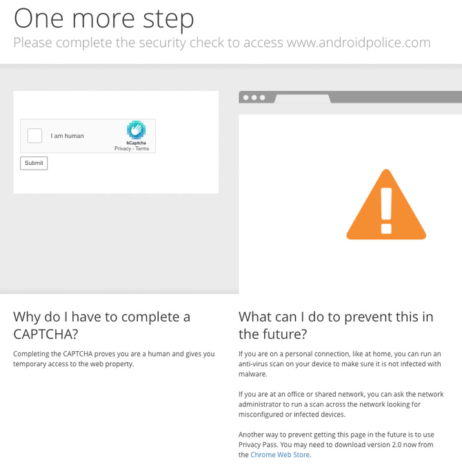
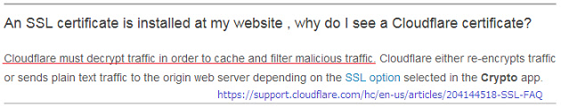
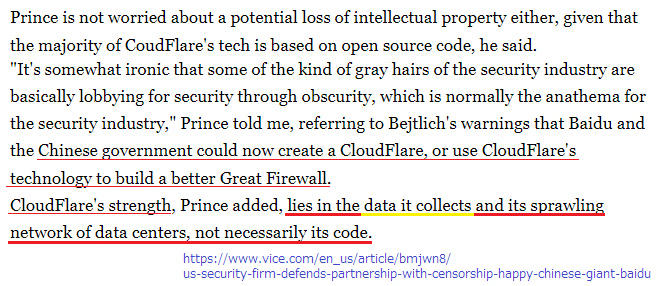

# Tường mây vĩ đại

---

## Chung tay chống lại Cloudflare

|  🖹  |  🖼 |
| --- | --- |
|  “Tường mây vĩ đại†ở đây là Tập đoàn Cloudflare, một công ty của Hoa Kỳ. Há» cung cấp các dịch vụ CDN (mạng phân phối nội dung), giảm thiểu DDoS, bảo mật Internet và dịch vụ DNS (máy chủ tên miá»n) phân tán.  |   |
|  Cloudflare là proxy MITM (proxy ngược) lớn nhất thế giới. Cloudflare sở hữu hơn 80% thị phần CDN và số lượng người dùng Cloudflare đang tăng lên mỗi ngày. HỠđã mở rộng mạng lưới của mình đến hơn 100 quốc gia. Cloudflare phục vụ nhiá»u lưu lượng truy cập web hơn Twitter, Amazon, Apple, Instagram, Bing & Wikipedia cộng lại. Cloudflare đang cung cấp gói miễn phí và nhiá»u người đang sử dụng nó thay vì định cấu hình máy chủ của hỠđúng cách. HỠđánh đổi sự riêng tư lấy sự tiện lợi.  |    |
|  Cloudflare nằm giữa bạn và máy chủ web gốc, hoạt động như một nhân viên tuần tra biên giới. Bạn không thể kết nối với điểm đến đã chá»n của mình. Bạn đang kết nối với Cloudflare và tất cả thông tin của bạn đang được giải mã và chuyển giao nhanh chóng. Cloudflare có thể giám sát lưu lượng Internet toàn cầu, và há» theo dõi nó liên tục. |    |
|  Quản trị viên máy chủ web gốc cho phép tác nhân - Cloudflare - quyết định ai có thể truy cập vào “tài sản web†của há» và xác định “khu vực hạn chếâ€.  |    |
|  Hãy nhìn vào hình ảnh bên phải. Bạn sẽ nghĩ Cloudflare chỉ chặn kẻ xấu. Bạn sẽ nghĩ rằng Cloudflare luôn trực tuyến (không bao giỠngừng hoạt động). Bạn sẽ nghĩ rằng các chương trình và trình thu thập thông tin hợp pháp có thể lập chỉ mục trang web của bạn.  |    |
|  Tuy nhiên. những điá»u đó hoàn toàn sai. Cloudflare đang chặn những người vô tội một cách vô cớ. Cloudflare có thể ngừng hoạt động. Cloudflare chặn các chương trình hợp pháp.  |    |
|  Cũng giống như bất kỳ dịch vụ lưu trữ nào, Cloudflare không phải là hoàn hảo. Bạn sẽ thấy màn hình này ngay cả khi máy chủ gốc đang hoạt động tốt.  |   |
|  Bạn thực sự nghĩ rằng Cloudflare luôn luôn hoạt động 100% ư? Bạn không hỠbiết Cloudflare đã gặp sự cố bao nhiêu lần. Nếu Cloudflare ngừng hoạt động, khách hàng của bạn không thể truy cập trang web của bạn. |   |
|  Việc nó được gá»i là như vậy có liên quan đến Tường lửa lớn của Trung Quốc, thứ mà thực hiện một công việc tương Ä‘Æ°Æ¡ng là cấm hàng ngàn người khá»i các nội dung web (ví dụ như tất cả má»i người ở Trung Quốc đại lục và những người bên ngoài) trong khi đồng thá»i những người không bị ảnh hưởng có thể nhìn thấy một trang web hoàn toàn khác, một trang web không bị kiểm duyệt chẳng hạn như hình ảnh “người xe tăng†và lịch sử của “các cuộc biểu tình trên Quảng trường Thiên An Môn”. |   |
|  Cloudflare sở hữu sức mạnh to lớn. Theo một nghĩa nào đó, há» kiểm soát những kết quả mà người dùng nhìn thấy. Bạn bị chặn duyệt trang web bởi Cloudflare. |  |
|  Cloudflare có thể được sử dụng để kiểm duyệt. |  |
|  Bạn không thể xem trang web có sử dụng Cloudflare nếu bạn đang sử dụng trình duyệt không nổi mà Cloudflare có thể nghĩ rằng là bot (vì không có nhiá»u người sử dụng nó). |  |
|  Bạn không thể vượt qua bước “kiểm tra trình duyệt†xâm lấn này mà không phải bật Javascript. Đây là sự lãng phí năm (hoặc nhiá»u hơn) giây trong cuộc Ä‘á»i quý giá của bạn. |  |
|  Cloudflare cũng tự động chặn các chương trình/trình thu thập thông tin hợp pháp như Google, Yandex, Yacy và các ứng dụng API khách. Cloudflare đang tích cực theo dõi cộng đồng “bỠqua Cloudflare†với mục đích phá vỡ các chương trình nghiên cứu hợp pháp. |   |
|  Tương tự như vậy, Cloudflare ngăn nhiá»u người có kết nối Internet chậm truy cập vào các trang web đằng sau nó (ví dụ: há» có thể đứng sau hơn 7 lớp NAT hoặc chia sẻ cùng một địa chỉ IP, chẳng hạn như WiFi công cộng) trừ khi há» giải nhiá»u CAPTCHA hình ảnh. Trong một số trường hợp, điá»u này sẽ mất từ ​​10 đến 30 phút để làm hài lòng Google. |  |
|  Vào năm 2020, Cloudflare chuyển từ dịch vụ reCAPTCHA của Google sang hCaptcha vì Google dự định tính phí cho việc sử dụng nó. Cloudflare nói với bạn rằng há» quan tâm đến quyá»n riêng tư của bạn (“nó giúp giải quyết một vấn Ä‘á» vá» quyá»n riêng tÆ°â€) nhưng đây rõ ràng là một lá»i nói dối trắng trợn. Tất cả há» quan tâm tới là tiá»n.“hCaptcha cho phép các trang web kiếm tiá»n từ nhu cầu này trong khi chặn các chương trình và hình thức lạm dụng khác†|   |
|  Từ quan điểm của người dùng, điá»u này không thay đổi nhiá»u. Bạn đang bị buộc phải giải nó. |   |
|  Nhiá»u người và phần má»m đang bị Cloudflare chặn mỗi ngày. |  |
|  Cloudflare làm phiá»n nhiá»u người trên thế giới. Hãy xem danh sách và nghĩ xem việc sử dụng Cloudflare trên trang web của bạn có tốt cho trải nghiệm người dùng hay không. |   |
|  Mục đích của Internet là gì nếu bạn không thể làm những gì bạn muốn? Hầu hết những người truy cập trang web của bạn sẽ chỉ tìm kiếm các trang khác nếu há» không thể tải một trang web. Bạn có thể không chủ động chặn bất kỳ khách truy cập nào, nhưng tường lửa mặc định của Cloudflare đủ nghiêm ngặt để chặn rất nhiá»u người. |   |
|  Không có cách nào để giải captcha mà không phải bật Javascript và Cookie. Cloudflare đang sử dụng chúng để tạo chữ ký trình duyệt nhằm mục đích nhận dạng bạn. Cloudflare cần biết danh tính của bạn để quyết định xem bạn có đủ điá»u kiện để tiếp tục duyệt trang web hay không. |   |
|  Những người dùng Tor và VPN cũng là nạn nhân của Cloudflare. Cả hai giải pháp đang được sử dụng bởi nhiá»u người không có khả năng mua Internet không bị kiểm duyệt do chính sách quốc gia/công ty/mạng của há» hoặc những người muốn thêm một lớp khiên bổ sung để bảo vệ quyá»n riêng tư của há». Cloudflare đang tấn công những người đó một cách vô liêm sỉ, bắt buộc há» phải tắt giải pháp proxy của mình. |  |
|  Nếu bạn chưa dùng thử Tor cho đến thá»i điểm này, chúng tôi khuyến khích bạn tải xuống trình duyệt Tor và truy cập các trang web yêu thích của bạn (Chú ý: Bạn không nên đăng nhập vào trang web ngân hàng hoặc trang web của chính phủ, nếu không há» sẽ gắn cá» tài khoản của bạn. Sử dụng VPN cho các trang web đó.) |  |
|  Bạn có thể nghĩ rằng “Tor là bất hợp pháp! Người dùng Tor là tội phạm! Tor tệ lắm!". Không. Bạn có thể biết vá» Tor từ truyá»n hình, há» nói rằng Tor có thể được sử dụng để duyệt darknet và buôn bán súng, ma túy hoặc phim ảnh ấu dâm. Mặc dù khẳng định trên là đúng rằng có rất nhiá»u trang web thị trường nơi bạn có thể mua những mặt hàng như vậy, nhưng những trang web đó cũng thường xuất hiện trên mạng Internet bình thường.  |  |
|  Tor được phát triển bởi Quân đội Hoa Kỳ, nhưng hiện tại đang được phát triển bởi dự án Tor. Có rất nhiá»u người và tổ chức sử dụng Tor, trong đó có cả những người bạn trong tương lai của bạn. Vì vậy, nếu bạn đang sử dụng Cloudflare trên trang web của mình, bạn đang chặn người thật.  Bạn sẽ mất đi những tình bạn đó và các hợp đồng kinh doanh. |  |
|  Và dịch vụ DNS của há», 1.1.1.1, cũng đang chặn người dùng truy cập trang web bằng cách gửi địa chỉ IP giả do Cloudflare sở hữu, IP localhost như “127.0.0.x”, hoặc không gửi gì. |   |
|  DNS của Cloudflare cũng phá vỡ các phần má»m trực tuyến từ ứng dụng điện thoại thông minh đến trò chơi máy tính vì câu trả lá»i DNS giả của há». Há»(DNS của Cloudflare) không thể truy vấn một số trang web ngân hàng. |   |
|  Và bây giỠbạn có thể đang nghĩ, "Tôi không sử dụng Tor hoặc VPN, tại sao tôi phải quan tâm?" "Tôi tin tưởng tiếp thị của Cloudflare, tại sao tôi phải quan tâm?" "Trang web của tôi sử dụng HTTPS, tại sao tôi phải quan tâm?" |  |
|  Nếu bạn truy cập một trang web sử dụng Cloudflare, bạn đang chia sẻ thông tin của mình không chỉ với chủ sở hữu trang web mà còn với cả Cloudflare. Đây là cách hoạt động của proxy ngược. |  |
|  Không thể phân tích mà không giải mã lưu lượng TLS. |  |
|  Cloudflare biết tất cả dữ liệu của bạn, chẳng hạn như mật khẩu chưa mã hoá. |  |
|  Cloudbeed có thể xảy ra bất cứ lúc nào. |  |
|  Kết nối HTTPS của Cloudflare không bao giỠlà kết nối đầu-cuối. |  |
|  Bạn có thực sự muốn chia sẻ dữ liệu của mình với Cloudflare và cả bá»n 3 chữ cái (ANM) không? |  |
|  Hồ sơ trực tuyến của người dùng Internet là một “sản phẩm†mà chính phủ và các công ty công nghệ lớn cực kỳ muốn mua. |  |
|  Bộ An ninh Nội địa Hoa Kỳ cho biết:  Bạn có biết dữ liệu mà bạn có giá trị như thế nào không? Bạn có thể bán nó cho chúng tôi theo một cách nào đó không?  |  |
|  Cloudflare cũng cung cấp dịch vụ VPN MIỄN PHà có tên là “Cloudflare Warp”. Nếu bạn sử dụng nó, tất cả các lưu lượng từ điện thoại thông minh (hoặc máy tính của bạn) sẽ được gửi đến máy chủ Cloudflare. Cloudflare có thể biết bạn đã xem trang web nào, bạn đã đăng bình luận nào, bạn đã nói chuyện với ai, v.v. Bạn đang tự nguyện cung cấp tất cả thông tin của mình cho Cloudflare. Nếu bạn nghĩ rằng “Bạn đùa à? Cloudflare hoàn toàn an toàn. †thì bạn cần tìm hiểu cách thức hoạt động của VPN. |  |
|  Cloudflare cho biết dịch vụ VPN của hỠgiúp Internet của bạn nhanh hơn. Nhưng VPN làm cho kết nối Internet của bạn chậm hơn kết nối hiện có của bạn. |  |
|  Bạn có thể đã biết vá» vụ bê bối PRISM. Äúng là AT&T cho phép Cơ quan An ninh Quốc gia Hoa Kỳ sao chép tất cả dữ liệu Internet của hỠđể giám sát. |  |
|  Giả sử bạn đang làm việc tại Cơ quan An ninh Quốc gia Hoa Kỳ và bạn muốn có _hồ sơ trên Internet của má»i công dân_. Bạn biết đấy, hầu hết người dân đang tin tưởng vào Cloudflare một cách mù quáng và sử dụng nó - một cổng tập trung duy nhất - để ủy quyá»n kết nối tới máy chủ công ty của há» (SSH/RDP), mail điện tử, trang web cá nhân, trang web trò chuyện, trang web diễn đàn, trang web ngân hàng, trang web bảo hiểm, công cụ tìm kiếm, trang web bí mật chỉ dành cho thành viên được má»i, trang web đấu giá, mua sắm, trang web video, trang web khiêu dâm và trang web bất hợp pháp. Bạn cũng biết rằng há» đang sử dụng dịch vụ DNS của Cloudflare ("1.1.1.1") và dịch vụ VPN ("Cloudflare Warp") vì chúng cho phép lướt web “Bảo mật! Nhanh hơn! Tốt hơn!". Kết hợp chúng với địa chỉ IP của người dùng, vân tay trình duyệt, cookie và RAY-ID sẽ hữu ích để xây dựng hồ sơ trực tuyến của mục tiêu. |   |
|  Bạn muốn dữ liệu của há». Bạn sẽ làm gì? |  |
|  **Cloudflare là một cái bẫy.** |  |
|  **Mật ong miễn phí cho tất cả má»i người. Với một số điá»u kiện.** |  |
|  **Tuyệt đối không sử dụng Cloudflare.** |  |
|  **Phân quyá»n mạng Internet.** |  |

---

##    Vui lòng tiếp tục sang trang tiếp theo:  "[Đạo đức kinh doanh của Cloudflare](vi.ethics.md)"

---

## Dữ liệu và Thông tin khác

Kho lưu trữ này là danh sách các trang web đứng sau "Bức tường mây vĩ đại" đang chặn người dùng Tor và các CDN khác.

**Dữ liệu**
* [Tập đoàn Cloudflare.](../cloudflare_inc/)
* [Người dùng Cloudflare](../cloudflare_users/)
* [Các tên miền Cloudflare](../cloudflare_users/domains/)
* [Người dùng CDN không phải Cloudflare](../not_cloudflare/)
* [Người dùng chống Tor](../anti-tor_users/)

**Thêm thông tin**
* **[☞ Tệp phụ deCloudflare ☜](../subfiles/README.md)**
* [The Great Cloudwall](../pdf/2019-Jeff_Cliff_Book1.txt), [Tác giả Jeff Cliff](https://shitposter.club/users/jeffcliff)
  * Tải xuống: [PDF](../pdf/2019-The_Great_Cloudwall.pdf), [ePUB](../pdf/2019-Jeff_Cliff_The_Great_Cloudwall.epub)
  * Sách điện tử gốc (ePUB) đã bị BookRix GmbH xóa do vi phạm bản quyền tài liệu CC0
* [Padlock icon indicates a secure SSL connection established w MITM-ed](https://bugs.debian.org/cgi-bin/bugreport.cgi?bug=831835), tác giả vô danh
* [Block Global Active Adversary Cloudflare](https://trac.torproject.org/projects/tor/ticket/24351), nym-zone
  * Vé đã bị phá hoại rất nhiều lần.
  * [Đã bị xóa bởi Dự án Tor.](https://lists.torproject.org/pipermail/anti-censorship-team/2020-May/000098.html) [Xem vé 34175.](https://trac.torproject.org/projects/tor/ticket/34175)
  * [Lưu trữ cuối cùng của vé 24351.](https://web.archive.org/web/20200301013104/https://trac.torproject.org/projects/tor/ticket/24351)
* [Cloudflare Watch](http://www.crimeflare.org:82/)
  * Đã lưu trữ - [CloudFlare Watch](../subfiles/classics/README.md)
* [Chỉ trích và các tranh cãi](https://en.wikipedia.org/wiki/Cloudflare#Criticism_and_controversies), Wikipedia
* [Lý lịch tội phạm CloudFlare](../subfiles/rapsheet.cloudflare.md)

---

## Bạn có thể làm gì?

* [Đọc danh sách các hành động được đề xuất của chúng tôi và chia sẻ với bạn bè của mình.](vi.action.md)

* [Nghe ý kiến của người dùng khác và viết những suy nghĩ của bạn.](../PEOPLE.md)

* Tìm kiếm thứ gì đó: [Ombrelo](../subfiles/service/ombrelo.md)

* Cập nhật danh sách tên miền: [Danh sách và hướng dẫn](../INSTRUCTION.md).

* [Thêm Cloudflare hoặc sự kiện liên quan đến dự án vào lịch sử.](../HISTORY.md)

* [Thử và viết công cụ/tập lệnh mới.](../tool/)
   * [CfDomains](../tool/cfdomains/README.md)

* [Đây là một số PDF / ePUB để đọc.](../pdf/)

* [Hỗ trợ dịch deCloudflare](translateData/)

---

### Về tài khoản giả mạo

Chúng tôi biết về sự tồn tại của các tài khoản giả mạo danh các kênh chính thức của chúng tôi, có thể là Twitter, Facebook, Mastodon, Github, Gitea, Patreon, OpenCollective, Villages, v.v.
**Chúng tôi không bao giờ hỏi địa chỉ email của bạn.
Chúng tôi không bao giờ hỏi tên của bạn.
Chúng tôi không bao giờ hỏi danh tính của bạn.
Chúng tôi không bao giờ hỏi vị trí của bạn.
Chúng tôi không bao giờ yêu cầu đóng góp của bạn.
Chúng tôi không bao giờ yêu cầu đánh giá của bạn.
Chúng tôi không bao giờ yêu cầu bạn theo dõi trên mạng xã hội.
Chúng tôi không bao giờ hỏi tài khoản mạng xã hội của bạn.**

# KHÔNG TIN TƯỞNG TÀI KHOẢN GIẢ.

---

| 🖼 | 🖼 |
| --- | --- |
|  |  |
|  |  |
|  |  |

---

  [🖼 Poster](../image/poster)
