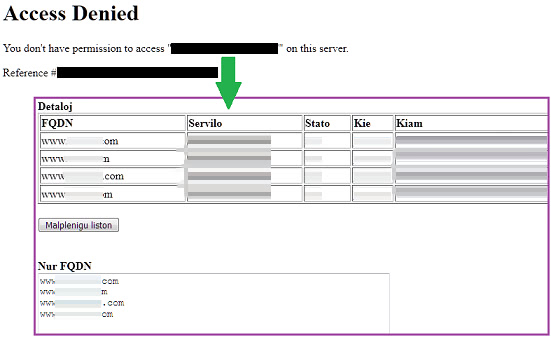

### Which website rejected me?

`Your website rejected me, but I know I'm going to be okay.`




```

1. Your website reject me.
2. This add-on will log the FQDN, URL, Status code and current time.
3. You can review it from Option menu.
4. Yell at website owner with this proof. (optional)
 
This add-on never send any data.
Your domain collection is yours.

```


- [Code](https://git.nogafam.es/deCloudflare/deCloudflare/src/branch/master/addons/code/ureject)
- Download add-on
  - From Gitea: [FirefoxESR](https://git.nogafam.es/deCloudflare/deCloudflare/raw/branch/master/addons/releases/urjm.xpi) / [Chromium / Edge](https://git.nogafam.es/deCloudflare/deCloudflare/raw/branch/master/addons/releases/urjm.crx)
