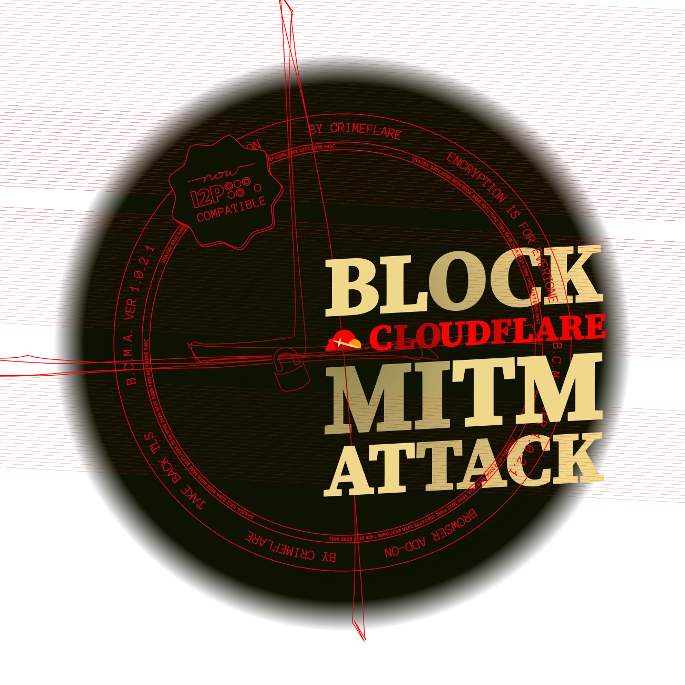

### Block Cloudflare MITM Attack!!

`Let's fight against the growing MITM attack on the Internet.`

| ? | ? |
| -- | -- |
|  |  |

This add-on will block, notify, or redirect your request if the target website is using Cloudflare.

The primary purpose of this browser add-on is to block Cloudflare sites.

The TLS protocol promises end-to-end encryption between the client and an authenticated, identified endpoint server. 
The browser’s lock icon is a UI widget which makes this promise to the user. 
Cloudflare is a mass-decryption chokepoint, which intercepts and decrypts the Web requests made by billions of people to millions of websites.
 

- Start your own Cloudflare Collection

The add-on remembers cloudflare domain and keep it locally like a collection book.
You can review, export, delete or disable your collection anytime.
It is your collection; this add-on never send it online.

- About "_Use KarmaAPI to detect stealthy Cloudflare domains_" settings option

This add-on does not make internet connection by default.
This option is disabled by default.
If you enable above option, the add-on will lookup only domain name (e.g. `https://www.mozilla.org/blog/ -> send only "mozilla.org"`) with [Karma API](../service/karma_api.md) service.
And if the domain is listed in our Cloudflare Domain list the add-on will take action based on your preferences.

---

- Looking for `Palemoon`? [Block Cloudflare Requests (Palemoon)](../../tool/block_cloudflare_requests_pm)
- Download add-on
  - From Git: [Firefox ESR](https://0xacab.org/dCF/deCloudflare/-/raw/master/addons/releases/bcma.xpi) / [Chromium / Edge](https://0xacab.org/dCF/deCloudflare/-/raw/master/addons/releases/bcma.crx)
