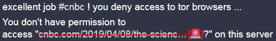

### Will these links block Tor user?

`Scan FQDN using API`




```

You′ve found something on the internet.
Are these links blocking Tor users or not?
 
This add-on is using[1] public[3] API to scan FQDN.
WE DO NOT COLLECT THIS DATA.
	e.g. https://ekzemplo.com/page.html → "ekzemplo.com"

This add-on never send other information.


[1] How to use offline database
	1. Open add-on's option page and select "Use Offline Local Database".
	2. Click "Database" link.
	3. Create a new text file[2] (or download text file from git)
	4. Click "Import Database" and select your text file.
	5. Wait until the message appear.

[2] Text file example
	(FQDN/Domain)
	--------------------
	www.cloudflare.com
	domain.com
	example.org
	--------------------

[3] Public API services
	You can select which API service you want to use.
	Additionally you can self-host and use your own API.

```


- [API Self-host Guide](../../tool/api_for_ismm_isat/)
- Download add-on
  - From Git: [Firefox ESR](https://0xacab.org/dCF/deCloudflare/-/raw/master/addons/releases/isat.xpi) / [Chromium / Edge](https://0xacab.org/dCF/deCloudflare/-/raw/master/addons/releases/isat.crx)
