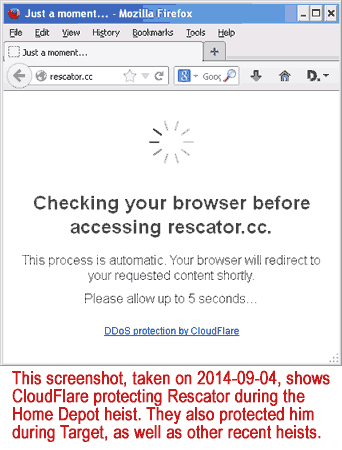

```
Americans are more likely to worry about having credit card information they used in stores
stolen by computer hackers than any other crime they are asked about.
```
 — Gallup.com, October 2014


### Carders love CloudFlare

    . . . like flies love honey?


The carder domains listed here were online between February 2014 and August 2021, and hiding behind CloudFlare. This list will be out of date within a few weeks, because carders frequently change domain names and service providers. After all, it is illegal to sell stolen credit card data no matter where you live.

CloudFlare doesn't care about laws. They're in Silicon Valley, where the rich get richer, lobbyists own the lawmakers, and eveyone else faces higher rents and evictions. As far as we can tell, CloudFlare has done exactly nothing about criminals using their services. We thought they might do something about the marketing of 40 million credit cards stolen from Target in late 2013, but we were wrong. The major criminal exploiting this heist calls himself "Rescator," and he still uses CloudFlare. He might even be the Boss Man. His screen name appears on a couple dozen of the domains listed on this page.



Maybe CloudFlare admires Rescator because his images are so cool. The one on top announced a batch of cards from Target in early December, "Pearl Harbor" was announced on January 13, and "Beaver Cage" on February 8. The next one, "Desert Strike," announced 282,000 cards on March 3. These are from 2,600 Sally Beauty locations in the U.S. The "Sanctions" image appeared on September 2, and is related to a breach at Home Depot stores.

Our theory is that CloudFlare is waiting for more images. A year or so from now they could have a full set in their trophy case. Then CloudFlare can boast that their venture-funded start-up enjoys immunity from all civil and criminal laws. That would be a perfect time to make a killing with an IPO.


---

[home page](README.md)