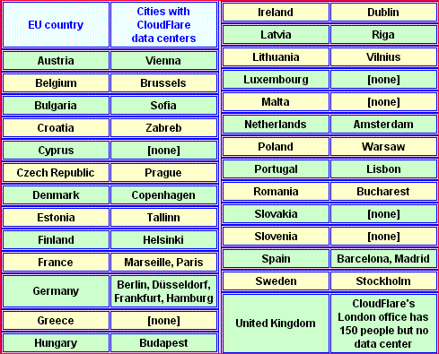

# Is CloudFlare affected by the EU's GDPR?

> May 25, 2018

Our [geolocation results](cfusers.md) page points to direct-connect IP addresses for many of the above countries. For example, if you click on France, the first link shows almost 4,000 domains in the same /24 block that all use CloudFlare. This looks like a situation where a single service provider in France hooks up every new customer to CloudFlare automatically. This provider in France obviously must adhere to the GDPR. However, it is our belief that in cases this extreme, CloudFlare must also share responsibility for GDPR violations. If you click again, you can get a listing of the specific domains. Sometimes the domain names themselves suggest dubious content.

We haven't investigated this particular case, as there are many dozens of similar patterns in our data, even after restricting our searches to EU countries only. 

---

[home page](README.md)