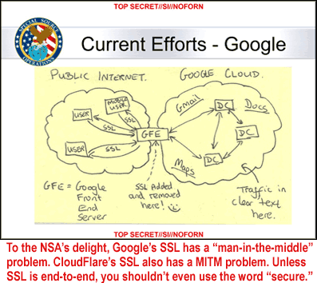
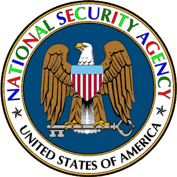

"In other words, nothing can be done about the ISIS sites, carders, booters, gamblers,
escorts, phishers, malware, and copyright infringers that CloudFlare protects."

# CloudFlare's half-baked SSL: suspicious sockets layer

> October 2013
> updated: March 18, 2020

We were inspired to collect the data on this page after reading this report: [Phishers using CloudFlare for SSL](https://web.archive.org/web/20210824200208/http://news.netcraft.com/archives/2013/10/07/phishers-using-cloudflare-for-ssl.html). Also see this [technical analysis](file/httpsincdn.pdf) (PDF, 545 KB) on the use of SSL by CloudFlare and similar services. The CloudFlare certificates we found all had the common name in the same style as the "ssl2796.cloudflare.com" shown in that Netcraft report. The "ssl2796" in the name is a CloudFlare tracking ID in the 49,541 root domains we found that use "standard" (not "universal") CloudFlare certificates. Every root domain also has a subdomain wildcard line (*.example.com), which we deleted to save space.

We compiled this list by attempting a handshake with the CloudFlare domains in our database. The "standard" certificates on this page (with "ssl" in front of the number instead of "sni") mean that the domain has a paid account at CloudFlare. Paid accounts make up about five percent of the domains that use CloudFlare, according to [news reports](https://web.archive.org/web/20210824200208/http://web.archive.org/web/20160310090126/http://www.cnbc.com/2014/12/22/cloudflare-to-open-a-data-center-a-week-in-2015.html). It's all a marketing effort anyway, whether paid or free. There is no such thing as "secure" SSL when you have potential Men-In-The-Middle at scores of data centers around the world. Local authorities could be sniffing the plaintext available at these data centers, and CloudFlare wouldn't have a clue. (Their "data centers" are typically a rack or two of equipment that CloudFlare ships to a real data center, along with installation instructions.) We asked CloudFlare to confirm that sniffing is possible at these so-called "data centers," but they didn't respond. By now we're wondering if there's a plaintext Ethernet port at the back of their equipment rack that makes interception easy and convenient. If so, it would make no difference whether the origin server has its own certificate.

CloudFlare may claim that there is no way plaintext can be accessed from their equipment racks, despite the fact that some sort of decrypt and re-encrypt must occur there due to the nature of their role as a CDN. After all, CloudFlare has engineers who come up with clever techniques to enhance SSL. But imagine that you are a government regulator in a country where a big ISP hosts a CloudFlare "data center." Your job is to consider the Internet in terms of public safety and current laws, and you go to that ISP with a list of CloudFlare-user domains you want blocked. The ISP replies that everything is encrypted, and CloudFlare traffic cannot be intercepted. In other words, nothing can be done about the ISIS sites, carders, booters, gamblers, escorts, phishers, malware, and copyright infringers that CloudFlare protects. How would you respond? It's fairly obvious — you ask this ISP to block the CloudFlare IP addresses used by the offending domains. If those IPs change, then block CloudFlare's entire IP space, and continue to monitor the situation. If CloudFlare's traffic still gets through, you ask the ISP to pull the plug on CloudFlare's racks. This is why CloudFlare will add a plaintext port to their own hardware someday, if they haven't already.

The CloudFlare certificates below encrypt the traffic only between the browser and CloudFlare. The traffic between the original web server and CloudFlare remains unencrypted unless the web server owner has his own certificate installed on his machine. Almost everyone who browses a https domain reached from CloudFlare is unaware that just half of the route is encrypted. When they see the padlock on their screen, they feel that everything is safe. This is why phishers love CloudFlare's SSL. It's easy to use for a cybercriminal with numerous domains hidden behind the privacy services of various registrars. Moreover, the subdomain wildcard option on each domain is handy for obscuring a URL in a phishing email.

Suppose that grandpa, age 90, gets an official-looking email that advises him to immediately change his password. He clicks on the URL in the email and ends up at bankofamerica.q4.es. This page is an excellent imitation of the Bank of America pages he remembers, and there is also that nice little SSL padlock in the corner of the address bar. Would he fill out the form? Probably, because he doesn't realize that he's at a subdomain of q4.es and is entering his old and new password into a fake page for the benefit of a phisher.

As if the "standard" certificates aren't enough of a problem, there are also over four million "universal" certificates that present bigger problems. All you need for a free CloudFlare account is a domain and an email address. Little countries and even some little islands all have their own top-level domain these days. Rich people can buy a generic top-level domain. Many registrars around the world are pleased to sell these ccTLD and gTLD registrations. It's a cash cow for everyone, but especially for bad guys. The same situation exists for anyone who needs a throwaway email address that's nearly impossible to trace.

Now add CloudFlare's free fly-by-night "universal" SSL. When you email CloudFlare to open your new account, they ask for your domain. Then they scrape your zone file from whatever dubious nameservers are listed at your dubious registrar. Without asking, they assign you a dubious "universal" SSL certificate. All of these "universal" certificates include that magical wildcard subdomain that invites so much mischief. Some critics are referring to these CloudFlare certificates as "fraudulent" because the domain ownership validation (a necessary component of the SSL standard) is achieved only from CloudFlare's initial access to the zone file.

With the paid accounts, there are payment records associated with a CloudFlare customer. But with free CloudFlare accounts, everything is too easy for bad guys, and the information about who's really behind a domain is frequently beyond the reach of law enforcement. The problem is that Silicon Valley is too self-serving. After the embarrassing NSA leaks, Google declared that everyone should look for a little padlock on their screen when they visit a website. Even your cat pictures should sport a little padlock these days! Now CloudFlare comes along and hopes to pave their way toward an IPO by giving away more free padlocks than anyone else. But by now the padlocks are almost meaningless. The NSA probably finds this amusing.

---

[home](README.md)
