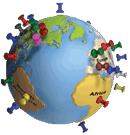

# Where in the world are those CloudFlare domains?


This site has recorded 2,608,730 direct-connect IP addresses of domains that used CloudFlare's nameservers since August 2012. Some of these domains no longer use CloudFlare, and others have shown various IPs over time. If a domain still uses CloudFlare, our domain search box displays dates when IP information was captured.

The countries below are preceded by the percentage of the domains in our database that geolocate to that country, based on an IP address lookup. By clicking on this percentage, you get a breakdown of the /24 netblocks of CloudFlare domains for that country, preceded by a count of those domains. Then by clicking on that number, you see the actual domains behind the count.



A /24 netblock is a set of IP addresses with identical numbers in the first three quads, and numbers from 0 to 255 in the fourth quad. This was once the smallest unit of address space that was allocated to applicants such as hosting providers. In recent years, however, IP address space has become fragmented because IPv4 addresses are in short supply.


```
        50.708 UNITED STATES
         7.004 GERMANY
         4.517 UNITED KINGDOM
         4.140 NETHERLANDS
         3.692 HONG KONG
         3.377 FRANCE
         3.061 CANADA
         2.591 CHINA
         2.588 AUSTRALIA
         2.573 IRELAND
         2.212 SINGAPORE
         1.368 JAPAN
         1.225 RUSSIA
         0.582 POLAND
         0.571 BRAZIL
         0.565 VIET NAM
         0.545 INDIA
         0.534 TAIWAN
         0.500 ITALY
         0.476 TURKEY
         0.408 SPAIN
         0.406 MALAYSIA
         0.405 SWEDEN
         0.377 KOREA, SOUTH
         0.358 FINLAND
         0.357 BELGIUM
         0.290 UKRAINE
         0.275 ROMANIA
         0.269 INDONESIA
         0.243 SOUTH AFRICA
         0.238 THAILAND
         0.223 SWITZERLAND
         0.200 CZECHIA
         0.193 DENMARK
         0.171 BULGARIA
         0.153 PORTUGAL
         0.150 HUNGARY
         0.141 NEW ZEALAND
         0.138 ISRAEL
         0.134 IRAN
         0.129 LITHUANIA
         0.079 GREECE
         0.072 NORWAY
         0.070 ARGENTINA
         0.066 LATVIA
         0.065 AUSTRIA
         0.057 LUXEMBOURG
         0.054 CHILE
         0.052 SLOVENIA
         0.047 CROATIA
         0.041 SLOVAKIA
         0.040 ESTONIA
         0.035 KAZAKHSTAN
         0.032 SEYCHELLES
         0.024 CYPRUS
         0.023 BELIZE
         0.020 PHILIPPINES
         0.020 MOLDOVA
         0.020 MEXICO
         0.019 BELARUS
         0.018 VIRGIN ISLANDS, BRITISH
         0.018 ICELAND
         0.018 COSTA RICA
         0.015 SERBIA
         0.014 UNITED ARAB EMIRATES
         0.014 SAUDI ARABIA
         0.012 COLOMBIA
         0.010 NEPAL
         0.010 MOROCCO
         0.009 MALTA
         0.009 GEORGIA
         0.009 BANGLADESH
         0.008 PANAMA
         0.008 PAKISTAN
         0.008 ISLE OF MAN
         0.008 ARMENIA
         0.007 EGYPT
         0.007 BAHRAIN
         0.007 AZERBAIJAN
         0.006 URUGUAY
         0.005 MACAO
         0.005 CAMBODIA
         0.004 VENEZUELA
         0.004 UZBEKISTAN
         0.004 NORTH MACEDONIA
         0.003 SRI LANKA
         0.003 PUERTO RICO
         0.003 JORDAN
         0.003 GUATEMALA
         0.003 ECUADOR
         0.003 CURACAO
         0.003 CAYMAN ISLANDS
         0.003 BOSNIA AND HERZEGOVINA
         0.002 TUNISIA
         0.002 PERU
         0.002 PALESTINIAN TERRITORY
         0.002 MAURITIUS
         0.002 KYRGYZSTAN
         0.002 KENYA
         0.002 GUERNSEY
         0.002 DOMINICAN REPUBLIC
         0.002 BRUNEI DARUSSALAM
         0.002 ALBANIA
         0.001 TRINIDAD AND TOBAGO
         0.001 SURINAME
         0.001 QATAR
         0.001 PARAGUAY
         0.001 OMAN
         0.001 NIGERIA
         0.001 NICARAGUA
         0.001 NEW CALEDONIA
         0.001 MYANMAR
         0.001 MONTENEGRO
         0.001 MONGOLIA
         0.001 MALDIVES
         0.001 LEBANON
         0.001 JAMAICA
         0.001 IRAQ
         0.001 HAITI
         0.001 GIBRALTAR
         0.001 DOMINICA
         0.001 BOTSWANA
         0.001 BAHAMAS
         0.000 ZIMBABWE
         0.000 ZAMBIA
         0.000 VIRGIN ISLANDS, U.S.
         0.000 VANUATU
         0.000 UGANDA
         0.000 TURKMENISTAN
         0.000 TOGO
         0.000 TANZANIA
         0.000 TAJIKISTAN
         0.000 SYRIAN ARAB REPUBLIC
         0.000 SAN MARINO
         0.000 SAMOA
         0.000 SAINT VINCENT AND GRENADINES
         0.000 SAINT MARTIN (FRENCH PART)
         0.000 SAINT KITTS AND NEVIS
         0.000 SAINT BARTHELEMY
         0.000 RWANDA
         0.000 REUNION
         0.000 PAPUA NEW GUINEA
         0.000 NORTHERN MARIANA ISLANDS
         0.000 NAMIBIA
         0.000 MOZAMBIQUE
         0.000 MONACO
         0.000 MARSHALL ISLANDS
         0.000 MALI
         0.000 MALAWI
         0.000 MADAGASCAR
         0.000 LIECHTENSTEIN
         0.000 LIBYA
         0.000 LAOS
         0.000 KUWAIT
         0.000 KOREA, NORTH
         0.000 JERSEY
         0.000 HONDURAS
         0.000 GUINEA
         0.000 GUAM
         0.000 GREENLAND
         0.000 GHANA
         0.000 FRENCH POLYNESIA
         0.000 FIJI
         0.000 FAROE ISLANDS
         0.000 ETHIOPIA
         0.000 EL SALVADOR
         0.000 CUBA
         0.000 COTE D'IVOIRE
         0.000 COOK ISLANDS
         0.000 CONGO, DEMOCRATIC REPUBLIC
         0.000 CAMEROON
         0.000 BONAIRE
         0.000 BOLIVIA
         0.000 BERMUDA
         0.000 BENIN
         0.000 BARBADOS
         0.000 ANTIGUA AND BARBUDA
         0.000 ANGOLA
         0.000 ANDORRA
         0.000 ALGERIA
         0.000 ALAND ISLANDS
         0.000 AFGHANISTAN
```

---

[home page](README.md)