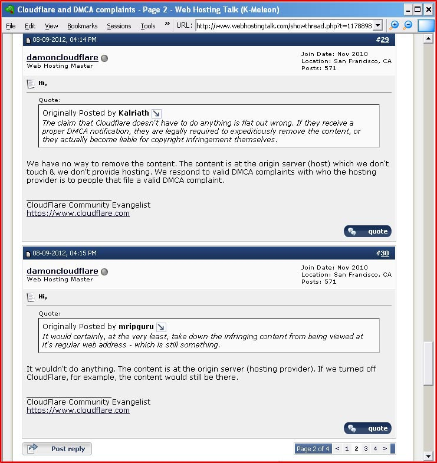
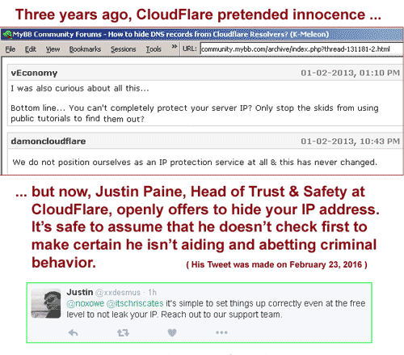

## Dear Damon Billian: We're not as stupid as you think!

_Please stop your insulting comments on forums_

CloudFlare is hosting the DNS lookups for their customers by providing the nameservers. The entire point of DMCA and other laws concerning content on the web is to provide due process toward removing the offending content from the Internet, so that it cannot be seen by the public. If CloudFlare deleted the nameserver records for the offending domain, it would effectively be removed from the web. The content would be unreachable within a matter of minutes.

Stop insulting us, Mr. Billian. Obviously it wouldn't affect the existence of that content on the original server. It is also true that if the owner of that server tossed his box into a dumpster, the content would still be on that server. This is utterly irrelevant.

The point is this: **it would be gone from the web**. Yes, the owner can change the authoritative nameservers to a non-Cloudflare DNS provider through his registrar, and the content would again be available on the web. But if that happened we would be one step closer to identifying the owner. This owner is probably using CloudFlare because you are hiding his identity. Chances are that he would remove the offending content himself before exposing information that could reveal his identity.

When you write that you "respond to valid DMCA complaints with who the hosting provider is to people that file a valid DMCA complaint," you are being disingenuous. Your DMCA form is carefully designed to obstruct complaints. On those rare occasions when a complaint arrives despite this, you respond with the netname and not the IP address. In every case we've seen, the netname is not specific enough to identify the box that is hosting the content. This means that the information you provide is often useless.

---

[home page](README.md)