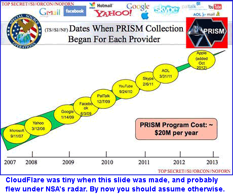

## A quotation from CEO Matthew Prince
( from the University of [Chicago law school journal](https://web.archive.org/web/20210826102142/https://web.archive.org/web/20170217121944/http://www.law.uchicago.edu/alumni/accoladesandachievements/matthew-prince-00-discusses-cloudflare-cloud-computing-journal) )

 

```
Back in 2003, Lee Holloway and I started Project Honey Pot as an open-source project to track online fraud and abuse. The Project allowed anyone with a website to install a piece of code and track hackers and spammers. We ran it as a hobby and didn't think much about it until, in 2008, the Department of Homeland Security called and said, 'Do you have any idea how valuable the data you have is?' That started us thinking about how we could effectively deploy the data from Project Honey Pot, as well as other sources, in order to protect websites online. That turned into the initial impetus for CloudFlare.
```


When you fetch a page from a website that is served from CloudFlare, Javascript has been injected on-the-fly into that page by CloudFlare, and they also plant a cookie that brands your browser with a globally-unique ID. This happens even if the website is using SSL and shows a cute little padlock in your browser. In fact, their entire approach to SSL appears to be a cynical marketing effort — it has a [man-in-the-middle problem](cfssl.md) that cannot be resolved.


We don't know if CloudFlare is tracking you. We do know that they are perfectly positioned to immediately begin tracking web surfers who visit selected sites hosted by CloudFlare. Is this why they proxy so many dodgy sites? Are they trying to jack up their stats and hype their way into another round of venture funding, or are they getting black-budget bucks from the feds?   Or both?


BBC reporter [Zoe Kleinman](https://web.archive.org/web/20210826102142/https://www.bbc.com/news/business-37348016) wrote that Matthew Prince wanted $20,000 for the Honey Pot data. "That check showed up so fast," said Prince.   Michelle Zatlyn heard the story from Prince and replied, "If they'll pay for it, other people will pay for it." Soon she and Prince cofounded CloudFlare.


Prince gave a presentation in 2005 at a conference in Vienna.  And even today,
 [LinkedIn](../../image/whoismp.jpg) brags of his "substantial work with government and law enforcement."
Project Honey Pot was launched by Prince's  [Unspam Technologies](https://web.archive.org/web/20210826102142/http://web.archive.org/web/20190331015236/http://www.unspam.com/),  a start-up
that began circa 2001 and can only be described as a [slow-motion train wreck](https://web.archive.org/web/20210826102142/http://www.datamation.com/columns/executive_tech/article.php/3526181/How-Utah-Michigan-Legislators-Got-Fooled.htm).




---

[home page](README.md)