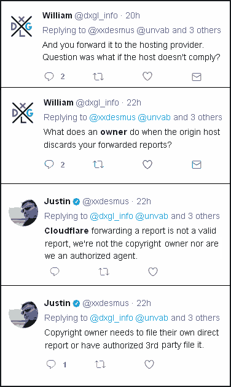

# CloudFlare attracts "repeat infringers"

Google publishes a [Transparency Report](https://web.archive.org/web/20210826102213/https://transparencyreport.google.com/copyright/explore) regarding copyright removal requests. One of the three large files in this downloadable data package is domains.csv, which lists domains specified in removal requests. We processed this file after downloading it on 2021-08-13. At that time the file was 333.3 million lines, and included domains mentioned in removal requests received by Google since July 2011.

Each removal request had a unique ID, which meant that it was on a separate line in this file. First we stripped out all the data except the domain name. Then we compressed the file by listing each domain once, preceded by the number of lines on which this domain appeared in that file. Finally, we extracted only those domains that were currently using CloudFlare nameservers. We wanted a rough idea of whether "repeat infringers" (a term used in the DMCA) might find CloudFlare attractive.

After adding these numbers together, it turns out that CloudFlare's contribution to Google's problem is 24.81 percent. Search-engine crawlers should avoid CloudFlare's [entire IP space](https://web.archive.org/web/20210826102213/https://www.cloudflare.com/ips/).

---

[home](README.md)
