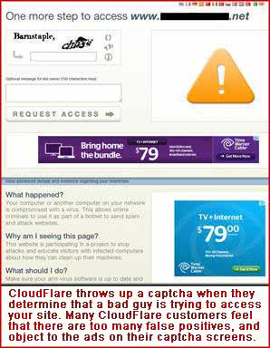

# CloudFlare seeks riches through anarchy

_Civil society and the twisted web_

> July 2012

One of the concepts that eludes the digital generation is that Internet participation requires a balance between privacy and accountability. If you are using a search engine for passive research, you have the right to remain anonymous. But if you publish something that can affect others, you should be accountable, and hence identifiable. Even comments under a blog post or on Facebook should be signed with a real name. It's that simple.

During 2011, CloudFlare responded to complaints about content on their servers by insisting that they are merely a pass-through content delivery network (CDN) and not a hosting provider. At the same time they usually gave you the hosting provider's IP address. In 2012 they stopped responding to many complaints, and even those that they still deem worthy are given only the netname of the hosting provider instead of the specific IP address.

Anyone attempting to file a complaint with only a netname will get nowhere. Frequently the netname is at the top of a pyramid, and any number of leased or owned IP netblocks are below that name. The netname alone is not specific enough to identify the server that hosts the content.

CloudFlare is delighted with this. In retrospect they are happy that they hosted LulzSec because it brought publicity and more customers. Currently they even host the website of a professional DDoSer named "Gwapo" in the Philippines. He explains how you can send him money to take down any website.

The question of whether CloudFlare is a pass-through provider is debatable. They change the pages they cache by adding JavaScript and compression, sometimes they intercept pages with a captcha, and they display their orange-cloud logo at every opportunity. Browsers who land on a domain serviced by CloudFlare end up with a globally-unique "cfduid" cookie that is 43 digits long. CloudFlare is _not_ the equivalent of a data center on the Internet backbone, which has no responsibility for content because it operates on a different Internet layer. This means that CloudFlare should be sensitive to content complaints. Despite this, they offer advice on how to hide your IP address, and they help basement-dwellers reduce bandwidth costs. Some of these teenagers run abusive websites for the lulz or because piracy is fun, and most have little money.

CloudFlare is basically a hosting provider, or at least an active and intrusive appendage to a hosting provider. In cases such as LulzSec and [Encyclopedia Dramatica](https://web.archive.org/web/20210826103612/http://josephevers.blogspot.com/) they are a necessary appendage, as those sites wouldn't exist without it. The brass at CloudFlare know this, and seem worried that someday it will be an issue for a judge or jury to decide. Whenever some fanboy comments about CloudFlare on some blog and uses the term "hosting provider," the company's official "Community Evangelist" [Damon Billian](damon.md) adds a comment to point out that CloudFlare is "not a hosting provider." Co-founder Matthew Prince echoes the same mantra. They want everyone to think that they have immunity from laws, so don't bother complaining to them about content.

They hype themselves to venture capitalists through media coverage, and have no time to read their own terms of service. Responsible citizenship interferes with getting rich. CloudFlare presents themselves as the world's solution to DDoS and hacking attacks, and cannot be bothered to handle complaints reasonably. As Google might say, accountability lacks scalability. Nothing short of a court order will get the attention of either CloudFlare or Google. It is left to public-sector activists and regulators do what they can to promote civility in Silicon Valley and accountability on the Internet.

Direct IP addresses are sometimes found on CloudFlare's nameservers. Since CloudFlare cannot handle email forwarding or direct uploading to the origin server, the site owner may add a "direct-connect" subdomain address to their DNS record. We try to collect these non-CloudFlare IP addresses by compiling lists of domains in CloudFlare's nameservers and checking each with several lookups.

Unfortunately, bad guys are often aware of technical issues, and quickly delete any direct-connect records or wildcard subdomains. CloudFlare should install a search box on their home page that lets anyone enter a domain name and get a history of IP addresses that have been feeding that domain to CloudFlare. But if they did this, all of their abusive customers would go elsewhere. They might even lose customers who are afraid of DDoS, and are trying to hide their IP from some of those same bad guys. See our search page, [Uncovering bad guys hiding behind CloudFlare](cfs.md), for more information and a search box.

From CloudFlare's perspective, it is better to keep both camps under one roof, and continue to spin and hype this wretched mess until the time comes when they can get rich with an IPO.

---

[home page](README.md)
