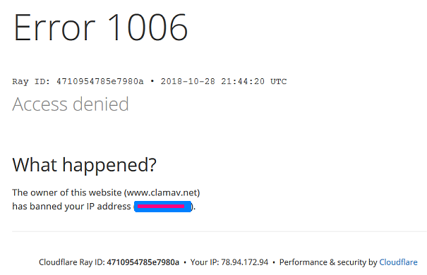

## How many % of Computer security companies are using Cloudflare?


- Computer security companies
```
Companies known for software related to the security of computers, networks or related devices.
```

- [ClamAV](https://en.wikipedia.org/wiki/ClamAV) is using CloudFlare and it is breaking antivirus definition update.
  - [Why did you block me clamAV page??](https://web.archive.org/web/20171011025329/http://forums.clamwin.com/viewtopic.php?t=4384)
  - [Updates blocked by cloudflare - how to proceed?](https://web.archive.org/web/20211215215242/http://forums.clamwin.com/viewtopic.php?t=4915)
  - [manuell and auto download clamwin virendefinitions fail](https://web.archive.org/web/20220114060744/http://forums.clamwin.com/viewtopic.php?t=5324)





The following is a list of Computer security companies.


| Name | Site | Cloudflared |
| --- | --- | --- |
| ADF Solutions | https://www.adfsolutions.com/ | Yes |
| AlgoSec | https://www.algosec.com/ | Yes |
| Altor Networks | https://www.altornetworks.com/ | No |
| Anomali | https://anomali.com/ | Yes |
| Anonymizer company | https://www.anonymizer.com/ | No |
| ArcSight | https://www.microfocus.com/ | Yes |
| Arctic Wolf Networks | https://www.arcticwolf.com/ | Yes |
| Arxan Technologies | https://www.arxan.com/ | Yes |
| AT&T Cybersecurity | https://cybersecurity.att.com/ | No |
| AusCERT | https://www.auscert.org.au/ | No |
| AuthenTec | https://authentec.com/ | No |
| Avast | https://www.avast.com/ | Yes |
| AVG Technologies | https://www.avg.com/ | Yes |
| Avira | https://www.avira.com/ | Yes |
| Awareness Technologies | https://www.awarenesstechnologies.com/ | Yes |
| Barracuda Networks | https://barracuda.com/ | Yes |
| BigID | https://www.bigid.com/ | Yes |
| BitArmor | https://www.bitarmor.com/ | No |
| Bitdefender | https://www.bitdefender.com/ | Yes |
| BlockDos | https://www.blockdos.net/ | No |
| Blue Coat Systems | https://www.broadcom.com/ | Yes |
| BlueTalon | https://www.bluetalon.com/ | No |
| Bromium | https://www8.hp.com/ | No |
| Bugcrowd | https://bugcrowd.com/ | Yes |
| Canon IT Solutions | https://www.canon-its.co.jp/ | No |
| Cato Networks | https://www.catonetworks.com/ | Yes |
| Checkmarx | https://checkmarx.com/ | Yes |
| Check Point | https://checkpoint.com/ | Yes |
| Cheetah Mobile | https://www.cmcm.com/ | No |
| Chronicle Security | https://chronicle.security/ | Yes |
| Cisco Systems | https://www.cisco.com/ | Yes |
| Clam AntiVirus | https://www.clamav.net/ | Yes |
| ClamWin Pty Ltd | https://clamwin.com/ | No |
| Clarified Networks | https://synopsys.com/ | Yes |
| Clavister | https://clavister.com/ | No |
| Cloudbric | https://www.cloudbric.com/ | No |
| Columbitech | https://www.columbitech.com/ | No |
| Comodo Cybersecurity | https://www.comodo.com/ | Yes |
| Core Security Technologies | https://www.coresecurity.com/ | Yes |
| Credant Technologies | https://www.credant.com/ | No |
| Critical Start | https://www.criticalstart.com/ | Yes |
| CronLab | https://cronlab.com/ | No |
| Crossbeam Systems | https://crossbeamsystems.com/ | No |
| CrowdStrike | https://www.crowdstrike.com/ | Yes |
| Cryptek | https://www.cryptek.com/ | No |
| Cybereason | https://cybereason.com/ | Yes |
| CyberHound | https://cyberhound.com/ | No |
| Cyber Intelligence House | https://cyberintelligencehouse.com/ | Yes |
| Cyberoam | https://www.cyberoam.com/ | No |
| Cylance | https://www.cylance.com/ | Yes |
| Cynet company | https://cynet.com/ | Yes |
| Cyveillance | https://www.zerofox.com/ | Yes |
| Dasient | https://www.dasient.com/ | No |
| DataGravity | https://www.datagravity.com/ | No |
| Datto company | https://datto.com/ | Yes |
| DB Networks | https://www.dbnetworks.com/ | No |
| Deep Instinct | https://www.deepinstinct.com/ | Yes |
| Digital Guardian | https://digitalguardian.com/ | Yes |
| DivvyCloud | https://divvycloud.com/ | No |
| Dr.Web | https://www.drweb.com/ | No |
| Druva | https://www.druva.com/ | Yes |
| Echoworx | https://www.echoworx.com/ | No |
| Egress Software | https://www.egress.com/ | Yes |
| ElcomSoft | https://www.elcomsoft.com/ | No |
| Emsisoft | https://www.emsisoft.com/ | Yes |
| Entrust | https://www.entrust.com/ | Yes |
| ESafe | https://www.safenet-inc.com/ | No |
| ESET | https://www.eset.com/ | No |
| F-Secure | https://www.f-secure.com/ | Yes |
| F5, Inc. | https://www.f5.com/ | Yes |
| Fastly | https://www.fastly.com/ | Yes |
| Fidelis Cybersecurity | https://www.fidelissecurity.com/ | Yes |
| Finjan Holdings | https://securebrowsing.finjan.com/ | No |
| Fluentd | https://www.fluentd.org/ | Yes |
| Forcepoint | https://www.forcepoint.com/ | Yes |
| Forter | https://www.forter.com/ | Yes |
| Fortinet | https://fortinet.com/ | No |
| FRISK Software International | https://frisk.is/ | No |
| GadgetTrak | https://gadgettrak.com/ | No |
| G Data CyberDefense | https://www.gdatasoftware.com/ | No |
| General Dynamics Mission Systems | https://gdmissionsystems.com/ | No |
| Gigamon | https://gigamon.com/ | Yes |
| Guardian Analytics | https://www.guardiananalytics.com/ | No |
| Guidance Software | https://www.guidancesoftware.com/ | No |
| HackerOne | https://hackerone.com/ | Yes |
| HBGary | https://www.hbgary.com/ | No |
| Hitachi | https://www.hitachi.com/ | No |
| IID company | https://www.internetidentity.com/ | No |
| Immunet | https://www.immunet.com/ | Yes |
| ImmuniWeb | https://www.immuniweb.com/ | Yes |
| Impermium | https://impermium.com/ | No |
| Imperva | https://www.imperva.com/ | Yes |
| Imprivata | https://www.imprivata.com/ | Yes |
| INCA Internet | https://inca.co.kr/ | No |
| InfoSec Institute | https://www.infosecinstitute.com/ | Yes |
| Infysec | https://www.infysec.com/ | No |
| Intego | https://www.intego.com/ | Yes |
| InterWorking Labs | https://www.iwl.com/ | No |
| IOActive | https://ioactive.com/ | No |
| IronPort | https://www.ironport.com/ | No |
| ISheriff | https://www.isheriff.com/ | No |
| Itochu Techno-Solutions | https://www.ctc-g.co.jp/ | No |
| IViz Security | https://ivizsecurity.com/ | No |
| JAL Infotec | https://www.jalinfotec.co.jp/ | No |
| Jscrambler | https://jscrambler.com/ | Yes |
| K7 Computing | https://www.k7computing.com/ | No |
| Kaspersky Lab | https://www.kaspersky.com/ | Yes |
| Lastline | https://lastline.com/ | Yes |
| Lavasoft | https://www.adaware.com/ | Yes |
| Librem | https://puri.sm/ | No |
| Loggly | https://www.loggly.com/ | No |
| LogLogic | https://loglogic.com/ | No |
| Lumension Security | https://www.ivanti.com/ | Yes |
| M86 Security | https://www.trustwave.com/ | Yes |
| Malwarebytes | https://www.malwarebytes.com/ | Yes |
| Mandiant | https://mandiant.com/ | Yes |
| McAfee | https://www.mcafee.com/ | No |
| Messaging Architects | https://www.messagingarchitects.com/ | Yes |
| Microsoft | https://www.microsoft.com/ | Yes |
| Mile2 | https://mile2.com/ | Yes |
| MIRACL security firm | https://www.miracl.com/ | No |
| Mitro | https://www.mitro.co/ | No |
| Mitsui Knowledge Industry | https://www.mki.co.jp/ | Yes |
| Mocana | https://mocana.com/ | Yes |
| Mushroom Networks | https://www.mushroomnetworks.com/ | Yes |
| Namogoo | https://www.namogoo.com/ | No |
| NEC | https://www.nec.com/ | No |
| NeoAccel | https://www.neoaccel.com/ | No |
| Netcraft | https://www.netcraft.com/ | No |
| NetScreen Technologies | https://www.juniper.net/ | Yes |
| Netwitness | https://www.netwitness.com/ | No |
| Nexor | https://www.nexor.com/ | No |
| NitroSecurity | https://www.nitrosecurity.com/ | No |
| Nomura Research Institute | https://www.nri.co.jp/ | No |
| Norman Safeground | https://www.norman.com/ | No |
| NortonLifeLock | https://www.nortonlifelock.com/ | Yes |
| NowSecure | https://nowsecure.com/ | Yes |
| NS Solutions | https://www.nssol.nssmc.com/ | No |
| Ntrepid | https://ntrepidcorp.com/ | No |
| NuCaptcha | https://www.nucaptcha.com/ | No |
| OneID | https://www.home.neustar/ | No |
| OneLogin | https://www.onelogin.com/ | Yes |
| OneSpan | https://www.onespan.com/ | Yes |
| Optenet | https://www.optenet.com/ | No |
| Optiv | https://www.optiv.com/ | Yes |
| Palo Alto Networks | https://paloaltonetworks.com/ | Yes |
| Panda Security | https://www.pandasecurity.com/ | Yes |
| Panorays | https://www.panorays.com/ | Yes |
| Parasoft | https://www.parasoft.com/ | Yes |
| PC Tools | https://pctools.com/ | No |
| Perimeter 81 | https://www.perimeter81.com/ | Yes |
| Pine64 | https://pine64.org/ | No |
| PrivateCore | https://www.privatecore.com/ | Yes |
| PRODAFT | https://www.prodaft.com/ | No |
| Prolexic Technologies | https://www.prolexic.com/ | No |
| Proofpoint, Inc. | https://www.proofpoint.com/ | Yes |
| Qihoo 360 | https://www.360.cn/ | No |
| Qualys | https://qualys.com/ | Yes |
| Quick Heal | https://www.quickheal.com/ | Yes |
| Raz-Lee | https://www.razlee.com/ | No |
| Retina-X Studios | https://retinax.com/ | No |
| RiskIQ | https://www.riskiq.com/ | Yes |
| RSA Security | https://www.rsa.com/ | Yes |
| S21Sec | https://www.s21sec.com/ | No |
| Safelayer Secure Communications | https://www.safelayer.com/ | No |
| SafeNet | https://cpl.thalesgroup.com/ | No |
| Safetica Technologies | https://www.safetica.com/ | Yes |
| SAINT | https://www.saintcorporation.com/ | No |
| Sandstorm Enterprises | https://www.sandstorm.net/ | No |
| SCSK | https://www.scsk.jp/ | No |
| Secure Computing Corporation | https://www.securecomputing.com/ | No |
| Secureworks | https://secureworks.com/ | Yes |
| SecurityScorecard | https://securityscorecard.com/ | Yes |
| SentinelOne | https://www.sentinelone.com/ | Yes |
| Sentrigo | https://www.sentrigo.com/ | No |
| Shavlik Technologies | https://www.shavlik.com/ | Yes |
| Snyk | https://snyk.io/ | Yes |
| SonicWall | https://www.sonicwall.com/ | Yes |
| Sony Global Solutions | https://www.sonyglobalsolutions.jp/ | No |
| Sophos | https://sophos.com/ | Yes |
| SpectorSoft | https://www.veriato.com/ | Yes |
| Splunk | https://splunk.com/ | Yes |
| Stonesoft Corporation | https://stonesoft.com/ | No |
| Sumo Logic | https://www.sumologic.com/ | Yes |
| Syhunt | https://www.syhunt.com/ | No |
| Synack | https://www.synack.com/ | Yes |
| Tactical Network Solutions | https://www.tacnetsol.com/ | Yes |
| Tanium | https://www.tanium.com/ | Yes |
| Tapestry Technologies | https://tapestrytech.com/ | No |
| Tenable, Inc. | https://www.tenable.com/ | Yes |
| ThreatConnect | https://www.threatconnect.com/ | Yes |
| TitanFile | https://www.titanfile.com/ | No |
| Tiversa | https://www.tiversa.com/ | No |
| TokenEx | https://tokenex.com/ | Yes |
| Trend Micro | https://www.trendmicro.com/ | Yes |
| Tripwire company | https://www.tripwire.com/ | Yes |
| Trusteer | https://www.trusteer.com/ | No |
| Tufin | https://www.tufin.com/ | Yes |
| Uniadex | https://www.uniadex.co.jp/ | No |
| Uniloc | https://www.uniloc.com/ | No |
| Utimaco Atalla | https://hsm.utimaco.com/ | Yes |
| ValidSoft | https://www.validsoft.com/ | No |
| Vectra AI | https://www.vectra.ai/ | Yes |
| Venafi | https://www.venafi.com/ | Yes |
| Veracode | https://www.veracode.com/ | Yes |
| Videntifier | https://www.videntifier.com/ | No |
| VirusBlokAda | https://www.anti-virus.by/ | No |
| VMware Carbon Black | https://carbonblack.com/ | Yes |
| Vupen | https://vupen.com/ | No |
| Vyatta | https://www.vyatta.com/ | Yes |
| WatchGuard | https://watchguard.com/ | Yes |
| Webroot | https://www.webroot.com/ | Yes |
| Web Sheriff | https://websheriff.com/ | Yes |
| World Informatix Cyber Security | https://worldinformatixcs.com/ | No |
| Xetron | https://meetngc.com/ | No |
| YesWeHack | https://www.yeswehack.com/ | No |
| Zeobit | https://zeobit.com/ | Yes |
| Zerodium | https://www.zerodium.com/ | No |
| Ziften | https://ziften.com/ | No |
| Zimperium | https://www.zimperium.com/ | Yes |
| Zscaler | https://zscaler.com/ | Yes |


-----

| Type | Count |
| --- | --- | 
| Cloudflare | 116 |
| Normal | 105 |


### 52.49% of Computer security companies are using Cloudflare.
