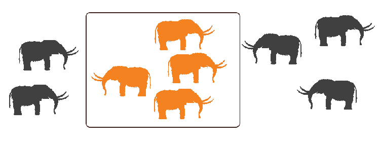

## How many % of links people publicly shared on Mastodon are using Cloudflare?


- [Mastodon](https://en.wikipedia.org/wiki/Mastodon_(software))
```
Mastodon is free and open-source software for running self-hosted social networking services. 
It has microblogging features similar to the Twitter service, which are offered by a 
large number of independently run Mastodon nodes (known as "instances"), each with 
its own code of conduct, terms of service, privacy options, and moderation policies.
```


- [Top 10 - Shared Any links](cloudflared_shared_mastodon.md#top-10-shared-any-links)
- [Top 100 - Shared Cloudflare links](cloudflared_shared_mastodon.md#top-100-shared-cloudflare-links)
- [About Mastodon Users](cloudflared_shared_mastodon.md#about-mastodon-users)
- ↳ Previous: [Shared on Mastodon](shared_on_mastodon.md)

----

### ( From `2021-07-17` to `2021-09-18` )

### Top 10 - Shared Any links

[//]: # (do not edit this line start; t1)

| # | Mastodon User | Links |
| --- | --- | --- |
| 1 | itnewsbot@schleuss.online | 11,305 |
| 2 | hn50@social.lansky.name | 7,188 |
| 3 | nowthisnews@newsbots.eu | 6,310 |
| 4 | covid_stats@mastodon.cloud | 6,119 |
| 5 | archlinux@pokemon.men | 5,605 |
| 6 | reuters_worldnews@newsbots.eu | 5,348 |
| 7 | hntooter@mastodon.social | 5,294 |
| 8 | hackernews@die-partei.social | 4,936 |
| 9 | ponypics@equestria.social | 4,916 |
| 10 | elpuntavui@mastodont.cat | 4,913 |

[//]: # (do not edit this line end)


### Top 100 - Shared Cloudflare links

[//]: # (do not edit this line start; t2)

| # | Mastodon User | Links |
| --- | --- | --- |
| 1 | covid_stats@mastodon.cloud | 6,119 |
| 2 | hn50@social.lansky.name | 4,876 |
| 3 | elpuntavui@mastodont.cat | 4,264 |
| 4 | itnewsbot@schleuss.online | 4,072 |
| 5 | birbs@neckbeard.xyz | 3,242 |
| 6 | hn100@social.lansky.name | 3,099 |
| 7 | hn100@botsin.space | 2,613 |
| 8 | darulharb@social.quodverum.com | 2,086 |
| 9 | hackernews@die-partei.social | 2,011 |
| 10 | hntooter@mastodon.social | 1,951 |
| 11 | naturalnews@brighteon.social | 1,768 |
| 12 | johndolph@brighteon.social | 1,576 |
| 13 | ponypics@equestria.social | 1,432 |
| 14 | alternet@newsbots.eu | 1,393 |
| 15 | hnbot@botsin.space | 1,384 |
| 16 | bbcpersiannewsbot@aleph.land | 1,280 |
| 17 | gradientbot@botsin.space | 1,219 |
| 18 | technews@aspiechattr.me | 1,216 |
| 19 | btc@framapiaf.org | 1,136 |
| 20 | thepressproject@libretooth.gr | 994 |
| 21 | freax@anonsys.net | 966 |
| 22 | hn250@social.lansky.name | 922 |
| 23 | ethereum@framapiaf.org | 898 |
| 24 | androidpolice@mstdn.social | 869 |
| 25 | youngblood@social.quodverum.com | 843 |
| 26 | blendernation@botsin.space | 786 |
| 27 | jleimer@brighteon.social | 668 |
| 28 | ckstechnologynews@mastodon.social | 664 |
| 29 | teargasbreakfast@social.quodverum.com | 650 |
| 30 | arzachel@mastodon.derveni.org | 586 |
| 31 | tilderadio@tilde.zone | 580 |
| 32 | todayilearned@botsin.space | 557 |
| 33 | enigmatico@fedi.absturztau.be | 526 |
| 34 | snoro@mastodon.social | 515 |
| 35 | kelly_naproducr@noagendasocial.com | 497 |
| 36 | journalducoin@mastodon.social | 494 |
| 37 | thenewoil@freeradical.zone | 491 |
| 38 | interlignes@newsbots.eu | 486 |
| 39 | artbot@botsin.space | 459 |
| 40 | mediapart@mastodon.social | 446 |
| 41 | blenderdomain@botsin.space | 426 |
| 42 | telesur_es@newsbots.eu | 419 |
| 43 | nextinpact@gs.leftic.club | 392 |
| 44 | loursdenice@mamot.fr | 373 |
| 45 | redfrog@mamot.fr | 371 |
| 46 | redwhitebluedude@social.quodverum.com | 369 |
| 47 | reporterre@gs.leftic.club | 362 |
| 48 | klaatu@noagendasocial.com | 357 |
| 49 | thecanary@newsbots.eu | 337 |
| 50 | martintero2@redliberal.com | 332 |
| 51 | benzogaga33@mamot.fr | 329 |
| 52 | dabnotu@mastodon.art | 324 |
| 53 | info_activism@mastodon.cc | 319 |
| 54 | lobsters@botsin.space | 310 |
| 55 | itsecbot@schleuss.online | 304 |
| 56 | lobsters@newsbots.eu | 297 |
| 57 | hhra@botsin.space | 296 |
| 58 | pluralistic@mamot.fr | 268 |
| 59 | hn500@social.lansky.name | 266 |
| 60 | jacquesurbanska@mastodon.xyz | 263 |
| 61 | makoto@precure.ml | 263 |
| 62 | humansarefree@brighteon.social | 254 |
| 63 | reporterre@mamot.fr | 252 |
| 64 | johndolph@noagendasocial.com | 243 |
| 65 | zennblack@itmslaves.com | 239 |
| 66 | mauthausengusen@qua.name | 235 |
| 67 | edgecontrol@mastodon.social | 219 |
| 68 | rosadefoc@barcelona.social | 203 |
| 69 | hermesgabriel@todon.nl | 200 |
| 70 | baron_rotterdam@noagendasocial.com | 200 |
| 71 | arg@kolektiva.social | 196 |
| 72 | outraspalavras@newsbots.eu | 196 |
| 73 | neoresistant@mamot.fr | 194 |
| 74 | hundriverwidow@social.quodverum.com | 188 |
| 75 | nachocarreras@mastodon.la | 176 |
| 76 | anarchistfederation@kolektiva.social | 174 |
| 77 | hj@shigusegubu.club | 174 |
| 78 | thefreethoughtproject@masthead.social | 173 |
| 79 | cgarison@noagendasocial.com | 173 |
| 80 | pzmyers@octodon.social | 172 |
| 81 | fantomas@framapiaf.org | 166 |
| 82 | trittriton@shelter.moe | 165 |
| 83 | thehackernews@social.tchncs.de | 162 |
| 84 | benborges@mastodon.social | 161 |
| 85 | jafo@social.quodverum.com | 160 |
| 86 | maeve@girlcock.club | 158 |
| 87 | lupyuen@qoto.org | 153 |
| 88 | masterblaster@social.quodverum.com | 151 |
| 89 | chris@noagendasocial.com | 150 |
| 90 | noagendashownoteslinks@noagendasocial.com | 150 |
| 91 | infoactu@mamot.fr | 149 |
| 92 | theonion@botsin.space | 147 |
| 93 | citoyenchouette@mastodon.social | 144 |
| 94 | poserindex@social.quodverum.com | 143 |
| 95 | wwwcdorg@mamot.fr | 143 |
| 96 | urbanbike@mastodon.social | 140 |
| 97 | mediapart@mastodon.online | 139 |
| 98 | foneguy89@noagendasocial.com | 139 |
| 99 | 1iceloops123@shitposter.club | 136 |
| 100 | se7en@freespeechextremist.com | 135 |

[//]: # (do not edit this line end)


### About Mastodon Users

[//]: # (do not edit this line start; t3)


- Mastodon users posted *1,081,887* public toots. (about *17172.8* toots per day)
  - Above number include toots which has no link.
- Now let's focus on *Mastodon toots which has links*.


- Mastodon users shared *441,521* links in total.
  - *110,510* links are Cloudflare links. (*25*%)
- There are *13,709* users who shared ANY links.
  - On average one mastodon user shared *32.2* links. (about *0.5* links per day)
  - There are *1,399* users who ONLY shared Cloudflare links. (*10.2*%)
  - There are *7,362* users who NEVER shared Cloudflare links. (*53.7*%)

tl;dr
### *46.3%* of Mastodon users who shared link shared Cloudflare links.
### *25%* of shared links are Cloudflare links.

[//]: # (do not edit this line end)


----


