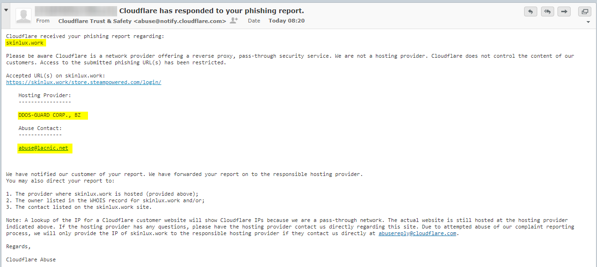

## How many % of public Torrent services are using Cloudflare?


- [Torrent](https://en.wikipedia.org/wiki/BitTorrent)
```
BitTorrent (abbreviated to BT) is a communication protocol for peer-to-peer file sharing (P2P), 
which enables users to distribute data and electronic files over the Internet in a decentralized manner.
BitTorrent is one of the most common protocols for transferring large files; 
such as, digital video files containing TV shows and video clips, or digital audio files containing songs.
```

- [Tracker](https://en.wikipedia.org/wiki/BitTorrent_tracker)
```
A BitTorrent tracker is a special type of server that assists in the communication between peers using the BitTorrent protocol.
The "tracker" server keeps track of where file copies reside on peer machines, 
which ones are available at time of the client request, and helps coordinate efficient transmission and reassembly of the copied file.
```

```
❓ Are torrents illegal?

✅ That depends. 
Downloading content that’s shared with permission from the creator is perfectly legal. 
Downloading pirated content is not.
```


Here's a list of public Torrent and Tracker services.


<details>
<summary>_click me_

## Torrent
</summary>

- From
  - [Top 10 Most Popular Torrent Sites of 2020](https://web.archive.org/web/20210427222841/https://torrentfreak.com/top-10-most-popular-torrent-sites-of-2020-200105/)
  - [Top 10 Most Popular Torrent Sites of 2021](https://web.archive.org/web/20210506020609/https://torrentfreak.com/top-torrent-sites-2021-210103/)
  - [24 Best Torrent Sites in April 2021](https://web.archive.org/web/20210413095523/https://troypoint.com/best-torrent-sites/)
  - [the best list of torrent sites](https://web.archive.org/web/20210303164503/https://torrentsites.com/)
- Above sites are 'protected' by Cloudflare.


| Site | Cloudflared |
| --- | --- |
| 01torrent.net | Yes |
| 1337x.to | Yes |
| 2torrentz.net | Yes |
| academictorrents.com | Yes |
| alt-torrent.com | Yes |
| anidex.info | Yes |
| anime-sharing.com | Yes |
| anime-ultime.net | No |
| animebytes.tv | Yes |
| animekaizoku.com | Yes |
| animetorrents.me | Yes |
| animetosho.org | No |
| anirena.com | Yes |
| arenabg.com | No |
| audiobookbay.nl | No |
| baconbits.org | No |
| badasstorrents.com | Yes |
| baibako.tv | No |
| bakabt.me | Yes |
| bibliotik.me | Yes |
| bigfangroup.org | Yes |
| bitnova.info | Yes |
| bitspyder.net | No |
| bittorrent.am | No |
| books-share.com | No |
| bookyards.com | Yes |
| broadcasthe.net | Yes |
| btdig.com | Yes |
| cinemageddon.net | Yes |
| crotorrents.com | Yes |
| cztorrent.net | Yes |
| demonoid.is | Yes |
| dirtytorrents.com | No |
| divxtotal.ch | Yes |
| dodi-repacks.site | Yes |
| ebookee.com | No |
| elite-tracker.net | No |
| elitetorrent.com | Yes |
| ethor.net | Yes |
| ettvtorrents.com | Yes |
| extratorrent.ag | Yes |
| extratorrent.cc | Yes |
| extratorrent.si | Yes |
| extratorrents.it | Yes |
| eztv.re | Yes |
| fast-torrent.ru | Yes |
| feedbooks.com | No |
| filebase.ws | Yes |
| fitgirl-repacks.site | Yes |
| freebookspot.club | No |
| freetechbooks.com | No |
| gazellegames.net | No |
| ggbases.com | Yes |
| glodls.to | Yes |
| gtdb.to | Yes |
| gutenberg.org | No |
| hd-space.org | Yes |
| hd4fans.org | Yes |
| hdarea.co | Yes |
| hdbits.org | No |
| hdreactor.club | No |
| horriblesubs.info | Yes |
| ibit.to | Yes |
| idope.se | Yes |
| igg-games.com | Yes |
| ilcorsaronero.link | Yes |
| immortalseed.me | No |
| iptorrents.com | Yes |
| iptorrents.me | Yes |
| isohunts.to | Yes |
| katcr.to | Yes |
| kickasstorrent.cr | Yes |
| kickasstorrent.link | Yes |
| kickasstorrents.ee | No |
| kickasstorrents.to | Yes |
| kinozal.tv | Yes |
| libgen.is | No |
| limetorrents.cc | Yes |
| limetorrents.co | Yes |
| limetorrents.com | Yes |
| limetorrents.cyou | Yes |
| limetorrents.info | Yes |
| limetorrents.net | Yes |
| limetorrents.zone | Yes |
| linkomanija.net | No |
| m-team.cc | Yes |
| magnetdl.com | Yes |
| manybooks.net | Yes |
| masters-tb.com | Yes |
| mejortorrento.com | Yes |
| mma-torrents.com | No |
| monova.org | Yes |
| montorrent.com | Yes |
| myanonamouse.net | No |
| mypiratebay.best | No |
| mypiratebay.club | Yes |
| mypiratebay.co | Yes |
| mypiratebay.fun | No |
| mypiratebay.life | No |
| mypiratebay.me | Yes |
| mypiratebay.net | Yes |
| mypiratebay.wtf | Yes |
| nyaa.si | No |
| openpirate.cc | Yes |
| openpirate.org | Yes |
| otorrents.com | No |
| p2pbg.com | No |
| partis.si | Yes |
| passthepopcorn.me | Yes |
| pdfbooksworld.com | No |
| piratebay.icu | Yes |
| piratebay.life | Yes |
| piratebay.tech | Yes |
| pirateiro.com | Yes |
| pirateproxy.ink | Yes |
| pirateproxy.surf | Yes |
| planetebook.com | Yes |
| publicdomaintorrents.info | No |
| rarbg.to | No |
| redacted.ch | No |
| riperam.org | No |
| rutracker.org | Yes |
| scenetime.com | Yes |
| seedpeer.eu | Yes |
| seedpeer.me | Yes |
| shanaproject.com | Yes |
| skidrowreloaded.com | Yes |
| skytorrents.to | Yes |
| smashwords.com | No |
| snowfl.com | Yes |
| subsplease.org | Yes |
| t3nnis.tv | No |
| tamilrockers.ws | Yes |
| telechargerjeuxtorrent.com | Yes |
| thepiratebay.org | Yes |
| tokyotosho.info | Yes |
| toorgle.com | Yes |
| torlock2.com | Yes |
| toros.co | Yes |
| torrends.to | Yes |
| torrent9.site | Yes |
| torrentbit.net | Yes |
| torrentdownload.info | Yes |
| torrentdownloads.cc | Yes |
| torrentdownloads.me | Yes |
| torrentfunk.com | Yes |
| torrentgalaxy.to | Yes |
| torrenthound.com | Yes |
| torrenting.com | Yes |
| torrentleech.org | Yes |
| torrentproject.com | Yes |
| torrentproject.se | Yes |
| torrentreactor.net | Yes |
| torrentroom.com | Yes |
| torrents.net | Yes |
| torrentseeker.com | Yes |
| torrentz.eu | Yes |
| torrentz.in | Yes |
| torrentz.me | Yes |
| torrentz.to | Yes |
| torrentz2.eu | Yes |
| torrentz2.is | Yes |
| torrentzeu.org | No |
| totheglory.im | Yes |
| tpb.bike | Yes |
| tpb.cool | Yes |
| tpb.email | Yes |
| tpb.red | Yes |
| turktorrent.us | Yes |
| tv-vault.me | Yes |
| watchsomuch.com | Yes |
| xspeeds.eu | Yes |
| xtorx.com | No |
| yggtorrent.li | Yes |
| yourbittorrent.com | Yes |
| yts.mx | Yes |
| zooqle.com | Yes |
| zooqlemovies.xyz | Yes |

</details>


<details>
<summary>_click me_

## Tracker
</summary>

| Server | Cloudflared |
| --- | --- |
| 1337.abcvg.info | Yes |
| 3rt.tace.ru | Yes |
| 47.ip-51-68-199.eu | No |
| 5rt.tace.ru | Yes |
| 6ahddutb1ucc3cp.ru | No |
| 6rt.tace.ru | Yes |
| admin.videoenpoche.info | No |
| agusiq-torrents.pl | No |
| anidex.moe | Yes |
| app.icon256.com | Yes |
| aruacfilmes.com.br | No |
| asnet.pw | No |
| atrack.pow7.com | Yes |
| bclearning.top | No |
| bioquantum.co.za | No |
| blokas.io | No |
| bobbialbano.com | No |
| bt.100.pet | No |
| bt.firebit.org | Yes |
| bt.nfshost.com | No |
| bt.okmp3.ru | Yes |
| bt1.archive.org | Yes |
| bt2.54new.com | No |
| bt2.archive.org | Yes |
| bubu.mapfactor.com | No |
| camera.lei001.com | No |
| cdn-1.gamecoast.org | Yes |
| cdn-2.gamecoast.org | Yes |
| code2chicken.nl | No |
| concen.org | No |
| cutiegirl.ru | No |
| daveking.com | No |
| discord.heihachi.pw | Yes |
| drumkitx.com | No |
| edu.uifr.ru | No |
| engplus.ru | No |
| exodus.desync.com | No |
| explodie.org | No |
| fe.dealclub.de | No |
| filetracker.xyz | No |
| free-tracker.zooki.xyz | Yes |
| free.publictracker.xyz | Yes |
| fxtt.ru | No |
| gwp2-v19.rinet.ru | No |
| h4.trakx.nibba.trade | No |
| inferno.demonoid.is | Yes |
| ipv4.tracker.harry.lu | Yes |
| ipv6.tracker.zerobytes.xyz | Yes |
| johnrosen1.com | Yes |
| line-net.ru | No |
| ln.mtahost.co | No |
| mail.realliferpg.de | Yes |
| mail2.zelenaya.net | No |
| mgtracker.org | No |
| movies.zsw.ca | No |
| mts.tvbit.co | No |
| nagios.tks.sumy.ua | No |
| newtoncity.org | No |
| ns3107607.ip-54-36-126.eu | No |
| ns349743.ip-91-121-106.eu | No |
| ns389251.ovh.net | No |
| open.acgnxtracker.com | Yes |
| open.acgtracker.com | Yes |
| open.kickasstracker.com | No |
| open.lolicon.eu | Yes |
| open.publictracker.xyz | Yes |
| open.stealth.si | No |
| openbittorrent.com | No |
| opentor.org | No |
| opentracker.i2p.rocks | No |
| p4p.arenabg.com | No |
| peerfect.org | No |
| pow7.com | Yes |
| pt.lax.mx | Yes |
| public-tracker.zooki.xyz | Yes |
| public.publictracker.xyz | Yes |
| public.tracker.vraphim.com | No |
| retracker.bashtel.ru | No |
| retracker.gorcomnet.ru | No |
| retracker.krs-ix.ru | No |
| retracker.lanta-net.ru | No |
| retracker.mgts.by | No |
| retracker.netbynet.ru | No |
| retracker.nts.su | No |
| retracker.sevstar.net | No |
| retracker.spark-rostov.ru | No |
| retracker.telecom.by | No |
| rt.tace.ru | Yes |
| share.camoe.cn | No |
| storage.groupees.com | Yes |
| t.acg.rip | No |
| t.nyaatracker.com | Yes |
| t.overflow.biz | No |
| t1.leech.ie | Yes |
| t2.leech.ie | Yes |
| t3.leech.ie | Yes |
| thetracker.org | Yes |
| torrentclub.online | No |
| torrentclub.tech | No |
| torrentsmd.eu | Yes |
| torrenttracker.nwc.acsalaska.net | No |
| tr.bangumi.moe | Yes |
| tr.cili001.com | No |
| tr.kxmp.cf | No |
| tr.ready4.icu | Yes |
| tr2.ysagin.top | Yes |
| tracker-cdn.moeking.me | Yes |
| tracker-de.ololosh.space | Yes |
| tracker-udp.gbitt.info | Yes |
| tracker.0x.tf | Yes |
| tracker.aletorrenty.pl | No |
| tracker.altrosky.nl | No |
| tracker.army | No |
| tracker.beeimg.com | Yes |
| tracker.bittor.pw | No |
| tracker.bittorrent.am | No |
| tracker.blacksparrowmedia.net | No |
| tracker.bt-hash.com | No |
| tracker.bt4g.com | Yes |
| tracker.ccp.ovh | Yes |
| tracker.city9x.com | No |
| tracker.coalition.space | Yes |
| tracker.coppersurfer.tk | No |
| tracker.darmowy-torrent.pl | No |
| tracker.devil-torrents.pl | No |
| tracker.dler.org | Yes |
| tracker.eddie4.nl | No |
| tracker.edoardocolombo.eu | Yes |
| tracker.electro-torrent.pl | No |
| tracker.ex.ua | No |
| tracker.fastdownload.xyz | Yes |
| tracker.filemail.com | No |
| tracker.files.fm | Yes |
| tracker.foreverpirates.co | Yes |
| tracker.gbitt.info | Yes |
| tracker.grepler.com | Yes |
| tracker.hama3.net | Yes |
| tracker.imgoingto.icu | Yes |
| tracker.internetwarriors.net | No |
| tracker.iriseden.eu | No |
| tracker.iriseden.fr | No |
| tracker.kali.org | No |
| tracker.kuroy.me | Yes |
| tracker.leechers-paradise.org | No |
| tracker.lelux.fi | No |
| tracker.lilithraws.cf | Yes |
| tracker.loadbt.com | Yes |
| tracker.mg64.net | No |
| tracker.moeking.me | Yes |
| tracker.monitorit4.me | No |
| tracker.moxing.party | Yes |
| tracker.nanoha.org | Yes |
| tracker.nighthawk.pw | Yes |
| tracker.nitrix.me | Yes |
| tracker.noobsubs.net | Yes |
| tracker.nrx.me | No |
| tracker.ololosh.space | Yes |
| tracker.openbittorrent.com | No |
| tracker.opentrackr.org | No |
| tracker.parrotsec.org | Yes |
| tracker.renfei.net | Yes |
| tracker.shkinev.me | No |
| tracker.sigterm.xyz | No |
| tracker.sktorrent.net | No |
| tracker.skyts.net | No |
| tracker.sloppyta.co | No |
| tracker.swateam.org.uk | No |
| tracker.tamersunion.org | Yes |
| tracker.tfile.co | No |
| tracker.theoks.net | Yes |
| tracker.tiny-vps.com | No |
| tracker.tvunderground.org.ru | Yes |
| tracker.uw0.xyz | Yes |
| tracker.v6speed.org | No |
| tracker.vraphim.com | No |
| tracker.yoshi210.com | No |
| tracker.zemoj.com | Yes |
| tracker.zerobytes.xyz | Yes |
| tracker0.ufibox.com | Yes |
| tracker1.bt.moack.co.kr | No |
| tracker1.wasabii.com.tw | No |
| tracker2.christianbro.pw | No |
| tracker2.dler.org | Yes |
| tracker2.indowebster.com | Yes |
| tracker2.itzmx.com | Yes |
| tracker2.wasabii.com.tw | No |
| tracker4.itzmx.com | Yes |
| trakx.herokuapp.com | No |
| trk.publictracker.xyz | Yes |
| tsundere.pw | Yes |
| u.wwwww.wtf | Yes |
| udp-tracker.shittyurl.org | Yes |
| us-tracker.publictracker.xyz | Yes |
| valakas.rollo.dnsabr.com | No |
| vibe.community | Yes |
| vibe.sleepyinternetfun.xyz | Yes |
| vpn.flying-datacenter.de | No |
| vps02.net.orel.ru | No |
| w.wwwww.wtf | Yes |
| wassermann.online | No |
| www.loushao.net | No |
| www.wareztorrent.com | No |
| zephir.monocul.us | No |

</details>


-----


- Torrent

| Type | Count |
| --- | --- | 
| Cloudflare | 138 |
| Normal | 40 |


- Tracker

| Type | Count |
| --- | --- | 
| Cloudflare | 88 |
| Normal | 115 |


### 77.5% of public Torrent sites are using Cloudflare.
### 43.3% of public Tracker services are using Cloudflare.


Some Cloudflared site owners are using additional _protection_ to protect themselves from legal pressure.




- ↳ [Cloudflare attracts "repeat infringers"](repeat_infringers_love_cloudflare.md)
