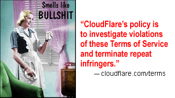

# Cloudflare attracts "repeat infringers"

Google is publishing [Transparency Report](https://transparencyreport.google.com/copyright/overview) regarding copyright removal requests.

We processed their report after downloading it in `October 2022`.

Here is the result.

### Domains

| Type | % |
| --- | --- |
| Cloudflare | 595,615 (16.24%) |
| Normal | 3,070,944 (83.76%) |
| Total | 3,666,559 |

### Removal Requests related to above domains

| Type | % |
| --- | --- |
| Cloudflare | 152,198,676 (37.95%) |
| Normal | 248,899,337 (62.05%) |
| Total | 401,098,013 |

### Top 100 (sorted by removal requests)

| Domain | Requests | Cloudflared |
| --- | --- | --- |
| rapidgator.net | 912,722 | No |
| torrentdownloads.me | 712,773 | Yes |
| turbobit.net | 650,497 | Yes |
| uploaded.net | 646,664 | Yes |
| chomikuj.pl | 566,596 | Yes |
| zippyshare.com | 552,006 | No |
| blogspot.com | 500,234 | No |
| limetorrents.cc | 498,707 | Yes |
| torrentfunk.com | 468,872 | Yes |
| new-rutor.org | 446,704 | No |
| limetorrents.info | 398,255 | Yes |
| 1337x.to | 385,259 | Yes |
| 4shared.com | 368,861 | No |
| thepiratebay.org | 362,375 | Yes |
| monova.org | 359,554 | Yes |
| nitroflare.com | 357,891 | Yes |
| torrentz.eu | 346,574 | Yes |
| torlock.com | 337,924 | Yes |
| bittorrent.am | 322,824 | Yes |
| yourbittorrent.com | 321,300 | Yes |
| torrenthound.com | 315,212 | No |
| isohunt.to | 298,615 | No |
| limetorrents.com | 298,019 | Yes |
| thepiratebay.se | 285,927 | No |
| torrentroom.com | 281,071 | Yes |
| web.app | 274,728 | No |
| bitsnoop.com | 271,954 | Yes |
| ul.to | 249,862 | Yes |
| zooqle.com | 244,573 | Yes |
| extratorrent.cc | 229,595 | Yes |
| uptobox.com | 229,202 | Yes |
| seedpeer.me | 228,125 | No |
| filestube.com | 225,845 | No |
| glodls.to | 211,513 | Yes |
| hitfile.net | 209,031 | Yes |
| torrentbit.net | 205,404 | No |
| magnetdl.com | 204,756 | Yes |
| rarbg.to | 201,654 | No |
| 1377x.to | 201,090 | Yes |
| torrentz2.eu | 199,631 | Yes |
| torrentproject.se | 193,004 | No |
| torrentreactor.net | 187,742 | Yes |
| share-online.biz | 187,309 | No |
| torrentdownloads.cc | 182,230 | Yes |
| torrent.cd | 181,549 | No |
| torrents.net | 181,045 | No |
| limetorrents.net | 180,431 | Yes |
| rg.to | 178,556 | No |
| mp3vip.org | 173,316 | No |
| openload.co | 173,053 | Yes |
| kickass.to | 171,855 | No |
| limetorrents.co | 171,072 | Yes |
| thepiratebay.ee | 169,514 | No |
| come.in | 167,585 | No |
| kickasstorrents.to | 166,170 | Yes |
| myfreemp3.eu | 164,129 | Yes |
| rutor.info | 162,644 | Yes |
| limetor.com | 162,405 | Yes |
| xrutor.org | 160,062 | No |
| unblockall.org | 158,030 | Yes |
| kickass.cd | 155,972 | Yes |
| gosong.net | 155,698 | Yes |
| myfreemp3.cc | 155,151 | Yes |
| torrentproject.com | 153,812 | No |
| torrentz.to | 152,328 | Yes |
| vk.com | 151,211 | No |
| kat.cr | 150,607 | No |
| 1fichier.com | 149,118 | No |
| bt4g.org | 149,072 | Yes |
| torrentbay.to | 147,887 | Yes |
| plixid.com | 146,987 | Yes |
| novafile.com | 146,793 | Yes |
| filetram.com | 146,242 | No |
| muzofon.com | 146,228 | Yes |
| mrtzcmp3.net | 145,890 | No |
| kat.ph | 145,334 | Yes |
| mp3skull.com | 144,741 | No |
| unlocktorrent.com | 144,173 | No |
| stafaband.info | 142,255 | Yes |
| katproxy.com | 141,418 | No |
| torrentfunk2.com | 139,476 | Yes |
| torrentz.pro | 139,468 | No |
| unblocked.to | 139,395 | No |
| limetorrents.zone | 138,894 | Yes |
| sharedir.com | 138,246 | No |
| mp3clan.com | 137,897 | Yes |
| tehparadox.com | 135,785 | No |
| mygully.com | 135,780 | Yes |
| kickasstorrent.cr | 134,590 | Yes |
| ulozto.net | 132,625 | No |
| unblocked.is | 132,067 | No |
| zfilm-hd.net | 130,511 | Yes |
| extratorrent.ag | 130,021 | No |
| uproxy.to | 129,973 | Yes |
| mp3searched.net | 129,961 | Yes |
| kickasstorrents.ee | 129,609 | No |
| kickasstorrent.link | 128,911 | Yes |
| filefactory.com | 127,768 | Yes |
| thepiratebay.rocks | 127,668 | Yes |
| unblockall.xyz | 127,188 | No |

### 59% of top 100 reported domains are using Cloudflare.

---

### 16.24% of reported domains are using Cloudflare.
### 37.95% of copyright removal requests are related to Cloudflare domains.

Repeat infringers loves Cloudflare.
