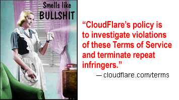

# Cloudflare attracts "repeat infringers"

Google is publishing [Transparency Report](https://transparencyreport.google.com/copyright/overview) regarding copyright removal requests.

We processed their report after downloading it in `September 2023`.

Here is the result.

### Domains

| Type | % |
| --- | --- |
| Cloudflare | 667,333 (14.85%) |
| Normal | 3,827,232 (85.15%) |
| Total | 4,494,565 |

### Removal Requests related to above domains

| Type | % |
| --- | --- |
| Cloudflare | 170,058,414 (37.1%) |
| Normal | 288,300,228 (62.9%) |
| Total | 458,358,642 |

### Top 100 (sorted by removal requests)

| Domain | Requests | Cloudflared |
| --- | --- | --- |
| web.app | 2,366,199 | No |
| rapidgator.net | 1,046,549 | No |
| torrentdownloads.me | 722,848 | Yes |
| turbobit.net | 701,163 | Yes |
| blogspot.com | 659,361 | No |
| new-rutor.org | 658,372 | No |
| uploaded.net | 654,041 | Yes |
| chomikuj.pl | 607,547 | Yes |
| zippyshare.com | 558,726 | No |
| limetorrents.cc | 518,467 | Yes |
| torrentfunk.com | 481,300 | Yes |
| 1337x.to | 430,593 | Yes |
| limetorrents.info | 424,364 | Yes |
| nitroflare.com | 422,510 | Yes |
| 4shared.com | 374,067 | No |
| thepiratebay.org | 371,907 | Yes |
| monova.org | 359,848 | Yes |
| torrentz.eu | 346,698 | Yes |
| torlock.com | 344,823 | Yes |
| yourbittorrent.com | 328,765 | Yes |
| bittorrent.am | 322,865 | Yes |
| limetorrents.com | 321,334 | Yes |
| torrenthound.com | 315,224 | No |
| erothots.co | 308,461 | Yes |
| isohunt.to | 298,647 | Yes |
| thepiratebay.se | 291,698 | No |
| torrentroom.com | 281,267 | Yes |
| bitsnoop.com | 271,956 | Yes |
| xrutor.org | 265,072 | Yes |
| masterfap.net | 257,573 | Yes |
| ul.to | 253,726 | Yes |
| uptobox.com | 251,360 | Yes |
| zooqle.com | 245,155 | Yes |
| 1377x.to | 244,217 | Yes |
| magnetdl.com | 234,337 | Yes |
| extratorrent.cc | 229,626 | Yes |
| seedpeer.me | 228,437 | No |
| fapello.com | 227,787 | Yes |
| rarbg.to | 226,950 | No |
| filestube.com | 225,861 | Yes |
| camwhores.tv | 225,590 | Yes |
| glodls.to | 220,388 | Yes |
| nsfw.xxx | 216,528 | Yes |
| hitfile.net | 211,984 | Yes |
| torrentbit.net | 205,584 | No |
| rg.to | 199,809 | No |
| torrentz2.eu | 199,702 | Yes |
| limetorrents.net | 199,234 | Yes |
| torrentproject.se | 193,011 | No |
| rutor.info | 191,929 | Yes |
| kickasstorrents.to | 189,855 | Yes |
| torrentreactor.net | 187,770 | Yes |
| share-online.biz | 187,345 | No |
| torrentdownloads.cc | 187,050 | Yes |
| camwhores.video | 181,735 | No |
| torrent.cd | 181,553 | No |
| torrents.net | 181,046 | No |
| limetorrents.co | 179,756 | Yes |
| torrentbay.to | 178,222 | Yes |
| thepiratebay.ee | 175,905 | No |
| bt4g.org | 173,791 | Yes |
| openload.co | 173,386 | Yes |
| mp3vip.org | 173,316 | No |
| unblockall.org | 172,852 | Yes |
| kickass.to | 171,857 | No |
| vk.com | 169,971 | No |
| limetor.com | 167,980 | Yes |
| come.in | 167,593 | No |
| myfreemp3.eu | 164,129 | Yes |
| 1fichier.com | 162,407 | No |
| faponic.com | 159,534 | Yes |
| kickass.cd | 156,085 | Yes |
| gosong.net | 155,753 | Yes |
| myfreemp3.cc | 155,151 | No |
| torrentfunk2.com | 154,567 | Yes |
| wildskirts.com | 154,285 | Yes |
| cambro.tv | 154,155 | No |
| torrentproject.com | 153,960 | No |
| torrentz.to | 152,366 | No |
| novafile.com | 152,168 | Yes |
| kat.cr | 150,637 | No |
| unblockninja.com | 149,147 | Yes |
| coomer.party | 147,763 | No |
| mygully.com | 147,590 | Yes |
| plixid.com | 146,996 | Yes |
| filetram.com | 146,426 | No |
| muzofon.com | 146,309 | Yes |
| mrtzcmp3.net | 145,890 | No |
| kat.ph | 145,510 | Yes |
| allserial.org | 145,404 | Yes |
| proxyrarbg.org | 145,380 | Yes |
| kickasstorrent.cr | 144,908 | Yes |
| mp3skull.com | 144,741 | No |
| uploadgig.com | 144,427 | No |
| xfantazy.com | 144,200 | Yes |
| unlocktorrent.com | 144,176 | No |
| limetorrents.zone | 143,380 | Yes |
| stafaband.info | 142,280 | No |
| katproxy.com | 141,418 | No |
| uproxy.to | 140,758 | Yes |

### 64% of top 100 reported domains are using Cloudflare.

---

### 14.85% of reported domains are using Cloudflare.
### 37.1% of copyright removal requests are related to Cloudflare domains.

Repeat infringers loves Cloudflare.
