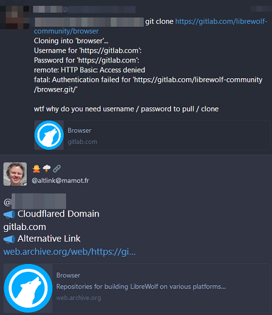

# Alternative Link





This is `opt-in` service.


> Subscribe

1. Follow [Alternative Link (AL)](https://mamot.fr/@altlink).
  - Some trigger-happy instances such as `mastodon.social` are blocking altlink.

2. AL will accept your follow request and follow back you.
  - If you're locking your account, please accept AL's follow request otherwise AL can't read your toots.
  - If you're marking your account as `Bot`, AL will reject your request and send you a message.
    - Try to follow again within 24 hours. (opt-in by human)
  - If there is a network instability and AL failed to follow back you: please unfollow and follow again. This will trigger follow-back.

3. When you share Cloudflared link, AL will send `direct` message to you with information.
  - Direct messages older than 3 days will be deleted.
    - There is no good reason to keep old toots online.
      - [Should I Delete My Tweets?](https://www.wired.com/story/the-know-it-alls-should-i-delete-my-tweets/)


> Unsubscribe

1. Just `block` or `mute` AL's account on your side.
  - AL do not attempt to re-follow you.
  - If you've changed your mind and want to subscribe(opt-in) again, `unblock`, `unfollow` AL and `follow` again.


> Settings

You can configure AL via `direct message`.

- 1: Do not message me same domain again for a day.
  - Default is `off`.
  - By default AL will notify you each time when you share _cloudflaresite.example_. Turning this settings _on_ will silence second post for 24 hours.
- 2: Message me onionsite if available.
  - Default is `off`.
  - If you turn _on_ this settings AL will notify you with onionsite link. Note that AL will also notify you for non-cloudflare sites when onion is available.
- 3: Count my links and send me report monthly.
  - Default is `off`.
  - If you turn _on_ this settings AL will simply count how many links you shared publicly and how many were Cloudflared. Note that this count will have duplicates because we never save what you shared.
  - If you change this settings _or_ each month has passed counter will reset to 0.
- 4: Set my preferred language to ??. 
  - Default is _unset_.
    - AL will use language based on your toot.
  - If you tell AL your language, AL will speak your language.
    - Need other language? Create an issue.
- 5: Show my current preferences.
  - No settings option.
- 6: Ignore boosted toots.
  - Default is `off`.
  - By default AL will notify you when you boost(retweet) other user's post which has Cloudflare link.


```
set N V
```

- N is above numbers.
- V is value.
  - for number 1 to 3:
    - _one of_: y n yes no true false 1 0 on off
  - for number 4:
    - _one of_: _cc_ (see below)
  - for number 5:
    - none (see below example)
- You can mix uppercase if you want.
  - `sEt 1 TRuE` is same as `set 1 true`


| _cc_ | ? |
| -- | -- |
| af | Afrikaans |
| ar | العربية |
| bg | Български |
| bn | বাংলা |
| ca | Català |
| co | Corsu |
| cs | Čeština |
| cy | Cymraeg |
| da | Dansk |
| de | Deutsch |
| el | Ελληνικά |
| en | English |
| eo | Esperanto |
| es | Español |
| et | Eesti |
| eu | Euskara |
| fa | فارسی |
| fi | Suomi |
| fr | Français |
| ga | Gaeilge |
| gd | Gàidhlig |
| gl | Galego |
| he | עברית |
| hi | हिन्दी |
| hr | Hrvatski |
| hu | Magyar |
| hy | Հայերեն |
| id | Bahasa Indonesia |
| is | Íslenska |
| it | Italiano |
| ja | 日本語 |
| ka | ქართული |
| kk | Қазақша |
| kn | ಕನ್ನಡ |
| ko | 한국어 |
| ku | سۆرانی |
| ky | Кыргызча |
| lt | Lietuvių |
| lv | Latviešu |
| mk | Македонски |
| ml | മലയാളം |
| mr | मराठी |
| ms | Bahasa Melayu |
| nl | Nederlands |
| no | Norsk |
| pl | Polski |
| pt | Português |
| ro | Română |
| ru | Русский |
| si | සිංහල |
| sk | Slovenčina |
| sl | Slovenščina |
| sq | Shqip |
| sr | Српски |
| sv | Svenska |
| ta | தமிழ் |
| te | తెలుగు |
| th | ไทย |
| tr | Türkçe |
| uk | Українська |
| ur | اُردُو |
| vi | Tiếng Việt |
| zh | 汉语 |
| zt | 漢語 |


Here's an example.

- Speak Russian. Enable onion. Monthly Report please.
```
@AL
set 4 ru
set 2 1
set 3 on
```

- What is my current settings?
```
@AL
set 5
```

- Turn 1 on and show settings.
```
@AL set 1 yes
set 5
```


---

- Mastodon servers are controlled by third party.
  - Let us know if above account is censored by aggressive Cloudflare supporters.
- AL don't read direct messages. e.g. `@AL @OtherUser hey read me`
  - If you have something to say, you are welcome to create new Issue for public discussion.
- ↳ ["Cloudflare, we have a problem" Mastodon](people.mastodon.md)
- ↳ [Shared on Mastodon](shared_on_mastodon.md)

<a rel="me" href="https://mamot.fr/@altlink"></a>
