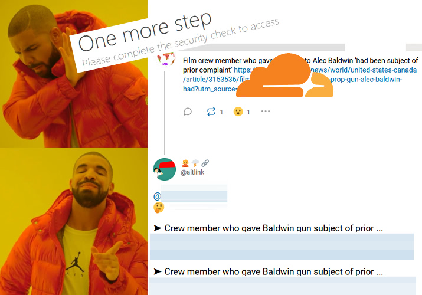
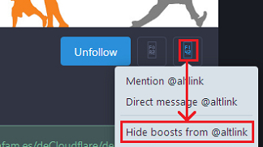

# Alternative Link


| 🖼 | 🖼 |
| -- | -- |
|  |  |


This is `opt-in` service.


### A little history

Once upon a time there was a bot named "_[CloudflareLink](https://social.privacytools.io/@cloudflarelink/with_replies)_" which was created by Anonymous.
It replied to many users who shared CF links publicly.

Not many people reacted it positively. Here is some of them.

- [kemonine@social.holdmybeer.solutions](https://social.holdmybeer.solutions/objects/9479c5be-40df-4ecd-a3fe-0209a9020dfd)
```
To the owner of this bot
You should be ashamed.
Quit drive by bro'ing our statuses.
Please fornicate with a pointy stick.
```

- [Sylvhem@eldritch.cafe](https://eldritch.cafe/@Sylvhem/102701484501099424)
```
Pointing to a copy rather than the original document if it's still online is bad practice too. Also, you are a very annoying bot.
```

They got annoyed and Mastodon server owner was pressured by their "spam" reports.

One of Mastodon server owner once [said](../tool/mastodonwch#some-public-reaction), "_your little protest bot is making people upset, and i'm worried it might cause people to defederate from the instance, please tone it down_."

For the record "_CloudflareLink_" was moved to other Mastodon servers 3 times and banned 2 times by 2 Mastodon services until the Anonymous decided to given up for good.

The main difference of AltLink is `opt-in`.
Those people who [share Cloudflare links casually](cloudflared_shared_mastodon.md) never receive notification until they have a good heart and follow AL.


### How to Subscribe

1. Follow [Alternative Link (AL)](https://mamot.fr/@altlink).
  - Some instances such as [mastodon.social](https://github.com/mastodon/mastodon/issues/16480) are blocking altlink.

| 🖼 | 🖼 |
| -- | -- |
|  |  |


2. AL will follow back you **within an hour**.
  - If you're locking your account, please accept AL's follow request otherwise AL can't read your toots.
  - **If** there is a network instability and AL failed to follow back you **after 1 hour**:
    - Please `unfollow`, `wait 1 hour`, and `follow` again.

3. When you share Cloudflared link, AL will send `direct` message to you with information.
  - Direct messages older than *12* hours will be deleted.
    - There is no good reason to keep old toots online.
      - [Should I Delete My Tweets?](https://www.wired.com/story/the-know-it-alls-should-i-delete-my-tweets/)


### How to Unsubscribe

1. Just `unfollow` AL's account **on your side**.
  - **AL will unfollow you within an hour**.
  - AL do not attempt to re-follow you.
  - If you've changed your mind and want to subscribe(opt-in) again, `unblock`, `unfollow` AL and `follow` again.


### How to hide _boosted_ toots

If you just want to use `direct message function` and don't want to know other [user's voices](../PEOPLE.md), just use Mastodon's "_Hide boost_" function like below picture.




### "_Is it really CloudFlare!?_" check

Just send `domain name` or `URL` as `direct message` and AL will answer within 1 minute.

Here's an example.

```
@altlink blog.emsisoft.com
```

You can also query multiple at once / mix domain and URLs

```
@altlink
en.wikipedia.org
https://blog.emsisoft.com/wow/
www.wikimedia.org
```


### Report a problem / Create an Issue

You can create an Issue without git account. Just send a `direct` message.
And don't worry,

- Multiple mentions (e.g. `@randomUser @altlink @otherUser blah blah blah`)
- _Public_ message (e.g. `there's a bot called @altlink`)

...will be ignored to prevent spam.
Your username part (before `@`) will be masked to protect your privacy.


### Settings

You can configure AL via `direct message`.

- 1: Do not message me same domain again for a day.
  - Default is `off`.
  - By default AL will notify you each time when you share _inaccessible_ link. Turning this settings _on_ will silence second post for 24 hours.
- 2: Suggest other non-Cloudflare alternative sites _when available_.
  - Default is `off`.
    - **Test Stage**: Currently this is `on` until October.
  - Let's say you boost or post Cloudflared news site. AL will suggest some similar websites related to your URL within 1 minute. Note that AL might suggest inaccurate result.
    - AL will not suggest anything if your account is `Bot`.
    - Rate-Limit: AL will suggest `only once per 2 minutes`. For example you post:
      - 10:**00** `http://example.com/article-a.html` (AL will suggest)
      - 10:**01** `http://example.net/article-b.html` (_will be ignored_)
      - 10:**02** `http://example.org/article-c.html` (AL will suggest)
      - 10:**03** `http://example.uk/article-d.html` (_will be ignored_)
- 3: Count my links and send me report monthly.
  - Default is `off`.
  - If you turn _on_ this settings AL will simply count how many links you shared publicly and how many were Cloudflared. Note that this count will have duplicates because we **never** save (& don't care) what you shared.
  - If you change this settings _or_ each month has passed counter will reset to 0.
- 4: Set my preferred language to ??. 
  - Default is _unset_.
    - AL will use language based on your toot.
  - If you tell AL your language, AL will speak your language.
    - Need other language? Create an issue.
- 5: Show my current preferences.
  - No settings option.
- 6: Ignore boosted toots.
  - Default is `off`.
  - By default AL will notify you when you boost(retweet) other user's post which has Cloudflare link.
- 7: Use alternative provider.
  - Default is `off`.
  - If you turn _on_ this settings AL will use [IAList](README.md) service.
- 8: Notify me if the link is known [Anti-Tor](../anti-tor_users/domains) link.
  - Default is `off`.
  - If you turn _on_ this settings AL will notify you when you share links that block Tor users.
    - "_Hey website.com why are you blocking Tor!?_"


```
set N V
```

- N is above numbers.
- V is value.
  - for number 1 to 3, 6 to 8:
    - _one of_: y n yes no true false 1 0 on off
  - for number 4:
    - _one of_: _cc_ (see [/README.md](../README.md))
    - e.g. `es Español` -> `es`
    - [**Improve translation**](../tool/trans.altlink.txt)
  - for number 5:
    - none (see below example)
- You can mix uppercase if you want.
  - `sEt 1 TRuE` is same as `set 1 true`


Here's an example.

- Speak Русский. Monthly Report please.
```
@altlink
set 4 ru
set 3 on
```

- What is my current settings?
```
@altlink set 5
```

- Turn 1 on and show settings.
```
@altlink set 1 yes
set 5
```


---

- Mastodon servers are controlled by third party.
  - Let us know if above account is censored by aggressive Cloudflare supporters.
- ↳ [Altlink IRC Service](service.altlink_irc.md)
- ↳ ["Cloudflare, we have a problem" Mastodon](people.mastodon.md)
- ↳ [How many % of public Fediverse services are using Cloudflare?](cloudflared_fediverse.md)
- ↳ [How many % of links people publicly shared on Mastodon are using Cloudflare?](cloudflared_shared_mastodon.md)

<a rel="me" href="https://mamot.fr/@altlink"></a>
