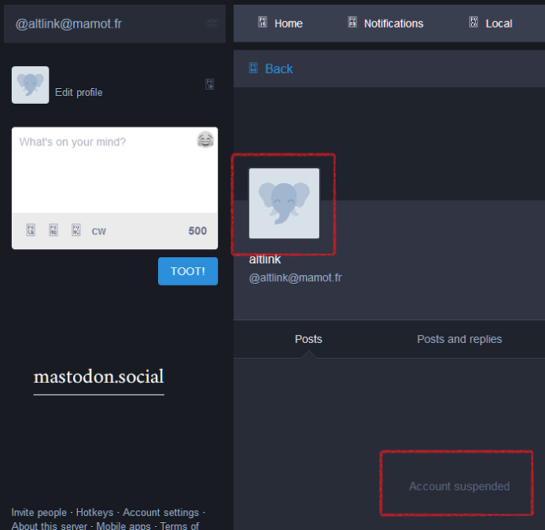
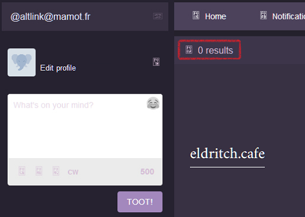

# Alternative Link


This is `opt-in` service.


> A little history

Once upon a time there was a bot named "_[CloudflareLink](https://social.privacytools.io/@cloudflarelink/with_replies)_" which was created by Anonymous.
It replied to many users who shared CF links publicly.

Not many people reacted it positively.
They got annoyed and Mastodon server owner was pressured by their "spam" reports.
One of Mastodon server owner once [said](../tool/mastodonwch#some-public-reaction), "_your little protest bot is making people upset, and i'm worried it might cause people to defederate from the instance, please tone it down_."

For the record "_CloudflareLink_" was moved to other Mastodon servers 3 times and banned 2 times by 2 Mastodon services until the Anonymous decided to given up for good.

The main difference of AltLink is `opt-in`.
Those people who [share Cloudflare links casually](cloudflared_shared_mastodon.md) never receive notification until they have a good heart and follow AL.


> Subscribe

1. Follow [Alternative Link (AL)](https://mamot.fr/@altlink).
  - Some instances such as [mastodon.social](https://github.com/mastodon/mastodon/issues/16480) are blocking altlink.

| 🖼 | 🖼 |
| -- | -- |
|  |  |


2. AL will accept your follow request and follow back you.
  - If you're locking your account, please accept AL's follow request otherwise AL can't read your toots.
  - If you're marking your account as `Bot`, AL will reject your request and send you a message.
    - Try to follow again within *24* hours. (opt-in by human)
  - If there is a network instability and AL failed to follow back you: please unfollow and follow again. This will trigger follow-back.

3. When you share Cloudflared link, AL will send `direct` message to you with information.
  - Direct messages older than *1* day will be deleted.
    - There is no good reason to keep old toots online.
      - [Should I Delete My Tweets?](https://www.wired.com/story/the-know-it-alls-should-i-delete-my-tweets/)


> Unsubscribe

1. Just `block` or `mute` AL's account **on your side**.
  - AL do not attempt to re-follow you.
  - If you've changed your mind and want to subscribe(opt-in) again, `unblock`, `unfollow` AL and `follow` again.


> "_Is it really CloudFlare!?_" check

Just send `domain name` or `URL` as direct message and AL will answer within 1-2 minutes.

Here's an example.

```
@altlink blog.emsisoft.com
```

You can also query multiple at once / mix domain and URLs

```
@altlink
en.wikipedia.org
https://blog.emsisoft.com/wow/
www.wikimedia.org
```


> Report a problem / Create an Issue

You can create an Issue without git account. Just send a private or direct message.
And don't worry,

- `Multiple @mentions`
```
@randomUser @altlink @otherUser
blah blah blah
```

- Some spam keywords


...will be ignored to prevent spam.
Your username part (before `@`) will be masked to protect your privacy.


> Settings

You can configure AL via `direct message`.

- 1: Do not message me same domain again for a day.
  - Default is `off`.
  - By default AL will notify you each time when you share _cloudflaresite.example_. Turning this settings _on_ will silence second post for 24 hours.
- 3: Count my links and send me report monthly.
  - Default is `off`.
  - If you turn _on_ this settings AL will simply count how many links you shared publicly and how many were Cloudflared. Note that this count will have duplicates because we never save (& don't care) what you shared.
  - If you change this settings _or_ each month has passed counter will reset to 0.
- 4: Set my preferred language to ??. 
  - Default is _unset_.
    - AL will use language based on your toot.
  - If you tell AL your language, AL will speak your language.
    - Need other language? Create an issue.
- 5: Show my current preferences.
  - No settings option.
- 6: Ignore boosted toots.
  - Default is `off`.
  - By default AL will notify you when you boost(retweet) other user's post which has Cloudflare link.
- 7: Use alternative provider.
  - Default is `off`.
  - If you turn _on_ this settings AL will use [IAList](README.md) service.


```
set N V
```

- N is above numbers.
- V is value.
  - for number 1 to 3, 6 to 7:
    - _one of_: y n yes no true false 1 0 on off
  - for number 4:
    - _one of_: _cc_ (see [/README.md](../README.md))
    - e.g. `es Español` -> `es`
  - for number 5:
    - none (see below example)
- You can mix uppercase if you want.
  - `sEt 1 TRuE` is same as `set 1 true`


Here's an example.

- Speak Русский. Monthly Report please.
```
@altlink
set 4 ru
set 3 on
```

- What is my current settings?
```
@altlink set 5
```

- Turn 1 on and show settings.
```
@altlink set 1 yes
set 5
```


---

- Mastodon servers are controlled by third party.
  - Let us know if above account is censored by aggressive Cloudflare supporters.
- ↳ ["Cloudflare, we have a problem" Mastodon](people.mastodon.md)
- ↳ [How many % of public Fediverse services are using Cloudflare?](cloudflared_fediverse.md)
- ↳ [How many % of links people publicly shared on Mastodon are using Cloudflare?](cloudflared_shared_mastodon.md)

<a rel="me" href="https://mamot.fr/@altlink"></a>
