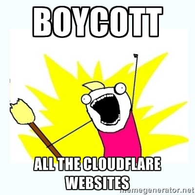

# Alternative Link

| &#128444; | &#128441; |
|  ---  |  ---  |
|   |  |

This is `opt-in` service.

> Subscribe

1. Follow [Alternative Link (AL)](https://mamot.fr/@altlink).

2. AL will accept your follow request and follow back you.
  - If you're locking your account, please accept AL's follow request otherwise AL can't read your toots.
  - If you're marking your account as `Bot`, AL will reject your request and send you a message.
    - Please create Issue or notify us that your action is not automated. (opt-in by human)

3. When you post Cloudflared link, AL will send `direct` message to you with information.
  - `Boosts` will be ignored.

> Unsubscribe

1. Just `block` or `mute` AL's account on your side.
  - Optionally, unfollow AL account. AL will unfollow you in the future.

---

- Mastodon servers are controlled by third party.
  - Let us know if above account is censored by aggressive Cloudflare supporters.
- AL don't read direct messages. e.g. `@AL hey read me`
  - If you have something to say, create new Issue for public discussion.
- ↳ [Shared on Mastodon](shared_on_mastodon.md)

