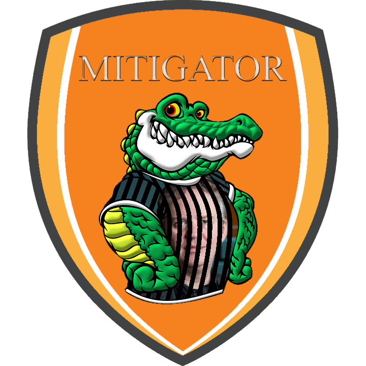

# Alternative Link (MitiGator/AltLink)


| 🖼 | 🖼 |
| -- | -- |
|  |  |


This is `opt-in` service.


- Contents
  - [A little history](service.altlink.md#a-little-history)
  - [How to Subscribe](service.altlink.md#how-to-subscribe)
  - [How to Unsubscribe](service.altlink.md#how-to-unsubscribe)
  - ["Is it really CloudFlare!?" check](service.altlink.md#_is-it-really-cloudflare-_-check)
  - [CloudFlareTest it!](service.altlink.md#cloudflaretest-it)
  - [Report a problem / Create an Issue](service.altlink.md#report-a-problem-create-an-issue)
  - [Settings](service.altlink.md#settings)
  - [Download PNG Logo](service.altlink.md#download-png-logo)


----

### A little history

Once upon a time there was a bot named "_[CloudflareLink](https://social.privacytools.io/@cloudflarelink/with_replies)_" which was created by Anonymous.
It replied to many users who shared CF links publicly.

Not many people reacted it positively. Here is some of them.

- [kemonine@social.holdmybeer.solutions](https://social.holdmybeer.solutions/objects/9479c5be-40df-4ecd-a3fe-0209a9020dfd)
```
To the owner of this bot
You should be ashamed.
Quit drive by bro'ing our statuses.
Please fornicate with a pointy stick.
```

- [Sylvhem@eldritch.cafe](https://eldritch.cafe/@Sylvhem/102701484501099424)
```
Pointing to a copy rather than the original document if it's still online is bad practice too. Also, you are a very annoying bot.
```

They got annoyed and Mastodon server owner was pressured by their "spam" reports.

One of Mastodon server owner once [said](../tool/mastodonwch#some-public-reaction), "_your little protest bot is making people upset, and i'm worried it might cause people to defederate from the instance, please tone it down_."

For the record "_CloudflareLink_" was moved to other Mastodon servers 3 times and banned 2 times by 2 Mastodon services until the Anonymous decided to given up for good.

The main difference of AltLink is `opt-in`.
Those people who [share Cloudflare links casually](cloudflared/shared_mastodon.md) never receive notification until they have a good heart and follow AL.


### How to Subscribe

1. Follow [MitiGator](https://tvitero.com/@mitigator).
  - Some instances such as [mastodon.social](https://github.com/mastodon/mastodon/issues/16480) are blocking altlink.

| 🖼 | 🖼 |
| -- | -- |
|  |  |


2. AL will follow back you **within an hour**.
  - If you're locking your account, please accept AL's follow request otherwise AL can't read your toots.
  - **If** there is a network instability and AL failed to follow back you **after 1 hour**:
    - Please `unfollow`, `wait 1 hour`, and `follow` again.

3. When you share Cloudflared link, AL will send `direct` message to you with information.
  - Direct messages older than *24* hours will be deleted.
    - There is no good reason to keep old toots online.
      - [Should I Delete My Tweets?](https://www.wired.com/story/the-know-it-alls-should-i-delete-my-tweets/)


### How to Unsubscribe

1. Just `unfollow` AL's account **on your side**.
  - **AL will unfollow you within an hour**.
  - AL do not attempt to re-follow you.
  - If you've changed your mind and want to subscribe(opt-in) again, `unblock`, `unfollow` AL and `follow` again.


### "_Is it really CloudFlare!?_" check

Just send `domain name` or `URL` as `direct message` and AL will answer within 1 minute.

Here's an example.

```
@mitigator blog.emsisoft.com
```

You can also query multiple at once / mix domain and URLs

```
@mitigator
en.wikipedia.org
https://blog.emsisoft.com/wow/
www.wikimedia.org
```


### CloudFlareTest it!

You can call AltLink into your **public** **discussion** to test `above user's URL`. 
All you have to do is hit `Reply` button and 
- Include user `altlink`
- Add the word `cloudflaretest` (case does not matter)
- Send it as **non-direct** toot

AL will answer within 1 minute.

- This is a simple `Yes`/`No` test.
  - If you need _detailed_ check use above one instead.


Here's an example.

mad_dog wrote:
```
Check my new blog! https://oh.my.god/
```
you reply:
```
Hey @mad_dog, your blog need to do cloudflareTest. @mitigator
```


### Report a problem / Create an Issue

You can create an Issue without git account. Just send a **direct** message.
And don't worry,

- Multiple mentions (e.g. `@randomUser @altlink @otherUser blah blah blah`)
- _Public_ message (e.g. `there's a bot called @altlink`)

...will be ignored to prevent spam.
Your username part (before `@`) will be masked to protect your privacy.


### Settings

You can configure mitigator from [this website](https://mitigator.crimeflare.eu.org/).


### Download PNG Logo

For your poster/meme needs.

| 🖼 | 🖼 | 🖼 | 🖼 |
| -- | -- | -- | -- |
|  |  | - | - |
|  |  |  |  |


---

- Mastodon servers are controlled by third party.
  - Let us know if above account is censored by aggressive Cloudflare supporters.
- ↳ [Altlink IRC Service](service.altlink_irc.md)
- ↳ ["Cloudflare, we have a problem" Mastodon](people.mastodon.md)
- ↳ [How many % of public Fediverse services are using Cloudflare?](cloudflared/fediverse.md)
- ↳ [How many % of links people publicly shared on Mastodon are using Cloudflare?](cloudflared/shared_mastodon.md)

<a rel="me" href="https://101010.pl/@MitiGator"></a>
