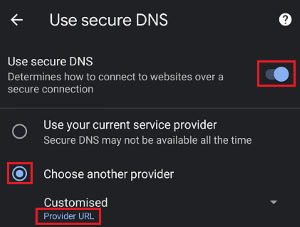
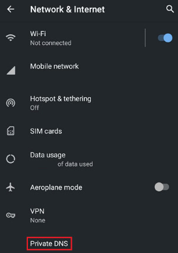

# Public DNS

> About this service

https://dns.crimeflare.eu.org/

- No logs. No statistics. No collection. Plain simple DNS!
  - DNS over HTTPS (DoH)
  - DNS over TLS (DoT)
- Block sites using Cloudflare.
- Block adverts, trackers, adware, malware sites.
  - List data
-  Randomly pick good DNS root servers.
- Block DNS-rebind attack.

| Type | Value | Example |
| --- | --- | --- |
| DNS over HTTPS | `https://dns.crimeflare.eu.org/dns-query` |  |
| DNS over TLS | `dns.crimeflare.eu.org` |  |
