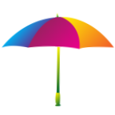
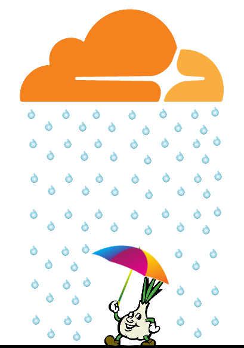

# Ss (Serĉi)





**[Ss](https://sercxi.eu.org)** (pronounce /ɛsɛs/; other name "_Serĉi_" (_Sercxi_), pronounce /ˈsert͡ʃi/), previously called _[Searxes](https://web.archive.org/web/20210614033612/https://en.wikipedia.org/w/index.php?title=Searx&oldid=906373508)_, is the **world's first anti-cloudflare search engine** website for [Tor](https://www.torproject.org/) users and [clearnet](https://en.wikipedia.org/wiki/Clearnet_(networking)) users, operating since year [2016](https://addons.thunderbird.net/en-us/firefox/addon/searxes/).

Some people may think about [Schutzstaffel](https://en.wikipedia.org/wiki/SS) on first sight but do not get confused; the second letter s is _lowercase_ taken from previous name.

It is fed by quality sources and rank down Cloudflare sites to bottom by default, thus you avoid the risk and inconvenience of having [MITM traps](../README.md) littered throughout search results.
You can also open a cached version of the page by clicking the icon of the search result.
There are many options to choose from for example disabling Cloudflare ranking and rank down known [Tor-hostile](../anti-tor_users/domains) sites. Ss is also providing public API service for developers and also Lynx-site for text-base browser users.

The current Ss logo resembles an umbrella. Developers said that they want to provide an _umbrella_ to protect people safe against heavy _rain_ caused by the _cloud_.





### About _.onion_ certificate warning

Tor Browser user may see this warning on first visit.

```
Warning: Potential Security Risk Ahead

Tor Browser detected a potential security threat and did not continue.
Someone could be trying to impersonate the site and you should not continue.
```

You can ignore this warning because onion service is [already encrypted](https://community.torproject.org/onion-services/overview/).
There are multiple reasons to use HTTPS over Tor.
At the moment the only way to get a _trusted_ SSL certificate for a .onion domain is to buy an EV (extended validation) certificate.
